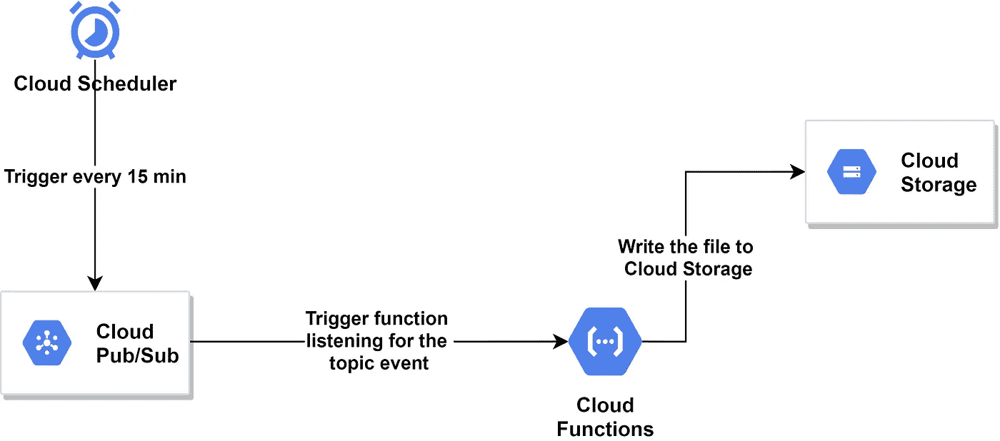
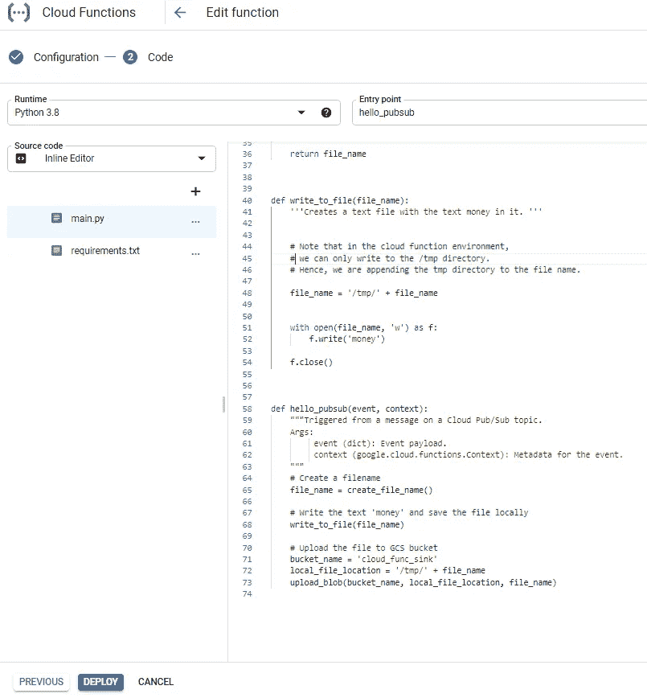

# 如何安排无服务器谷歌云功能定期运行

> 原文：<https://towardsdatascience.com/how-to-schedule-a-serverless-google-cloud-function-to-run-periodically-249acf3a652e?source=collection_archive---------6----------------------->

## 你有一些需要定期运行的代码吗？请继续阅读，了解如何在谷歌云平台(GCP)上使用无服务器功能来实现这一点。

在 [Unsplash](https://unsplash.com?utm_source=medium&utm_medium=referral) 上由 [Boitumelo Phetla](https://unsplash.com/@writecodenow?utm_source=medium&utm_medium=referral) 拍摄的照片

作为一名数据科学家/工程师，我经常有需要定期运行的代码。这可能是每天下午 02:00 处理一些日志文件，或者每天凌晨 01:00 运行机器学习模型。

如果它可以在内存限制 [8 GiB 内运行，并且不到 9 分钟](https://cloud.google.com/functions/quotas)，那么它可能值得作为一个无服务器功能来实现。

如果您对此感兴趣，那么在本文中，我将向您展示如何使用无服务器架构，利用谷歌云平台(GCP)的云功能无服务器计算产品来调度您的代码。

要了解更多关于谷歌云功能及其好处的信息，请查看我在 Medium 上的另一篇文章。第一节简明扼要地解释了它。😄

</machine-learning-model-as-a-serverless-endpoint-using-google-cloud-function-a5ad1080a59e>  

# ⚠️⚠️家政公司

*本文假设您已经拥有一个 GCP 账户。如果你没有，在这里注册*<https://cloud.google.com/>**可以获得一些免费积分。**

**如果你想从你的本地机器上与你的 GCP 账户进行交互，使用* [*这里*](https://cloud.google.com/sdk/docs/quickstart) *列出的步骤安装 Google Cloud SDK。**

**确保在您的 GCP 项目中使用* [*API 控制台*](https://console.developers.google.com) *为 Google 云存储、函数、发布/订阅和调度程序启用 API**。**

**本文中的所有代码都是用 Python 3.8 开发的。所有必要的代码都可以通过 GitHub Gist 获得。**

# *任务和解决方案架构示例*

*那么，我们在建造什么？为了本文的目的，我们将安排一个每 15 分钟打印一次钞票的云函数。当然不是字面上的钱😄，而是钱这个字。*

**

*云解决方案架构。(来源:作者)*

*我们将使用谷歌云平台(GCP)的 4 项服务来完成这项工作。*

1.  *[**云功能**](https://cloud.google.com/functions) :哦，是的，这个无服务器计算服务将托管并执行我们所有的代码。该服务将每隔 15 分钟触发一次。当它执行时，它将运行我们的代码，将单词“money”写入一个文本文件，并将其保存在 Google 云存储桶中。这是一项简单的任务，可以轻松适应您的使用情形。*
2.  *[**Cloud Pub/Sub**](https://cloud.google.com/pubsub)**:**这是一个事件驱动的实时消息服务，允许我们创建异步通信的系统。它使得系统设计中存在事件生产者和消费者，也称为发布者和订阅者。在我们的例子中，云调度器将产生一个 Pub/Sub 事件，该事件将触发我们的云功能消费者，该消费者正在从 Pub/Sub 服务中监听特定的主题。*
3.  *[**云调度器**](https://cloud.google.com/scheduler) **:** 这是一款来自 GCP 的全托管企业级 cron 作业调度器。它基本上可以安排任何事情。在这种情况下，我们使用它每隔 15 分钟为一个主题生成一个发布/订阅事件。*
4.  *[**云存储**](https://cloud.google.com/storage) **:** 嗯……这里真的不多说了。它基本上是一个保存任何类型数据的位置。它可能没有其他的性感，但在我看来，它是 GCP 上一切的可靠支柱！*

*现在…我们开始建造！🚀 🚧*

# *步骤 0:创建一个 Google 云存储桶*

**

*在 GCP 控制台上搜索存储。(来源:作者)*

*在 GCP 控制台中，搜索存储以找到云存储，然后单击**创建存储桶。**给存储桶取一个合适的名称，并确保在计划运行云功能的同一区域创建存储桶。您可以保留其余设置，然后点击**创建**。*

**

*创建云存储桶来存储文本文件。(来源:作者)*

## ***第一步:创建并配置云功能***

*现在在 GCP 控制台上搜索云函数，点击**创建函数**。给云函数取一个合适的名字，并确保它与存储桶在同一个区域。*

*选择功能**触发类型**为**云发布/订阅**。*

**

*创建由发布/订阅触发的云函数。(来源:作者)*

*点击**创建一个主题**来创建一个新的发布/订阅主题，这将触发这个云功能。给它起一个合适的名字，点击**创建主题，**然后点击**保存**来完成发布/订阅触发器。*

**

*创建新的发布/订阅主题。(来源:作者)*

*现在，在**运行时、构建和连接设置**部分下，保持**运行时**选项卡设置不变。我们的功能非常简单。因此，256 MiB 内存的执行环境已经足够了。*

*但是，在**连接**选项卡中，选择**仅允许内部流量**。出于安全原因，这样做是因为它只允许来自项目环境内部的流量，而不会被恶意的外部请求触发。*

*完成后，点击下一个的**对功能进行编码。***

# *步骤 2:编码和部署云功能*

*现在，您应该会看到内联源代码编辑器窗口。这是我们定义运行时环境和编写要执行的函数的地方。*

*选择**运行时环境**为 Python 3.8，因为我们将用 Python 编码。*

**

*云函数的内联编辑器。(来源:作者)*

*如您所见，源代码内联编辑器选项卡下显示了两个文件。让我们了解它们是什么。*

## *文件:main.py*

*这个文件是所有函数代码驻留的地方，当触发事件发生时被执行。因为我们已经选择了 Pub/Sub 作为触发器，所以在这个文件中应该有一个签名为 *hello_pubsub(event，context)* 的函数，默认情况下会填充这个函数。*

*这是由发布/订阅事件触发的主函数的签名。显然，您可以更改主函数名，但请确保在**入口点**函数名选项卡中相应地更新它。这就是环境如何知道调用哪个函数来处理发布/订阅事件。*

*出于本文的目的，我们将保持名称不变，只更新内容。*

## ***文件:requirements.txt***

*在这里，我们声明需要安装在云函数环境中的库，以执行我们的函数。默认情况下，环境预装了一堆库。因为这是一个简单的函数，所以我们不需要安装太多额外的库。*

## *编码和部署*

*你可以从下面的要点中复制并粘贴这两个文件的内容。代码是不言自明的，并被注释。如果您有任何问题，请联系我们。😃*

*本文所需的云函数代码。(来源:作者)*

*一旦将代码从 gist 复制到相关文件中，就可以点击 **deploy** 。*

*这将需要一些时间，因为正在设置云功能环境，并且安装了所有要求。您应该会在函数名旁边看到一个加载圆圈。*

*成功部署函数时，函数名称旁边会出现一个绿色对勾。👊*

**

*云功能部署成功。(来源:作者)*

*好吧，那么…让我们看看它是否有效！😅为此，点击**动作**下的 3 点按钮，并点击**测试功能**。*

# *步骤 3:测试云功能*

**

*测试部署的云功能。(来源:作者)*

*由于我们的云函数不需要任何输入数据或上下文，我们只需单击蓝色的**测试函数**按钮，让触发事件输入保持空白。*

*当函数成功完成时，它应该在下面的日志中显示 OK。如果出现错误，请阅读日志进行诊断。*

*我们还应该看到云存储桶里有一个新的文本文件，里面有钱！💲 💲 😄*

**

*云存储桶，带有由云功能生成的文本文件。(来源:作者)*

*现在剩下的就是安排函数定期运行。*

# *步骤 4:计划云功能*

*回到 GCP 控制台，搜索云调度程序，并点击**创建作业**。这应该会将您带到一个设置页面来配置 cron 作业。*

**

*设置云调度程序作业。(来源:作者)*

*在**下定义作业**部分，给出一个合适的名称，并使用 unix-cron 格式，指定调度频率。*

*因为我们想安排我们的函数每 15 分钟运行一次，所以使用下面的: ***/15 * * * *** 。您可以从[这里](https://cloud.google.com/scheduler/docs/configuring/cron-job-schedules)了解更多关于格式的信息，并根据您的需求进行调整。*

*哦，还要确保你在正确的时区。😅*

**

*为我们的发布/订阅主题设置 cron 作业的目标。(来源:作者)*

*在**配置作业目标**部分下，选择发布/订阅主题作为目标。这将显示当前项目中的所有主题。确保您选择了正确的发布/订阅主题，如步骤 1 中所创建的。*

*必须提供消息正文。我们只是说“你好”,尽管在我们的体系结构中它不会被处理。*

**

*创建后的云调度程序作业列表。(来源:作者)*

*现在点击 create 来安排这个任务。现在应该每 15 分钟运行一次我们的云功能。*

*但是，我们可以点击调度程序作业页面中的**立即运行**，立即运行该功能。*

*您应该能够在云存储桶中看到一个新的货币文本文件，它是在您点击 **run now** 时创建的。如果出现错误，请检查日志进行诊断。*

*现在，在你最后一次运行后的每 15 分钟，你应该能够看到新的货币文本文件被添加到云存储桶中。*

**

*预定的云功能每 15 分钟产生一次钱。(来源:作者)*

*恭喜你，你现在已经成功地安排了一个定期执行的无服务器功能。😄 🚀*

***⚠️注意:*确保删除/暂停云调度程序作业和其他资源，以避免产生持续成本。*🔥***

# *最后的想法*

*通常，人们(包括我)会使用虚拟机和其他工具来运行他们的 cron 作业。但是，重新审视这些任务，看看它们的内存/计算约束是否符合云功能的限制，可能是值得的。*

*从数据科学系统的角度来看，我可以看到如此多的任务可以采用这种架构。定期处理一些 CSV 数据文件、运行模型预测、每天生成摘要报告表、每天将外部文件加载到大型查询表中，等等。*

*此外，拥有像这样的无服务器架构可以实现很大的灵活性并提高可维护性。嗯…这就是微服务架构的全部。 ****条款和条件适用。*😄 ******

*希望这篇文章能为您的下一个解决方案架构提供一些思路。*

*感谢您的阅读。*

****希望这篇文章对你有用。如果你有任何问题或者你认为我能帮忙，请联系我。总是期待与新朋友建立联系。*😄***

****你可能也会喜欢我的这些文章:****

*<https://python.plainenglish.io/the-only-data-science-machine-learning-book-i-recommend-4fc23b947dfe>  </machine-learning-model-as-a-serverless-app-using-google-app-engine-b760de59156>  <https://medium.com/codex/3-simple-side-hustles-to-make-extra-income-per-month-as-a-data-scientist-7470030fbf43> *