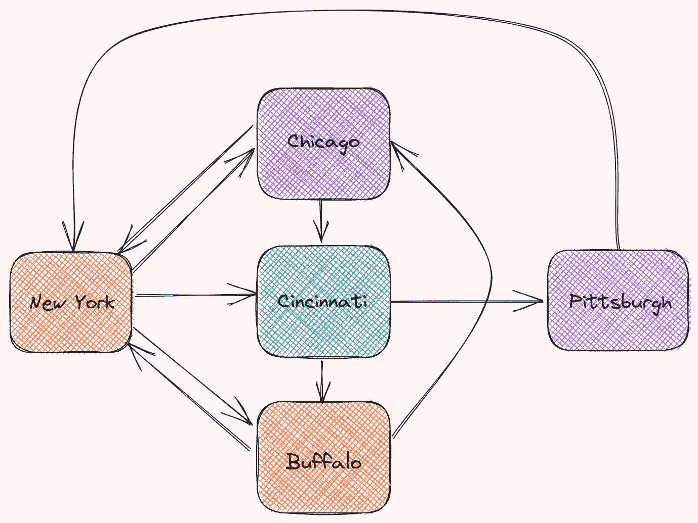

# 如何在 Python 中安排航班

> 原文：<https://towardsdatascience.com/how-to-schedule-flights-in-python-3357b200db9e?source=collection_archive---------9----------------------->

## 使用 CVXPY 分配足够的飞机，同时最小化成本

# 动机

想象你是一家航空公司的所有者。您的航空公司需要分配其在纽约的飞机来覆盖所有即将到来的定期航班。

共有 10 个航班和 8 个航班序列。每个航班序列由多个航班组成。

例如，一系列航班可以包括从纽约到布法罗、从布法罗到芝加哥以及从芝加哥到纽约的航班。

数据来源于[应用整数规划，由陈博士，巴特森，r . g .&党，Y. (2010)](https://www.wiley.com/en-us/Applied+Integer+Programming%3A+Modeling+and+Solution-p-9780470373064)



作者图片

每个飞行序列都有一定的成本。我们需要选择一个飞行序列的子集，以便每个航班至少有一架飞机。

有许多可能的方法来选择航班序列的组合，以便每个航班都有可用的飞机。一种可能的组合如下:


作者图片

另一种可能的组合如下:


作者图片

还有很多。

您的航空公司应该选择哪种序列组合才能满足约束条件并使成本最小化？

很多主要航空公司都面临这个问题。美国航空公司估计，他们基于数学编程的系统每年节省约 2000 万美元。

在本文中，您将学习如何使用整数编程和 Python 来解决这个问题。

# 什么是整数规划？

整数规划涉及带有目标和约束的问题。部分或全部变量被限制为整数。

[CVXPY](https://www.cvxpy.org/) 是一个 Python 工具，为许多整数编程求解器提供了接口。要安装 CXVPY，请键入:

```
pip install cvxpy
```

让我们确定这个问题中的输入、目标和约束。

## 检索数据

从从 Google Drive 下载数据开始:

数据来源于[应用整数规划，由陈，陈德生，巴特森，r . g .&党，Y. (2010)](https://www.wiley.com/en-us/Applied+Integer+Programming%3A+Modeling+and+Solution-p-9780470373064)

获取每个飞行序列的时间表、成本和小时数。

把所有正数变成 1:

## 输入参数

定义输入参数:


作者图片

## 决策变量

使用`cp.Variable`定义决策变量:


作者图片

## 限制

每个航班必须至少有一架飞机。例如，为了确保至少有一架飞机从纽约飞往布法罗，必须选择航班顺序 1、4 或 7。

为了确保从纽约→辛辛那提的航班至少有一架飞机，必须选择航班顺序 2 或 5。

因此，对于从纽约→布法罗的航班，我们有约束条件:


作者图片

将这一约束推广到所有 10 次飞行，我们得到:


作者图片

## 目标

我们想选择使总成本最小化的航班顺序。


作者图片

## 解决问题

现在我们有了约束和目标，让我们来解决问题吧！

```
13.0
```

目标的值是 13。让我们看看 y 的值是多少。

```
[1\. 1\. 1\. 0\. 0\. 0\. 0\. 0.]
```

酷！因为 y 数组的前 3 个值是 1，所以我们的飞机通过选择航班 1、2 和 3 的顺序来节省最多的钱。

这意味着飞机应该飞行:

*   从纽约→布法罗→芝加哥→纽约出发
*   从纽约→辛辛那提→匹兹堡→纽约
*   从纽约→芝加哥→辛辛那提→纽约


作者图片

酷！如果我们的飞机希望飞行总小时数**不超过 1700** 怎么办？

让我们将这个约束添加到我们的问题中，看看会发生什么。

# 对总时数的约束

首先，我们需要获得代表每个飞行序列的小时数的数组:


作者图片

将第一个约束与新约束合并:


作者图片

解决问题:

```
20
```

带有附加约束的目标值为 20，大于 13。为什么目标的值会改变？

这是因为选择了不同的飞行顺序。


作者图片

但是为什么第二个和第三个航班序列没有被选中呢？如果我们仔细观察代表小时的数组，我们可以看到前 3 次飞行的总小时数超过 1700。


作者图片


作者图片

但是，第一、第五和第六个航班序列的总小时数小于 1700，这满足约束条件。


作者图片

这是新选择的飞行序列的可视化表示。


作者图片

# 结论

恭喜你！您刚刚学习了如何选择航班顺序，同时将成本降至最低。我希望这篇文章能够激励您使用整数编程和 Python 解决类似的问题。

在 Github repo 中，您可以随意使用本文的代码:

<https://github.com/khuyentran1401/Data-science/blob/master/mathematical_programming/schedule_flight_crew/flight_crew_schedule.ipynb>  

我喜欢写一些基本的数据科学概念，并尝试不同的算法和数据科学工具。你可以通过 [LinkedIn](https://www.linkedin.com/in/khuyen-tran-1401/) 和 [Twitter](https://twitter.com/KhuyenTran16) 与我联系。

如果你想查看我写的所有文章的代码，请点击这里。在 Medium 上关注我，了解我的最新数据科学文章，例如:

</how-to-find-best-locations-for-your-restaurants-with-python-b2fadc91c4dd>  </how-to-solve-a-staff-scheduling-problem-with-python-63ae50435ba4>  </maximize-your-productivity-with-python-6110004b45f7>  </sentiment-analysis-of-linkedin-messages-3bb152307f84>  

# 参考

陈(2010)。*应用整数规划:建模与求解*。j .威利&的儿子们。