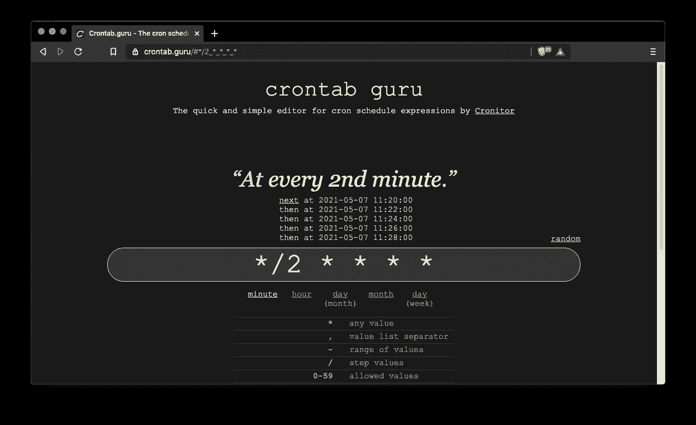
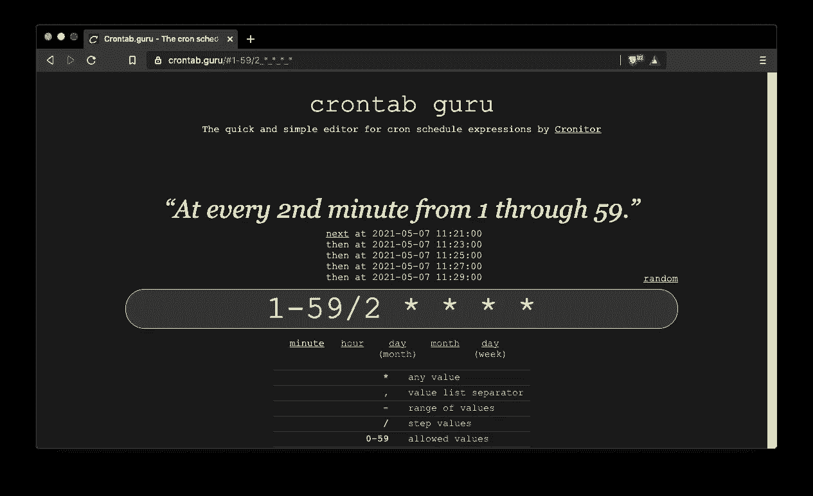
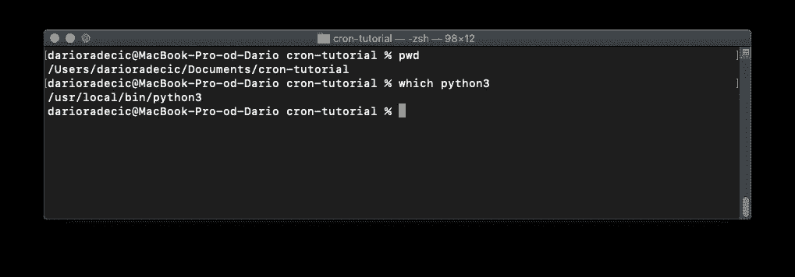
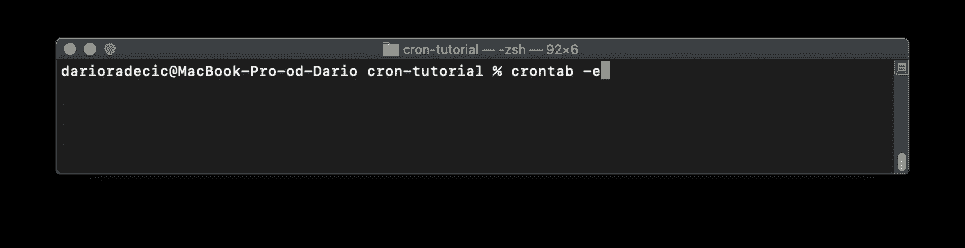
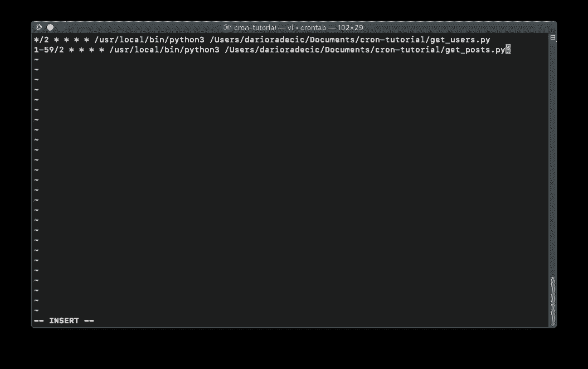
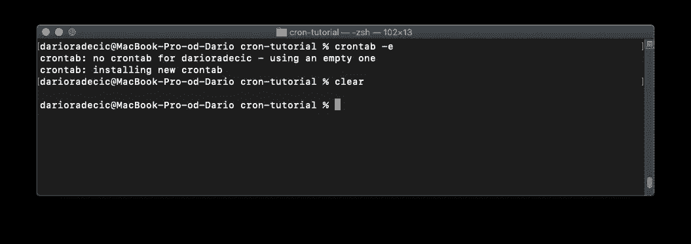
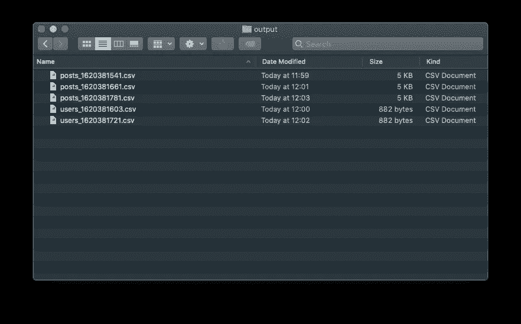

# 如何使用 Cron 调度 Python 脚本——您需要的唯一指南

> 原文：<https://towardsdatascience.com/how-to-schedule-python-scripts-with-cron-the-only-guide-youll-ever-need-deea2df63b4e?source=collection_archive---------0----------------------->

## 自动化您的 Python 脚本执行—在 Linux 和 macOS 上运行

照片由[乔尔&贾斯敏·福斯特伯德](https://unsplash.com/@theforestbirds?utm_source=unsplash&utm_medium=referral&utm_content=creditCopyText)在 [Unsplash](https://unsplash.com/?utm_source=unsplash&utm_medium=referral&utm_content=creditCopyText) 拍摄

当涉及到重复性的任务时，你更擅长自动化它们。这篇文章将教你如何做。

阅读完本文后，您将知道如何自动执行两个 Python 脚本来获取、解析和保存来自 web 的数据。我们开始吧！

这篇文章的结构如下:

*   Cron 是什么？
*   写剧本
*   编辑 Crontab 文件
*   测试
*   MacOS Gotchas
*   结论

# Cron 是什么？

可以把 Cron 看作是在 Linux 和 macOS 环境中调度任务的最简单的方法之一。“Cron”一词来源于希腊语“Chronos”(时间)，“Crontab”一词代表“Cron table”或时间表。你很快就会知道这张表指的是什么。

任何时候你都应该使用 Cron 来实现自动化，比如操作系统作业或者 Python 脚本。不用说，自动化的 Python 脚本基本上可以做任何事情。

在 Linux 和 macOS 上，Crontab 由六个字段组成。前五个字段保留用于计划执行的日期和时间(分钟、一月中的某天、一年中的某月、一周中的某天)，最后一个字段保留用于要执行的命令。

您可以在日期-时间字段中自由使用星号、值和范围，但稍后会详细介绍。

您现在知道 Cron 和 Crontab 是什么了，但是在进行调度之前，我们仍然需要一些 Python 脚本。接下来我们来介绍一下。

# 写剧本

今天我们将安排两个简单的脚本。他们的工作是从以下虚假网站获取数据:

*   [https://jsonplaceholder.typicode.com/users](https://jsonplaceholder.typicode.com/users)
*   [https://jsonplaceholder.typicode.com/posts](https://jsonplaceholder.typicode.com/posts)

这些网站包含各种主题的虚拟数据，但我们将只关注用户和帖子。我们处理两个站点的唯一原因是展示如何在不同的时间间隔调度 cron 作业。

这两个脚本都将通过`requests.get()` API 调用获取数据，解析 JSON 数据，处理它(只保留某些属性)，将其转换成 Pandas 数据帧，并保存到 CSV 文件中。听起来很多，但是只有几行代码。

让我们从`get_users.py`文件开始:

`get_posts.py`文件将或多或少地相同——除了处理部分:

最后，确保在你的脚本所在的地方创建`output`。这就是我们所需要的。如果您要运行脚本，CSV 将以`<name>_<timeastamp>.csv`名称结构保存在`output`目录中。时间戳是为了确保文件不会被覆盖。

接下来看看怎么安排任务。

# 编辑 Crontab 文件

无论您使用的是 Linux 还是 macOS，这一部分都是一样的。macOS 有一些权限问题，但我们稍后会谈到。

如前所述，您必须遵循特定的语法来调度 cron 作业。好消息是，你可以使用 Crontab.guru 网站来制定你的日程安排。

我们希望`get_users.py`每隔偶数分钟运行一次(例如，0，2，4)，而`get_posts.py`每隔奇数分钟运行一次(例如，1，3，5)。以下是每隔一分钟运行一个作业的正确模式:

图 1 —每隔一分钟执行一次的 Cron 作业模式(图片由作者提供)

以下是奇数分钟:

图 2 —每隔几分钟执行一次的 Cron 作业模式(图片由作者提供)

很好——让我们使用这些模式来安排执行。打开一个终端窗口，执行`pwd`和`which python3`命令，获得脚本文件夹和 Python 的绝对路径:

图 3-获取绝对路径(图片由作者提供)

一旦有了这些，输入`crontab -e`命令编辑一个 cron 文件，或者创建一个不存在的文件:

图 4 —访问 crontab 文件(作者图片)

它将打开一个 VIM 编辑器——在那里，点击键盘上的`I`键进入插入模式。您必须指定调度模式、Python 可执行文件的完整路径和脚本的完整路径，以使调度工作正常进行。使用下图作为参考:

图 5 —编辑 crontab 文件(作者图片)

完成后，按下`ESC`键退出插入模式，紧接着按下`:wq`和`ENTER`键。这将保存 crontab 文件，您将立即返回到终端窗口:

图 6 —成功创建 crontab 文件(作者图片)

要验证文件是否已成功保存，您可以使用`crontab -l`命令——它将列出所有计划的作业:

图 7-列出所有计划的作业(按作者排序的图像)

这就是你要做的。让我们在下一节检查调度是否有效。

# 测试

除了坐在那里看着你的脚本每一分钟被执行，你别无选择。这是几分钟后我的`output`文件夹的样子:

图 8-输出文件夹(作者提供的图片)

如您所见，一切都按预期运行。不要忘记删除这两个作业，否则每天会有 1440 个新的 CSV 文件。

# MacOS Gotchas

Linux 用户应该不会有任何问题，但是在 macOS 上情况就不同了。默认情况下，macOS 不会给终端和 Cron 提供完整的磁盘访问权限，所以您必须手动完成。

需要明确的是，您不会得到任何错误，但是`output`文件夹将保持为空。

如果是这样的话，请跟随[这篇文章](https://dccxi.com/posts/crontab-not-working-catalina/#:~:text=Aug%206%2C%202019-,If%20Any%20of%20Your%20Crontab%20Tasks%20No%20Longer%20Works%20on,lists%20located%20at%20System%20Preferences.)——它将向您展示如何向终端和 Cron 授予完整的磁盘访问权限。

# 结论

现在您已经知道了——如何在 Linux 和 macOS 上使用 Cron 轻松调度 Python 脚本。

可能性是无限的——从预定的 web 抓取到 ETL 管道的自动执行。代码可以改变，但原则保持不变。

玩得开心！

*喜欢这篇文章吗？成为* [*中等会员*](https://medium.com/@radecicdario/membership) *继续无限制学习。如果你使用下面的链接，我会收到你的一部分会员费，不需要你额外付费。*

 [## 通过我的推荐链接加入 Medium-Dario rade ci

### 作为一个媒体会员，你的会员费的一部分会给你阅读的作家，你可以完全接触到每一个故事…

medium.com](https://medium.com/@radecicdario/membership) 

# 了解更多信息

*   [每个数据科学家必读的 3 本编程书籍](/3-programming-books-every-data-scientist-must-read-db1d3a1a284c)
*   [如何让 Python 静态类型化—基本指南](/how-to-make-python-statically-typed-the-essential-guide-e087cf4fa400)
*   [使用 Python 进行面向对象编程——你需要知道的一切](/object-orientated-programming-with-python-everything-you-need-to-know-cb0ada963756)
*   [Python 字典:你需要知道的一切](/python-dictionaries-everything-you-need-to-know-9c2159e5ea8a)
*   [介绍 f 字符串 Python 中字符串格式化的最佳选项](/introducing-f-strings-the-best-option-for-string-formatting-in-python-b52975b47b84)

# 保持联系

*   关注我的[媒体](https://medium.com/@radecicdario)获取更多类似的故事
*   注册我的[简讯](https://mailchi.mp/46a3d2989d9b/bdssubscribe)
*   在 [LinkedIn](https://www.linkedin.com/in/darioradecic/) 上连接
*   查看我的[网站](https://www.betterdatascience.com/)