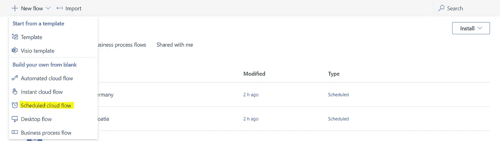
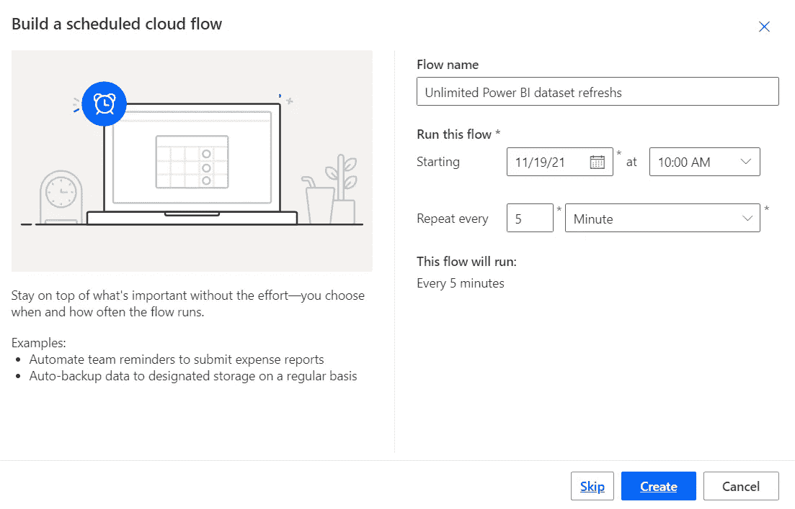
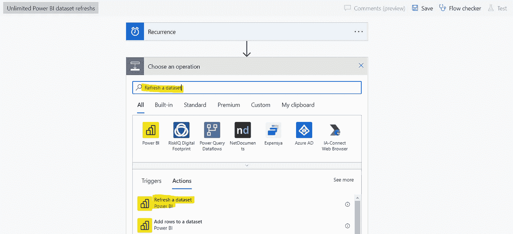
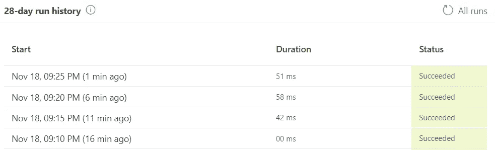

# 如何通过简单的电源自动化来计划无限制的电源 BI 数据集刷新

> 原文：<https://towardsdatascience.com/how-to-schedule-unlimited-power-bi-dataset-refreshes-with-a-simple-power-automate-a7affe90c2de?source=collection_archive---------4----------------------->

来自 Unsplash.com 的斯蒂芬·菲利普-Hostreviews.co.uk

## 如何在不到五分钟的时间内设置自动刷新而无需直接查询

# 为什么您不能总是对您的 PowerBI 使用直接查询

通常，数据工程师会建议您在 Power BI 报告中使用直接查询。这种解决方案(可能)是最用户友好的，因为它使用户能够通过一次点击来刷新数据和视觉效果。然而，有许多[技术原因](https://docs.microsoft.com/en-us/power-bi/connect-data/desktop-use-directquery#considerations-and-limitations)为什么直接查询可能是不可能的。最常见的问题可能是这个:**你的数据有不止一个来源**。

Power BI 的直接查询选项仅在您的 BI 数据集基于单一来源时有效。**目前，您的报告需要两个或更多来源，不再支持直接查询**。虽然这对于拥有发达的 IT 基础设施和训练有素的数据工程团队的组织来说可能不是问题，但对于其他组织来说却是一个巨大的挑战。许多组织使用 Power BI，因为内置的数据建模工具使得在不应用全面的 ETL 过程的情况下组合不同的数据源变得容易。**如果您想不出适用的场景，请考虑以下商业案例**:

*您的销售团队使用 Salesforce 跟踪他们的销售线索并维护客户信息。然而，财务部使用一种小型会计软件，这种软件是根据您所在地区的要求量身定制的。*

*财务部门现在希望将客户、渠道和财务数据整合到一份报告中。在大公司中，数据工程团队会将不同的系统连接到一个仓库，并创建一个包含所有需要的信息的表。*

*但是，您的公司很小，而且您没有数据工程团队。您的会计软件太不知名，不提供 Salesforce 的标准连接器。*

*因为您希望避免在外部程序员身上花钱，所以您将不同的源连接到您的 Power BI，并通过数据建模器自己进行映射。因此，直接查询选项被禁用，您的用户无法再通过报告的刷新选项更新数据和图像。*

# 以下是你解决这个问题的方法…

如果不能使用直接查询，用户必须手动刷新数据集。虽然这不仅耗时，而且几乎不可能。大多数情况下，最终用户无法访问报表的基础数据集。换句话说，他们必须向报告管理员请求手动刷新…浪费更多的时间。

你们中的一个会跳起来说:为什么不在 Power BI Pro 中简单地安排刷新？**这是个好主意，但是你每天只能刷新 8 次。**

那还有什么？正确！**我们可以升级到高级，这样我们每天最多可以安排 48 次刷新。**虽然对于大多数用例来说这可能已经足够了，但这只能让您每 30 分钟刷新一次数据集。如果你想达到接近实时，这是不够的。通过 Power BI cloud 界面设置 48 个日程安排也是一项痛苦的手动工作。相信我，我尽力了。

# …您应该这样做！

## 你需要的东西

在您开始实现您的 Power Automate 流程之前，您需要进行一些采购。给你自己买以下两件东西(不，我不会因此得到任何会员奖金):

*   [高级商务智能工作空间或用户许可证](https://docs.microsoft.com/en-us/power-bi/admin/service-premium-what-is#power-bi-premium-generation-2)
*   [Power Automate 用户许可证或更高版本](https://powerautomate.microsoft.com/en-us/pricing/)

## 如何实现它

首先，将您的报告发布到您的高级工作区或用户。**您可以识别用户或工作区是否是高级的，如果它有一点💎名字旁边的**。但是，您只能在 web 界面中看到这一点。因此，我建议您在发布报告之前检查一下。

现在，登录到您的 Power Automate web 界面，点击“我的流程”。之后，点击“新建流量”并选择“**预定云流量**”选项。

新的预定云流量选项。图片作者。

然后会要求您提供名称、开始时间和流程间隔。随意输入，点击**创建**。

预定云流量选项。图片作者。

您已经成功创建了流程，并将看到一个新页面。在这里，单击“+New step”选项，并在搜索栏中键入“刷新数据集”。**然后点击 Power BI 动作“刷新数据集”**。

相应的操作将作为下一步成功添加。**现在，您可以在相应的字段中选择您的工作空间或用户以及您的目标数据集。**然而，根据您的系统设置，Power Automate 会要求您首先登录 Power Bi。提供您的凭据，然后单击“保存”。

刷新数据集操作。图片作者。

恭喜你！您已经成功设计了一个 Power Automate，它将在指定的循环中刷新目标数据集，而无需任何额外的手动工作。

如果您不确定计划的刷新是否真正起作用，您可以在最后一步检查您的流的运行历史。您可以通过点击流的名称并向下滚动来实现。在这里，您将看到已执行运行的历史记录。**如果运行成功，状态将为绿色。**

流程运行历史记录。图片作者。

对于所有多疑的人来说:你也可以在 Power BI web 界面上查看。只需单击您的工作区或用户(您发布报告的地方)，并查看相应的数据集列。**你会看到“刷新”下的条目会显示与你的工作流程大致相同的时间。**由于刷新本身可能会出现时差，所以不必担心。这是完全正常的。

Power BI web 界面中刷新的数据集和报告。图片作者。