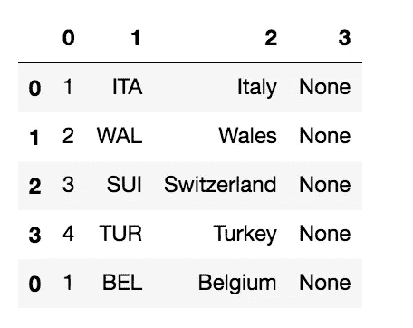

# 如何用 Python 熊猫刮 HTML 表格

> 原文：<https://towardsdatascience.com/how-to-scrape-html-tables-with-python-pandas-98d18d2129cb?source=collection_archive---------12----------------------->

## 数据收集

## 一个现成的代码，它利用了 Python 熊猫库的 read_html()函数


图片由 [Goumbik](https://pixabay.com/users/goumbik-3752482/?utm_source=link-attribution&utm_medium=referral&utm_campaign=image&utm_content=2717063) 从 [Pixabay](https://pixabay.com/?utm_source=link-attribution&utm_medium=referral&utm_campaign=image&utm_content=2717063) 获得

几乎所有在 Python 工作的数据科学家都知道 Pandas 库，几乎所有人都知道`read_csv()`函数。但是，他们中只有很少人知道`read_html()`的功能。

`read_html()`函数允许快速提取 HTML 页面中包含的表格。这个函数的基本版本提取 HTML 页面中包含的所有表格，而使用一些特定的参数可以提取非常特定的表格。

在本教程中，我将重点放在以下 HTML 页面上，其中包含 2020 年欧洲杯的各组比赛:


作者图片

每个表格都具有以下 HTML 结构:

```
<table class="table"> <thead>
    <tr>
      <th title="Field #1"></th>
      <th title="Field #2">P</th>
      <th title="Field #3">+/-</th>
      <th title="Field #4">Pts</th>
    </tr>
  </thead> <tbody>
    <tr>
      <td><span>1</span> </span>ITA</span>  <span>Italy</span></td
      <td>3</td>
      <td>7</td>
      <td>9</td>
    </tr>
    <tr> 
      ...
    </tr>
    <tr>
       ...
    </tr>
    <tr>
       ...
    </tr>
  </tbody>
</table>
```

# 提取所有表格

欧足联网站包含 6 张表格，每组一张(A-F)。我可以简单地通过将路径传递给`read_html()`函数来提取所有的表

```
import pandas as pddf_list = pd.read_html("source/euro2020_groups.html")
```

该函数返回一个包含 6 个数据帧的列表，每组一个。例如，`df_list[0]`包含第一个数据帧:


作者图片

所有的数据帧都有相同的结构。我注意到第一列`Unnamed: 0`没有被正确识别。因此，它需要一个清洁过程。

# 将所有提取的表组合成一个表

现在，我将所有提取的表组合成一个表。为了保持表之间的差异，我需要添加一个新列，存储每条记录所属的组。

我定义了一个包含所有组(A-F)的列表:

```
import stringN = len(df_list)
groups_names = list(string.ascii_uppercase[0:N])
```

`groups_names`变量包含以下值:

```
['A', 'B', 'C', 'D', 'E', 'F']
```

现在我通过`append()`函数将所有数据帧分组。首先我定义了一个空的数据帧，然后我将包含在`df_list`变量中的所有数据帧添加到它上面。根据上下文，我还添加了`Group`列，它指定了每条记录所属的组:

```
df = pd.DataFrame()
for i in range(0,N):
    group_col = [groups_names[i]] * len(df_list[i])
    df_list[i]['Group'] = group_col
    df = df.append(df_list[i])
```

现在数据帧`df`如下表所示:


作者图片

# 清洁数据框

数据帧`df`看起来有点脏:事实上，列`Unnamed: 0`是不正确的。首先，我把它改名为`Team`:

```
df.rename(columns={"Unnamed: 0": "Team"}, inplace=True)
```

然后我扩展了`Team`列，将它分成许多列:

```
df_new = df['Team'].str.split(' ',expand=True)
```

`df_new`数据帧如下所示:



作者图片

唯一有趣的列是 0、1 和 2。因此，我选择 then，并将其分配给原始数据帧中的新列`df`:

```
df[['N', 'ID', 'Country']] = df_new[[0,1,2]]
```

我可以删除原来的`Team`列:

```
df.drop(['Team'], axis=1, inplace=True)
```

`df`数据帧如下所示:


作者图片

表格是正确的，但是列的顺序是错误的。我需要首先移动组，然后是 N，ID，Country，最后是剩余的列。我可以通过`reindex()`函数对列进行重新排序，该函数接收精确的列顺序作为输入:

```
df = df.reindex(columns=['Group','N', 'ID', 'Country', 'P', '+/-', 'Pts'])
```

`df`数据帧如下所示:


作者图片

# 保存数据帧

现在，我可以将数据帧保存为 CSV 文件:

```
df.to_csv('euro_2020_groups.csv')
```

# 摘要

在本教程中，我用 Python Pandas 演示了一个从 HTML 页面中提取表格的简单机制。这可以通过`read_html()`函数来实现，非常简单快捷。在大多数情况下，报废的桌子需要一些清理过程。

`read_html()`函数还提供了一个有趣的输入参数，称为`match`，可以用来提取复杂 HTML 页面中非常具体的表格。想深化这个参数敬请期待:)

本文中解释的所有代码都可以作为 Jupyter 笔记本从 [my Github repository](https://github.com/alod83/data-science/blob/master/DataCollection/Web/Pandas%20read_html.ipynb) 下载。

如果你想了解我的研究和其他活动的最新情况，你可以在 [Twitter](https://twitter.com/alod83) 、 [Youtube](https://www.youtube.com/channel/UC4O8-FtQqGIsgDW_ytXIWOg?view_as=subscriber) 和 [Github](https://github.com/alod83) 上关注我。

# 相关文章

</scraping-data-from-nested-html-pages-with-python-selenium-c5f23065841f> [## 用 Python Selenium 从嵌套的 HTML 页面中抓取数据

towardsdatascience.com](/scraping-data-from-nested-html-pages-with-python-selenium-c5f23065841f) </how-to-extract-tables-from-pdf-using-python-pandas-and-tabula-py-c65e43bd754>  </how-to-load-the-content-of-a-google-document-in-python-1d23fd8d8e52> [## 如何用 Python 加载 Google 文档的内容

towardsdatascience.com](/how-to-load-the-content-of-a-google-document-in-python-1d23fd8d8e52) </three-tricks-to-speed-up-and-optimise-your-python-d9b5d49d68a6> 