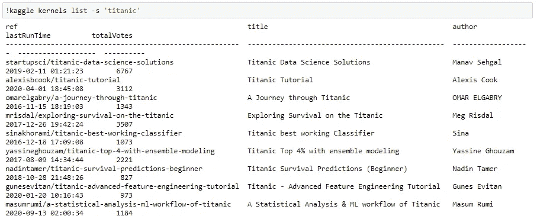

# 如何使用 Kaggle API 搜索和下载数据？

> 原文：<https://towardsdatascience.com/how-to-search-and-download-data-using-kaggle-api-f815f7b98080?source=collection_archive---------13----------------------->

## 使用命令行工具与 Kaggle 交互


图片由[穆罕默德·哈桑](https://pixabay.com/users/mohamed_hassan-5229782/?utm_source=link-attribution&amp;utm_medium=referral&amp;utm_campaign=image&amp;utm_content=4396924)拍摄，来自 [Pixabay](https://pixabay.com/?utm_source=link-attribution&amp;utm_medium=referral&amp;utm_campaign=image&amp;utm_content=4396924) ，使用 [Pixlr](https://pixlr.com/) 编辑

aggle 是世界上最大的数据科学社区，拥有强大的工具、数据集和其他资源来帮助您实现数据科学目标。Kaggle 包含大量用于教育目的的免费数据集。它还举办比赛，并免费提供笔记本电脑，以探索和运行数据科学和机器学习模型。

要使用 Kaggle 资源并参加 Kaggle 比赛，您需要登录 Kaggle 网站并进行相应的搜索。要从 Kaggle 下载数据集，需要搜索数据集并手动下载，然后移动到所需的文件夹进行进一步探索。

所有与 Kaggle 的交互都可以通过用 Python 实现的**命令行工具(CLI)** 使用 **Kaggle API** 来完成。

## 安装:

使用 pip 安装 Kaggle 库:

```
**pip install kaggle**
```

## 认证:

要使用 Kaggle 公开可用的 API 与 Kaggle 资源交互，首先您需要使用 API 令牌进行**认证。按照以下步骤将新的身份验证令牌下载到您的计算机上，以完成身份验证:**

*   **点击您的个人资料图片**和**点击下拉菜单中的账户**。
*   向下滚动到 **API 章节**。
*   点击**“创建新的 API 令牌”**按钮，以 JSON 文件的形式下载一个新的令牌，该文件包含用户名和 API 密钥。
*   将 JSON 文件复制到`**~/.kaggle/**`目录下。在 windows 系统中，进入根目录，然后进入`**.kaggle**`文件夹，将下载的文件复制到该目录。

如果您直接使用 Kaggle API，那么只要您能够在运行时提供凭证，令牌放在哪里并不重要。

您可以使用 Kaggle API 进行交互，以便在不登录其网站的情况下使用其资源，以下是通过命令行语句使用 API 的可用交互列表:

*   **搜索数据集**
*   **下载数据集**
*   **创建和维护数据集**
*   **搜索已发布的笔记本**
*   **下载已发布的笔记本**
*   **创建和运行笔记本**
*   **与比赛互动**
*   **提交参赛作品**

## 1.搜索数据集:

使用 CLI 参数，您可以搜索任何关键字来查找相应的数据集。使用 search 语句获取数据集列表的 CLI 语句:

```
**kaggle datasets list -s [KEYWORD]**
```


(图片由作者提供)，使用“titanic”关键字搜索数据集的结果

## 2.下载数据集:

在您使用用于搜索的 CLI 参数搜索了适当的数据集之后，这个 API 提供了一个优势，可以将任何数据集从 Kaggle 下载到您的本地机器。使用 CLI 下载与数据集关联的文件的命令:

```
**kaggle datasets download -d [DATASET]**
```

## 3.创建和维护数据集:

Kaggle API 可用于使用 CLI 参数上传新数据集和数据集版本。这可以简化 Kaggle 上数据集和项目的共享。

要**创建新的数据集**,请遵循以下步骤:

*   将数据集文件组装到一个文件夹中，然后上传到 Kaggle 上。
*   要生成元数据，请运行:`**kaggle datasets init -p /path/to/dataset**`
*   将元数据添加到生成的文件:`**datapackage.json**`
*   为了最终创建数据集，运行:`**kaggle datasets create -p /path/to/dataset**`

为了**上传现有数据集的新版本**遵循以下步骤:

*   要生成元数据，运行:`**kaggle datasets init -p /path/to/dataset**`
*   确保元数据文件`**datapackage.json**`中的`**id**`字段指向您的数据集。
*   要最终创建数据集，运行:`**kaggle datasets version -p /path/to/dataset -m "MESSAGE"**`

## 4.搜索已发布的笔记本:

使用 Kaggle API，您可以使用关键字进行搜索，找到相应的已发布笔记本。它支持搜索已发布的笔记本及其元数据，以及用于创建和运行笔记本的工作流。

使用搜索关键字获取已发布笔记本列表的 CLI 语句:

```
**kaggle kernels list -s [KEYWORD]**
```



(图片由作者提供)，使用“titanic”关键字搜索笔记本的结果

## 5.下载已发布的笔记本:

Kaggle API 提供了从 Kaggle 下载任何发布的笔记本到你的本地机器的优势。使用 CLI 下载与笔记本相关的文件的命令:

```
**kaggle kernels pull -k [KERNEL] -p /path/to/download -m**
```

## 6.创建和运行笔记本:

Kaggle API 可用于上传新笔记本，并使用 CLI 参数维护笔记本版本。这可以方便在 Kaggle 上共享笔记本和项目。

要**创建新笔记本**，请遵循以下步骤:

*   将代码文件(笔记本)放在一个文件夹中上传到 Kaggle。
*   要生成元数据，请运行:`**kaggle kernels init -p /path/to/kernel**`
*   将元数据添加到生成的文件:`**kernel-metadata.json**`
*   为了最终创建数据集，运行:`**kaggle kernels push -p /path/to/kernel**`

为了**上传现有数据集的新版本**遵循以下步骤:

*   将笔记本的最新版本和相应的元数据下载到本地机器:`**kaggle kernels pull -k [KERNEL] -p /path/to/download -m**`
*   确保元数据文件`**kernel-metadata.json**`中的`**id**`字段指向您的笔记本。
*   要最后推送新版笔记本运行:`**kaggle kernels version -p /path/to/kernel**`

## 7.与竞争对手互动:

Kaggle API 工具提供了一种与 Kaggle 上举办的比赛进行互动的简单方式。要接受任何比赛的规则，您需要登录到比赛网站并接受规则以下载数据集并提交。你需要访问 Kaggle 网站并接受那里的规则，因为通过 API 是不可能的。

与 Kaggle 上举办的竞赛互动的命令:

*   所有正在进行的比赛列表:`**kaggle competitions list**`
*   下载比赛相关文件:`**kaggle competitions download -c [COMPETITION]**`

## 8.提交竞赛:

只有在您通过访问 Kaggle 竞赛网站页面接受提交规则后，才能提交任何竞赛。

*   提交给竞争对手并获得分数的 CLI 参数:

```
**kaggle competitions submit -c [COMPETITION NAME] -f [FILE PATH]**
```

*   要列出所有之前提交的竞赛运行:

```
**kaggle competitions submissions -c [COMPETITION NAME]**
```

# 结论:

在本文中，我们讨论了如何使用 Kaggle API 通过 CLI 参数使用 Kaggle 资源。使用 CLI 命令，我们可以与数据集、笔记本电脑或任何竞赛互动。

为了探索更多的 CLI 参数，您可以在任何调用之后添加`***-h***`来查看该命令的帮助菜单。

# 参考资料:

[1] Kaggle API 文档:[https://www.kaggle.com/docs/api](https://www.kaggle.com/docs/api)

[2] Kaggle API GitHub 回购:【https://github.com/Kaggle/kaggle-api 

> 感谢您的阅读