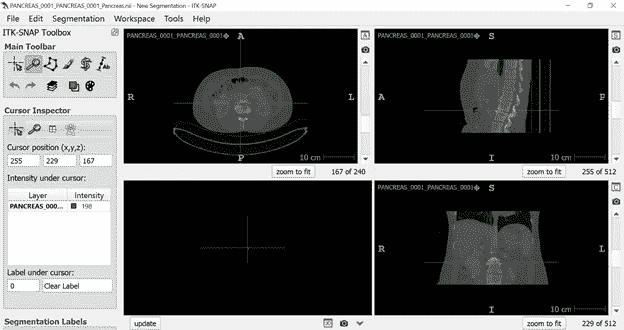
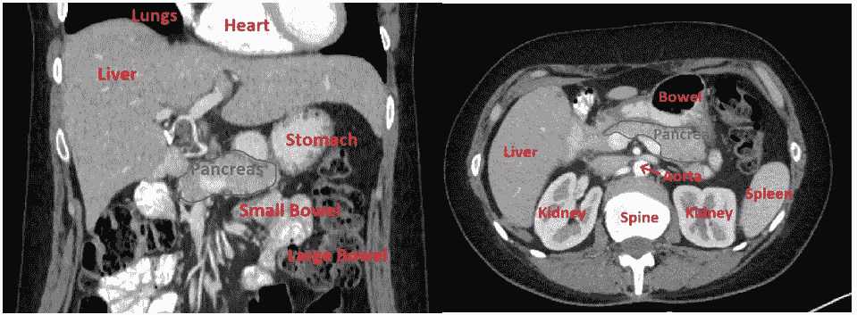
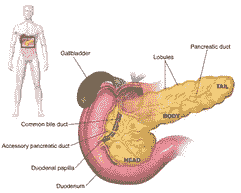
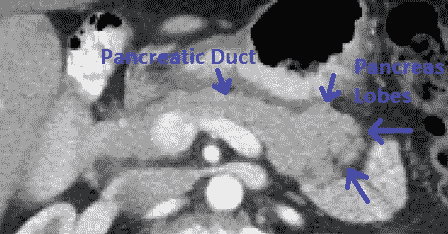
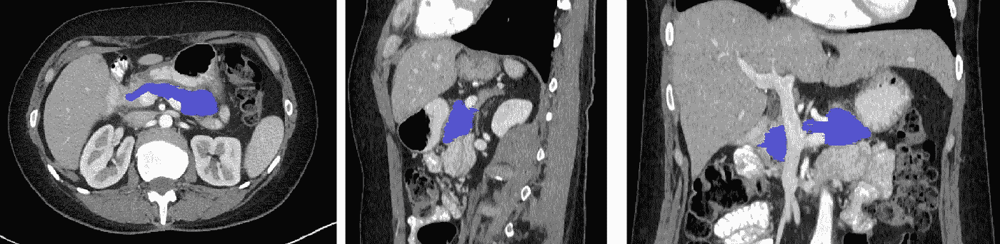

# 如何分割胰腺 CT

> 原文：<https://towardsdatascience.com/how-to-segment-ct-pancreas-3a390acb3c70?source=collection_archive---------14----------------------->

## 腹部增强 CT 发现和追踪胰腺指南

特别感谢我的好朋友梅根·恩格斯博士帮助我写这篇文章。

# 简介—什么是细分？

CT 扫描包含丰富的信息，可以帮助我们了解患者的健康状况。作为数据科学家，我们的角色是提取信息，以便可以测量或量化。

分析 CT 或 MRI 扫描的第一步通常是分割。这里，我指的是追踪——从背景中分割出重要的结构。从分割中，我们提取重要的特征，如器官体积、表面积、亮度和纹理模式，告诉我们疾病的各个方面。

细分可能是一个耗时的过程，也是我们试图使用深度学习实现自动化的首批任务之一。例如，我们实验室开发了一个 U-Net 模型，从腹部 CT ( [*纸*](https://aapm.onlinelibrary.wiley.com/doi/full/10.1002/mp.14422) *)* 中分割出三十四个独特的器官。

在本教程中，我将演示如何从腹部 CT 分割胰腺。我将重点使用 ITK 快照，这是一个简单的，免费的工具，你可以使用开始。我将介绍一些解剖学基础，但如果你打算开始自己的研究项目，我强烈建议你联系临床专家，如放射科医生，以了解你的任务的具体需求。

# TCIA 数据集

对于这个演示，我使用的是 [*癌症成像档案*](https://www.cancerimagingarchive.net/) (TCIA)数据集，这是一个由 NIH 提供的公开可用的医学图像数据集。完整的数据集包含来自健康患者的 85 次扫描。数据集还提供分段，尽管我将向您展示如何从头开始追踪。

# ITK 快照

有许多工具可以查看和注释 DICOM 图像(有关 DICOM 文件格式的背景，请参见 [*我的另一篇文章*](/understanding-dicom-bce665e62b72) )。快速入门的方法是使用 [*ITK 快照*](http://www.itksnap.org/pmwiki/pmwiki.php) ，它很容易下载和使用。它非常适合较小的数据集。

*快速插入*——对于更复杂的项目(例如，涉及多个示踪剂或重复扫描的项目)，我们在梅奥诊所的团队开发了我们自己的开源软件工具[*【RIL 轮廓*](https://gitlab.com/Philbrick/rilcontour) 。RIL 轮廓有先进的功能，使分割更快，更准确，甚至数据版本，这有助于质量控制时，你有多个个人工作在同一个项目。

# 查看图像

ITK 快照支持 NIFTI 和 DICOM 格式的图像。图 1 显示了导入文件后 ITK 快照界面的样子。

**图一。**将文件导入 ITK 快照

这是一个 3D 扫描，以 3 个视图显示——轴向(也称为“横向”)(左上)、矢状(右上)和冠状(右下)。你会注意到每个视图都标有前视图(A)，后视图(P)，上视图(S)，下视图(I)，右视图(R)和左视图(L)。

对读者来说，右和左可能是向后的——这是从面对我们的病人的角度给出的。

您可以在任何平面上进行分割，但是通常在轴向平面上进行大部分分割。这是因为 CT 中的切片厚度通常在轴向平面上更大(3-5 毫米，而不是 0.5-0.8 毫米)，所以您最终必须跟踪更少的切片。

# 开窗术

开始之前，我们需要调整扫描的对比度。这叫做“开窗”。CT 对比度是以 Hounsfield 单位测量的，它被标准化为空气(HU = -1000)和水(HU = 0)。要在 ITK 快照中调整窗口，请转到*工具* > *图像对比度* > *对比度调整*。有一个滑动条，但是直接输入数字会更准确。对于腹部软组织，级别为 50，窗口为 400，这意味着图像像素被裁剪在-350 到+450 之间。

**图二。** CT 腹部开窗前(左)和开窗后(右)。设置为级别=50，窗口=400。

这些 CT 是对比增强的，这意味着碘造影剂被注射到血流中。这将使血管看起来比周围的组织更亮。此外，患者有钡剂吞咽形式的消化对比，这使得胃和小肠的内容物也显得明亮。

# 腹部解剖学

在我们找到胰腺之前，了解一点腹部解剖学是有帮助的。我在下面的扫描中标记了一些地标。如果你查阅解剖学教科书，你会看到胰腺藏在肝脏下面，胃的后面，通常靠近脊柱。

**图 3。**腹部冠状面(左)和轴面(右)解剖

# 胰腺解剖学

就像其他器官一样，胰腺的位置、大小和形状有相当大的差异，这使得它很难分割。胰腺可能特别难以分割，原因有几个—

1.  它比其他固体器官附着少，而且容易移动
2.  它直接连接其他周围器官(尤其是肠壁)
3.  即使在健康的病人身上，它也有不均匀的外观。

下面，我从维基百科上复制了一幅漫画。胰腺器官分为三个区域，头部、身体和尾部。胰腺具有柔软的叶状外观，并围绕中央胰管组织，中央胰管将胰腺分泌的消化液运送到小肠。

**图 4。**胰腺图，来自[维基百科](https://en.wikipedia.org/wiki/Pancreas)

在 CT 上，这种分叶状的外观表现为一种柔软的块状结构。胰管可以是可见的，也可以是不可见的(年轻患者胰管不太可见)。要知道胰腺可能含有囊肿— [*有人估计*](https://gut.bmj.com/content/67/1/138) 把这个数字高达 50%。肥胖还会影响胰腺的外观，导致脂肪沉积，使胰腺看起来更黑。最后，胰腺萎缩在老年人中也很常见；这可能是疾病的迹象，或者只是老年人的正常变异。

**图 5。**轴面胰腺特写。关键的标志包括柔软的叶状结构和黑色的胰管。

# 一步一步地追踪胰腺

我通常认为最容易找到胰腺体，因为它的纹理和位置与众不同。我先追踪这个结构，然后上下追踪。

胰腺往往包裹在几个血管周围，包括主动脉、腔静脉和肾动脉/静脉。这些血管通常在对比增强 CT 上显示为明亮的圆形结构(非对比 CT 这些区别几乎不可见，并且更难分割)。务必避免在分割中意外包含血管，这会给测量带来偏差。

最后，当胰腺的头部和尾部接触附近的器官时，很难将它们分开。我喜欢使用的一个技巧是在冠状面上分割 4-5 个明显的切片，然后以此作为轴向分割的指导。这使得找到胰腺器官的“角落”变得容易。

完成后，一定要再次检查你的工作。我最常犯的错误是不小心跳过了一两片。

**图 6。**在轴面(左)、矢状面(中)和冠状面(右)完成胰腺分割。使用 ITK 快照，这个分割花了我大约 20 分钟

# 结论

像其他事情一样，细分是一个学习过程(有点像艺术形式)。在 [*我们的论文*](https://aapm.onlinelibrary.wiley.com/doi/full/10.1002/mp.14422) *，*中，我们发现当多个示踪剂勾画出同一个胰腺时，它们的一致性只有 80%左右，所以可以预料你的工作可能并不完美。

我喜欢告诉学生的一件事是，当你不确定的时候，就做你最好的猜测。你可能比你意识到的更准确！