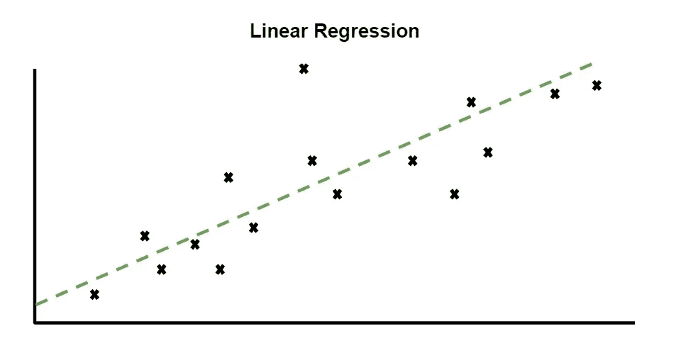
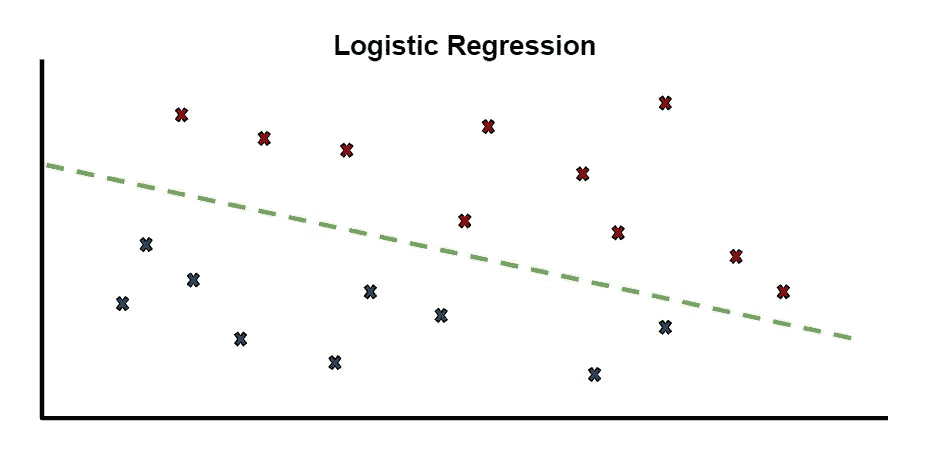

# 如何为您的数据科学问题选择初始模型

> 原文：<https://towardsdatascience.com/how-to-select-an-initial-model-for-your-data-science-problem-77f7b811bd0?source=collection_archive---------23----------------------->

## 为自己节省一些时间和麻烦，从简单开始。


塞萨尔·卡利瓦里诺·阿拉贡在 [Unsplash](https://unsplash.com?utm_source=medium&utm_medium=referral) 上拍照

这篇文章是为那些试图决定用什么模型来解决问题的新的或者有抱负的数据科学家而写的。

这篇文章不会讨论数据争论。希望这是数据科学家的主要工作。我假设你已经准备好了一些数据，你想看看如何做一些预测。

# 简单模型

**有许多型号可供选择，而且似乎有无穷无尽的变种。**

将回归模型转换成分类模型通常只需要很小的改动，反之亦然。幸运的是，标准的 python 监督学习包已经为您完成了这项工作。所以你只需要选择你想要的选项。

有许多型号可供选择:

*   决策树
*   支持向量机(SVM)
*   朴素贝叶斯
*   k-最近邻
*   神经网络
*   梯度推进
*   随机森林

这个清单可以一直列下去，但是可以考虑从两个中的一个开始。

# **线性回归&逻辑回归**


照片由 [iMattSmart](https://unsplash.com/@imattsmart?utm_source=medium&utm_medium=referral) 在 [Unsplash](https://unsplash.com?utm_source=medium&utm_medium=referral) 上拍摄

是的，像 xgboost，BERT 和 GPT-3 这样的花哨模型是存在的，但从这两个开始。

***注*** *: logistic 回归有一个不太合适的名字。该模型用于分类，但由于历史原因，该名称仍然存在。*

我建议将名称改为线性分类这样简单的名称，以消除这种混淆。但是，我在这个行业还没有那样的影响力。

## 线性回归

```
**from** **sklearn.linear_model** **import** LinearRegression
**import** **numpy** **as** **np**X = np.array([[2, 3], [5, 6], [8,9], [10, 11]])
y = np.dot(X, np.array([1, 2])) + 1
reg = LinearRegression().fit(X, y)
reg.score(X, y)
```

## 逻辑回归

```
**from** **sklearn.linear_model** **import** LogisticRegression
**from** **sklearn.datasets** **import** load_breast_cancer
X, y = load_breast_cancer(return_X_y=**True**)
clf = LogisticRegression(solver='liblinear', random_state=10).fit(X, y)
clf.score(X,y)
```

## 为什么是这些型号？

为什么要从这些简单的模型开始呢？**因为有可能，你的问题不需要什么花哨。**

打破一些深度学习模型，花费数百美元在 AWS 费用上，只获得轻微的准确性提升，这是不值得的。

这两个模型已经被研究了几十年，是机器学习中最广为人知的模型之一。

它们很容易解释。两个模型都是线性的，所以它们的输入转化为输出的方式可以用手工计算。

## 给自己省点头疼。

即使你是一个经验丰富的数据科学家，你也应该知道这些模型在你的问题上的表现，主要是因为它们实现和测试是如此的不费力。

我为此感到内疚。我以前曾一头扎进去，建立过复杂的模型。**考虑到我正在使用的 xgboost 型号总体上更胜一筹**，所以它应该是我的起始型号。却发现线性回归模型的表现只有几个百分点。使用线性回归是因为它更简单，更容易理解。

这里有自我的因素在起作用。


由[塞巴斯蒂安·赫尔曼](https://unsplash.com/@officestock?utm_source=medium&utm_medium=referral)在 [Unsplash](https://unsplash.com?utm_source=medium&utm_medium=referral) 上拍摄的照片

你可能想表明你理解这些复杂的模型以及如何使用它们。但有时设置、培训和维护它们并不实际。**一个模型可以用，并不意味着就应该用这个模型。**

不要浪费你的时间。足够好并被使用的东西总是比复杂但没人使用或理解的东西更好。

所以希望，现在你从简单的开始，从这些模型中的一个开始。

# 第一个问题

我的问题是分类问题还是回归问题？

## 你的问题是回归问题吗？

你想预测一个连续的输出吗？



线性回归(作者供图)

像房子、产品或股票的价格？回归。
某样东西会持续多久，比如飞行持续时间、制造时间，或者用户在你博客上停留的时间？回归。

从线性回归开始。画出你的线性回归图并评估这个模型。

在这里保存性能。如果对你的问题来说已经足够好了，那就继续吧。否则，现在你可以开始尝试其他模式。

## 你的问题是分类问题吗？

您是在尝试预测二进制输出还是多个唯一且离散的输出？



逻辑回归(作者照片)

你是想确定某人是否会从你的商店买东西或者赢得一场游戏吗？分类。

一个是或否回答了你的问题吗？分类。

从逻辑回归开始，绘制你的数据或数据子集的散点图，并给类着色。也许已经有了明确的模式。

同样，评估这个模型，如果你仍然需要改进你的表现，把它作为你的基线。但是从这里开始。

# 结论

很可能，那些读过这篇文章的人会发现自己处于类似的情况，选择使用什么模型。然后从你读过的一篇论文中决定你的问题对于这个新模型是完美的。结果，花费数小时对这个复杂的模型进行微调，最终只有一个更简单的模型胜出。

不一定是性能，**而是因为它们简单易懂**。

给自己留点时间和精力。就从线性回归和逻辑回归开始吧。

*如果你有兴趣阅读关于新颖的数据科学工具和理解机器学习算法的文章，可以考虑在 Medium 上关注我。*

*如果你对我的写作感兴趣，想直接支持我，请通过以下链接订阅。这个链接确保我会收到你的会员费的一部分。*

<https://zjwarnes.medium.com/membership> 