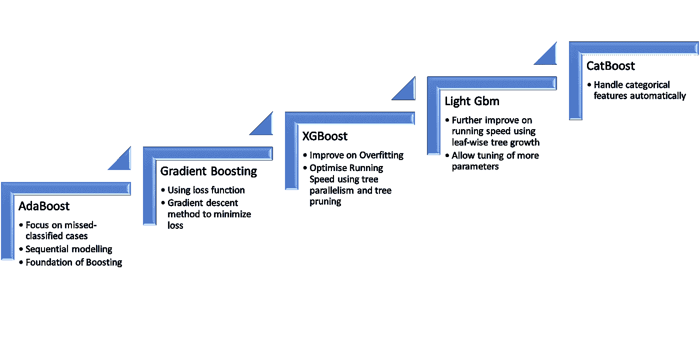
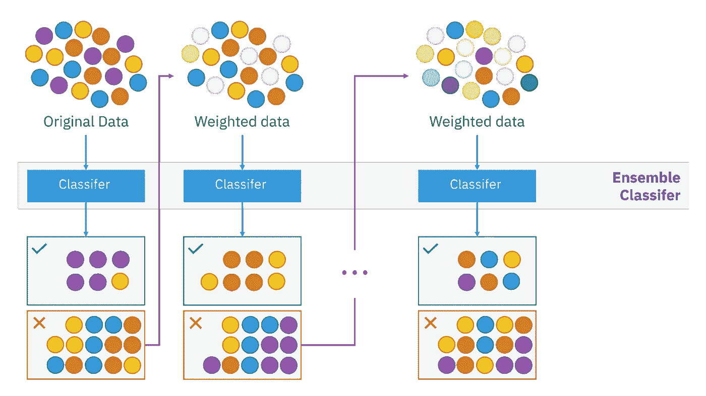
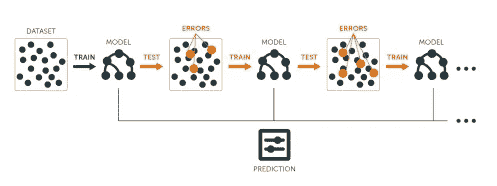
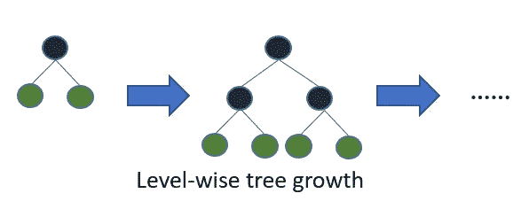
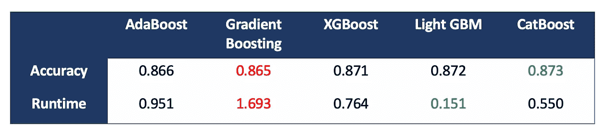

# 如何在不同的升压算法之间进行选择

> 原文：<https://towardsdatascience.com/how-to-select-between-boosting-algorithm-e8d1b15924f7?source=collection_archive---------13----------------------->

## AdaBoost、梯度增强、XGBoost、Light Gbm、CatBoost


[绿色变色龙](https://unsplash.com/@craftedbygc?utm_source=unsplash&utm_medium=referral&utm_content=creditCopyText)在 [Unsplash](https://unsplash.com/s/photos/learning?utm_source=unsplash&utm_medium=referral&utm_content=creditCopyText) 上的照片

几年前我第一次听说 boosting 算法。当时我还在学校读本科，使用线性回归/逻辑回归作为机器学习的主要算法。那时候，boosting 听起来像是一个非常困难和复杂的算法，这让我害怕！

这些年来，我逐渐学会了不同的 boosting 算法。我意识到这其实并不是一个很难学习和应用的概念。当然，如果你想对算法的数学和编码了如指掌，这将是困难和巨大的努力。但是，如果你只是想用算法，知道什么时候用，我们只需要**知道特点，了解不同 boosting 算法的区别**。

本文将重点介绍**不同升压算法的概述**。我将向您展示主要思想、示例代码、如何使用它们以及每种 boosting 方法的优缺点。然而，我不会深入讨论每一种提升算法的细节。

> Boosting 是一种**顺序**集成学习技术，其中不同的模型被迭代添加，以提高整体模型性能。



作者图片:Boosting 算法的演变

如上图所示，我将按照发布时间的顺序介绍 5 种提升方法。Light Gbm 和 CatBoost 是在相似的时间推出的，所以我们不能说一个是另一个的改进版本。

# 我们正在使用的数据

这次我将使用来自 UCI 的[成人工资预测数据集](https://archive.ics.uci.edu/ml/datasets/Adult)进行演示。该数据集的主要目标是预测此人的年收入是否超过 5 万英镑。这是一个分类问题，它包含相当多的分类变量，如教育背景、婚姻状况和职业。

我将在 salary 数据集上展示每个 boosting 算法的示例代码。对于前 4 种方法，我已经使用[标签编码](https://scikit-learn.org/stable/modules/generated/sklearn.preprocessing.LabelEncoder.html)将文本列转换成整数。标签编码将文本类别转换为 0，1，2，3…我使用这种方法是因为一个热编码(转换为 0/1)会创建太多的列。我将使用最后一个方法 CatBoost 的原始文本列，因为这是算法内置功能的一部分。

此外，为了查看运行时性能，我将所有算法标准化为运行 100 次迭代来比较运行时。

## adaboost 算法

AdaBoost 是自适应增强的简称。我们称之为自适应，因为该算法利用了来自先前模型的**未分类案例，并创建了一个**新的加权数据样本**，其中未分类案例具有更大的权重。这样，新添加的模型在解决先前模型的“错误”时应该更具适应性。**

AdaBoost 是最早开发的 boosting 算法之一。现在很少使用它，但它是大多数 boosting 算法的基础。



由西拉科恩——自己的作品，CC BY-SA 4.0，[https://commons.wikimedia.org/w/index.php?curid=85888769](https://commons.wikimedia.org/w/index.php?curid=85888769)

```
from sklearn.ensemble import AdaBoostClassifier
clf = AdaBoostClassifier(n_estimators=100,random_state=1)
clf.fit(X_train, Y_train)
predicted=clf.predict(X_test)
print('Accuracy of the result is:')
print(np.mean(predicted==Y_test))#Accuracy: 0.8659023441498618
#Runtime: 0.9506289958953857
```

## 梯度推进

与 AdaBoost 相比，梯度提升**不惩罚漏分类情况，而是使用损失函数**。损失函数可以是回归的平均误差或分类问题的对数损失。此外，梯度提升算法使用**梯度下降法来不断最小化损失函数，以找到最优点**。

梯度提升方法理论上比 AdaBoost 执行得更好。然而，它更容易出现过拟合问题，并且梯度增强的运行时间更长。可以设置早期停止条件，以减轻过拟合并减少运行时间。



通过使用 R 的[动手机器学习进行梯度提升](https://bradleyboehmke.github.io/HOML/gbm.html)

```
from sklearn.ensemble import GradientBoostingClassifier
clf = GradientBoostingClassifier(n_estimators=100,random_state=0)
clf.fit(X_train, Y_train)
predicted=clf.predict(X_test)
print('Accuracy of the result is:')
print(np.mean(predicted==Y_test))#Accuracy: 0.8646739686764254
#Runtime: 1.6930928230285645
```

## XGBoost

XGBoost 代表极限梯度提升，它指的是工程师们推动梯度提升方法的计算资源极限的目标。

XGBoost 是梯度增强方法的增强版本。首先，它**通过使用正则化**改进过拟合。其次，通过使用并行运行优化排序**，提高了运行速度。最后，使用决策树的**最大深度作为参数**来修剪该树，这显著减少了运行时间。**

```
from xgboost import XGBClassifier
clf = XGBClassifier(n_estimators=100,random_state=0)
clf.fit(X_train, Y_train)
predicted=clf.predict(X_test)
print('Accuracy of the result is:')
print(np.mean(predicted==Y_test))#Accuracy: 0.8710205752891801
#Runtime: 0.7643740177154541
```

## 轻型 GBM

顾名思义， [Light Gbm](https://lightgbm.readthedocs.io/en/latest/Features.html) 进一步**通过让计算工作量‘轻’来提高程序的运行时间**。但是，与其他算法相比，它仍然可以保持相同或更高的模型性能。

Light Gbm 主要通过两种方式优化运行速度和准确性。

1.  它采用基于直方图的算法，**将连续变量拆分到不同的桶中**(而不是单独排序)。这大大提高了运行时间。
2.  它使用**逐叶树生长方法，而不是逐层树生长方法**(被大多数其他基于决策树的方法使用)。从下面的图片可以看出，它允许损失较高的叶片部分继续生长(**最佳拟合切割**)，从而将整体损失函数降至最低。



来自[轻型 gbm 文档](https://lightgbm.readthedocs.io/en/latest/Features.html)的水平方向树生长与叶方向树生长

```
import lightgbm as lgb
clf = lgb.LGBMClassifier()
clf.fit(X=X_train, y=Y_train,feature_name=list(X_train.columns),categorical_feature=list(df_cat.columns))
predicted=clf.predict(X_test)
print('Accuracy of the result is:')
print(np.mean(predicted==Y_test))#Accuracy: 0.871839492271471
#Runtime: 0.15074729919433594
```

使用 Light Gbm 的另一个好处是，它有 100 多个参数可以根据数据集和问题进行调优和调整。这里一个非常有用的特性是，您可以在 fit 函数中定义分类特性列表(您需要先将类别转换为整数)。

## CatBoost

最后，CatBoost 代表分类推进。它有一个很大的特点就是**自动处理分类变量，而不需要将它们转换成数字**。

CatBoost 是 5 种 boosting 算法中最新开发的，但非常接近轻型 Gbm。分类变量越多，性能越好。

```
from catboost import CatBoostClassifier
clf=CatBoostClassifier(iterations=100)
clf.fit(X_train, Y_train,cat_features=list(df_cat.columns))
predicted=clf.predict(X_test)
print('Accuracy of the result is:')
print(np.mean(predicted==Y_test))#Accuracy: 0.8731702323676938
#Runtime: 0.5496680736541748
```

# 整体性能比较



结果对照表

不同的增强方法在准确性方面的表现相当一致。CatBoost 具有最高的精度，但差异领先是最小的。就运行时性能而言，Light Gbm 具有最快的执行速度和最高的准确率。

梯度增强在运行时间方面表现不佳，并且它具有最低的精度(略低于 AdaBoost)。从这次演习来看，轻型 Gbm 似乎是冠军。

# 建议

就个人而言，我会**推荐使用轻型 GBM 和 CatBoost** ，因为它们的**性能/速度优势**以及**大量用于模型调整的参数**。

当预测器中有许多分类变量时，CatBoost 表现更好。分类变量包括文本、音频和图像。它还为您节省了转换分类变量的工作量。

轻型 GBM 的模型训练速度比 CatBoost 快。同时也不牺牲精度水平。当您有一个大型数据集和相对较少的分类预测器时，您可以选择使用 LightGBM

# 潜在的未来工作

1.  比较是在 30k 行数据上进行的。数据集可以有偏差，大小也不是很大。您可以通过使用 [make_classification](https://scikit-learn.org/stable/modules/generated/sklearn.datasets.make_classification.html) 包来尝试更大的分类数据集
2.  这个练习只是为了分类，你也可以尝试回归的一面
3.  在评估模型性能方面，仅使用准确性和运行时间，**其他分类评估如 ROC 评分、F1 评分、召回率、精确度也可用于查看全貌**。
4.  建模最耗时的部分是超参数调整。当前的练习或比较不包括超参数调整部分。我会有一篇新的文章，请继续关注。

# 最后

这是对不同类型的升压方法的非常基本的概述。你可以阅读每种方法的更多内容，也许可以在几个数据集上尝试模型以进一步理解它。

另外，boosting 只是集成学习算法中的一种。如果你有兴趣了解更多关于 ensembled learning 的内容，可以参考我下面的文章:

</overview-of-ensemble-learning-c216a9f6c04>  

感谢阅读！希望这篇文章能帮到你。

如果你对你想让我介绍的某个特定的助推方法或主题感兴趣，请在评论中提出来！