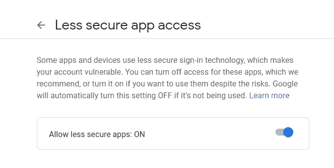
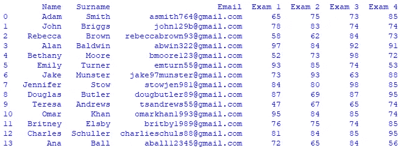
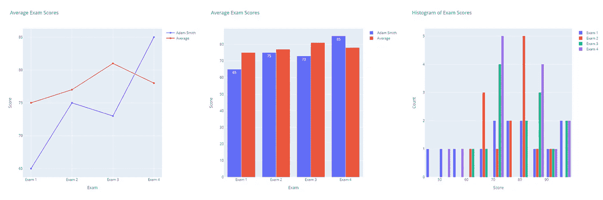
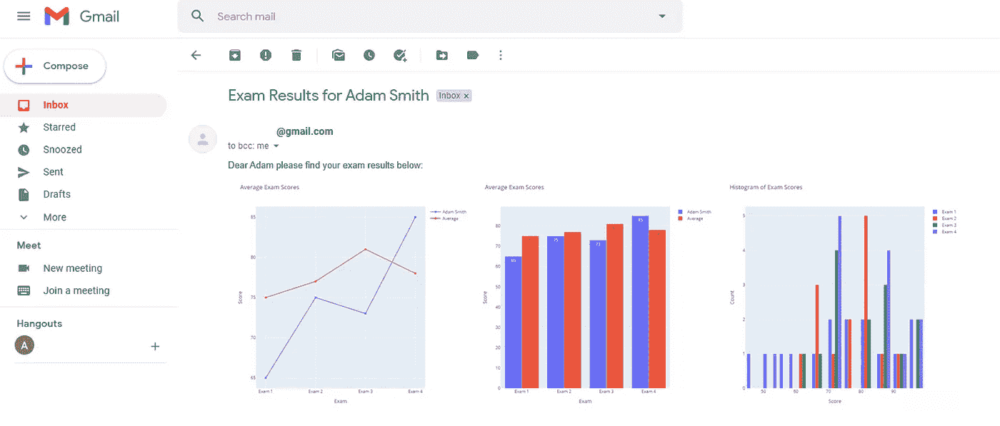

# 如何使用 Python 发送和接收自动电子邮件

> 原文：<https://towardsdatascience.com/how-to-send-and-receive-automated-emails-using-python-a5c711c7a35c?source=collection_archive---------13----------------------->

## 使用令人眼花缭乱的仪表板创建自动化的电子邮件管道


斯蒂芬·菲利普斯-Hostreviews.co.uk 在 [Unsplash](https://unsplash.com?utm_source=medium&utm_medium=referral) 上的照片

# 介绍

在我们的公司和非公司生活中，我们每天都会收发大量的电子邮件。说实话，这些交易中的很大一部分确实可以自动化。也许我们都经历过人生中具有里程碑意义的时刻，那就是我们一天中的大部分时间都在给许多人发送差不多相同的电子邮件。嗯，不一定非要那样。使用 Python，您实际上可以设置和部署一个自动化的电子邮件管道来接收电子邮件，然后根据前者的内容发送电子邮件。换句话说，当你在工作或家里处理更有影响力的任务时，你可以让自动化发挥作用。

完全没有必要精通技术，我们要做的事情很简单，我们每个人都可以在短时间内完成。在本教程之后，您将学习如何自动接收电子邮件，使用内容和附件生成图表，然后最终向许多收件人发送带有令人眼花缭乱的仪表板的电子邮件。

具体来说，在本教程中，我们将自动执行以下操作:

*   接收电子邮件
*   解析电子邮件内容和附件
*   生成数据可视化
*   向多个收件人发送电子邮件

# 接收电子邮件

虽然本教程中使用的技术可以应用于任何使用标准 IMAP 协议的电子邮件服务器，但一些服务器(如 Gmail)的使用可能会有所不同。如果您确实在使用 Gmail，请确保您在 Google 帐户中启用了不太安全的应用程序选项，如下所示:



Gmail 不太安全的应用程序授权-作者图片。

继续启动 Anaconda 或您选择的任何其他 Python IDE，并运行下面的代码片段来连接到您的电子邮件帐户并下载您收件箱中的所有内容。

此外，请注意，存储您的用户凭证的更安全的方法是将它们保存在一个[配置文件](https://medium.com/@t.rosen2101/how-to-create-a-gitignore-file-to-hide-your-api-keys-95b3e6692e41)中，然后在您的代码中将它们作为参数调用。

# 解析电子邮件内容和附件

现在让我们假设您正在等待一封带有 Microsoft Excel 附件的电子邮件，其中包含许多学生的考试结果。您的目标是使用“考试结果”主题自动搜索该电子邮件。一旦找到它，您将需要提取文件并保存到您的本地目录。

请注意，如果您想要搜索特定的发件人而不是电子邮件主题，请将上面代码片段的第 7 行替换为以下内容:

```
if 'sender_email@gmail.com' in email_content['From']:
```

# 生成数据可视化

现在您已经下载了电子邮件附件，您将希望根据附件的内容生成文本和图表。因为在我们的例子中，文件是一个 Excel 电子表格，我们将使用 Pandas 将其转换成一个数据框。



电子邮件附件数据框-作者图片。

我们现在的目标是找到每次考试的班级平均分，然后创建一个图表，单独显示每个学生的分数。为此，我们将使用如下所示的 Plotly 来生成包含考试结果的自定义折线图、条形图和直方图。在继续下一步之前，请确保您可以通过在 Anaconda 提示符下键入以下命令，使用‘python-kaleido’库将图表保存为图像:

```
conda install -c plotly python-kaleido
```

上面的片段将为每个学生创建以下三个图表:



考试成绩图表-作者图片。

# 向多个收件人发送电子邮件

现在我们已经生成了定制的图表，下一步是将相应的图表和考试结果发送给每个学生。下面的代码片段是前面代码片段中 for 循环的延续。

# 结果

这就是你自己的电子邮件仪表板，通过自动化管道毫不费力地发送给许多收件人。这只是这种方法的扩展功能的一个小演示，实际上您可以通过发送更丰富的内容来扩展它，包括但不限于文本、图像、音频和其他 HTML 内容。



电子邮件仪表板—按作者分类的图像。

如果您想了解更多关于数据可视化和 Python 的知识，请随时查看以下(附属链接)课程:

## 使用 Streamlit 开发 Web 应用程序:

[](https://www.amazon.com/Web-Application-Development-Streamlit-Applications/dp/1484281101?&linkCode=ll1&tag=mkhorasani09-20&linkId=a0cb2bc17df598006fd9029c58792a6b&language=en_US&ref_=as_li_ss_tl) [## 使用 Streamlit 开发 Web 应用程序:开发和部署安全且可伸缩的 Web 应用程序…

### 使用 Streamlit 开发 Web 应用程序:使用……开发安全且可扩展的 Web 应用程序并将其部署到云中

www.amazon.com](https://www.amazon.com/Web-Application-Development-Streamlit-Applications/dp/1484281101?&linkCode=ll1&tag=mkhorasani09-20&linkId=a0cb2bc17df598006fd9029c58792a6b&language=en_US&ref_=as_li_ss_tl) 

## 使用 Python 实现数据可视化:

[](https://www.coursera.org/learn/python-for-data-visualization?irclickid=xgMQ4KWb%3AxyIWO7Uo7Vva0OcUkGQgW2aEwvr1c0&irgwc=1&utm_medium=partners&utm_source=impact&utm_campaign=3308031&utm_content=b2c) [## 用 Python 实现数据可视化

### “一图胜千言”。我们都熟悉这个表达。它尤其适用于试图…

www.coursera.org](https://www.coursera.org/learn/python-for-data-visualization?irclickid=xgMQ4KWb%3AxyIWO7Uo7Vva0OcUkGQgW2aEwvr1c0&irgwc=1&utm_medium=partners&utm_source=impact&utm_campaign=3308031&utm_content=b2c) 

## 面向所有人的 Python 专业化:

[](https://www.coursera.org/specializations/python?irclickid=xgMQ4KWb%3AxyIWO7Uo7Vva0OcUkGQgW16Ewvr1c0&irgwc=1&utm_medium=partners&utm_source=impact&utm_campaign=3308031&utm_content=b2c) [## 面向所有人的 Python

### 学习用 Python 编程和分析数据。开发收集、清理、分析和可视化数据的程序…

www.coursera.org](https://www.coursera.org/specializations/python?irclickid=xgMQ4KWb%3AxyIWO7Uo7Vva0OcUkGQgW16Ewvr1c0&irgwc=1&utm_medium=partners&utm_source=impact&utm_campaign=3308031&utm_content=b2c) 

## GitHub 资源库:

[](https://github.com/mkhorasani/python_automated_email) [## mkhorasani/python _ automated _ email

### 使用令人眼花缭乱的仪表板创建自动化的电子邮件管道

github.com](https://github.com/mkhorasani/python_automated_email) 

# ☕喜欢这个教程？这里[有空给我捐一杯咖啡](https://www.paypal.com/paypalme/dummylearn)。

# 新到中？您可以在此订阅并解锁无限文章[。](https://khorasani.medium.com/membership)