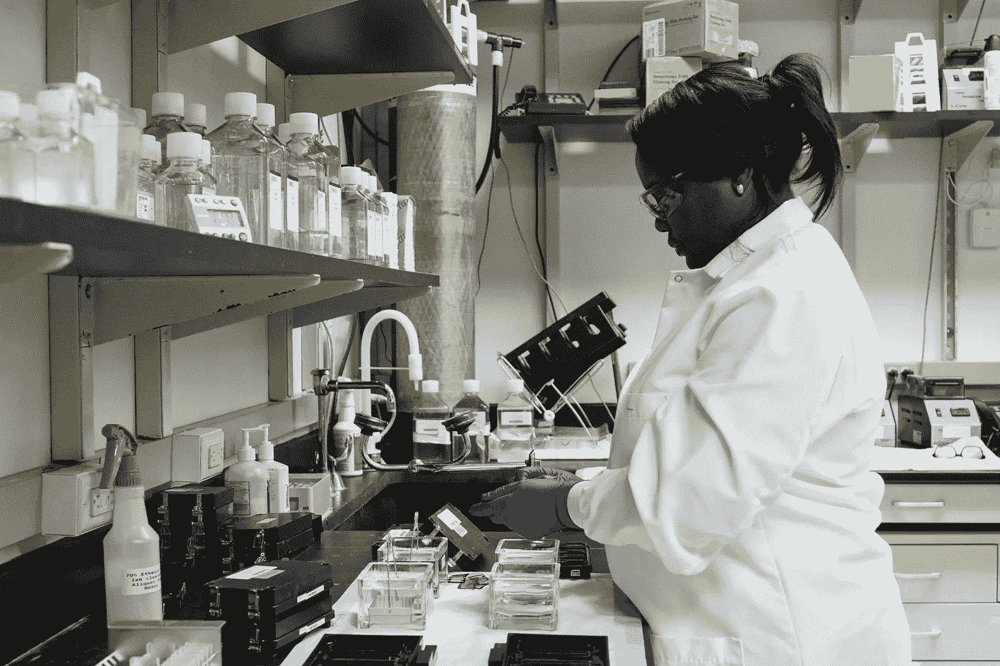
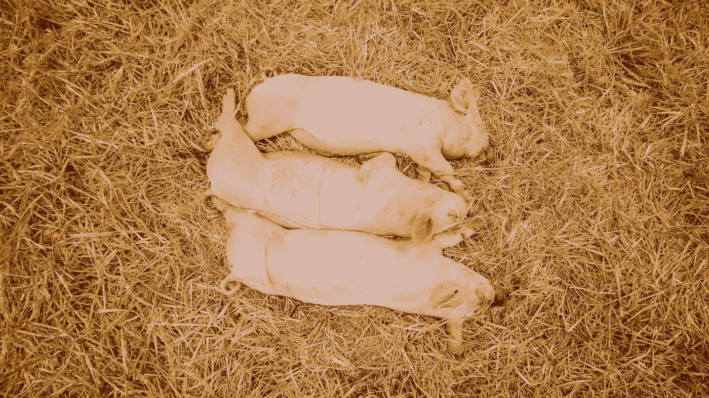
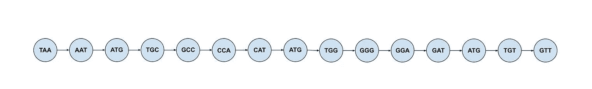
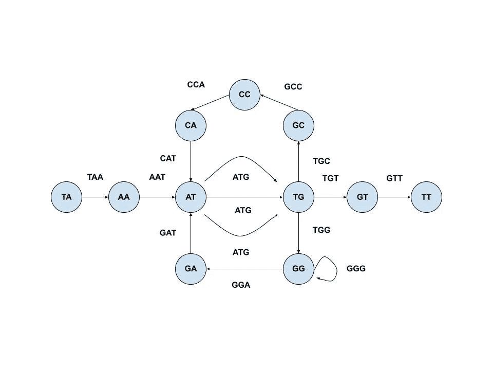
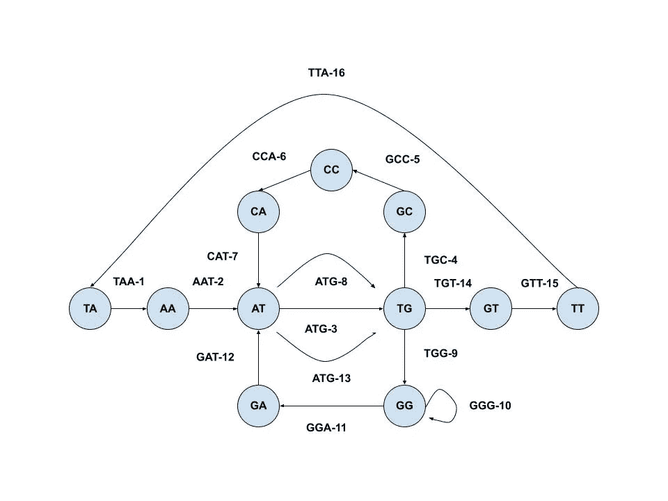
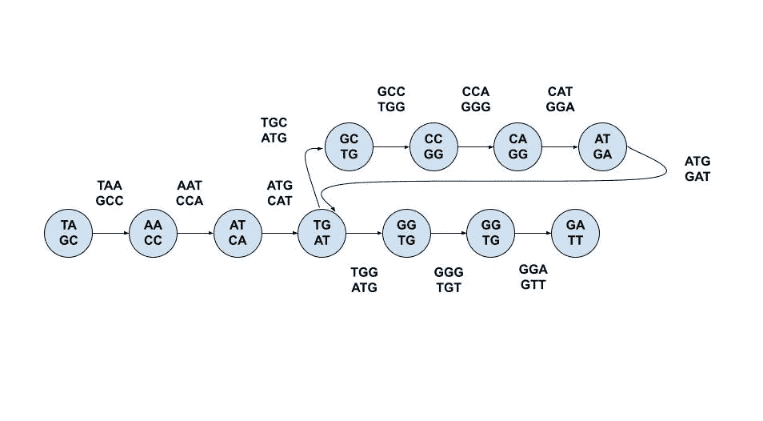

# 如何测序人类基因组

> 原文：<https://towardsdatascience.com/how-to-sequence-a-human-genome-a-bioinformatics-approach-ae64481cec7b?source=collection_archive---------37----------------------->

## [实践教程](https://towardsdatascience.com/tagged/hands-on-tutorials)

## 通过阅读《三只小猪》和穿越一座城市

人类基因组包含超过 30 亿个碱基对。从上下文来看，如果你每秒钟检测一个碱基对，你需要花 94 年来检测它们。因此，毫不奇怪，1990 年，人类基因组计划就是为了完成这一任务而创立的，也就是说，对整个人类基因组进行测序。

像科学中的许多事情一样，这个项目变成了一场竞赛。在这种情况下，在 Celera Genomics 和 IHGSC 之间。



DNA 基因分型和测序。[信用](https://unsplash.com/photos/27KVI33BS_E):国家癌症研究所(Unsplash)

也许有些令人不满意，两个团队在 2001 年同时发表了完整的基因组。这两个阵营采用的方法各不相同，在本文中，我们将重点介绍 Celera 的三步法:

1.  将整个基因组切割成大约 150，000 个碱基对长的更易管理的片段。
2.  将这些片段分别插入克隆的人造细菌染色体中，然后通过“指纹”向科学家展示它们重叠的地方。
3.  然后，这些重叠被用作向导，向科学家展示顺序，然后从那里，整个基因组被重建。

前两步非常简单，事实上，DNA 的分离和转染是工业上经常做的事情，例如在重组蛋白生产中。第三步要复杂得多，乍一看，可能会让人不知所措。

这种做事方式几乎就像你拿了很多本*三只小猪*(或者任何一个词汇相当局限于一小组单词的故事)，把它们放进一个碎纸机，把纸屑像绳子一样混合在一起，然后试图重建至少一个完美的*三只小猪*的副本。



[信用](https://unsplash.com/photos/SSjGNxxqD6k):马蒂厄·佩蒂亚尔(Unsplash)

除非你对拼图游戏有秘密的嗜好，否则这看起来非常没有希望，事实上也确实如此(特别是当你的《三只小猪》有 30 亿个字符长的时候)。

但是，人类无法有效完成的机械任务，计算机肯定可以。这就是生物信息学的用武之地。生物信息学就像生物学和计算机的私生子。它利用计算机以逻辑方式处理大量数据的能力来解决生物学问题。人类基因组测序可以被视为一个非同寻常的生物学问题，几乎从定义上来说，它包含了大量的数据，这使得使用生物信息学方法来解决它变得非常完美。

回到*三只小猪的比喻，*因为粉碎的过程是随机的，所以不可能有很多碎片看起来完全一样。例如，在一个副本中，句子“我会一鼓作气，吹倒你的房子”可能会被砍成

> "我会吹气，我会吹气，我会吹倒你的房子"。

但是，在另一个副本中，它可能是

> "我会发怒，我会砰的一声，我会把你的房子夷为平地"。

如果我们对英语没有任何概念，如果呈现给我们第一批片段，我们就不知道该按什么顺序排列，因为就我们所知，一个顺序看起来和下一个一样好。我们会很容易地把第一组纸条拼凑成正确的措辞“我会吹，我会吹你，我会吹倒我们的房子”。

话虽如此，如果有第二套，我们可能会注意到有一些重叠之间的“我会 huff an”和“我会 huff，我会 pu”和一些更多的重叠之间的“我会 huff，我会 pu”和“d 我会 puff，我会吹你”。因此，我们可能会得出这样的结论:“我会发脾气”和“我会吹气，我会吹你”紧挨着，提供句子“我会发脾气，我会吹气，我会吹你”,这是朝着正确方向迈出的一步。

这个过程似乎有些矫枉过正。为什么你要收集一架子的*三只小猪*，把每一只都放进碎纸机里，当你可以读其中一只的时候，还要煞费苦心地寻找重叠之处？当谈到基因组时，生物信息学家没有能力像阅读一本书那样从左到右阅读。因此，他们不得不

1.  将基因组的多个副本分割成更小的“**读数**”，这不可避免地会变得杂乱无章。
2.  找到这些读数重叠的地方，并利用这些信息构建整个基因组。

我们先考虑一个理想情况。比方说，我们有一个“天文”这个词，它可以很方便地分成一堆三个字母:“ast”、“str”、“tro”、“ron”、“ono”、“omi”、“mic”、“ica”、“cal”。因为每对连续的三聚体共有 2 个字符(即一个三聚体的“后缀”等于紧随其后的三聚体的“前缀”)。

因此，我们可以从第一个三聚体开始，添加每个后续三聚体的最后一个字符，得到“ast-r-o-n-o-m-i-c-a-l”。如果我们使用四聚体，这将是正确的:

> " astr" + "stro" + "tron "，" rono "+" onom "+" nomi "+" omic "+" mica "+" ical " = " astr-o-n-o-m-I-c-a-l "。

或五聚体

> " astro "+" stron "+" trono "+" ronom "+" onomi "+" nomic "+" omica "+" mical " = " astro-n-o-m-I-c-a-l "。

这其中的两个主要问题是

1.  它假设所有的读取都是按照正确的顺序进行的。例如，如果我们有“astro”、“trono”、“nomic”、“onomi”、“omica”、“stron”、“mical”、“ronom”，这就不太好了。
2.  **它假设完美覆盖**——即每一个可能的 k-mer 都被转换成 k-mer。如果 k-mer 的“ronom”被省略，我们从“trono”到“onomi”，我们就会有一个缺口。

我们将讨论所有这些要点，但首先让我们考虑一个基本操作，即获取一个字符串并尝试将其分解为它的 **k-mer 组合**——即组成它的 k-mer 集合(例如。《天文》的三聚体构成是" ast "、" str "、" tro "、" ron "、" ono "、" omi "、" mic "、" ica "、" cal "。

```
def StringComposition(Text, k):
    for i in range(len(Text)-k+1):
        print(Text[i:i+k])
```

但是，我们也希望能够做相反的事情。也就是说，给定一个 k-mer 组合，恢复它对应的字符串。因为这仍然是一种理想化的情况，我们可以进行上面的观察，并意识到每个 k-mer 都在其之前的 k-mer 中添加一个新字母。

```
def StringFromGenomePath(Genome):
    k = len(Genome[0])
    string = ""
    string += Genome[0][0:k-1]
    for i in range(0, len(Genome)):
        string += Genome[i][k-1]
    return string
```

## 假设 1:所有的阅读顺序都是正确的。

现在，我们陷入疯狂和不确定之中！但在我们全面开始之前，值得注意的是，这很大程度上是基于 Pavel Pevzner 和 Philip Compeau 的 MOOC 生物信息学 II。为了更多地实践这里概述的概念，我强烈建议你去看看！

正如我们之前建立的那样，k-mers 可能不会按照你想要的顺序出现。所以我们转向**重叠图**的概念。所有的图都是由节点和边组成的。你可以把它想象成一个城市，各个目的地是节点，边是街道


鸣谢:Hanson Lu (Unsplash)

在这种情况下，我们的图将有**条有向边**，这意味着你只能沿着边所指的方向从一个节点到下一个节点，即单行道。

我们将制作所有的 k-mers 节点，并在共享前缀和后缀的节点之间绘制边。例如，如果我们有三聚体 TAATGGGATGCCATGTT，那么节点 TAA 有一条指向 AAT 的边，它有一条指向 ATG 的边…等等。因为边缘在共享的前缀和后缀之间，所以穿过它们就像穿过两个 k-mers 之间的重叠部分。



基本字符串重建路径。鸣谢:作者

但问题是，我们实际上并不知道事情是以这种特定的顺序联系在一起的，例如，ATG 目前指向 TGC 的气泡，但从技术上来说也可能指向 TGG。

重建 k-mer 就像试图在这个重叠图中找到一条路径/找到一条访问城市中每一个目的地的方法。但不是任何路径:一条**哈密尔顿路径**，它恰好访问每个节点一次。因为它是沿着有向边(所有的重叠)来做的，所以我们知道所有的 k-mers 都是正确的顺序。

但是，从算法上来说，很难找到哈密顿路径。这就是为什么我们也考虑**德布鲁因图**的原因。在这个图中，边是 k-mers，节点是构成前缀和后缀的 k-1mers。特别地，对于给定的边，它来自的节点将是前缀，它去往的节点将是后缀。因此，例如在上面的 k-mer TAATGGGATGCCATGTT 中，边 TAA 将从 TA 指向 AA，边 GAT 将从 GA 指向 AT。

为了简化事情，我们可以将具有相同 k-1 mer 的节点“粘合”在一起，合并进入和离开它们的边。



德布鲁金图。鸣谢:作者

```
def DeBruijn(k, Text):
    mers = {}
    for i in range(len(Text)-k+1):
        if Text[i:i+k-1] in mers:
            mers[Text[i:i+k-1]].append(Text[i+1:i+k])
        else:
            mers[Text[i:i+k-1]] = [Text[i+1:i+k]]  
    for item in mers:
        print("{} -> {}".format(item, ', '.join(mers[item])))
```

我们想在这个图中找到一条路径，这条路径恰好访问每条边一次(所以每个 k-mer 都被访问一次)。我们知道，如果我们沿着正确的方向沿着边走，那么所有这些 k-mers 的顺序都是正确的，因为它们必须紧挨着与它们重叠的 k-mers(由于共享前缀和后缀的节点)。这样的路径被称为**欧拉路径。**

欧拉循环非常类似于欧拉路径，只是它在同一个节点开始和结束。对于一个有欧拉圈的图，它必须是

1.  **强连接。**即可以从每个其他节点到达每个节点。例如，如果我们的“城市”基本上是一系列没有桥梁连接的岛屿，那么它就不会是强连接的。

**2。平衡。**进入节点的边数(入度)必须等于离开节点的边数(出度)。换句话说，能让你到达目的地的单行道数量等于能让你离开目的地的节点数量。

在这种情况下，第一个要求几乎是隐含在这种情况下，如果你有一个字符串，你将*显然*能够从字符串中的一个 k-mer 到另一个。第二个也是，但是如果一个图有两个以上的节点，其中入度不是出度，那么在访问每个点之前，您将不可避免地停留在一个这样的位置。

但是一个人如何找到这样一条路呢？让我们假设你被随机放在一个欧拉图上，任务是计算出一个欧拉圈。如果事先不知道这个图表是什么样子，你的第一反应可能是开始随机地四处游荡，直到有事情发生。

将会发生的“某件事”是你到达一个节点，却无处可去，因为你已经用完了离开那个节点的所有边。但这不会在任何节点发生，因为结果是，**你唯一可能被卡住的节点是你从**开始的节点。在这种情况下，如果你已经沿着其他每一条边走了，那么很好——你找到了一个欧拉周期。但是，如果仍有一些未使用的边，则必须执行以下操作:

1.  回溯到一个节点(n ),它有一些未使用的边。
2.  从那里开始遍历图，直到你再次卡在节点 n。
3.  沿着原始路径从节点 n 继续前进。

您可以将这种方法视为为您的循环建立一个“主干”,即最初的遍历，然后在图的其他部分不断“循环”到这个主干中。

```
def EulerCycleSolver(graph):
    path = []

    key = random.choice(list(graph))
    path.append(key)while len(graph[key]) != 0:
        value = random.choice(graph[key])
        graph[key].remove(value)
        key = value
        path.append(key)

    for key in path:
        if len(graph[key]) != 0:
            x = len(path) - path.index(key) - 1
            while len(graph[key]) != 0:
                value = random.choice(graph[key])
                graph[key].remove(value)
                key = value
                path.insert(-x, key)
    #path.pop() #- if want to minus last connection
    return path
```

然后从这一点，找到一个欧拉路径只是必须忽略最后一个连接。这是可行的，因为所有有欧拉圈的图都必须有一条欧拉路径。但是，如果一个图没有欧拉圈呢？这并不一定意味着图形没有欧拉路径(有点像所有的正方形都是矩形，但不是所有的矩形都是正方形)。

在那些小的子集情况下，图必须是“接近平衡的”。这意味着，有一个节点的进箭头比出箭头多一个，另一个节点的出箭头比进箭头多一个。

具有额外出度的那个将是起点，具有额外入度的那个将是终点。这是因为每次你进入一个节点，你需要能够离开它，但如果你有一个更多的边缘进来，你最终会卡在那个节点，这是好的，如果这是你的最后一个节点。一种相反的直觉适用于起始节点。

通过找到这两个节点，在 then 和 then 之间添加一条边，然后使用之前建立的欧拉循环算法，我们可以很容易地将此图转换为具有欧拉循环的图。



德布鲁金图中的欧拉圈。鸣谢:作者

然后将该序列拟合到字符串重构问题算法中，将返回原始字符串。但是事实证明并不是所有时候。例如，假设您有一个字符串 TAATG**GG**ATG**CC**at GTT，它的三个成员是 TAA、ATT、ATG、TGG、GGG、GGA、GAT、ATG、TGC、GCC、CCA、CAT、ATG、TGT 和 GTT。虽然欧拉循环算法可以按照这个顺序将它们组合在一起，但它也可以很容易地切换 GG 和 CC，并返回 TAATG**CC**ATG**GG**at gtt，因为它的三聚体组成是相同的，只是顺序略有不同——TGG、GGG、GGA 将与 TGC、GCC、CCA 进行切换。

因为这些更小的片段可以互换，我们需要考虑它们的顺序，这可以从它周围的三聚体推断出来。而不仅仅是直接围绕着它，因为正如我们所看到的，它们也被转换了。我们需要前面至少有 k 个字符的 k-mers。

这启发了**成对的 De Brujin** 图采用(k，d)-mers 而不是 k-mers。(k，d) mer 是一对由 d 字符分隔的两个 k-mer。例如，在上面的字符串中，第一个(3，2)将是(TAA|GGA)。条形表示两个 k-mers 之间已删除的所有内容。

就像我们可以有一个 k-mer 组合的字符串，我们也可以有一个(k，d)-mer 组合的字符串。对于上面的字符串，(3，2) mer 组成将是(TAA|GGA)，(AAT|GAT)，(ATG|ATG)，(TGG|TGC)，(GGG|GCC)，(GGA|CCA)，(GAT|CAT)，(ATG|ATG)，(TGC|TGT)，(GCC|GTT)。



成对的德布鲁金图。鸣谢:作者

```
def PairedDeBruijn(k, Text):
    mers = {}
    for i in range(len(Text)):
        if  Text[i][0:k-1] + "|" + Text[i][k+1:2*k] in mers:
            mers[Text[i][0:k-1] + "|" + Text[i][k+1:2*k]].append(Text[i][1:k] + "|" + Text[i][k+2:2*k+1])
        else:
            mers[Text[i][0:k-1] + "|" + Text[i][k+1:2*k]] = [Text[i][1:k] + "|" + Text[i][k+2:2*k+1]]
    for item in mers:
        return mers
```

当我们得到一个有序的(k，k-mer 集时，我们可以像上面一样重建字符串，但是将第一个字符添加到第一个 k-mer 的末尾，然后根据 d 的值补充最后几个第二个 k-mer。

## 假设 2:完美覆盖

尝试处理这种假设比克服之前的事实要容易得多，即并非所有的 k 线图都是按照理想的顺序排列的。正如我们之前看到的，完美覆盖的概念是我们拥有我们想要重建的字符串中出现的每个 k-mer。

这就是为什么生物信息学家经常求助于使用“重叠群”，这是德布鲁金图中最长的可能片段，没有任何不确定性。基本上，如果你要尝试扩展这样一条道路，你需要选择 k-mer 将会带来什么。即使我们的 k-mers 具有完美的覆盖，也使用这种做法，因为有时重复会阻止存在唯一的欧拉路径(即一个图可以翻译成许多字符串)。


生成 MaximalNonBranching 路径/重叠群。鸣谢:作者

```
def MaximalNonBranchingPaths(graph):
    #print(graph)
    ins = {}
    for i in graph:
        for x in graph[i]:
            if x in ins:
                ins[x] += 1
            else:
                ins[x] = 1
    rejects = {}
    for x in graph:
        if x in ins and len(graph[x]) == 1 and ins[x] == 1:
           rejects[x] = graph[x]

    dones = []
    collections = []
    for x in graph:
        if x not in rejects:
            for y in graph[x]:
                path = [x, y]
                while y in rejects:
                    dones.append(y)
                    path.append(graph[y][0])
                    y = graph[y][0]
                collections.append(path)
    for y in dones:
        del rejects[y]

    while len(rejects) != 0:
        forgotten = []
        key = random.choice(list(rejects))
        forgotten.append(key)
        while key in rejects:
            value = rejects[key][0]
            forgotten.append(value)
            del rejects[key]
            key = value
        collections.append(forgotten)
    return collections
```

好了，让我们回顾一下我们是如何从残忍地撕毁一堆三只小猪到能够重建整个基因组的。

1.  在罕见的理想情况下，我们以正确的顺序覆盖所有节点，我们可以只使用字符串重建。
2.  否则，我们可以用节点作为 k-mers 的前缀/后缀来构造一个 DeBrujin 图。我们想在这个图中找到一个欧拉圈或欧拉路径，然后对其应用字符串重构。
3.  为了更准确，我们可以使用成对的德布鲁金图，它考虑了 k-mers 之间的空间，并在这周围找到类似的欧拉回路/路径。
4.  因为我们不能假设完美的覆盖，科学家们经常求助于寻找“重叠群”，这是德布鲁金图中最长的可能片段，没有不确定性。

现在你有了，你应该完全有能力对整个人类基因组进行测序；).