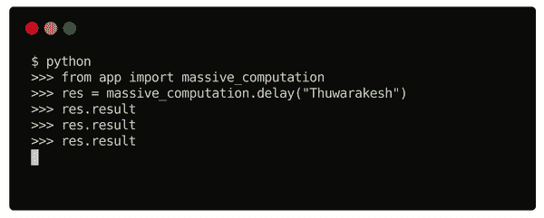
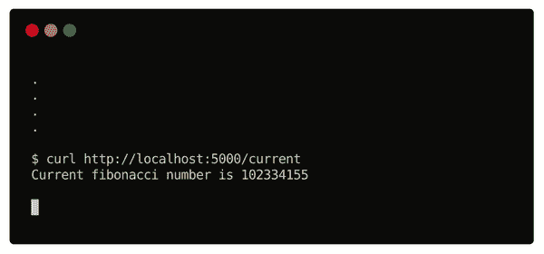

# 如何使用 Python Web 应用服务于大规模计算？

> 原文：<https://towardsdatascience.com/how-to-serve-massive-computations-using-python-web-apps-590e51624bc6?source=collection_archive---------14----------------------->

## 克服 Python 的局限性，并通过 web 请求将其用于繁重的数据分析和机器学习。


米格尔·Á拍摄的照片。来自[佩克斯](https://www.pexels.com/photo/photo-of-golden-cogwheel-on-black-background-3785935/?utm_content=attributionCopyText&utm_medium=referral&utm_source=pexels)的帕德里纳

在[的上一篇文章](/python-web-apps-are-a-terrible-idea-for-analytics-projects-36f1bd33e84b)中，我写了使用 Python web 应用进行分析项目的局限性。其中一些观点点燃了读者的好奇心，并激励我写另一个故事来补充它。

这篇文章的中心问题是，“如果 Python 因为其同步行为而存在严重缺陷，那么 Instagram 和 Spotify 等平台如何使用它来服务全球数百万人？”

虽然我没有来自这些平台(或类似平台)的官方信息，但根据我的经验，我对处理如此大规模的请求有一些见解。

在本文中，我准备了一个演示来展示基础知识。现实生活中的项目可能有其他几种技术；我没有把它们都包括在内。但是我在这个故事中暗示了一些我最喜欢的，并尽可能提供了参考资料的链接。

让我们再次从讨论同步-异步问题开始。

# Python 的同步行为和服务 web 请求的成本。

拥有一个精益技术栈是一个很好的选择。数据科学社区在这方面有 Python 的天赋。因为 python 是一种通用语言，所以可以用它来构建数据管道、机器学习、web 应用等等。

使用 Python web 框架时需要注意的一点是它的同步行为。也就是说，Pyhton 在每个线程中一次处理一个任务。在请求完成之前，其他人必须排队等候。如果您需要服务更多的并发请求，您必须增加内核和实例的数量。

如果你的网络应用只为有限数量的用户服务，这不是一件事。此外，如果您不按需执行繁重的计算，您仍然可以。但是当你增长和计算更多的时候，你的 hello world 类型的网络应用可能会引起严重的问题。

即使是选择节点 app 也是如此。Node 是基于 JavaScript 的，异步运行是这种语言的本性。关键是，在使用 Python 框架时，成本更高(如果未处理的话)。

所以，我们来处理吧。

# 将计算从请求-响应周期中分离出来。

想象一下，在 Instagram 上；你会看到一只巨大的蓝鲸。被它的美丽所震撼，你双击并喜欢上了这张图片。你希望你能看到更多。但这是你第一次在站台上遇到如此雄伟的照片。

你一直向下滚动；下面几张图片是旧的数据科学迷因之类的东西。

过一会儿，你会再次访问 Instagram。太棒了！你会看到更多巨大的蓝鲸在游泳，和它们的幼崽玩耍。它让你着迷。

这是大多数平台向用户推荐内容的方式。不需要立即学习。它们甚至可能导致假阳性。

处理这个问题的一个聪明方法是将计算从请求-响应周期中分离出来。使用关于用户的先验知识来服务即时请求。积累更多的数据，以便以后更好的学习和表现。这就是我们如何通过继续向下滚动看到旧的数据科学迷因，并在下一次访问中看到更多蓝鲸。

在大规模应用中，我们将用户的每一个动作都收集在一个专用的数据库中。像 [Cassandra](https://cassandra.apache.org/_/index.html) 这样的数据存储是实现这一目的的绝佳选择。根据应用程序的性质，定期任务用新数据更新模型，或者系统使用触发器来做同样的事情。如果它们发生在你下一次访问平台之前，你很幸运得到了一个最新的模型。

这就足够说明问题了；是时候把手弄脏了。

# 在 web 请求之外执行繁重的计算。

为了简单起见，我将使用 Flask。但是这种技术同样适用于任何其他 Python 框架。我们使用芹菜来处理请求-响应周期之外的繁重计算。最后，我们将使用一个数据库来收集用户操作。

在这个演示中，我们使用请求本身作为触发器，并立即开始计算。但是它可能会根据您的应用程序的性质而有所不同。通常，您可能还必须使用单独的管道。在这种情况下，你可能需要像[阿帕奇气流](https://airflow.apache.org/)或者[提督](https://www.prefect.io/)这样的技术。

## 安装消息代理— Redis。

消息代理顾名思义。您可以向代理发送一条消息，代理同时将该消息传递给它的所有订阅者。尽管这个定义看起来很简单，但是对于工程师来说，在消息代理出现之前的生活是很困难的。

这里我们将安装 Redis，一个著名的消息代理软件。相反，你也可以使用 RabbitMQ、亚马逊 SQS 和许多其他芹菜经纪人。

Redis 官方网站有所有操作系统的说明。一种与平台无关的方法是使用他们的官方 docker 映像。

```
**$** docker run --name redis-server -p 6379:6379 -d redis
```

## 安装芹菜和烧瓶

这两个模块的安装非常简单。就像许多其他 Python 包一样，您可以使用 PyPI。

```
**$** pip install celery Flask
```

Flask 的目的是通过 HTTP 服务 web 请求。这是一个极简主义的框架，其广受欢迎的替代方案 Django 是满足许多需求的一站式解决方案。我将要分享的技术将在这些方面发挥作用。

芹菜是 Flask(或 Django)和消息代理之间的桥梁。它将您的 Python 对象解析成代理软件可以理解的消息。更广泛的应用还包括任务调度和定期执行。

## 去耦 hello world 示例。

现在，我们已经安装了芹菜和烧瓶，我们的 Redis 服务正在运行。让我们尝试创建我们的第一个解耦应用程序。

创建一个名为 app.py 的文件，并添加以下内容。

来自作者[的代码片段。](https://medium.com/u/93ce19993bef)

上面的代码有四个部分。第一个是将返回芹菜对象的函数(make_celery)。

第二个是 Flask 应用程序创建。如果你有使用 Flask 的经验，你可能对这部分比较熟悉。我们传递额外的配置来通知 Flask 应用程序和 Celery 关于 Redis 服务器的信息。

在第三部分中，我们使用 make_celery 函数创建芹菜应用程序。我们传入 Flask 应用程序实例，它包含 Redis 配置信息。

有了这个设置，我们现在可以创建异步任务。这意味着它们的执行不会中断主线程的常规操作。这里的示例任务 massive _ computation 将返回“你好<name>”，不是立即返回，而是在五秒钟后返回。</name>

为了测试这一点，首先，我们需要启动芹菜服务器。这是一个解耦的过程，将运行您的大规模计算。下面的这个命令会做到这一点。

```
**$** celery -A app.celery worker -E
```

在另一个终端中，运行下面录音中显示的命令。

这从 app 模块中导入了我们的 massive _ computation 函数，并调用它。请注意用于调用该函数的独特延迟方法。@celery.task 装饰器添加了这个额外的方法。

一旦调用了函数并将它的值存储在变量中，就可以使用 result 属性来访问它的值。



由[作者截屏。](https://medium.com/u/93ce19993bef)

正如您在录音中看到的，result 属性在最初的几次调用中没有值。几秒钟后，屏幕上出现了“Hello Thuwarakesh”。

在函数返回值之前，您可以在同一个线程中执行其他活动。这不是使用同步语言(如 Python)开发的应用程序的典型行为。

## 通过 web 请求服务于大量计算。

我们已经安装了我们需要的技术，并创建了一个与应用程序线程并行运行的基本应用程序。现在，我们已经完成了最后一个部分 web 请求处理。

现在用下面的代码替换 massive _ computation 函数和下面的所有内容。

来自作者[的代码片段。](https://medium.com/u/93ce19993bef)

我们创建了 Redis 数据库的一个实例来存储我们分离的计算结果。

我们在这里执行的计算是斐波那契计算。massive _ computation 函数接受一个数字，计算斐波那契数，并将其存储在数据库中。

我们还创建了两个 web API 端点。第一个将设置上次计算的值，另一个将读取当前值。

为了测试这个应用程序，我们需要在已经运行的芹菜服务旁边运行一个 Flask 应用程序。您可以使用以下命令在不同的终端中启动 Flask 应用程序。

```
**$** flask run
```

现在，我们已经做好了使用 Python web 应用测试大规模计算的一切准备。让我们试一试。

你可以使用你的浏览器或者 CURL 来完成这项工作。我将在终端窗口中使用 curl。



由[作者截屏。](https://medium.com/u/93ce19993bef)

上面的录音清楚地解释了用法。当我们查询“/current”端点时，它给出初始值 0。

然后，我们通过“/set”端点指定一个新值，即第 40 个斐波那契数。计算这个数字需要一些时间。然而，系统立即给出了回应，“新的斐波纳契数将很快分配。”这方便地通知用户关于后端任务的信息。

对“/current”终结点的立即查询再次得到 0。这是因为计算尚未完成，数据库中的值仍为 0。

然而，过了一会儿，同一个端点返回第 40 个斐波那契数列的值。后端计算已经完成，芹菜任务更新了数据库中的值。

计算斐波那契数并不是你在现实生活中看到的大量计算。但这只是对它们可能样子的一个合理估计。你可以触发机器学习模型的再训练，而不是斐波那契。

# 最后的想法

你可能想知道大规模计算在哪里。然而，这篇文章不是关于计算本身。我们专注于如何为大规模计算服务。为了公平起见，我们使用了斐波那契数计算器。

我们已经将计算从 web 服务器的请求-响应周期中分离出来。这允许我们在不中断网络服务器的情况下执行计算。

在本文中，我们使用芹菜来处理这种分离的任务。虽然芹菜能够在生产中运行，但现代替代品提供了更多功能。阿帕奇气流和提督是这方面的一些伟大的技术。

Python 本质上是一种同步语言。试图使它异步会带来很多开销和缺点。使用芹菜进行繁重的计算是处理这个问题的一种优雅的方式。

然而，这并不意味着异步语言可以摆脱它。大规模计算不应该通过请求-响应循环来完成。它们通常服务于不同的目的，而不是即时的、有意义的反应。因此这种方法在任何情况下都是有用的。

> 感谢阅读，朋友！看来你和我有许多共同的兴趣。我很乐意通过 LinkedIn、T2、Twitter 和 Medium 与你联系

还不是中等会员？请使用此链接 [**成为**](https://thuwarakesh.medium.com/membership) 会员。你可以享受成千上万的有见地的文章，并支持我，因为我赚了一点佣金介绍你。