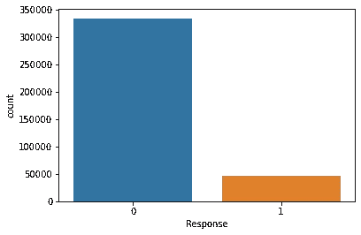
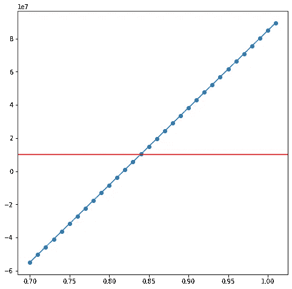

# 如何为企业设置技术指标数据科学项目

> 原文：<https://towardsdatascience.com/how-to-set-technical-metrics-data-science-project-for-business-7e77084448a4?source=collection_archive---------29----------------------->

## 技术 KPI 是数据科学项目中的必备要素


弗洛里安·伯杰在 [Unsplash](https://unsplash.com?utm_source=medium&utm_medium=referral) 上拍摄的照片

数据科学家是受雇使用数据产品解决业务问题的人。然而，数据科学课程的趋势集中在技术方面，而不是业务角度。**老实说，如果数据科学家先学习业务而不是技术，他们被聘用的机会会增加**。

数据科学家工作的重点之一是技术指标，如准确度、精确度、召回率等。许多数据科学家专注于获得尽可能高的指标，**但是多高的指标才算是好的呢？**。你可能想在竞争中取得最好的成绩，但做生意不同，很多时候你没有时间这样做。那么，如何为企业设定合理的技术指标呢？本文将通过一个示例帮助您理解如何做到这一点。

本文将从我设置满足业务需求的技术指标的经验中探索一个具体的例子。它可能不适用于您的特定业务，但总体思路应该是相似的。带着那个音符，让我们开始吧。

# **商业和数据科学**

数据科学家懂业务是否必不可少？是的，我会为这种说法辩护。优秀的数据科学家和伟大的数据科学家的区别在于解决业务问题。**一个优秀的数据科学家可以开发出最好的模型，但是一个伟大的数据科学家可以开发出满足业务需求的好模型。**

在下面的文章中，我就为什么一个伟大的数据科学家是懂业务的人这一问题提出了自己的观点。

</learn-the-business-to-become-a-great-data-scientist-635fa6029fb6>  

每个数据科学家都知道的一个知识是**将业务问题模拟成技术需求**。每个业务项目都将从业务用户希望数据科学家解决的业务问题开始。我们需要讨论我们的项目将触及的每个业务方面的情况。为什么？因为我们的模式会受到每个商业选择的影响。

例如，业务用户需要一个模型来预测客户购买产品的兴趣。许多人最初会通过开发一个分类模型来进行预测。然而，我认为您应该知道的是业务流程如何向客户销售产品。

最佳模型是在业务流程中使用的模型。想象一下，你已经花了几个月的时间来完善这个模型，却发现你的模型无法使用——因为你使用的特性或者不好的标记。这就是为什么你需要知道业务流程。

了解业务会让你成为伟大的数据科学家，因为你会选择适合问题的特性和模型。此外，您可以为您的数据科学项目设定技术要求。为了帮助您理解技术指标的业务概念，让我们使用一个示例数据集。

# 设定技术要求的业务模拟

对于这种情况，我会利用我在开发机器学习模型方面的经验来预测交叉销售保险客户。数据集来自 [Kaggle](https://www.kaggle.com/anmolkumar/health-insurance-cross-sell-prediction) 。让我们阅读培训和测试数据，以了解数据集和业务问题。

```
import pandas as pdtrain = pd.read_csv('train.csv')
test = pd.read_csv('test.csv')train.info()
```


作者图片

训练数据包含具有 381109 行的 12 个特征。因变量(目标)是响应变量。测试数据包括 127037 个具有相似特征的行，但不包括响应。我们来看看目标变量分布。

```
import seaborn as sns#Target exploration
sns.countplot(train['Response'])
```



作者图片

我们的数据中有一个不平衡案例；只有 12%的人对培训数据中的交叉销售感兴趣。

我不会在这里展示我所有的数据探索结果，因为要花很长时间来解释它，但我稍后会将我的笔记本附加到我的 GitHub 上。我将描述业务中的特性含义，以及如何从业务角度对待训练/测试(当前数据)。

现在，在现实世界中选择数据之前，我们需要首先考虑业务流程。然而，在这种情况下，让我们反过来；根据我们拥有的数据集，我们需要考虑使用数据集的业务流程和含义。

比如功能 Driving _ License 是客户有没有驾照的一个特征。如果此功能可以帮助您预测交叉销售的客户，您认为您会使用它吗？也许你会说是，但我会说不是。为什么？从商业的角度来看，尤其是保险，向没有驾驶执照的客户提供保险是不合理的(以我的经验来看)。我会说这个特性变成了一个过滤器，而不是训练数据。

我可以说 Policy_Sales_Channel 特性和 Region_Code 特性也可能产生偏见。一些渠道和地区可能比其他地区销售更多；你能把它介绍给模特吗？我之所以说不，是因为它间接导致了一些渠道和地区被排除在外。

让我们进入本文的要点，建立业务的技术需求。我前面解释的所有业务理解都是理解业务流程所需要的。你需要知道这个行业来自哪里，以及你所使用的每个特性的含义。

## **业务模拟**

在继续机器学习开发之前，我们需要在部署这个模型时考虑业务方面。怎么做呢？通过业务模拟，我们可以计划我们的技术需求目标。首先，我们来考虑一下我们为什么要开发这个机器学习模型？我们希望构建模型，帮助企业产生交叉销售可能性更高的销售线索，以避免致电不感兴趣的客户。

遗憾的是，没有关于代理商数量和联系客户费用的信息。**为什么这个信息很重要？因为如果联系客户没有相关的成本，而模型做出了错误的预测，那么为什么不直接给他们打电话，而不是依赖机器学习模型呢？**。此外，我们需要考虑项目时间表和能够执行销售线索的代理数量，因为这也会影响业务目标。

此外，我们为什么要考虑项目时间表？想象一下，该模型预测 50000 名客户将进行交叉销售。代理会在一天内执行所有 50000 个客户吗？显然，不是(除非每个客户有 50000 个代理)，并且代理会优先考虑他们要呼叫的客户。也许你会认为我们可以让代理在任何时候找到销售线索，只要我们预测到他们会交叉销售；问题是客户的生活会随着时间的推移而改变，在这种情况下预测可能不成立(数据漂移)。这就是项目时间表影响业务和技术方面的原因。

让我们试着概述一下我们需要考虑的业务变量:

1.业务目标(从这个项目来看，要跟踪的业务目标是什么；
常为销售数或换算数)2。接洽/拜访成本(与拜访相关的所有成本、运营成本、代理小费等。)
3。代理编号
4。时间线
5。成功转化收入(成功交叉销售对 ANP 的贡献有多大)
6。销售线索数量(在时间表中会有多少销售线索)
7。模型度量

我们仍然可以想到许多变量，但是让我们首先坚持最简单的一个。那么如何处理这些变量呢？我们需要基于业务流程用这个变量构建一个模拟。这个过程可以是任何事情，因为我不知道这个特定公司的过程是怎样的，但是我可以根据我的经验来模拟它。我的目标是模拟我们能否实现目标。

业务目标(BT)是我们需要在**时间线(T)内**实现或超越的最终目标。在该项目中，在收到预测后，我们会给**代理(A)** 一定数量的**线索(L)** 在时间表内处理。假设每个代理只需要调用转换，那么我们需要关心调用(C) 的**成本。每个电话都会受到代理数量和项目时间表的影响，代理数量多和时间表短都会增加成本，反之亦然。最后，**成功转换收入**是每个成功呼叫的系数。总收入将受到**模型指标(M)** 和销售线索数(销售线索数中有多少成功呼叫转化为收入)的影响。为什么还要对度量进行建模？因为不是所有的电话都会 100%成功。**

业务流程将只有预测感兴趣的销售线索才是被呼叫的销售线索。

如果我们把它变成一个线性方程，我们就把它写成:

> BT <= (S * (L * M)) — (L*(C * (A/T))

这个等式并不完美，但我们需要用一个合理的数字来填充它。

我们已经建立了变量和方程。现在，我们只需要把它装满。成本是一个企业的固定数字，我们可以调整，但成功转换收入在每次成功中都是不同的(除非你想说产品总是产生固定收入/ANP)。在这种情况下，我们可以使用来自客户 ANP 的历史数据，例如平均值或中值。对于我们的情况，让我们以列车数据的年保费平均值为例。

```
#Rounding the ANP Average per cases
round(train['Annual_Premium'].mean())
```

结果将是 30564 印度卢比。接下来，让我们为模拟操作定义一个函数。

```
def business_target_simulation(S, L, M, C, A, T):
    revenue = (S*(L * M)) - (L * (C * (A/T)))
    return revenue
```

让我们定义一些变量(因为这是模拟，所以您可以更改)，我们有:

*   业务目标(BT)；假设今年我们希望通过交叉销售计划获得 10.000.000 印度卢比
*   时间线(T)将是一年，这意味着 12 个月
*   每次通话费用(C)假设 5000 印度卢比
*   代理数量(A)，假设为 100
*   成功收入将是 30564 英镑
*   销售线索的数量(L)将与现有人口相关，因为它是交叉销售计划。测试数据包含 127037 人。从培训数据中，我们看到大约 12%的人对销售感兴趣。如果我们将其余数据的 12%作为线索(假设预测模型可能遵循相同的概率分布)，我们将有 15244 个客户作为线索。
*   对于模型度量(M ),让我们假设我们使用**精度**,因为我们需要根据预测的购买兴趣来计算真实的正例。因为业务流程只会调用预测的感兴趣的线索，所以我们需要最大化类 1(感兴趣)的精确度。为什么？因为误报太高(精度低)，打了太多电话没有成功收入；sans，成本更高。我们的成本与阳性病例相关(对或错)。

我们要定义我们的技术 KPI，所以让我们模拟各种精度数字。我将创建一个简单的函数来绘制要实现或超越的业务目标的结果。

```
def simulation_plot(metric_range, S, L, C, A, T, BT):
    result = []
    for score in metric_range:
        result.append(business_target_simulation(S=S, L=L, M = score, C=C, A=A, T=T))
    plt.figure(figsize = (8,8))
    img = plt.plot(metric_range, result, marker = 'o') 
    plt.axhline(BT, color  = 'red')
    return img
```

让我们输入所有的假设变量，用这个函数来画出函数。

```
simulation_plot(metric_range = np.arange(0.7, 1.01, 0.01), S = 30564, L = 15244, C = 3000,  A = 100, T =12, BT = 10000000)
```



作者图片

我们的业务目标是 10.000.000 印度卢比，根据我们的模拟，我们需要至少达到 **82%** 的精度，我们的模型才能对业务产生影响。这个数字相对较高，但肯定是可能的。考虑到这一点，当我们建立模型和 MLOps 时，我们需要确保精度始终高于 82%。你可以随时改变衡量标准，比如准确性、召回率等。然而；如果我们这样做，我们需要调整等式。

当然，这种模拟是基于线性假设，没有考虑随机因素和误差。我们可以试着改变置信区间，但是让我们留待以后讨论。

您可以修改代码和变量，以更好地模拟业务需求。我建议你调整一下线性函数，因为我知道它并不完美。我愿意为这个功能的建议。

我想展示的是模拟的**力量，它能够为业务建立技术要求**。有了 82%的准确率，我们就能实现业务目标；少于这个数字是不可取的。

## **资源**

这个模拟的所有代码都存储在我下面的 GitHub 页面上。

<https://github.com/cornelliusyudhawijaya/Cross-Sell-Insurance-Business-Simulation>  

# **结论**

伟大的数据科学家是理解业务流程的人。商业理解来自经验，但它肯定是我们可以学习的东西。

在本文中，我概述了如何为业务建立技术需求，尤其是使用业务模拟的能力。

希望有帮助！

在我的 [**LinkedIn**](https://www.linkedin.com/in/cornellius-yudha-wijaya/) 或 [**Twitter**](https://twitter.com/CornelliusYW) 上访问我。

> *如果您喜欢我的内容，并希望获得更多关于数据或数据科学家日常生活的深入知识，请考虑在此订阅我的* ***简讯。***

> *如果您没有订阅为中等会员，请考虑通过* [*我的推荐*](https://cornelliusyudhawijaya.medium.com/membership) *订阅。*