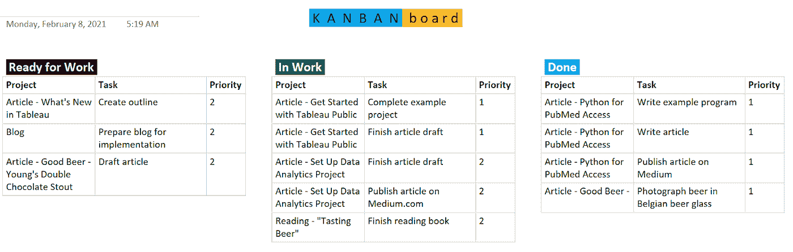
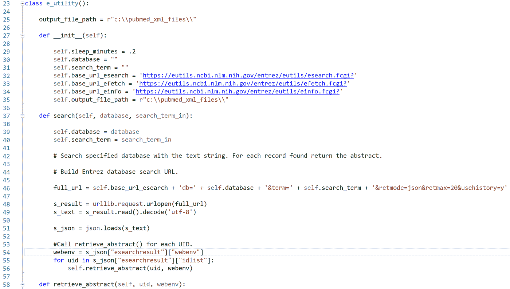
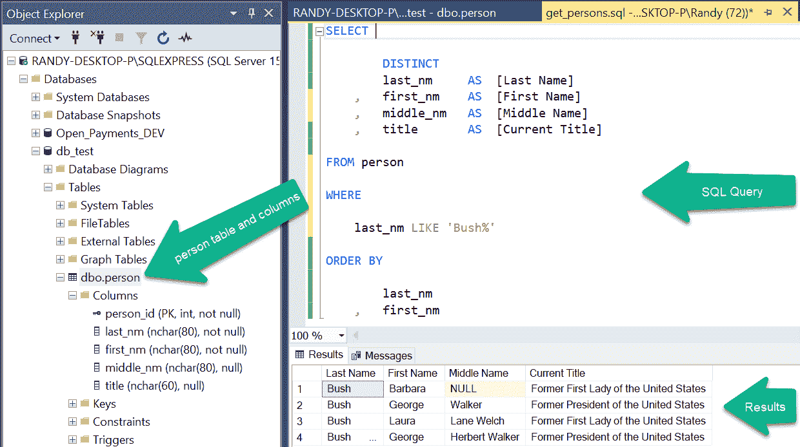
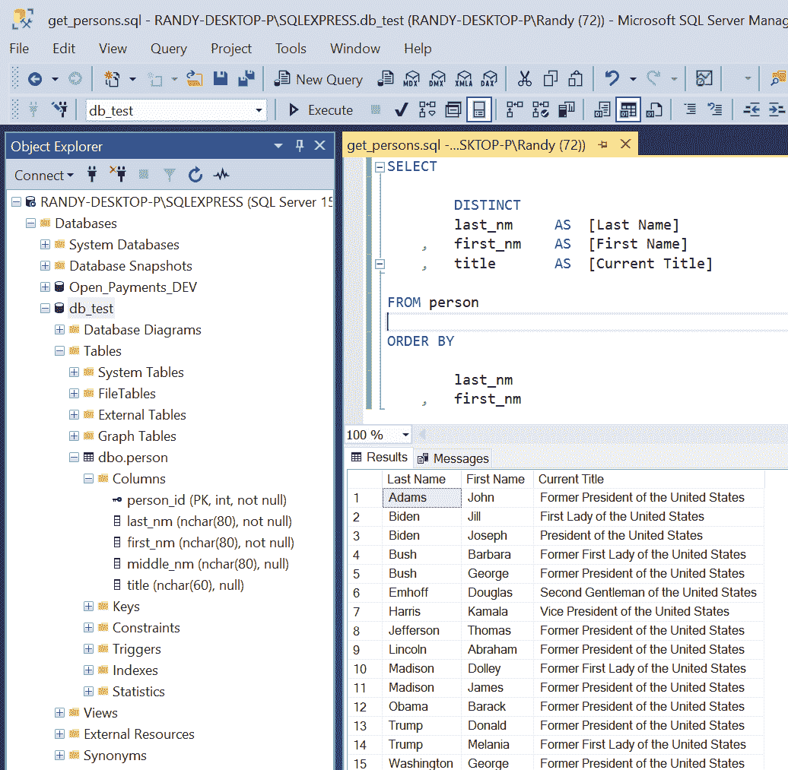
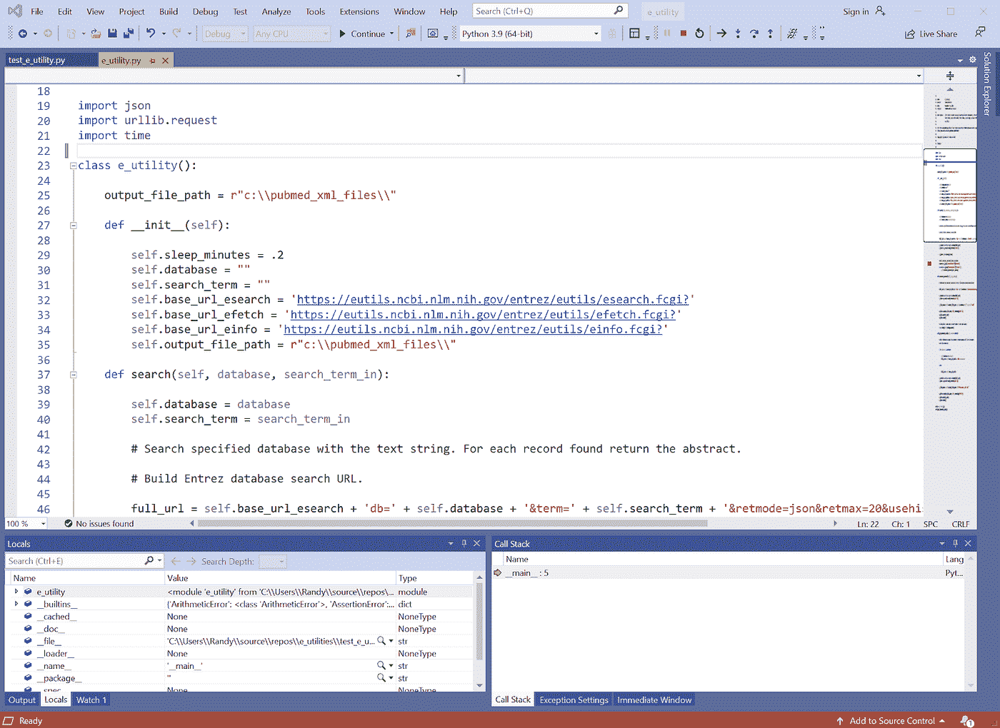
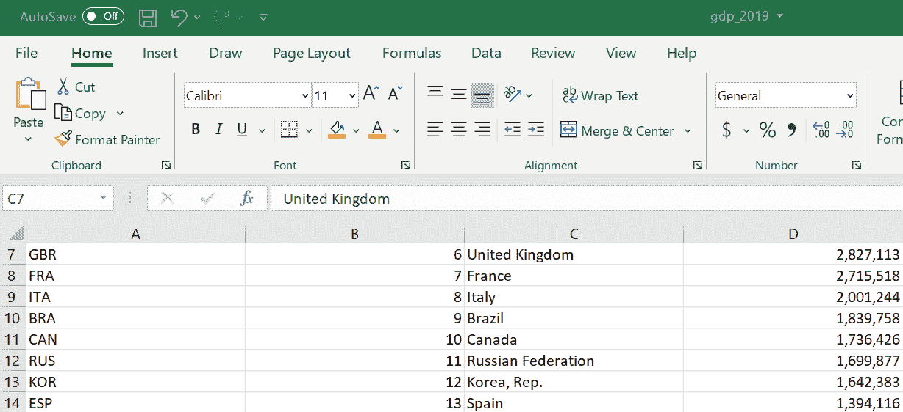

# 为成功建立有效的数据分析团队和项目生态系统

> 原文：<https://towardsdatascience.com/how-to-set-up-a-data-analytics-team-and-project-ecosystem-for-success-100e14067e77?source=collection_archive---------18----------------------->

## 应用这些技术创建一个数据分析程序，提供令最终用户满意并满足其需求的解决方案

# 介绍

在软件开发、信息安全和数据分析的长期职业生涯中，我观察到大型、复杂和压倒性的项目有可能无法满足利益相关者的需求，除非它们管理得非常好。相比之下，我参与的大多数成功的数据分析项目在范围、规模、团队规模和时间上都很小。它们通常需要几天、几周或几个月的时间来完成，而不是几年，并且通常可以满足最终用户的需求。

健全的管理、敏捷的实践、熟练的从业者、强大的工具、标准和指南可以结合起来创建一个数据分析生态系统，从而缩短项目生命周期并提供有用的解决方案。以下部分描述了我的团队为取得成功而开发和利用的一些组织、项目和数据分析属性和技术。虽然我们在大型企业的风险管理和内部审计职能中构建了我们的数据分析计划，但是您也可以将其中的许多技术应用到您的工作环境中。

# 良好的管理和领导力

在我从事软件开发和数据分析的 34 年中，我观察到了许多管理和领导风格，有好有坏。我最近与一位经理一起工作，他创建了一个框架，并指导我们的团队在一家大型企业中建立了一个成功的部门数据分析程序。根据经验和观察，以下是他和其他模范领导者为帮助个人、团队和项目取得成功而采取的一些品质和行动:

*   为项目设定目标，并管理项目和团队实现目标。
*   确定所需的能力，并雇用和培训员工来实现这些能力。
*   与内部和外部组织合作，分享和学习最佳实践。
*   提供满足需求的强大软件工具。
*   作为高层管理人员的沟通渠道。
*   与团队合作，关心团队及其成员，但不要盛气凌人。
*   确保实施并遵循基本但充分的商定标准、指南和程序。
*   建立成长和成就的节奏。
*   尊重每个团队成员的时间和注意力。

# 雇佣并发展技能和知识

几年前，我参加了一个数据分析会议，会上一位演讲者描述了她作为数据科学家所需的一些技能。她说有效地完成她的工作需要 200 多种技能。事实上，创建成功的数据分析解决方案需要分析师具备多方面的才能。要聘用和培养具备所需技能和知识的分析师，您和您的管理层可以考虑以下步骤:

1.  **撰写引人注目的职位描述和公告** —撰写描述成功候选人必须具备的技能和知识的职位描述和公告。此外，列出员工在受雇期间必须发展的技能和知识。
2.  **聘用具有专业知识和良好潜力的数据分析师** —应用职位描述和职位发布来聘用具有所需技能和知识、资质和潜力的分析师，以开发额外的所需技能。
3.  **确定学习资源** —创建课程和教程列表，以帮助数据分析师发展在其职位上取得成功所需的技能和知识。
4.  **评估技能** —衡量团队及其成员的优势和劣势，确定发展和成长需求，根据每个数据分析师的工作描述和深入的能力列表评估他们的技能和知识。
5.  **培训分析师** —确保工作单位的预算和时间表允许资金和时间用于数据分析师完成培训，以发展所需的技能和知识。根据技能评估结果，确保分析师参加学习资源列表中定义的培训。

# 保持项目团队的小规模

除非熟练地管理，否则大型团队的复杂项目可能会陷入困境。尝试保持每个项目的规模和范围较小，并将团队规模限制为一至三个最终用户和一名首席数据分析师，可能有助于项目成功。团队可以将数据分析师添加到复杂的项目中，这将受益于分工或互补的技能。对于大型或复杂的项目，您可能希望指派一名项目经理与团队一起确定和管理任务、时间表、风险和问题。最后，在需要时，寻找项目业务领域的主题专家(SME)。

# 采用敏捷实践

项目团队，尤其是在软件开发中，经常将敏捷开发方法应用到他们的项目中，比如 Scrum 或看板，来组织任务和快速移动。我的团队有效地使用了在 Microsoft OneNote 中开发的看板，在频繁的站立会议上，在团队及其经理之间跟踪和交流任务。它在一页上由三列组成。每项任务在开始时从“准备工作”变为“工作中”,在完成时从“工作中”变为“完成”。

一个简单的看板可以用来管理项目任务。图片由作者提供。

# 定义简明的范围、目标和时间表

在整个项目生命周期中，与最终用户、团队成员和经理的对话对于建立和坚持一致同意的简明范围、目标和时间表至关重要。通过保持项目紧凑，我成功地完成了一周至三个月的项目。

如果一个项目很大很复杂，可以考虑把它分成更小的子项目，每个子项目都有一个有限的范围、目标和时间表。

# 将一组合理的竞争性项目和任务分配给数据分析师

一些研究人员发现，当同时处理多项任务时，人类的表现会受到影响。给个人分配大量的项目或任务可能会适得其反。此外，虽然技能和任务多样性是可以提高个人满意度和绩效的工作组成部分(参见[工作特征理论](https://en.wikipedia.org/wiki/Job_characteristic_theory))，但分配给工人的项目或任务数量应该合理，以允许工人成功完成所有项目或任务。

# 平衡团队合作和自主性

在一个运转良好的团队中工作可以带来许多好处，例如:

*   队友可以互补彼此的技能。
*   队友之间可以互相鼓励和推动。
*   团队成员可以分享想法，集思广益，找出解决方案。
*   团队的生产力可能超过其各个部分的总和。

有效团队合作的好处是毋庸置疑的。另一方面，一些类型的工作，如数据分析、编程和写作，通常最好由半自主工作的个人来完成，通常需要团队成员的输入。他们的工作需要专注和有限的干扰。

# 采用并掌握强大而通用的工具和语言

数据分析师应该为自己配备功能强大、用途广泛的数据分析工具，以满足他们的需求。通过这种方法，分析师可以利用每种工具的功能，开发能力和最佳实践。以下部分描述了我当前团队在数据分析项目中使用的每个软件包。

**Alteryx Designer**——根据 Alteryx 的网站，Designer 可以用来“自动化分析的每一步，包括数据准备、混合、报告、预测分析和数据科学。”虽然单用户许可证需要数千美元，但它是一个强大的数据分析和数据科学工具。我的团队使用它来创建和运行输入数据、转换和准备数据以及以多种格式输出数据的工作流。分析师使用它来快速轻松地创建强大且快速运行的工作流。

**Tableau** — Tableau 软件创建了一个强大的、或许是最受欢迎的商业智能和数据可视化平台。我的团队使用 Tableau Desktop 连接数据源，开发可视化的工作表和仪表板。然后，我们将视觉效果发布到 Tableau 服务器，最终用户可以在那里观看并与之交互。

**Python** — Python 是一种用户友好且功能强大的编程语言，深受数据分析师和数据科学家的欢迎。与在数据科学家中也很流行的以统计为中心的 R 语言不同，Python 是一种通用语言。它是免费的，也很容易学。分析师可以用免费的库来扩展 Python 的功能，比如 [NumPy](https://numpy.org/) 和 [TensorFlow](https://www.tensorflow.org/) 。

Python 编程语言代码示例。图片由作者提供。

**SQL** —结构化查询语言(SQL)是用于实现、操作和查询存储在关系数据库管理系统(RDBMS)中的结构化数据的标准语言。它包括多种子语言。通过其数据查询语言(DQL)，分析师可以从数据库表中查询和检索数据。RDMS 数据库存储了世界各地企业的大量数据集。

SQL(结构化查询语言)代码示例。图片由作者提供。

**微软 SQL Server Management Studio(SSMS)**—SSMS 是微软的集成开发环境(IDE)，用于管理和查询在其 SQL Server RDBMS 中实现的数据库。免费且易于学习，我使用 SSMS 创建并运行 SQL 代码来查询包含所需数据的数据库。

SQL Server Management Studio (SSMS)用于管理 Microsoft SQL Server 数据库和 SQL 代码。图片由作者提供。

**Rapid SQL** — Rapid SQL 是一个类似于 SSMS 的 IDE，用于开发 SQL 查询以访问存储在 Oracle、SQL Server、DB2 和 SAP Sybase 数据库中的数据。我使用 Rapid SQL 从 DB2 或 Oracle 数据库获取数据。

**微软 Visual Studio** — Visual Studio 是微软的旗舰集成开发环境(IDE)。我使用 Visual Studio Professional 创建用 Python 和其他编程语言编写的应用程序。它的编辑器具有强大的颜色编码语法。[Visual Studio Community 2019](https://visualstudio.microsoft.com/vs/community/)是一款免费版的 IDE，可能会满足你的需求。微软的 Visual Studio Code (VS Code)是另一个免费的 IDE，在程序员和数据分析师中很受欢迎。

Microsoft Visual Studio Professional 是用于编写程序和开发应用程序的集成开发环境(IDE)。图片由作者提供。

当然，Excel 是一个无处不在的、有用的、强大的、有时不可或缺的工具。我使用 Excel 工作簿作为项目数据源和输出来创建小型数据集，执行基本的数据清理和计算，等等。像 Excel 这样的电子表格应用程序是任何数据分析或数据科学商店中的重要工具。

电子表格应用程序，如 Microsoft Excel，是通用的数据分析工具。图片由作者提供。

# 制定基本标准、指南和程序

将简明的标准和指南应用到数据分析项目中，可以提高生产力，维护和共享工作产品。以下是指导我工作的标准和指南。

**命名标准**——标准化项目，例如文件夹、文件、数据库表、列和字段，使它们易于一致地命名，并在许多产品的集合中找到工作产品。

**文件夹结构标准和模板** —对所有项目使用标准文件夹结构，可以轻松创建新项目和查找文件夹和文件。我的团队使用以下文件夹结构模板来组织和存储所有数据分析项目的工作产品:

*   Project_name(将此值更改为项目的名称)
*   alteryx _ 工作流
*   数据
*   证明文件
*   python _ 程序
*   sql _ 脚本
*   tableau _ 工作簿

文件夹结构会根据每个项目的需求进行扩展和收缩。

编码标准 —编码标准适用于编程，就像语法适用于英语散文一样。它们帮助我们清晰一致地组织和传达思想。我工作过的数据分析和软件开发团队受益于文档化的编码约定。在项目中应用这些标准可以使每个代码模块更容易被最初的编码者编写，也更容易被任何团队成员阅读、理解、增强和维护。下面是我的团队用来指导工作的一些编码标准的描述。

*   **类、变量和函数命名惯例** —为了可读性，我们决定用小写字母创建所有的类、函数和变量名称，每个单词或缩写用下划线(“_”)隔开。每个类和变量名描述了它存储的值的类型，而每个函数名描述了该函数用什么值或对象做什么。例如，存储人名的变量可能被称为 person_name 或 person_nm。从数据库中检索人名列表的函数可以称为 get_person_names()。
*   **代码模块序言** —我们以文本开始每个模块，描述其用途。为了帮助其他可能维护该模块的编码人员，我们添加了额外的信息，例如作者的姓名、数据库连接字符串、文件位置信息和更改日志。
*   **注释** —虽然有人说代码本身就是文档，但我相信恰当的注释可以帮助编码者组织他们的思想，并帮助其他需要维护或增强代码的人更快地理解它。例如，在它的开始，我描述了一个函数用什么数据做什么。我还在执行任务的每个代码逻辑分组前添加了一个简短的注释。
*   **空白**——为了让代码更容易阅读，我在每个函数、每组变量定义和执行特定任务的每个代码块之间插入了一个空行。
*   **简洁的函数范围和可见的大小**——和空白一样，我限制了每个函数的内容，以便更容易编码、理解、维护和增强。我努力保持每个函数简单，并试图保持其内容在编辑器中可见(例如 80 个字符宽，40 行长)。

可视化风格指南 —虽然编码标准可以帮助程序员理解、编写和维护代码，但可视化风格指南可以帮助数据分析师开发一致、有用和有意义的视觉效果。它们还可以通过提供一致、设计良好、易于理解和用户友好的视觉效果，使数据分析项目的最终用户受益。以下是我的团队采用的一些视觉风格指南。

*   **品牌标准** —我们公司的品牌管理部门已经确定了一套一致的字体、颜色以及视觉设计风格和组件。我们将这些应用到我们的可视化指南中，以增加专业性和一致性，并帮助为最终用户提供熟悉的用户界面风格。
*   **字体** —我们公司已经设计了一种字体，当它可供我们使用时，我们将使用它。否则，我们的数据分析产品将默认使用 Ariel 字体。
*   **颜色** —我们公司的品牌标准包括一个小调色板。我们尽可能将这些颜色应用于图表、图形和仪表板。我们还试图将图表、图形或仪表板上使用的颜色数量限制在视觉上令人愉悦的范围内。
*   **标题、页眉和标签** —我们的指南描述了应用于文本元素的标准位置、字体、大小和颜色，例如仪表板标题、图形和图表页眉、列、过滤器和图例。
*   **可视组件的放置** —与文本一样，我们的指南描述了图表、图形、过滤器和图例等元素在仪表板上的标准位置。

# 摘要

建立一个有效的数据分析团队并不容易，该团队定期构建和交付数据分析解决方案，为最终用户提供见解并帮助他们做出决策。但是，应用我在长期的软件开发和数据分析职业生涯中学到、采纳和发展的一些经验和有效实践，可能会帮助你取得成功。

# 关于作者

Randy Runtsch 是一名数据分析师、软件开发人员、作家、摄影师、自行车手和冒险家。他和妻子住在美国明尼苏达州东南部。

关注 Randy 即将发表的关于公共数据集的文章，以推动数据分析解决方案、编程、数据分析、自行车旅行、啤酒等。