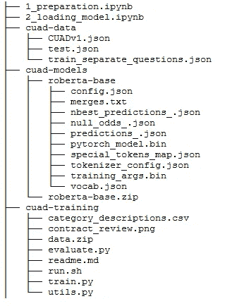
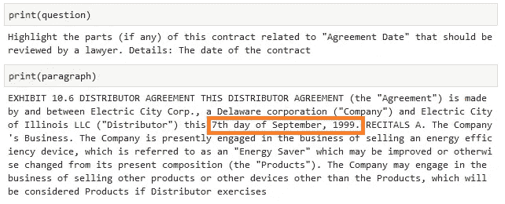
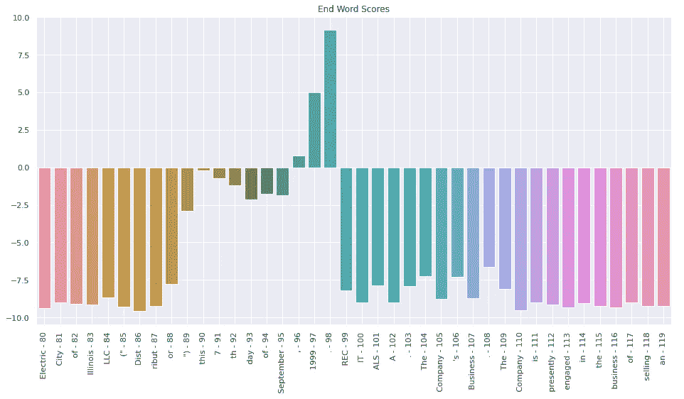
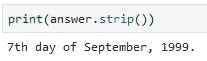

# 如何建立法律合同审查的机器学习模型

> 原文：<https://towardsdatascience.com/how-to-set-up-a-machine-learning-model-for-legal-contract-review-fe3b48b05a0e?source=collection_archive---------8----------------------->

## [行业笔记](https://towardsdatascience.com/tagged/notes-from-industry)

## 深入研究新发布的自然语言处理数据集，以了解合同

合同审查是彻底阅读合同以理解签署合同的个人或公司的权利和义务并评估相关影响的过程。人们普遍认为这是初级律师事务所合伙人必须做的最重复、最乏味的工作之一。这也很昂贵，而且是对法律专业人员技能的低效利用。在这篇博文中，我展示了如何建立一个[新发布的数据集](https://arxiv.org/abs/2103.06268)和相关的机器学习模型来自动化合同审查。

[斯科特·格雷厄姆](https://unsplash.com/@homajob?utm_source=medium&utm_medium=referral)在 [Unsplash](https://unsplash.com?utm_source=medium&utm_medium=referral) 上拍照

# 合同评审需要什么？

谈到合同审查，律师的工作就是手动审查数百页的合同，以找到合同中规定的相关条款或义务。这是重复的，因为他们总是需要在任何给定的合同中识别相同的数据点:合同的生效日期是什么？续约条款是什么？谁参与了这个合同？

律师事务所面临着降低成本的巨大压力，尤其是在 COVID 时代期间和之后。随着自然语言处理(NLP)的最新进展，机器学习模型可以学习自动提取和识别合同中的关键条款，从而节省数百小时的人工劳动。

# 什么是 CUAD 数据集？

2021 年 3 月， [Atticus 项目](https://www.atticusprojectai.org)发布了合同理解 Atticus 数据集(CUAD)，该数据集由 500 多份合同组成，每份合同都由法律专家仔细标记，以确定 41 种不同类型的重要条款，总共有 13，000 多条注释。除了数据集，他们还发布了几个经过数据集训练的最先进的变压器模型。你可以在他们的 [GitHub repo](https://github.com/TheAtticusProject/cuad/) 找到数据集和训练代码，微调后的模型可以从 [Zenodo](https://zenodo.org/record/4599830) 下载。

在这篇文章中，我将带你一步一步地建立和运行微调后的模型，这样你就可以用它们来做你自己的预测。

# 数据准备

你应该可以在你自己的机器上运行这个例子，因为它不是很耗费资源，我们也不需要模型的毫秒级响应。我用的所有代码和笔记本都可以在[我的 GitHub repo](https://github.com/marshmellow77/cuad-demo) 里找到。

在第一个笔记本中，[*1 _ preparation . ipynb*](https://github.com/marshmellow77/cuad-demo/blob/main/1_preparation.ipynb)，我运行一组 shell 命令来下载数据、代码、模型和库。相反，您可以在终端中轻松运行这些命令。

出于这个博客的目的，我使用的是 *roberta-base* 模型，它是最小的，但也是表现第三好的模型。当然，你可以选择使用性能更好的 *roberta-large* 型号或 *deberta-v2-xlarge* 型号。无论选择哪种模型，加载模型和进行预测的指令都是相同的。所有型号均可在此下载[。](https://zenodo.org/record/4599830#.YGRiwOfTVhE)

运行这些命令后，您的主项目文件夹中应该有以下三个文件夹: *cuad-data/* ，其中包含实际的 cuad 数据集*，cuad-models/* ，其中包含模型，*和 cuad-training/* ，其中包含用于训练模型的 Python 脚本和 shell 脚本。

CUAD 演示的文件夹结构

# 加载模型

查看 *cuad-training/train.py* 中的训练代码，我们可以看到 cuad 模型基于 AutoModelForQuestionAnswering 类，该类是专门为问答任务训练的。这是有意义的，因为我们希望模型通过问它一个问题来识别合同的某些部分(例如，“合同的日期是什么？”).

有了这些知识，我们可以像这样加载模型和它的记号化器(为模型准备输入):

注意，我们将 *use_fast* 参数设置为 *False* 。原因是问答(Q & A)模型与具有更智能的溢出处理的快速标记化器不兼容。这完全符合我们的目的，我们只需要记住相应地设置参数。

既然我们已经加载了模型，我们可以用一个样本快速测试它。CUAD 团队提供 JSON 文件中的合同和相关查询数据。41 个查询的完整列表可在[此处](https://github.com/marshmellow77/cuad-demo/blob/main/output/questions.txt)查看。现在，我们可以使用数据集中的一个契约和查询来测试刚刚加载的模型:

这段代码从 JSON 文件加载第三个查询，询问“合同的日期是什么？”，并显示该合同的前 100 个单词:

查询和签约。我强调了合同中的相关部分。

# 进行第一次测试预测

问答模型的工作方式是将问题和契约连接在一起(用一个特殊的标记分开)，标记化(即准备输入以便模型可以理解)，然后输入到模型中。然后，该模型将提供两个输出:开始逻辑和结束逻辑。

开始逻辑描述了字符串中每个单词成为问题答案开始的概率。类似地，结尾逻辑描述了每个单词成为答案结尾的概率。

为了从模型中获得最佳预测，我们现在要做的就是选择具有最高概率的开始和结束标记。

这一切听起来有点抽象，所以我包含了以下两个图表来澄清。第一个图表描述了契约中的每个标记成为答案的开始标记的概率，第二个图表描述了除结束标记之外的相同情况:

每个标记成为开始标记的概率

每个标记成为结束标记的概率

通过分别挑选具有最高概率的两个记号，我们检索总体上具有最高概率的模型预测:

模型预测法

完整代码可以在笔记本[*2 _ loading _ model . ipynb*](https://github.com/marshmellow77/cuad-demo/blob/main/2_loading_model.ipynb)中找到。

# 摘要

在这篇博文中，我们介绍了自动化合同审查的挑战以及帮助应对这一挑战的 CUAD 数据集。我们已经下载了数据集并加载了相关的微调模型。然后，我们创建了第一个示例查询，以确保模型正确运行。我们已经查看了模型的输出，并确定了提取模型预测的简单方法。

# 后续步骤

我们在这里还没有完成:虽然我们现在已经建立并运行了模型，但是我们的方法对于在生产中实际使用来说有点太简单了。首先，您可能已经问过自己:“如果模型预测到一个结束标记在契约中的开始标记之前，该怎么办？”这是一个合理的问题，因为开始和结束标记是由模型独立预测的，所以我们必须实现一些逻辑来解决这个问题。

我们当前方法的另一个限制并不明显，但与问答模型的底层架构有关。这些模型中的大多数，包括这一个，只能接受 512 个令牌(大致相当于 512 个单词)，这包括问题和契约的组合。但是这对于我们的用例来说是行不通的:大多数合同都比 512 个单词长得多，例如，特定合同评审查询的答案可能在合同的第 27 页。

在以后的博客文章中，我们将看看如何克服这些限制，以及如何为这个演示设置一个用户友好的 UI。

***【2021 年 4 月 13 日编辑:*** [***第二部***](/how-to-set-up-a-machine-learning-model-for-legal-contract-review-part-2-6ecbbe680ba) ***现已出版！】***