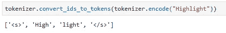
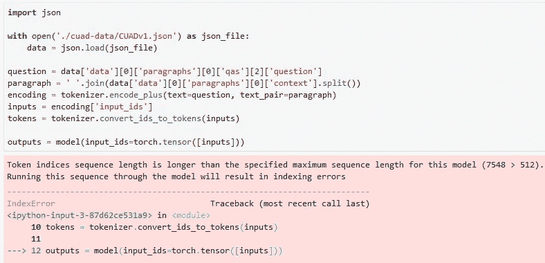
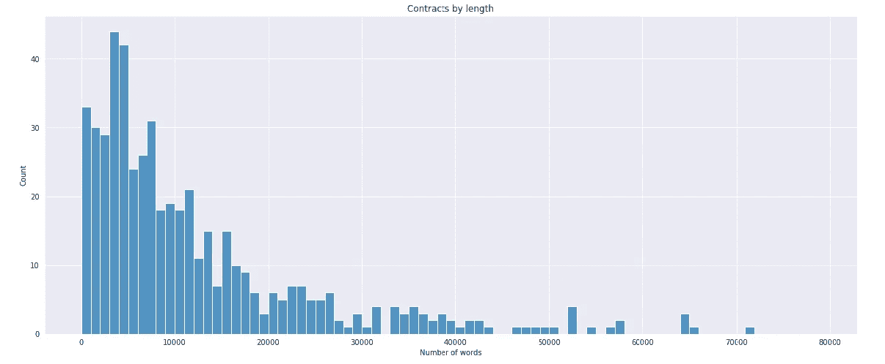
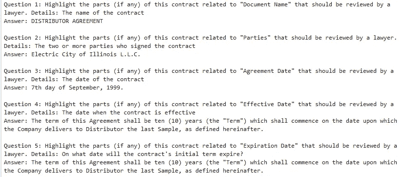

# 如何为法律合同审查建立机器学习模型—第二部分

> 原文：<https://towardsdatascience.com/how-to-set-up-a-machine-learning-model-for-legal-contract-review-part-2-6ecbbe680ba?source=collection_archive---------17----------------------->

## 克服臭名昭著的 512 令牌限制

由 [Raphael Schaller](https://unsplash.com/@raphaelphotoch?utm_source=medium&utm_medium=referral) 在 [Unsplash](https://unsplash.com?utm_source=medium&utm_medium=referral) 拍摄的照片

# 这是怎么回事？

在[之前的一篇博文](/how-to-set-up-a-machine-learning-model-for-legal-contract-review-fe3b48b05a0e)中，我们看了如何开始使用新发布的 [CUAD 数据集](https://github.com/TheAtticusProject/cuad/)，它有助于自动化合同审查。我们加载了模型，并对一份合同的简短摘录(前 100 个单词)进行了第一次预测。正如文章中提到的，我们用于这项任务的 NLP 模型通常有 512 个单词的限制。这意味着我们建立的模型不能扫描整个合同的信息。相反，它只限于少于 512 个字的合同摘录。

在这篇博文中，我们将看看如何克服这一限制，以便该模型可以在整个合同中搜索律师感兴趣的关键信息。

> **边注**:技术上来说，限制不是 512 个字，而是 512 个*令牌*。记号是自然语言的组成部分，因此也是 NLP 模型的组成部分。它们通常通过将单词分成子单词来表示:

单词“Highlight”的标记。第一个和最后一个标记是特殊的标记，用于标识文本的开始和结束。

> 出于我们的目的，这种技术上的区别在很大程度上是不相关的，我将在本文中互换使用术语*令牌*和*单词*。

# 我们试图解决的问题是什么？

上次我们在合同的前 100 个字内搜索了一条特定的信息(合同日期)。这很有效，因为我们在 512 字的限制之内。但是，如果我们试图在整个合同中查找这些信息，我们将会超出这个限制。在这种情况下，我们会收到如下所示的错误消息:

合同过长时的错误消息

错误消息通知我们，合同的令牌数(7，548)超过了该模型允许的最大长度 512。

对于许多类似的问答(Q&A)模型来说，这不是问题。这是因为这些问答对中的相关段落要么少于 512 个单词，要么这些段落被截断以符合单词限制，而不会丢失关键信息。这些类型的问答任务的示例可以在[斯坦福问答数据集(SQUAD)](https://rajpurkar.github.io/SQuAD-explorer/) 中找到。比如[这些关于南加州的段落](https://rajpurkar.github.io/SQuAD-explorer/explore/v2.0/dev/Southern_California.html)都短于 512 个字。

# 一份合同有多少字？

对于法律合同，情况就大不相同了。查看 CUAD 数据集中包含的合同，我们发现只有 3.1%的合同短于 512 个单词。

标识有多少合同短于 512 个字的代码。对于 CUAD 数据集，这将是 3.1%。

我们还可以看到，通过绘制合同长度直方图，我们将遇到大多数合同的 512 字限制:

按长度划分的合同

# 克服 512 字的限制

为了克服这个限制，合同必须被分成 512 个单词的几个部分。然后，该模型可以单独分析每个部分，并汇总结果以得出最终预测。幸运的是，当模型在 CUAD 数据集中的合同上训练时，程序员们必须克服同样的挑战。这意味着，通过识别训练代码中的相关代码段，我们可以对我们的预测任务使用相同的逻辑。我已经用一个 [Python 脚本](https://github.com/marshmellow77/cuad-demo/blob/main/scripts/predict.py)编译了相关的代码片段。在这一节中，我将介绍这个脚本的关键部分。

将问题和契约转换成模型接受的特性的函数是一个名为*squad _ convert _ examples _ to _ features()的函数。*它的[文档](https://huggingface.co/transformers/main_classes/processors.html#transformers.data.processors.squad.squad_convert_examples_to_features)和它的[实现](https://huggingface.co/transformers/_modules/transformers/data/processors/squad.html)可以在 [Huggingface 网站](https://huggingface.co/)找到。正如我们从文档中看到的，该函数将一系列问题和合同转换为模型的特性:

*将问题和合同转换为模型的特征*

然后将生成的要素加载到数据加载器中，并批量输入到模型中。该模型预测开始和结束逻辑，就像我们在第一篇博文中看到的例子一样:

对合同块进行预测

由此产生的开始和结束逻辑适用于合同的各个部分，必须总结为一个最终的模型预测。为此，我们可以利用函数[*compute _ predictions _ logits()*](https://github.com/huggingface/transformers/blob/ffe0761777a3d9dd562697a5ab1cec51f5c493d4/src/transformers/data/metrics/squad_metrics.py#L384)*:*

为了最终的预测，把所有的东西集合在一起

# 结论

在这篇博文中，我们克服了合同评审 NLP 模型的 512 字限制。这很重要，因为律师在合同中寻找的关键信息可能在文件中的任何地方，正如我们所看到的，大多数合同都比 512 个字长得多。

克服这一限制的代码封装在[这个脚本](https://github.com/marshmellow77/cuad-demo/blob/main/scripts/predict.py)中。在本[笔记本](https://github.com/marshmellow77/cuad-demo/blob/main/3_predictions.ipynb)中可以找到一个示例，说明如何利用该脚本来回答关于[样本合同](https://github.com/marshmellow77/cuad-demo/blob/main/output/contract.txt)的 CUAD 数据集的所有 [41 个问题](https://github.com/marshmellow77/cuad-demo/blob/main/output/questions.txt)。该笔记本的输出包含所有 41 个问题和相应的模型预测。它相当长，所以我将模型预测保存在这个[文本文件](https://github.com/marshmellow77/cuad-demo/blob/main/output/predictions.txt)中，以便于查看。

前 5 个问题和模型预测

有了这些资源，你现在可以自己设计一个法律合同评审模型了。您可以上传一个文本格式的合同，然后运行模型来查找合同中的关键信息，就像我们在这里所做的一样。

在以后的博客文章中，我们将看看如何用 [Streamlit](https://streamlit.io/) 建立一个合同评审的演示网站。这将使得上传合同和使用易于使用的 web 界面运行模型变得更加容易，非常类似于这个例子。