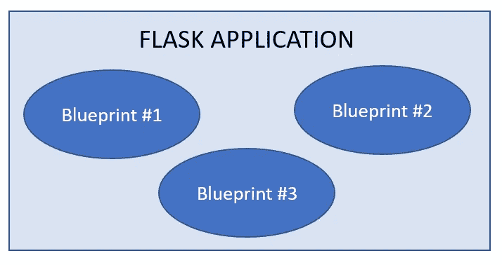
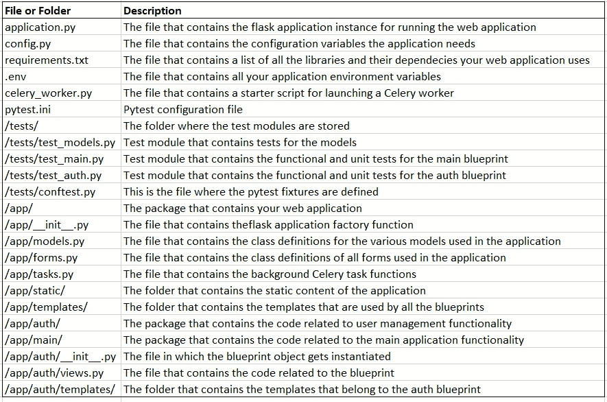
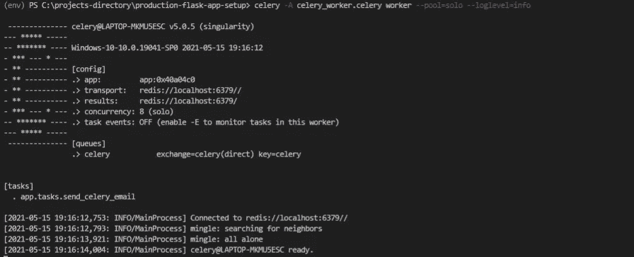
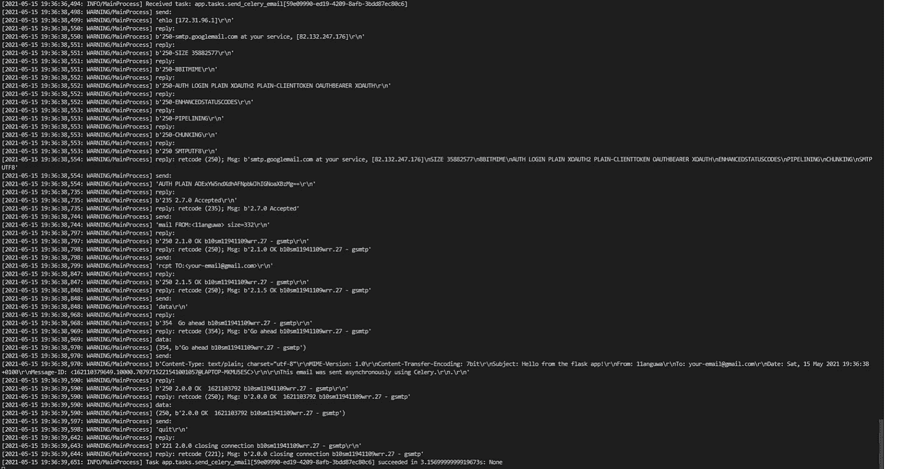
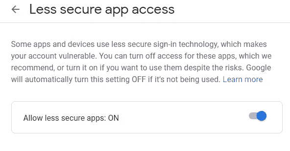

# 如何使用 Application Factory 模式和 Celery 建立生产级的烧瓶应用程序

> 原文：<https://towardsdatascience.com/how-to-set-up-a-production-grade-flask-application-using-application-factory-pattern-and-celery-90281349fb7a?source=collection_archive---------3----------------------->

## 使用 flask blueprints、application factory 模式和 Celery 构建和配置生产级 flask 应用程序的高适应性和可伸缩性工作流。


照片由[威尔·波拉达](https://unsplash.com/@will0629?utm_source=unsplash&utm_medium=referral&utm_content=creditCopyText)在 [Unsplash](https://unsplash.com/s/photos/workflow?utm_source=unsplash&utm_medium=referral&utm_content=creditCopyText) 拍摄

**免责声明**

这不是初学者教程。假设读者已经熟悉 flask web 应用程序框架、其常用的库和 celery。

# 基础

1.  为您的项目创建一个 github 存储库，并使用 README 和 python 对其进行初始化。gitignore 文件。
2.  将 git repo 克隆到您的本地机器上

```
$ git clone <repo link>
```

3.创建一个虚拟环境，并安装 flask 和您需要的任何其他库

```
$ python -m venv env
$ env/Scripts/activate
$ pip install flask python-dotenv flask-mail celery redis
$ pip freeze > requirements.txt
```

# 项目结构:烧瓶蓝图

## 什么是蓝图？

Flask 是一个非常灵活的 web 开发框架。作为开发人员，您可以完全自主地决定如何构建您的 web 应用程序。如果您正在构建一个小项目，将所有代码放在一个模块中没有坏处。然而，大型项目普遍接受的模式是使用 Flask Blueprints 将您的项目分成多个包。

一个模块是一个单独的`.py` python 文件。包是包含一个或多个模块以及一个`__init__.py`文件的文件夹。`__init__.py`文件是区分包和标准文件夹的地方:如果它存在于一个文件夹中，那么这个文件夹就是一个包；如果不存在，则该文件夹只是一个普通的存储文件夹。

蓝图是封装了应用程序中某个特定功能的包。您应该将使用蓝图构建的 flask 应用程序视为几个关键的功能块，它们协同工作来交付完整的 web 应用程序。



flask 应用程序由蓝图(作者自己的)组成

在开始编写项目代码之前，最好先考虑一下可以将应用程序分成哪些蓝图。我个人的做法是用两个蓝图，`auth`和`main`。`auth`蓝图处理所有与用户相关的功能——注册、登录、注销、密码重置和账户确认。`main`蓝图处理应用程序特有的功能和特性。您还可以添加第三个蓝图`api`，用于处理对 web 应用程序资源的编程访问。

您应该为具有两个蓝图的项目创建以下项目结构:

```
|-application.py
|-config.py
|-.env
|-.gitignore
|-readme.md
|-requirements.txt
|-celery_worker.py
|-Dockerfile
|-docker-compose.yml
|-pytest.ini
|-env/
|-tests/
    |-conftest.py
    |-test_main.py
    |-test_auth.py
    |-test_models.py
|-app/
    |-__init__.py
    |-models.py
    |-forms.py
    |-tasks.py
    |-static/
    |-templates/
        |-base.html
        |-400.html
        |-403.html
        |-404.html
        |-405.html
        |-500.html
    |-auth/
        |-__init__.py
        |-views.py
        |-forms.py
        |-templates/auth
            |-register.html
    |-main/
        |-__init__.py
        |-views.py
        |-forms.py
        |-templates/mai
            |-index.html
```

下表给出了各种组件的概要:



flask 应用程序中的公共文件(作者自己的)

当您使用蓝图时，处理请求的视图函数不会都在一个文件中；它们将被拆分到不同的文件中。每个蓝图都有自己的`views.py`文件，包含属于它的代码。这些路径没有一个`@app`装饰器，而是用它们所属的蓝图名称来装饰，例如`@auth_blueprint.route('/login')`。

一旦你将你的项目组织成蓝图，而不是服务器将请求传递给 flask 应用实例来处理，请求被推送到适当的蓝图，蓝图处理它们。为了让 flask 应用程序实例知道项目中的蓝图和属于它的路线，蓝图必须向 flask 应用程序实例“注册”。

# 结构管理

配置 flask 应用程序是指定关键参数值的过程，这些参数用于控制 flask 应用程序实例及其扩展的行为。关于这个主题的官方 flask 文档提供了一个很好的列表，列出了所有内置的 flask 变量，可以根据需要进行配置。

## 配置方法

Flask 提供了 4 种配置 flask 应用程序的主要方式:环境变量、flask 应用程序实例的 config 属性、CFG 文件和对象。

***环境变量**

当您想要设置一两个配置参数时，使用环境变量是最简单的配置方法。要设置参数，您可以运行`set`(对于 Windows)或`export`(对于 Linux)命令。Flask 建议您使用此方法设置`FLASK_APP`和`FLASK_ENV`环境变量，以便能够使用`flask run`命令在调试模式下启动 flask development server。

```
$set FLASK_APP = app.py
$set FLASK_ENV = development
```

使用环境变量来配置关键参数很简单，但是当您有许多参数或者当您想要使用具有不同配置设置的多个环境时，就不能很好地扩展。

*** flask app 实例的配置属性**

flask 应用程序实例公开了一个类似字典的对象，称为“config ”,通过点符号访问，它允许您将配置变量设置为所需的值，就像您设置字典键的值一样。当使用这个对象时，所有的配置代码都在 flask 对象实例化后立即编写。这是因为配置设置需要在 flask 应用程序实例化时可用，以便它可以在运行之前正确配置。

```
app = Flask(__name__)
app.config['SECRET_KEY'] = 'hard to guess
app.config**[**'TESTING'**]** = Trueapp.config['MAIL_SERVER'] = 'smtp.googlemail.com'
app.config['MAIL_PORT'] = 465
app.config['MAIL_USE_TLS'] = True
app.config['MAIL_USERNAME'] = os.environ.get('MAIL_USERNAME')
app.config['MAIL_PASSWORD'] = os.environ.get('MAIL_PASSWORD')
```

尽管在实例化 flask 对象的脚本中包含所有配置代码并不灵活。当 flask 对象被实例化时，它会立即根据这些设置进行配置，并且在实例化之后，无法更改 flask 实例的配置。

当您希望基于您正在做的事情拥有不同的应用程序“版本”时，这就成了一个问题。也就是说，当您处于开发阶段时，您需要一个配置用于开发的 flask 应用程序；当您想要进行测试时，您需要一个配置用于测试的 flask 应用程序；当您准备好进行部署时，您需要一个配置用于生产的 flask 应用程序。

也许您在开发过程中使用了 SQLite，但在生产中想要使用 postgreSQL 数据库。或者，您希望使用不同的 SQLite 数据库文件进行开发、测试和生产，以便将事情分开，使它们不会相互干扰。能够为不同的环境配置不同的 flask 应用程序是实现这一点的唯一方法。

***一个 CFG 文件**

不要把所有的配置代码都放在实例化 flask 对象的脚本中，可以把它写在一个单独的配置文件中，然后告诉 config 对象使用它公开的`from_pyfile()`方法从那个文件中提取配置设置。此方法采用的参数是文件的路径，它可以是相对于项目根目录的路径，也可以是文件的绝对路径。这种方法扩展性很好，但是不允许为不同的环境指定不同的配置设置。

名为 **config.cfg** 的配置文件的内容示例如下:

```
DEBUG = **False**
SECRET_KEY = 'a bad secret key'
```

使用存储在根项目目录中的 **config.cfg** 文件配置 flask 应用程序:

```
app = Flask(__name__)
app.config.from_pyfile('config.cfg')
```

***一个物体**

配置 flask 应用程序的方法是在一组 python 类中定义配置设置，该应用程序既具有良好的可伸缩性，又允许您为不同的环境指定不同的配置设置。

在位于项目根目录**、**的名为 **settings.py** 或 **config.py** 的 python 脚本文件中，您定义了 4 个类:

*   class Config(object)，它是基本配置类，包含适用于所有环境的配置设置。其他 3 个类都继承了这个类。
*   类 DevelopmentConfig(Config)，它包含开发环境的配置设置。
*   类 TestingConfig(Config)，它包含测试环境的配置设置。
*   class ProductionConfig(Config)，它包含生产环境的配置设置。

要使用 config.py/ settings . py 文件配置 flask 应用程序实例，您可以使用 config 对象公开的`from_object()`方法。此方法采用的参数指示配置脚本的名称和应该从中加载配置数据的类。假设您的配置脚本名为 config.py，在开发阶段，您可能希望从 DevelopmentConfig 类加载配置数据。完成此操作的方法如下所示:

```
app = Flask(__name__)
app.config.from_object('config.DevelopmentConfig')
```

## 生产级烧瓶应用程序的配置方式

实际上，有一些参数，比如密钥、邮件服务器用户名和密码，以及许多其他参数的值，出于安全原因，您不希望在 config.py 文件中显式地硬编码。

最终发生的是 flask 应用程序使用环境变量方法和对象方法的组合进行配置。使用环境变量方法在环境中设置敏感参数，然后使用`os.environ.get()`方法将其导入 config.py 文件。如果环境没有为参数提供值，则会提供默认值。非敏感参数在 config.py 文件中显式定义。

如果您不想像前面解释的那样使用终端设置环境变量，有一个漂亮的小 python 包叫做`python-dotenv`。一旦安装了这个包，您就可以在项目根目录下创建一个`.env`文件，并在其中定义所有的环境变量。然后，通过调用`load_dotenv()`方法，告诉 config.py 文件从`.env`文件加载环境配置设置。如果你使用这种方法，你需要记住将`.env`文件添加到`.gitignore`文件中。

在您的`.env`文件中:

在您的`config.py`文件中:

# 定义你的蓝图

每个蓝图必须有一个`__init__.py`文件。在这个文件中，通过实例化 blueprint 类的一个实例来定义 Blueprint。传递给类构造函数的参数是蓝图的名称和包含属于蓝图的模板的文件夹的名称。然后，您需要导入与该蓝图相关联的路由，这些路由写在与`__init__.py`模块位于同一目录的`views.py`中。

在`app/auth/__init__.py`中:

在`app/main/__init__.py`中:

出于测试目的，您需要编写一些初始代码，以确保一切设置正确。

使用蓝图时:

*   确保用于定义任何路由的装饰器使用 blueprint 对象。
*   确保`render_template()`函数参数采用`blueprint_name/template_name.html`的形式。这样做是为了反映一个事实，即一个蓝图只能呈现属于它的模板。
*   确保`url_for()`功能引用了与视图功能相关的蓝图。这样做是为了反映视图功能属于特定蓝图的事实。`url_for(auth.login)`。
*   您对`app`对象的任何引用都需要由`current_app`对象替换。这是因为当您使用蓝图时，您不再能够直接访问 flask 应用程序实例。你只能通过它的代理人`current_app`来访问它。
*   如果您在蓝图注册中为蓝图指定了一个前缀，那么视图函数 decorator 中的 route 不会得到那个前缀(也就是说，decorator 不是您所想的`@auth_blueprint.route('/users/login')`)。但是，从客户端收到的路由请求必须包含前缀，否则服务器将返回 404 错误。
*   在蓝图的目录中，您需要创建一个 templates 文件夹，然后在该 templates 文件夹中创建另一个以蓝图命名的文件夹。与蓝图关联的模板存储在以蓝图命名的目录中。[这种方法是存储与蓝图](https://flask.palletsprojects.com/en/1.1.x/blueprints/)视图功能相关的模板的建议方式。

```
|project  
    |-auth
        |-templates
            |-auth
```

在`app/auth/views.py`:

在`app/auth/templates/auth/register.html`中:

在`app/main/views.py`中:

在`app/main/templates/main/index.html`中:

# 应用程序工厂模式

通常，flask 应用程序是用全局范围实例化的。这意味着当您运行 flask 应用程序脚本时，flask 应用程序会立即被实例化和配置。不幸的是，一旦它开始运行，就没有办法改变它的配置设置。

这不是理想的行为。您希望能够创建针对不同环境(开发、测试或生产)配置的同一 flask 应用程序的不同版本。

一种解决方案是将 flask 应用程序的实例化和配置转移到一个函数中。使用应用程序工厂函数，然后在想要创建 flask 应用程序实例时调用它的方法实际上是一种众所周知的设计模式，称为工厂方法模式。使用配置 flask 应用程序的应用程序工厂模式方法使您能够在实例化 flask 应用程序之前定义它的配置。基本上，您需要为 flask 应用程序设置的所有内容都在应用程序工厂函数中定义，这样它会返回一个完全按照您的喜好设置和配置的 flask 应用程序实例。

定义 flask app 实例化的函数称为应用工厂函数(因为它在文学上用于生产许多 flask 应用程序，就像一个工厂用于生产许多产品一样)。它是在项目包的`app/__init__.py`模块中定义的。然后它在项目的`application.py`模块中被实例化。

**应用程序工厂函数中定义的所有内容的摘要:**

1.  Flask 应用实例化
2.  烧瓶应用配置
3.  烧瓶扩展实例化和初始化
4.  蓝图的注册
5.  请求回调的注册
6.  应用程序范围错误处理程序的注册
7.  日志记录配置

## 登记蓝图

蓝图是通过将蓝图对象传递给 flask 应用程序实例公开的`register_blueprint()`方法来注册的。该方法接受第二个可选参数，这是一个前缀，所有与蓝图相关联的 URL 都应该以它开头。在下面的例子中，授权蓝图的前缀是`/users`。这意味着，例如，要访问登录页面，用户必须请求`/users/login`路线。

在`app/__init__.py`中:

在`application.py`中:

要测试一切以确保蓝图设置正确，请在终端中运行以下命令:

`$ flask run`

当您导航到 [http://127.0.0.1:5000/](http://127.0.0.1:5000/) 时，您应该会看到“Hello world from the main blue！”

当您导航到[http://127 . 0 . 0 . 1:5000/users/register/you-email-address @ Gmail . com](http://127.0.0.1:5000/users/register/11anguwa@gmail.com)时，您应该会看到“您好，您的电子邮件地址 [@gmail.com](mailto:11anguwa@gmail.com) ，来自认证蓝图！”

# 记录

## 什么是日志记录，为什么它很重要？

日志记录是记录应用程序信息的过程。它用于在事件发生时记录事件，是调试任何问题和深入了解应用程序如何工作的绝佳工具。

您应该记录的内容包括:

*   与用户相关的事件，如注册、登录、注销、不正确的密码尝试
*   特定于应用程序功能的事件(例如，对于一个博客，它可以发布一个新的博客或添加一个评论)
*   错误，包括特定于应用程序的错误以及数据库操作错误。

您不应该在日志中存储任何敏感数据，因为它们通常存储为文本文件，因此不安全。

## 日志模块

Flask 使用标准的 python 日志模块。日志模块有 4 个子模块，可以通过点符号访问:记录器、处理程序、过滤器和格式化程序。

**记录器**是创建日志消息的对象。创建日志消息时，必须使用与重要程度级别相关的函数来指定其重要程度。关键级别(又名日志级别)、其数字表示以及与其相关的功能如下:

*   调试→ 10 →调试()
*   信息→ 20 →信息()
*   警告→ 30 →警告()
*   错误→ 40 →错误()
*   临界→ 50 →临界()

有一个默认的 logger 对象，无需任何配置就可以访问和使用它。每个 flask 实例通过`app.logger`对象公开它。如果您正在使用蓝图，那么您必须通过`current_app`对象来访问它，这个对象是 flask 应用程序实例的代理。

在你的`app/main/views.py`:

不幸的是，默认记录器只打印到控制台。因此，如果您想记录到一个文件，您需要配置一个新的记录器实例。默认记录器仍将继续记录，但您可以选择禁用它:

```
from flask.logging import default_handlerapp.logger.removeHandler(default_handler)
```

当您配置新的记录器实例时，您可以指定应该记录的消息的最低重要级别。所有重要程度为该值或更高的日志消息都将被记录，任何重要程度值低于该值的日志消息都不会被记录。这在您希望减少日志消息的数量而不从源代码中删除日志调用的情况下非常有用。您可以增加要写入日志的消息的最低日志级别，例如:错误消息及以上。

**处理程序**是将日志消息指向正确目的地的对象。默认的处理程序称为流处理程序，它向终端发送日志消息。您可以创建不同的处理程序对象来将日志消息路由到不同的目的地。

*   要记录到一个文件中，你需要使用一个文件处理程序。要将日志消息作为电子邮件发送，您可以使用 SMTPHandler。
*   FileHandler 方法接受要写入的日志文件的路径，包括其名称，并实例化一个 FileHandler 对象，该对象将向该文件发送日志消息。
*   实例文件夹通常用于存储运行时运行的文件(日志和数据库文件)。此文件夹需要添加到您的。gitignore 文件，这样它就不会被版本控制跟踪。

```
file_handler = logging.FileHandler('instance/my-app-log.log')app.logger.addHandler(file_handler)
```

*   FileHandler 对象将日志消息写入单个日志文件。这可能会导致日志文件很快变大。更好的方法是使用 RotatingFileHandler 对象。它还将日志消息写入文件，但是每当当前日志文件超过指定的文件大小(maxBytes)时，它都会创建一个新的日志文件。在开始覆盖现有文件之前，它将创建一个达到指定文件数(backupCount)的新文件。

```
from logging.handlers import RotatingFileHandlerfile_handler = RotatingFileHandler('instance/scrub-my-list.log', maxBytes=16384, backupCount=20)
```

**过滤器**用于向日志消息添加上下文信息。例如，在记录请求时，您可以创建一个过滤器，添加请求来自的远程 IP 地址。

**日志格式器**用于指定日志消息的格式。每个日志消息都是一个 LogRecord 对象。日志格式化程序用于指定要显示日志记录的哪些属性以及它们应该显示的顺序。

日志记录的常见属性包括:

*   `%(asctime)s` -创建日志记录的日期时间
*   `%(filename)s` -路径名的文件名部分
*   `%(funcName)s` -包含日志调用的函数名
*   `%(levelname)s` -消息的记录级别
*   `%(lineno)d` -发出日志记录调用的源代码的行号(如果可用)
*   `%(message)s` -记录的消息
*   `%(module)s` -发出记录调用的模块

## 如何配置日志记录

您应该在创建 flask 应用程序实例之前配置日志记录，否则它将使用默认的处理程序将日志消息写入控制台。这就是在应用程序工厂函数中配置日志记录的原因。

配置日志记录所需的步骤:

1.  导入日志库。可选:从`logging.handlers`导入`default_handler`
2.  实例化一个处理程序对象。
3.  使用 handler 对象公开的`setLevel()`方法设置其日志记录级别。
4.  实例化一个格式化程序对象。
5.  使用 handler 对象公开的`setFormatter()`方法将 Formatter 对象添加到 handler 对象。
6.  使用 logger 公开的`addHandler()`方法将 handler 对象添加到 logger。
7.  停用默认处理程序

在`app/__init__.py`中:

重新启动 flask development 服务器并导航到索引页面。

应该在顶层项目目录中创建一个新文件`flaskapp.log`。如果打开它，您应该会看到以下日志消息:

```
2021-05-14 16:14:31,910 INFO: Index page loading [in views.py: 6]
```

# 自定义错误处理

## HTTP 状态代码

当客户端向 web 服务器发出请求时，响应消息包含 HTTP 状态代码。这是一个 3 位数，表示处理请求的结果。状态代码根据第一个数字分为 5 个类别，每个类别代表一种响应类型:

1.  1xx —信息响应
2.  2xx —成功的 eg

*   200 (OK)，用于成功处理请求

3.3xx —重定向

*   302(找到)，成功地将客户端重定向到一个新的 URL

4.4xx —客户端错误

*   400(坏请求):当客户端提出服务器无法理解或不允许的请求时。
*   403(禁止):当客户端试图访问受限制的资源，但没有这样做的授权。
*   404(未找到):当客户端请求服务器无法识别的 URL 时。给出的错误消息应该是这样的:“对不起，您要找的东西不在这里！”。
*   405(不允许方法):当处理给定路由请求的视图函数不接受请求方法时。给出的错误消息应该类似于“对不起，该资源不支持所请求的方法！”。

5.5xx —服务器错误

*   500(内部服务器错误):通常由于编程错误或服务器过载而发生。

## 如何创建自定义错误页面

您通常希望为 403、404、405 和 500 错误定义自己的自定义错误页面，以便:

*   错误页面可以与 web 应用程序的其余部分具有相同的外观。通过使用一个扩展 base.html 的模板，错误页面将拥有和其他网页一样的导航栏和页脚。
*   您可以提供导航链接，使用户更容易导航回应用程序。

**步骤 1:为错误代码定义一个模板文件，并将其保存在保存 base.html 文件的 templates 文件夹中。**

未找到页面的自定义错误模板示例如下所示。您需要为 400、403、404、405 和 500 定义自定义错误处理程序模板。

在您的`app/templates/base.html`文件中:

在您的`app/templates/404.html`文件中:

**第二步:为每个错误代码定义一个错误处理程序。**

错误处理程序是在错误发生时呈现错误模板的函数。你可以给它起任何你想要的名字，它必须用`@app.errorhandler()`装饰。这个装饰器将它必须处理的错误的状态代码作为参数。

自定义错误处理程序的语法如下所示:

```
@app.errorhandler(status_code)
def function_name(error):
    # You can log the error or send an email here
    return render_template("status_code.html"), status_code
```

当您使用应用程序工厂方法时，所有的错误处理函数都在一个帮助函数`register_error_pages()`中定义。这个函数在应用程序工厂函数中被调用，并一次注册所有的错误处理程序。在`create_app()`函数之外定义错误处理程序很有用，这样可以保持干净，但仍然能够让 flask 应用程序实例知道错误处理程序。

在你的`app/__init__.py`文件中:

这个设置向 flask 应用程序实例注册了自定义错误处理程序。蓝图也支持`errorhandler()`装饰器，这意味着您可以用蓝图注册错误处理程序。然而，不建议使用这种注册自定义错误处理程序的方式，因为它不能被其他蓝图使用。最好向应用程序实例注册错误处理程序，以便它们可以查看所有蓝图中所有视图功能使用的视图。

为了测试定制的错误处理程序，Flask 提供了一个`abort()`函数，可以用来手动抛出错误。它将您想要抛出的错误的状态代码作为参数。将显示该错误的默认错误页面，但这很简单。

在你的`app/main/views.py`:

如果已经注册了该错误的错误处理程序，将调用它来显示自定义错误页，而不是默认页。

重新启动 flask 开发服务器。导航到[http://127 . 0 . 0 . 1:5000/admin](http://127.0.0.1:5000/admin)，您应该会看到定制的错误消息。将`abort()`函数的参数改为 403、404、405，最后改为 500，以确保所有自定义错误页面都被正确呈现。

# 芹菜

## 芹菜是什么？

Celery 是一个基于分布式消息传递的开源异步任务队列。尽管它支持调度，但它最常用于异步任务处理。当您的应用程序有长时间运行的任务(如处理数据、生成报告或发送电子邮件等网络相关任务)时，您最好在后台运行这些任务，而不是在与请求相同的流程中运行它们。

分布式消息传递系统有三个组件:

*   发布后台作业的发布者(芹菜客户端。celery 客户端运行 flask 应用程序)
*   消息代理/队列(通常是 Redis 或 Rabbit MQ)
*   订阅者(celery workers 是执行后台任务的独立进程)

分布式消息传递基本上意味着 Celery 依靠一个称为 broker 的中间人来充当它和任务生产者之间的中介。为了启动任务，客户端向消息队列发送消息。然后，消息队列将消息传递给工作线程，并执行所需的任何操作。worker 通过消息代理将作业的状态或结果返回给客户机。在任何时候，客户和员工都不会直接交流。实际上，他们甚至没有意识到对方。它们各自只处理消息队列。

使用分布式消息传递体系结构的主要优点是:

1.  可伸缩性:每个组件都可以根据需要独立伸缩，而不会影响其他组件
2.  松散耦合:工作者只关心它接收到的消息，而不关心是谁产生了它
3.  消息队列向工作人员提供实时消息。工作者不需要不断地轮询队列来查看是否有消息

## 用芹菜

**安装**

如果您还没有这样做，安装 celery 和您选择的消息代理的包。我选择了使用 Redis。

`$ pip install celery redis`

**配置**

要配置 Celery，您需要定义两个参数，`CELERY_BROKER_URL`和`RESULT_BACKEND`。这些参数的值是您选择的代理的 URL。它实际上告诉 Celery 代理在哪里运行，这样 Celery 就能够连接到它。我将在本地机器的端口 6379 上运行一个 redis docker 容器。

`RESULT_BACKEND`参数定义了当您运行一个返回某些东西的任务时，任务结果存储在哪里。如果您正在运行不返回结果或状态的后台任务，那么您不需要取消定义此参数。如果您确实想返回结果，您的消息代理也可以作为您的结果后端。这就是为什么我给了他们相同的网址。

1.在`.env`文件中定义 redis 客户端的 URL:

```
CELERY_BROKER_URL = redis://localhost:6379RESULT_BACKEND = redis://localhost:6379
```

2.在`config.py`中配置`Config`类芹菜:

```
CELERY_BROKER_URL = os.getenv('CELERY_BROKER_URL ')RESULT_BACKEND = os.getenv('RESULT_BACKEND')
```

**芹菜设置**

1.  在`app/__init__.py`中实例化一个芹菜对象:

在上面的代码中，我们通过调用 Celery 类对象实例化了一个新的 Celery 对象。它期望的参数是:

*   正在实例化芹菜对象的模块的名称
*   代理的 URL，它告诉 celert 代理服务正在哪里运行
*   结果后端的 URL

```
from celery import Celery  # NEW!!!!!
from config import Config  # NEW!!!!!celery = Celery(__name__, broker=Config.CELERY_BROKER_URL, result_backend=Config.RESULT_BACKEND)
```

芹菜的任何其他配置都从应用程序工厂函数内的 flask 应用程序配置传递给芹菜对象:

```
celery.conf.update(app.config)
```

2.定义要在后台运行的任务

对于这个例子，我们将设置 Celery 在后台发送电子邮件。

已经配置了`flask-mail`扩展。

后台任务被定义为函数。每个函数都需要用`@celery.task`装饰器来装饰。在一个单独的模块中定义所有的任务是一个好主意。

在`app/tasks.py`创建一个发送邮件的任务:

在`app/auth/views.py`中，调用任务:

为了调用任务，我使用了`apply_async()`方法，并使用`args`关键字传递任务函数需要的参数。

3.编写启动芹菜工的脚本。

在`celery_worker.py`中:

上面的代码创建了一个 flask 应用程序，然后使用它为 celery 实例的运行建立了一个应用程序上下文。Celery 需要应用程序上下文才能访问任何 flask 扩展对象，以便执行后台任务。它将在 celery worker 进程运行的整个生命周期内保持设置。

有必要导入 celery 实例，因为 Celery 将需要它来执行后台任务。

**测试所有东西**

1.  打开 docker 并运行 Redis 容器。

`$ docker run -d -p 6379:6379 redis`

2.打开一个新的终端窗口，激活虚拟环境并启动一个芹菜客户端:

`$ celery -A celery_worker.celery worker --pool=solo --loglevel=info`

您应该会看到 clery 客户端启动。它将向您显示它已经连接到 redis 客户机，还向您显示为 Celery 创建的在后台运行的任务。



芹菜客户端输出(作者自己的)

如果您遇到任何问题，请卸载并重新安装 celery，然后重试。还可以尝试不同的[执行池](https://www.distributedpython.com/2018/10/26/celery-execution-pool/),因为我发现这也有所不同。

3.在主终端窗口中，重新启动 flask development 服务器。导航至[http://127 . 0 . 0 . 1:5000/users/register/your-email-address @ Gmail . com](http://127.0.0.1:5000/users/register/11anguwa@gmail.com)

如果您检查运行 Celery 客户端的终端，您应该看到以下内容，以了解任务已经成功执行:



芹菜执行电子邮件发送后台任务(作者自己的)

输出的最后一行:

```
[2021-05-15 19:36:39,651: INFO/MainProcess] Task app.tasks.send_celery_email[59e09990-ed19-4209-8afb-3bdd87ec80c6] succeeded in 3.1569999999919673s: None
```

您应该会从邮件传递子系统收到一封电子邮件，说明无法找到`your-email-address@gmail.com`地址。

将 URL 的`your-email-address`部分替换为有效的电子邮件地址，您应该会收到一封主题和正文都在`app/views.py`中定义的电子邮件。

请记住，要让 flask 应用程序代表您使用 google SMTP 服务器发送电子邮件，您需要允许不太安全的应用程序访问。



允许不太安全的应用程序(作者自己的)

# 结论

就是这样！安装完成后，您可以继续开发您的 web 应用程序。

你可以在我的 [GitHub](https://github.com/angeuwase/production-flask-app-setup) 上找到这个回购。非常欢迎您使用 repo，并将其作为完全设置和配置 flask web 应用程序的起点。如果你这样做，记得添加一个`.env`文件将你所有的环境变量，因为该文件不会上传到 Github。