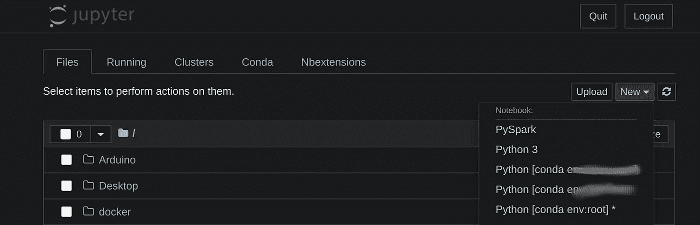

# 如何正确设置 Anaconda 和 Jupyter 笔记本

> 原文：<https://towardsdatascience.com/how-to-set-up-anaconda-and-jupyter-notebook-the-right-way-de3b7623ea4a?source=collection_archive---------1----------------------->



作者图片

如果 Anaconda (conda)和 Jupyter Notebook (Jupyter Lab)以正确的方式设置，它们的组合可以成为完美的团队，在那里你可以轻松地在深度学习 conda 环境之间切换。

有些程序需要 Tensorflow 1.15，有些需要 Tensorflow 2.0？没问题！只需简单点击即可切换环境和 Tensorflow 版本。

另外，您是否在每个 conda 环境中安装过 Jupyter 笔记本扩展？不要再担心了，我们将安装一次扩展，并让它们在每个环境中都可用！

# 我们如何实现这一目标？

1.  安装 Anaconda 或 Miniconda
2.  在基础环境中安装 Jupyter 笔记本电脑/实验室
3.  安装新环境
4.  激活 Jupyter 笔记本的环境

# 如何安装 Anaconda 或 Miniconda？

Anaconda 是一个很好的包，已经包含了很多 Python 包，可以很容易地进入 Python 世界。此外，它允许在 python 中创建环境，其中包含不同版本的 Python 包。例如，如果一个程序只能在 Python 2.7 或更早版本的 Matplotlib 上运行，您可以为该程序创建一个自己的工作空间，并通过单击一个按钮切换回 Python 3。此外，Tensorflow 2.0 和 Tensorflow 1.15 之间的切换也变得很容易，最终允许您轻松地在版本之间切换(否则这可能会很令人头疼)。

Miniconda 是 Anaconda 的一个基本版本，如果你在一个服务器上工作，磁盘空间有限的话，它会很有用。

要安装 Anaconda 或 Miniconda，请访问他们的网站(【https://www.anaconda.com/products/individual#Downloads】T4)，或者如果你使用的是 Linux，只需复制以下命令。

第一个链接在网站上搜索最新版本，并将其写入 LATEST_ANACONDA 变量。

```
cd ~/Downloads
LATEST_ANACONDA=$(wget -O - https://www.anaconda.com/distribution/ 2>/dev/null | sed -ne 's@.*\(https:\/\/repo\.anaconda\.com\/archive\/Anaconda3-.*-Linux-x86_64\.sh\)\">64-Bit (x86) Installer.*@\1@p')
wget $LATEST_ANACONDA
chmod +x Anaconda3*.sh # make it executable
./Anaconda3*.sh # execute the installer
```

按照对话，并就默认设置达成一致。

# 检查和切换 conda 环境

如果 conda 安装正确(可能需要注销并登录，或者重启)，您应该能够在终端中输入`conda`时看到输出。

要列出当前安装的环境，只需键入`conda env list`

它当前应该只显示安装的“基础”环境。

在环境之间切换就像输入`conda activate [NAME]`一样简单，如果完成了，用`conda deactivate`停用它(并返回到基本环境)。

默认情况下，基本环境是激活的。

# 在基础环境中安装 Jupyter 笔记本电脑/实验室

Jupyter 笔记本可以很容易地安装使用康达。我们的计划是只在基础环境中安装它，然后在子环境之间切换，以避免在每个环境中建立 Jupyter 实验室。

# 安装 Jupyter 笔记本电脑(默认)

```
conda install -c conda-forge notebook
conda install -c conda-forge nb_conda_kernels
```

# 安装 Jupyter 实验室

```
conda install -c conda-forge jupyterlab
conda install -c conda-forge nb_conda_kernels
```

# 安装 Jupyter 笔记本扩展

我真的很喜欢 Jupyter 笔记本扩展，它支持许多自动完成功能、附加信息，以及让您的生活更加轻松的一般功能。以下安装命令包含了一个好的默认设置:

```
conda install -c conda-forge jupyter_contrib_nbextensions
```

很好的概述了其他扩展:[https://towards data science . com/jupyter-notebook-extensions-517 fa 69d 2231](/jupyter-notebook-extensions-517fa69d2231)

# (可选)安装 pip 软件包管理器

在我看来，将 pip 包管理器添加到基础(和每个子)环境是一个好主意，因为 conda install 并不支持所有的包。此外，如果 pip 没有安装在每个子环境中，该软件包可能只是安装在“基础”conda 环境中，从而导致在您的子环境中找不到该软件包的错误。

```
conda install pip
```

# 在 conda 和 Jupyter 笔记本中创建环境

假设你想在 Jupyter 笔记本上同时安装 Tensorflow 2.0 和 Tensorflow 1.15。

先举这个例子，同意如果要用 Tensorflow 的 GPU 或者 CPU 版本。要使用 GPU 版本，请在 TensorFlow 中添加“-gpu”，否则，请保持原样。

为了创建一个新的 conda 环境，我们可以运行

`conda create --name tf-2.0`

如果你已经计划用它安装一些包，只需要把它们添加到末尾，比如:

```
conda create -n tf-2.0 tensorflow-gpu pip ipykernel
```

我建议安装`pip`进行包安装，使用 Jupyter 笔记本切换环境将需要`ipykernel`

要使用 TensorFlow 1.15 安装环境，请使用以下内容:

```
conda create -n tf-1.15 tensorflow-gpu==1.15 pip ipykernel
```

如果成功完成，在执行以下命令时，您应该能够看到三种环境:

```
conda env list
```

1.  基础
2.  tf-2.0
3.  tf-1.15

# 启动 Jupyter 笔记本并检查环境和扩展

```
jupyter notebook
```

在基本环境中运行 Jupyter Notebook，您应该可以看到一个包含“扩展”以及“conda”/“环境”的选项卡。转到扩展，激活你喜欢的扩展，如果你准备好了，使用“新建”按钮创建一个新的笔记本。在这里，您应该能够在您的基础环境、tf-2.0 环境和 tf-1.15 环境之间进行选择。

注意:你总是需要在基础环境中运行 jupyter notebook。运行`conda deactivate`离开你当前的环境，回到基础环境。

如果你需要安装更多的包，使用`conda activate [NAME]`激活一个环境，运行像`conda install X`或`pip install X`这样的命令，使用`conda deactivate`离开环境。

如果这对你有用，请告诉我，这对我帮助很大，我希望我能早点知道这件事！

在我的网站上找到这篇文章和其他文章:[https://www . data fortress . cloud/blog/how-to-set-up-anaconda-and-jupyter-notebook-the-right-way/](https://www.datafortress.cloud/blog/how-to-set-up-anaconda-and-jupyter-notebook-the-right-way/)