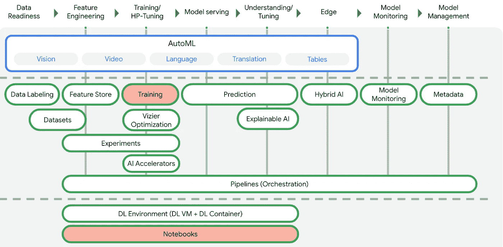
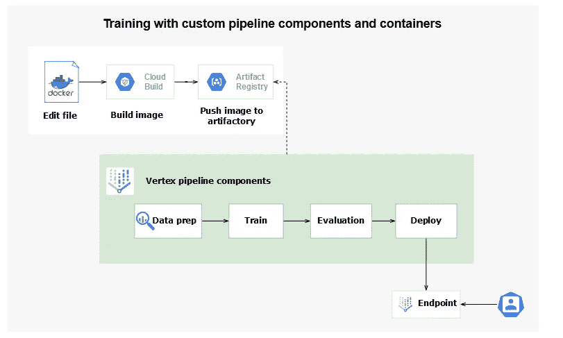
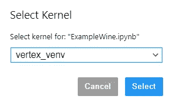
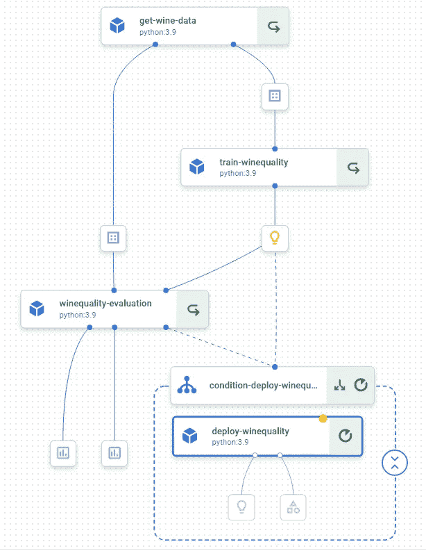
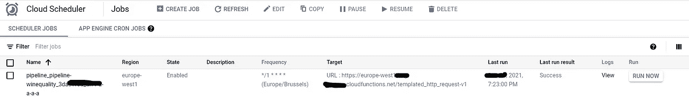
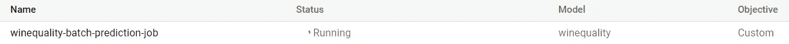

# 为初学者定制顶点 AI 管道[第 1 部分]

> 原文：<https://towardsdatascience.com/how-to-set-up-custom-vertex-ai-pipelines-step-by-step-467487f81cad?source=collection_archive---------0----------------------->

## 如何设置自定义顶点人工智能管道的分步教程


unsplash.com 尼康公司

# 使用顶点人工智能的多点操作

本文的目标是分享我关于如何使用端到端 MLOps Vertex AI 平台从零开始在生产中部署机器学习算法的经验。

尽管主题是[讨论过的](/serverless-machine-learning-pipelines-with-vertex-ai-an-introduction-30af8b53188e)，但这篇文章的新颖之处在于，我已经解决了从创建管道、提交、触发的整个周期，并且我还展示了如何以实时或批处理模式测试服务部分的例子。此外，我也提到了所有的技术问题，你可以应付沿途节省你的时间。

要阅读更多关于 Vertex AI 的内容，请参考谷歌官方文档[ [1](https://cloud.google.com/vertex-ai) ]。谷歌推出了一个很好的图表，恢复了 Vertex AI 提供的所有组件。



顶点人工智能功能@谷歌云

既然你对顶点 AI 有了概念，那就开始吧。

# 使用案例

我将解决在 [Kaggle](https://www.kaggle.com/datasets/rajyellow46/wine-quality) **上讨论的一个众所周知的用例***预测葡萄酒质量***。**数据下载自 [UCI 机器学习库](https://archive.ics.uci.edu/ml/datasets/wine+quality)@ source【Cortez et al .，2009】。
我们将使用一种常见的监督机器学习算法，如随机森林。

这个想法是基于以下标准来预测葡萄酒的质量:

*   ***挥发酸度:*** *挥发酸度是葡萄酒中存在的气态酸。*
*   ***固定酸度:*** *主要是* ***固定酸*** *葡萄酒中发现的有* ***酒石酸*******琥珀酸*******柠檬酸*** *和* ***苹果酸*****
*   *****残糖:发酵后剩余的*** *糖分的量。***
*   *****柠檬酸:*** *它是一种弱有机酸，天然存在于柑橘类水果中。***
*   *****氯化物:葡萄酒中所含的*** *盐量。***
*   *****游离二氧化硫:*** *So2 用于防止葡萄酒被氧化和微生物腐败变质。***
*   *****pH:*** *葡萄酒中的 pH 用于检测酸度***
*   *****密度*****
*   *****硫酸盐*** *:添加亚硫酸盐保鲜，保护* ***葡萄酒*** *免受氧化和细菌侵害。***
*   *****酒精:*** *葡萄酒中所含酒精的百分比。***

**要预测的目标是基于葡萄酒的质量等级:**

*   *****好酒= 1*** *(品质等级≥7 )***
*   *****劣酒= 0*** *(质量等级< 7 )***

# **流水线架构**

**用例使用四个管道组件(数据准备、训练、评估、部署)来实现。每个管道组件都使用工件注册中心提供的容器映像。在本文中，我们将只使用预编译的基本映像。在下一篇文章中，我将给出更多关于如何创建你自己的顶点 AI 自定义 docker 图像的见解。**

****

***架构概述。***

# **步骤:**

> **一.建立环境**
> 
> **二。安装一个虚拟 env 并在 JupyterLab 中激活它**
> 
> **三。创建管道组件:**加载数据，训练模型，评估模型，部署模型。****
> 
> **四。创建管道**
> 
> **动词 （verb 的缩写）运行管道**
> 
> **不及物动词触发管道。**

# ****一、**设置环境**

**环境:**

*   **Vertex AI Workbench(用 Python 3 在虚拟环境中运行的 Jupyter 笔记本)**
*   **Python 3**
*   **虚拟**
*   **Kubeflow 管道组件**
*   **在我的下一篇文章中，我会给你更多关于如何构建自定义图像的见解**

**如果你想激活笔记本中的*，你应该安装***jupyter _ contrib _ nb extension***s。***

***安装 kubeflow 组件。***

**如果 API 未启用，请启用它们。**

**导入库。**

**设置全局变量。**

# ****二。安装一个虚拟 env 并在 JupyterLab** 中使用它**

**执行以下代码:**

**重启 Jupyter 并选择新的内核:**

****

# **三。**创建管道组件****

**请注意，现在，我将使用 Artifactory 注册表中预编译的 docker 图像。此处见预建容器列表[。](https://cloud.google.com/vertex-ai/docs/predictions/pre-built-containers)**

**下图描述了我们将要实现的整体组件。**

****

**管道图**

## ****加载数据****

**第一个组件是 **get_wine_data。**该组件使用了一个预构建的 Python3.9 基础映像，其中我还添加了:pandas、sklean 和 pyarrow。**

**逻辑很简单，我们读取 [*葡萄酒质量数据集*](http://archive.ics.uci.edu/ml/machine-learning-databases/wine-quality/winequality-white.csv) *，w* e 选择***best _ quality****作为*标签，我们将数据拆分成训练和测试数据集。
组件的配置存储在一个名为 *get_wine_data.yaml* 的. yaml 文件中，您可以进一步使用它来运行组件，而无需重写代码。yaml 文件对于生成组件模板非常有用。**

## **训练模型**

**组件 **train_winequality** 使用预构建的 Python 3.9 基础映像，并将存储在 Google Storage 上的训练数据集作为输入。它将框架的名称记录为模型元数据。如果您想要使用顶点 AI 元数据功能，您需要使用***model . metadata[***"*name _ of _ the _ metric "*]= value 记录指标。**

**模型以 pickle 格式存储在 Google Storage 的 PIPELINE_ROOT 路径下。请记住，支持的模型格式是:scikit-learn: `model.joblib`或`model.pkl`，XGBoost: `model.bst,`
Tensorflow `model.pb.`**

**❗注意，模型需要用`model`这个名字保存**

## **评估模型**

**评估组件 **winequality_evaluation** 依赖于预编译的 Python 3 基础映像，其中我们使用“pip”安装了额外的包，如 pandas 和 sklearn。**

**它输入测试数据集、训练模型和预定义的精度阈值。然后，它计算准确度、ROC 曲线和混淆矩阵，并检查准确度是否高于预定义的阈值。**

## **部署模型**

**组件 **deploy_winequality** 使用与之前组件相同的基础映像。它输入项目名称、区域、训练模型和服务容器的 URL。**

**要部署模型，我们首先创建一个端点，将模型上传到 Vertex AI models，然后将模型部署到端点。**

# **四。创建管道**

**要定义唯一的管道作业名称，可以使用时间戳。**

```
**from datetime import datetime
TIMESTAMP =datetime.now().strftime("%Y%m%d%H%M%S")
DISPLAY_NAME = 'pipeline-winequality-job{}'.format(TIMESTAMP)**
```

**管道本身帮助您以无服务器的方式编排 ml 工作流。它接受一些参数作为输入，比如包含原始数据的 URL、API 端点和项目。它使用以下操作符作为步骤:data_op、train_model_op、model_evaluation_op 和 deploy_model_op。deploy_model_op 仅在训练模型的精度高于阈值时执行。为此，您需要使用 dsl 的条件管道特性(*)。条件*。**

# **动词 （verb 的缩写）运行管道**

**流水线编译生成***ml _ wine quality . JSON***作业规范文件。
使用编译器，指定 *pipeline_func* 和 *package_path* 。**

```
**compiler.Compiler().compile(pipeline_func=pipeline,
        package_path='ml_winequality.json')**
```

**使用先前生成的作业规范文件创建一个运行。**

```
**start_pipeline = pipeline_jobs.PipelineJob(
    display_name="winequality-pipeline",
    template_path="ml_winequality.json",
    enable_caching=True,
    location=REGION,
)**
```

**运行管道。**

```
**start_pipeline.run()**
```

**单击运行命令生成的 HTTPS 链接，查看生成的 UI 管道图的状态。**

# **不及物动词触发管道**

**检查是否启用了以下 API:**

*   **云函数**
*   **云调度程序**

**请确保您的服务帐户拥有云功能管理员、服务帐户用户和云调度服务代理的权限。创建重复性作业后，您可以在云调度程序控制台中列出它。**

****

**下面你可以找到一个循环工作的例子。使用**计划**参数(接受 crontab 格式)提及重复间隔。**

# **七。模拟批量预测和实时预测**

**我们定义了几个变量:**

*   **我们将使用的模型名称**
*   **我们部署模型的入口点**
*   **包含准备进行预测的批处理实例的存储桶**
*   **预测模型的 ID(每个上传的模型都有一个唯一的 ID)**
*   **我们存储预测输出的 Google 存储目标。**

**为了创建一个批处理预测作业，我们需要初始化 AI 平台，然后是模型资源名和 batch_predict 调用。**

**batch_predict 方法请求五个主要参数，例如作业的名称、要预测的实例的路径、存储预测的路径、计算预测所需的机器类型以及输入数据的类型(csv、json)。**

## **批量预测**

**提交作业后，转到 Vertex AI 中的批处理预测控制台，检查作业的状态:**

****

**查找批量预测日志的提示→在操作>记录>日志浏览器中键入:**

```
**resource.labels.service=”aiplatform.googleapis.com”** 
```

## **实时预测**

**每个预测请求必须最大。1.5 MB。我们使用**端点。预测** API。在下面的例子中，我们首先初始化 AI 平台，给出项目和位置。然后，我们声明我们计划用于预测的端点的 ID。最后，我们调用“endpoint.predict”方法，传入数据进行预测。**

**预测输出是一个. json，包含如下条目:**

```
**Prediction(predictions=[0.0], deployed_model_id='5026685687215161344', explanations=None)**
```

> **[**在下一篇文章中，我将解释如何构建你自己的定制 docker 图像，并在管道中使用它们。**](https://pub.towardsai.net/devops-7f4c62f43eeb)**

**笔记本的源代码可以在我的 [github](https://github.com/anabild/mlops/blob/e2efe79fb163ea12cff616882f74a52b08048a54/notebook/ExampleWine.ipynb) 账户上找到。**

# **强占**

**[1] [顶点 AI 流水线简介](https://cloud.google.com/vertex-ai/docs/pipelines/introduction)
【2】[流水线简介](https://github.com/GoogleCloudPlatform/vertex-ai-samples/blob/main/notebooks/official/pipelines/pipelines_intro_kfp.ipynb)
【3】[顶点流水线](https://colab.research.google.com/github/tensorflow/tfx/blob/master/docs/tutorials/tfx/gcp/vertex_pipelines_vertex_training.ipynb)
[【4】无服务器机器学习流水线](/serverless-machine-learning-pipelines-with-vertex-ai-an-introduction-30af8b53188e) [带顶点 AI 的 MLOps】](https://github.com/GoogleCloudPlatform/mlops-with-vertex-ai)**

# **感谢您的阅读！**

**如果你想在收件箱里收到我未来的故事，别忘了订阅。**

**如果您喜欢阅读我的故事，并希望支持我成为一名作家，请考虑注册成为 Medium 会员，并获得数千篇数据工程和数据科学文章。**

**[](https://medium.com/@anna.bildea/membership) [## 通过我的推荐链接加入 Medium—Bildea Ana

### 作为一个媒体会员，你的会员费的一部分会给你阅读的作家，你可以完全接触到每一个故事…

medium.com](https://medium.com/@anna.bildea/membership) 

*在*[*LinkedIn*](https://www.linkedin.com/in/ana-bildea-phd-2339b728/)*和* [Twitter](https://twitter.com/AnaBildea) 上找我！**