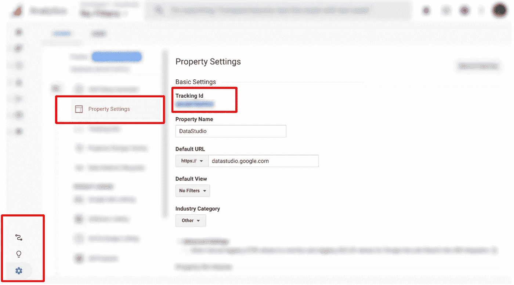
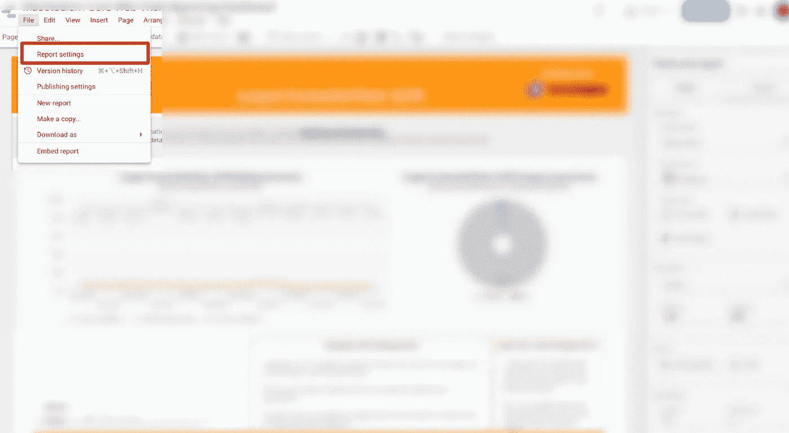
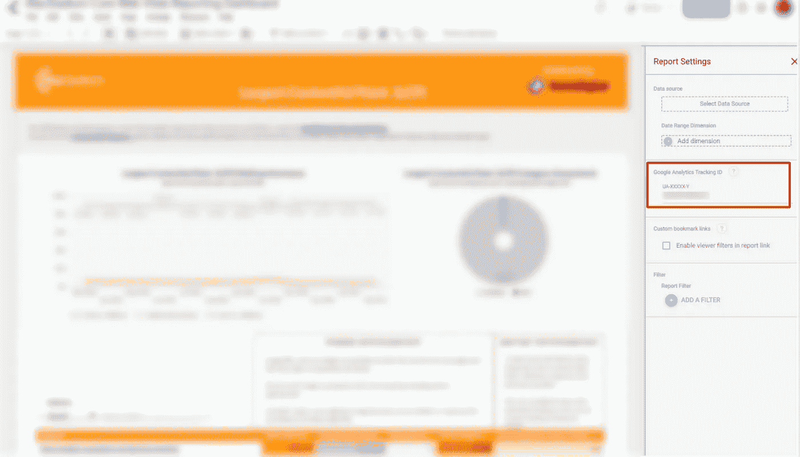

# 如何为 Data Studio 报告设置 Google Analytics 跟踪

> 原文：<https://towardsdatascience.com/how-to-set-up-google-analytics-tracking-for-google-data-studio-reports-c0c1eec0b777?source=collection_archive---------33----------------------->

## 监控您的报告的受欢迎程度

乔纳森·弗朗西斯卡在 [Unsplash](https://unsplash.com?utm_source=medium&utm_medium=referral) 上拍摄的照片

谷歌数据工作室报告是一个巨大的打击，尤其是在企业领域。

它是免费的，易于使用，并利用数百个潜在的集成，实现了整体和粒度级别报告的巨大潜力。

虽然我最近谈到了谷歌数据工作室的[局限性，但现在我想谈谈它有一个很酷的、隐藏的特性——追踪。](/4-limitations-of-google-data-studio-that-advanced-users-should-watch-out-for-fb2a907eaf5c)

没错，Google Data Studio 报告允许嵌入 Google Analytics tracking-id，这将允许对您创建的漂亮报告的受欢迎程度进行更强大的分析数据。

我将向您展示如何通过四个步骤来添加它。

## 1.创建 Google 分析属性。

假设您已经创建了您的 Google Analytics 帐户，您可以通过导航到您帐户的管理页面并点击*属性*列中的**创建属性**来创建 Google Analytics 属性。

然后，您可以命名该属性，在本例中，按照“Data Studio Reports”的方式命名，并调整其他属性设置，例如:

*   属性时区
*   无论你是否希望它成为一种普遍属性
*   网站 URL 和协议
*   其他信息(如业务信息)

设置调整完毕后，点击“创建”。

Google 在其[分析支持文档](https://support.google.com/analytics/answer/10269537?ref_topic=1009620)中提供了关于如何完成这一步骤的详细教程。

一旦创建了您的属性，您就可以继续下一步。

## 2.从属性设置中复制属性的 tracking-id。

导航至**管理**部分(点击左侧按钮上的设置图标)。

然后选择**属性设置**选项卡。

tracking-id 位于设置的第一部分(显示了上下文的其余页面设置)。选择并复制跟踪 id。

以下是谷歌对这个 [ID](https://support.google.com/analytics/answer/7372977?hl=en) 的说法:

> *跟踪 ID* 是一个类似 UA-000000–2 的字符串。第一组数字(-000000，在上面的例子中)指的是您的账号，第二组数字(-2)指的是与该账户相关的特定*房产号*。

只有当跟踪 ID 也包含在支持此类跟踪技术的其他仪器中时，分析才有效。

因此，让我们前往 Data Studio 并完成集成。

谷歌分析账户截图，显示追踪 id，作者图片

## 3.打开 Data Studio 报表并导航到报表设置。

在 Data Studio 中，单击文件，然后单击报告设置。

Google Data Studio 报告的屏幕截图，显示了报告设置菜单的位置，图片由作者提供

## 4.插入 GA 跟踪 id

在 Google Data Studio 报告中插入 GA tracking-id 代码。

这将使您能够获得有关报告使用情况的分析数据，包括用户行为数据、用户位置、使用的系统和设备等。

Google Data Studio 报告的屏幕截图，显示了 GA tracking-id 的粘贴位置，图片由作者提供

瞧啊。现在，您可以监控报告的性能。

在与客户合作时，始终确保他们的需求得到满足，他们的反馈被纳入报告的设计中，以确保整个组织采用的可能性更高。

以下是该过程的概述:

要为您的 Google Data Studio 报告设置跟踪，请在 GA 中创建一个属性，并从属性设置部分复制其跟踪 id。然后，在面板中导航到任何 Google Data Studio 的报告设置，并插入跟踪 id。

*感觉好奇？*

*欲了解更多 Data Studio 教程和技巧，请查看:*

 [## 高级用户应该警惕的 Google Data Studio 的 4 个局限性

### (以及如何克服它们)

towardsdatascience.com](/4-limitations-of-google-data-studio-that-advanced-users-should-watch-out-for-fb2a907eaf5c)  [## 如何使用 Data Studio 研究和可视化您的媒体统计数据

### 一步一步的初学者友好教程，以更好地理解你的文章的性能和参与

towardsdatascience.com](/how-to-use-data-studio-to-research-and-visualize-your-stats-4ab64ff19341)  [## 如何在 Google Data Studio 中创建显示负数的图表

### 使用 SEMrush 的 Data Studio 连接器和反向链接创建负值自定义字段的分步教程…

medium.com](https://medium.com/bite-sized-marketing/how-to-create-charts-that-display-negative-numbers-in-google-data-studio-4ecbb58c3a79)