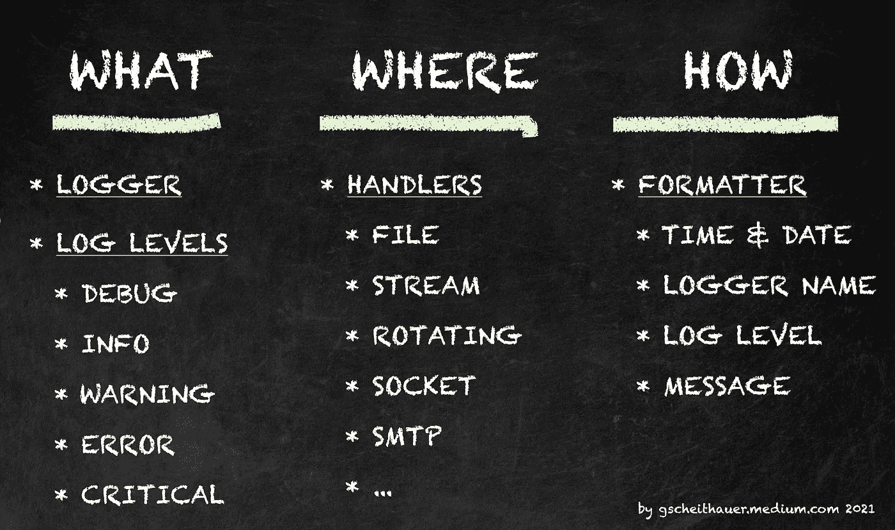
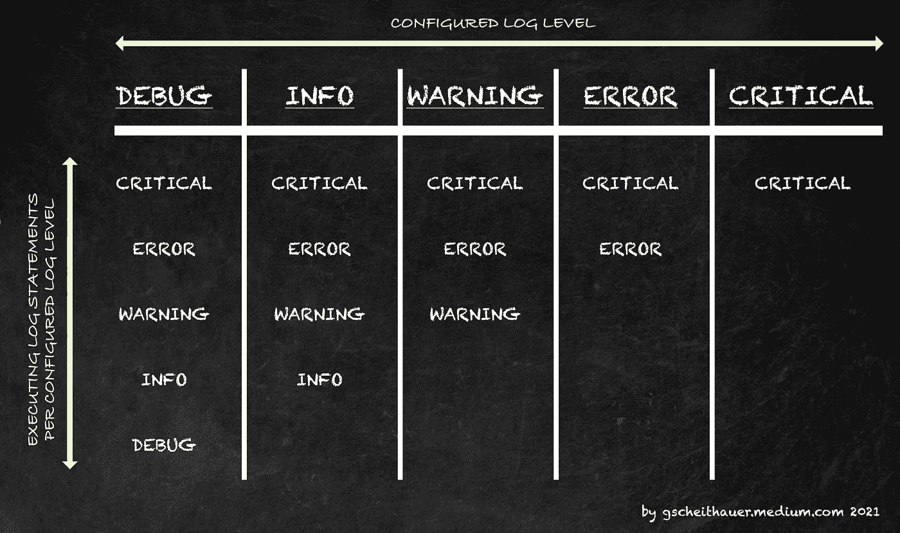

# 如何在 2 分钟内为您的 Python 笔记本设置日志记录

> 原文：<https://towardsdatascience.com/how-to-setup-logging-for-your-python-notebooks-in-under-2-minutes-2a7ac88d723d?source=collection_archive---------15----------------------->

## 教程 PYTHON 日志记录

## 理解、安装、使用和享受 Python 中的标准日志包的分步指南


照片由[杰曼特里](https://www.pexels.com/@jaymantri)在[像素](https://www.pexels.com/photo/nature-forest-trees-fog-4827/)上拍摄

G *regor 是一位热爱解决数据谜题的数据科学家。一天，他接到一个新项目，想马上投入到这个新任务中。他对自己最喜欢的编码工具的选择有所准备，并且是一个大师，知道使用哪个包，并且已经形成了如何构建数据项目的想法。他不考虑伐木。也就是说，不是一开始。当大部分代码都写好了，只有一个他试图在代码中指出并找到的错误时，他才恍然大悟。一旦他击碎了他的 bug 并重写了他有缺陷的代码，他意识到他的代码充斥着* `*print()*` *语句。在传递他的解决方案之前，他需要把它们拿出来。*

## 1.介绍

也许你能理解这个小场景。但是我知道有一个简单的方法可以弥补我的缺点。我花了一些时间研究了标准的 python 日志框架，我将在这里愉快地为我未来的自己解释它，当然，也为你。

我将为我们提供一个复制-粘贴-日志-代码-模板，使日志简单。此外，我将分享关于三个最重要的日志概念的附加信息。文章结尾是我在研究过程中发现的关于日志记录的相关文章。

## 2.一个复制粘贴模板，立即与您的代码一起工作

这是用于登录到您的控制台的复制粘贴模板。在第 3 节(日志处理程序)中找到一个日志模板来设置日志文件。

基于:[https://docs . python . org/3/how to/logging . html # logging-advanced-tutorial](https://docs.python.org/3/howto/logging.html#logging-advanced-tutorial)

**附加提示**

1.  您可以根据您的任务或开发状态更改日志级别，无需在调试会话后删除打印语句
2.  可以将语句记录到不同的输出中。用于审计目的的日志记录的文件，开发期间带有调试级别的控制台输出，或者生产期间只有警告和错误消息的控制台输出。
3.  尝试为运行您的代码的其他开发人员和管理员编写有意义的日志语句。
4.  只要有可能，就提供*上下文信息*，例如(散列的)用户 id、会话 id，以便能够进行调试或错误处理

## 3.三个伐木火枪手



图片由作者提供；日志组件概述(记录器(what)、处理程序(where)和格式化程序(how))

如果您已经使用过 Python 或者熟悉编程，那么这个代码块可能已经足够了。为了更容易理解和记忆，我试着把它和 **WHAT — WHERE — HOW** 联系起来。

*   **即**指的是*记录器*本身以及不同的*日志级别*。
*   **这里的**是指*测井输出*或者说*处理程序*应该去的地方。这可能包括您的控制台和一个文件。
*   **如何**指的是*日志语句*应该如何*看起来如何*或者应该包括什么？这是由*格式器*完成的。

**什么—日志级别** 下面是五个日志级别的概览表。如果你遵循 GitHub 的要点，你还会看到，对于我在应用程序生命周期中添加的每个级别，你都可以使用日志级别。

日志级别概述

如果您将*日志级别*设置为*调试* (logger.setLevel(logging。DEBUG))那么您编写的所有日志语句(DEBUG、INFO、WARNING、ERROR、CRITICAL)都将被记录。如果您将*日志级别*设置为警告(logger.setLevel(logging。WARNING))则只记录日志语句(警告、错误、严重)。



图片由作者提供；在给定的日志级别配置下，将执行哪个日志语句

这将给你带来好处，让**在代码中使用所有**日志语句，甚至当你进入生产时。您只需更改*日志级别*。

在*开发*期间，您可能会使用两个日志级别之一 DEBUG 或 INFO。在*调试*期间，您将使用 DEBUG。当您将代码部署到*产品*中时，您应该将日志级别设置为警告。下面您会发现两个具有不同日志级别的代码示例，因此会有不同的日志输出。

**示例 01 —日志级别设置为调试**

日志示例—调试

```
DEBUG - User User XYZ provided the numbers 100 and 0 for calculation
ERROR - Calculation was unsuccessful for user User XYZ with the inputs 100 and 0
ERROR - division by zero
```

**示例 02 —日志级别设置为警告**

日志示例—警告

```
ERROR - Calculation was unsuccessful for user User XYZ with the inputs 100 and 0
ERROR - division by zero
```

请注意，在第二个示例中，省略了*调试*日志语句，因为日志级别设置为*警告*，因此仅显示*警告*、*错误*和*关键*语句。

**WHERE —日志处理程序** 在我自己的经验中，我使用的是*文件*和*控制台(流)*处理程序。然而，python 日志文档列出了 [15 种不同的日志处理程序](https://gist.github.com/scheithauer/27763129e6cf55531fde07975beab494)。请根据您的具体需求进行检查。如何设置 *StreamHandler* 登录控制台如上图所示。

在这个例子中，我将向您展示如何设置一个 *FileHandler* 来在控制台输出旁边创建一个日志文件。

使用日志文件记录设置

**如何格式化您的日志语句** 我发现的大多数示例都是以这种方式格式化的，但是当然，您可以根据自己的需要调整配置:

格式化程序配置

1.  日期时间信息
2.  记录器的名称(使用 getLogger-function 提供的名称)
3.  log 语句的日志级别
4.  日志消息本身。

## 4.关于日志的更多文章

*   [测井包文档](https://docs.python.org/3/library/logging.html)
*   [软件包文档中的一个示例](https://docs.python.org/3/howto/logging.html#logging-advanced-tutorial)
*   [另一个伐木入门](https://zetcode.com/python/logging/)
*   [13 条日志提示](https://www.scalyr.com/blog/the-10-commandments-of-logging/)
*   [在 Python 中停止使用 Print 进行调试。用冰淇淋代替](/stop-using-print-to-debug-in-python-use-icecream-instead-79e17b963fcc)由 [Khuyen Tran](https://medium.com/u/84a02493194a?source=post_page-----2a7ac88d723d--------------------------------)

在这篇文章中，我试图让你在下一个 Python 项目中使用日志包。我提供一个复制-粘贴-记录-代码-设置。然后我解释三个重要的日志概念:日志级别、日志处理程序和日志格式化程序。最后，我提供了一个包含更多信息的列表。

如有任何问题和意见，请随时联系我。谢谢你。**在这里找到更多我的文章**:

1.  [了解我如何为媒体设计文章](https://medium.com/technical-excellence/article-pipeline-management-with-notion-app-template-13e83635ed1)
2.  [了解如何使用链接(或管道)在 Python 中编写干净的代码](https://medium.com/technical-excellence/article-pipeline-management-with-notion-app-template-13e83635ed1)
3.  [学习如何使用 R](/nine-years-on-linkedin-in-data-b34047c77223) 分析你的 LinkedIn 数据
4.  [学习如何使用图形语法在 Python 中以描述性的方式创建图表](/data-visualization-in-python-like-in-rs-ggplot2-bc62f8debbf5)

**Gregor Scheithauer** 是一名顾问、数据科学家和研究员。他专门研究流程挖掘、业务流程管理和分析。你可以在 [**LinkedIn**](https://www.linkedin.com/in/gscheithauer/) 、 [**Twitter**](https://twitter.com/gscheithauer) 上和他联系，或者在 [**Medium**](https://gscheithauer.medium.com/) 上这里。谢谢大家！