# 如何在 PowerBI 中设置选项卡级安全性

> 原文：<https://towardsdatascience.com/how-to-setup-tab-level-security-in-powerbi-13cbe3daa65a?source=collection_archive---------0----------------------->

## 创建具有行级安全性的动态导航菜单

[@钳工](https://unsplash.com/@benchaccounting)在 [Unsplash](https://unsplash.com/s/photos/dashboard?utm_source=unsplash&utm_medium=referral&utm_content=creditCopyText) 上的照片

我真的很喜欢这个特性，这也是我最近在 PowerBI 中学习做的最喜欢的事情之一。我以前使用过行级安全性，它在为许多用户创建公共报表时非常有用。主要的限制是每个用户组的报告看起来都一样——所以它们需要有相同的设计和相同的可视化，只是结果因访问而异。

我的情况有些不同。有各种各样的业务用户组，每个用户组都定义了他们希望看到的一些额外的特定于业务的度量。因此，根据哪个用户打开页面，页面将包含不同的视觉效果。

实施常规 RLS 并创建一个默认报告将导致一个业务用户组看到为另一个业务创建的空视图。

第一个想法只是用一个数据集为每个企业创建单独的报告，但是:

-报告中的某些页面对所有用户组都是通用的

-一些用户可以访问多个用户组

我讨厌冗余，所以我需要的是标签级的安全性，这样用户就可以轻松地浏览只与他们相关的页面。

我设法通过使用切片器和按钮作为菜单以及连接的行级安全性来调整切片器的内容。

让我们一步一步来看看如何做:

**1。设置导航表**

示例报告包含 4 个选项卡，在演示中，目标是创建两种类型的用户，他们将能够看到不同的选项卡。

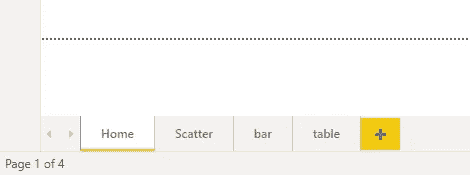

作者图片

用户 1 —可以查看所有选项卡

用户 2 —只能看到其中的 3 个

**1。创建新表:**

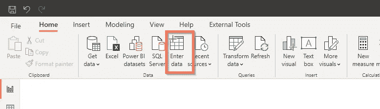

作者图片

在新表中，我们将放入所有选项卡名称和排序列进行排序:

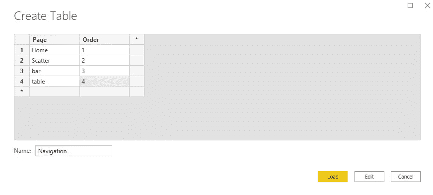

作者图片

我们现在需要向导航表添加 2 个度量:

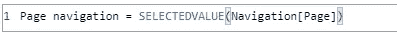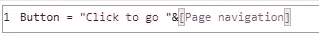

作者图片

首先将允许 as 导航到选定的页面。第二个只是在按钮上显示自定义文本。

现在让我们创建另一个带有用户访问管理的自定义表。它将包括用户组和将用户组映射到他们可以访问的页面名称:

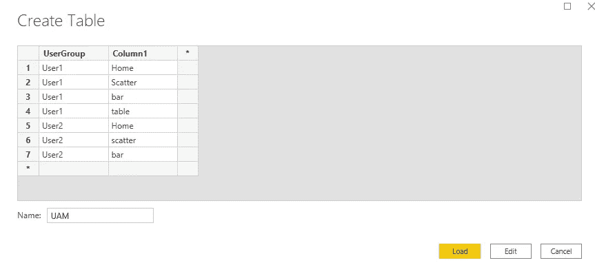

作者图片

为了让它工作，我们需要在 UAM 和导航表之间创建一个关系:

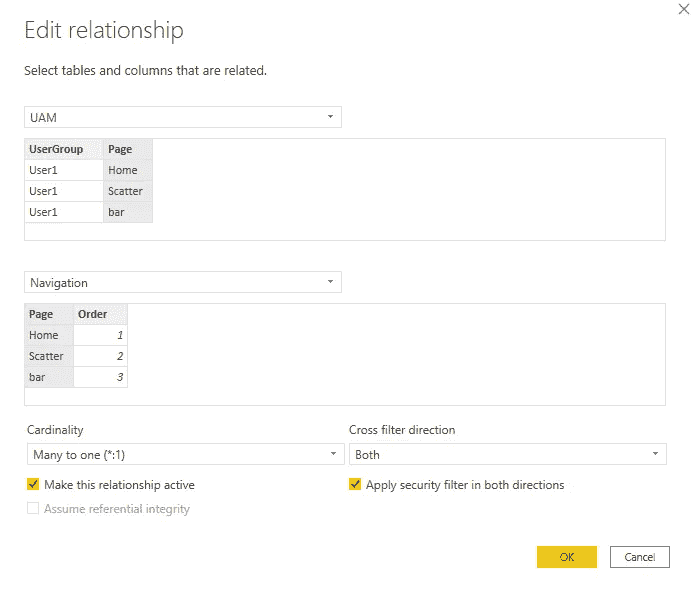

作者图片

记住勾选*在两个方向应用安全过滤器*。

**2 表格准备好后，让我们开始写报告:**

首先，创建一个新的切片器视觉对象，将导航表中的页面字段作为值:

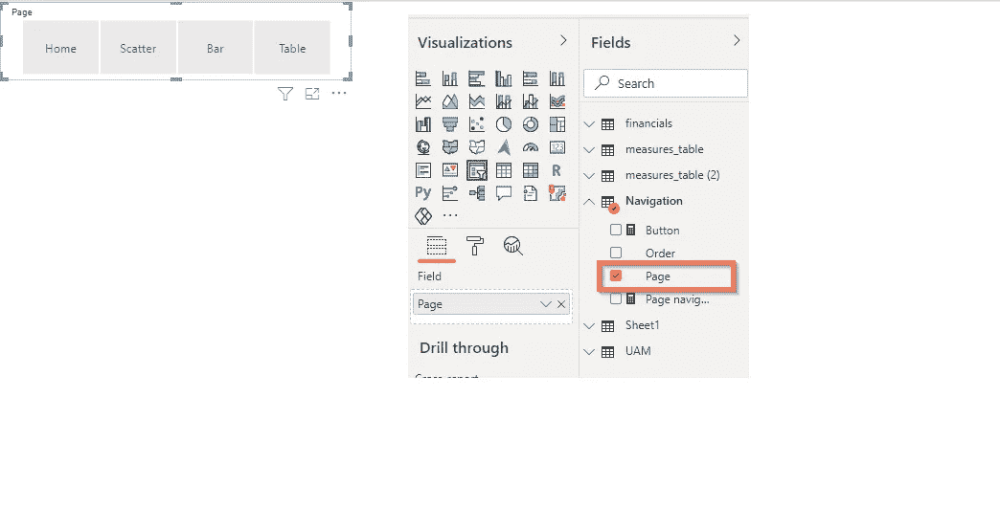

作者图片

-使方向水平

-使用单项选择

创建一个空按钮

作者图片

突出显示您创建的按钮转到属性下钻按钮文本，然后单击 fx:

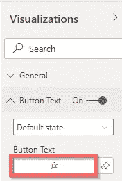

作者图片

现在选择按字段值格式化，并提供在上一步中创建的测量按钮:

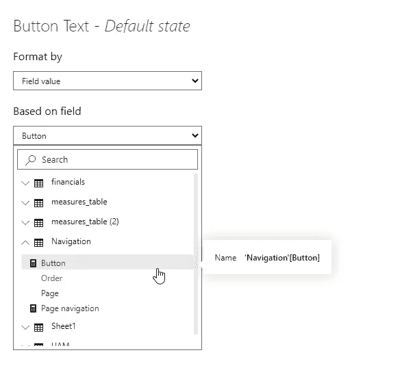

作者图片

一旦你把它放在仪表板上，它应该是这样的:

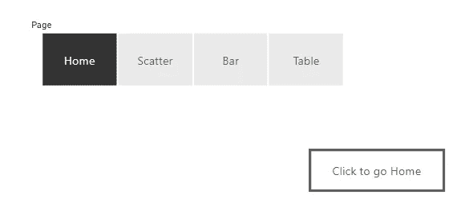

作者图片

由于测量按钮文本将根据切片器选择进行动态调整。

**3 设置 PowerBI 服务安全性。**

最后一步是在工作区中设置角色。首先，您需要在 PowerBI 服务中发布一个报告，然后转到报告数据集的安全设置。单击数据集旁边的 3 个点，然后选择安全:

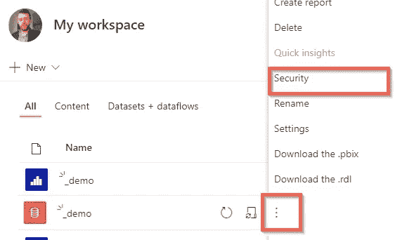

作者图片

在左侧，您将在桌面上定义角色，只需点击它，然后添加邮件或用户组来分配角色，您就可以开始了:

作者图片

这个解决方案可以很容易地用来创建真正有用的导航和用户访问管理系统的基础上的报告标签。您可以将 slicer 放在每个报告页面的顶部，并将其用作菜单，这样，不同的用户将只能看到基于他们的角色或分配他们可以访问的页面。虽然我可以很容易地将这一点添加到[应该发生的 powerBI 改进列表](https://www.solution-tailor.com/post/3-simple-things-microsoft-could-do-to-improve-power-bi)中。

此外，它还可以与常规的行级安全性相结合，因此您实际上可以同时运行这两个级别，这是一个非常好的特性。

如果你设法用其他方式解决这个问题，我很想听听。

请继续关注最新的 PowerBI 技巧，订阅或关注我的 [Twitter](https://twitter.com/Solution_Tailor) 。

*原载于 2021 年 3 月 2 日 https://www.solution-tailor.com**[*。*](https://www.solution-tailor.com/post/powerbi-tab-level-security)*