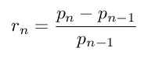
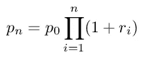
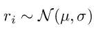
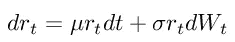
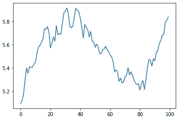
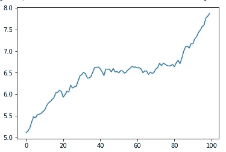

# 如何用不到 10 行 Python 代码模拟股票市场

> 原文：<https://towardsdatascience.com/how-to-simulate-a-stock-market-with-less-than-10-lines-of-python-code-5de9336114e5?source=collection_archive---------4----------------------->

## 让我们用几何布朗运动来模拟一个金融市场


马克西姆·霍普曼在 [Unsplash](https://unsplash.com?utm_source=medium&utm_medium=referral) 上的照片

对于那些对量化交易感兴趣的人来说，随机过程理论是美妙的，充满了理论机会。有时，为了测试交易策略，模拟股票市场可能是有用的。让我们看看理论是如何发挥作用的，以及如何使用 Python 将其转化为实践。

***来自《走向数据科学》编辑的提示:*** *虽然我们允许独立作者根据我们的* [*规则和指导方针*](/questions-96667b06af5) *发表文章，但我们并不认可每个作者的贡献。你不应该在没有寻求专业建议的情况下依赖一个作者的作品。详见我们的* [*读者术语*](/readers-terms-b5d780a700a4) *。*

# 市场回报

除了价格，当涉及到股票市场建模时，我们可以建模的最重要的对象是回报。如果我们考虑特定的一天 *n* 和它的前一天 *n-1* 收益计算如下:



从这个定义出发，我们可以使用以下公式计算价格时间序列:



因此，知道了起始价格 *p0* ，我们就可以使用收益序列来计算未来价格。

问题是回报是随机对象，所以每次实现回报都会给我们不同的价格时间序列。价格的随机行为就是这样建模的。

所以，如果我们想模拟价格时间序列，我们需要对收益做一些假设，然后应用上面的公式。几何布朗运动就是这些假设之一。

# 什么是几何布朗运动？

GBM 是股票市场的一个特殊模型，其收益是不相关的，并且是正态分布的。

我们可以从数学上把这句话翻译成:



也就是说，回报率正态分布，均值为μ，标准差为σ。请记住，这些参数与时间无关，因此该过程称为“稳态”。

μ是回报的平均值。如果它是积极的，我们有一个看涨的趋势。如果是负面的，我们有一个看跌的趋势。该参数的绝对值越高，趋势越强。

σ是收益的波动性。与μ相比，该值越高，价格越不稳定。

回到投资组合理论，无风险收益等于 0 的夏普比率是μ/σ。

对于像我一样热爱统计背后的数学的人来说，如果我们切换到连续时间，我们可以写出这个随机微分方程(SDE):



其中 *W* 是维纳过程。

这个模型经常在金融数学中使用，因为它是你能建立的最简单的股票市场模型。例如，它是诺贝尔奖获得者布莱克-肖尔斯期权理论的理论基础。然而，这个模型被证明并不完全正确，因为股票市场回报[不是正态分布的，也不是平稳的](/statistical-analysis-of-a-stock-price-e6d6f84ac2cd)，但这是一个很好的起点。

在伊藤的解释下，SDE 可以解析地解决，但在现实中，我们从来没有连续的时间，因为交易是离散的和有限的。因此，如果我们想模拟 GBM，我们可以简单地离散时间，保持回报的正态性。这在数学上等同于使用[欧拉-丸山方法](https://en.wikipedia.org/wiki/Euler%E2%80%93Maruyama_method)数值求解 SDE。

这个想法非常简单:生成 n 个正态分布的随机变量，并从起始价格开始计算未来价格。

让我们看看如何用不到 10 行代码在 Python 中实现它。

# Python 模拟

首先，让我们导入一些有用的库:

```
import numpy as np
import matplotlib.pyplot as plt
```

现在，我们必须定义μ，σ和起始价格。例如，我们可以使用这些值:

```
mu = 0.001
sigma = 0.01
start_price = 5
```

现在是模拟部分。首先，我们需要设置 *numpy* 随机数发生器的种子，以便产生可重复的结果。然后，我们为回报生成 100 个值，最后我们从起始价格开始构建价格时间序列。

```
np.random.seed(0)
returns = np.random.normal(loc=mu, scale=sigma, size=100)
price = start_price*(1+returns).cumprod()
```

最后，我们可以绘制这些结果:

```
plt.plot(price)
```



股票市场的模拟。作者图片

就是这样。总共 9 行。它看起来真的像一个股票价格，不是吗？

例如，我们可以增加μ的值，看看会发生什么。

例如，μ=0.004 时，我们有:



作者图片

正如我们所见，μ值越高，我们的看涨趋势越强。

# 结论

使用几何布朗运动在 Python 中模拟股票市场非常简单，但是当我们做这个练习时，我们需要记住股票市场并不总是正态分布的，也不是平稳的。例如，我们可以对μ和σ应用时间相关性，或者对回报使用不同的概率分布。

*Gianluca Malato 是意大利数据科学家和小说作家。他是数据科学、机器学习和数据分析在线学校*[*YourDataTeacher.com*](https://www.yourdatateacher.com/)*的创始人。*