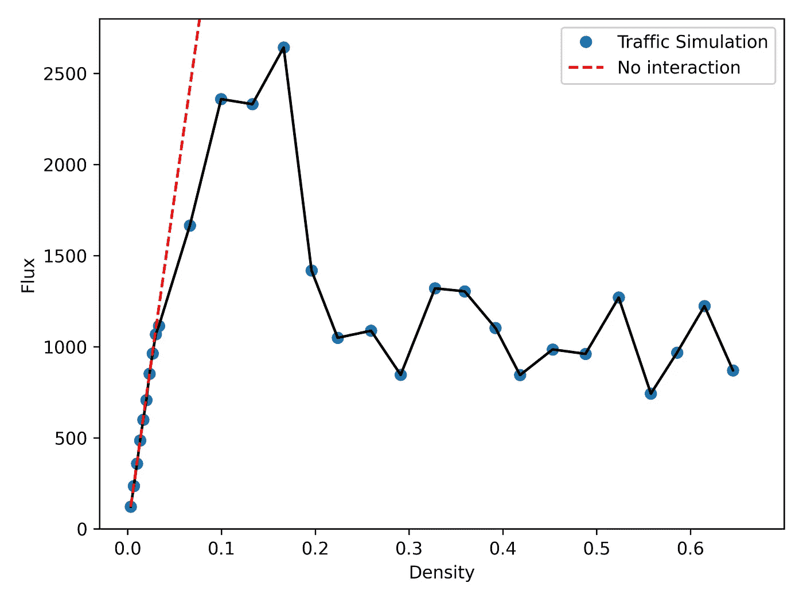

# 如何使用相扑模拟城市网络上的交通

> 原文：<https://towardsdatascience.com/how-to-simulate-traffic-on-urban-networks-using-sumo-a2ef172e564?source=collection_archive---------5----------------------->

## [思想和理论](https://towardsdatascience.com/tagged/thoughts-and-theory)

## 使用 SUMO 和 python 在复杂城市网络中进行高级交通模拟的教程


城市中的汽车|图片来自 [Pixabay](https://pixabay.com/?utm_source=link-attribution&amp;utm_medium=referral&amp;utm_campaign=image&amp;utm_content=1837176) 的 [Pexels](https://pixabay.com/users/pexels-2286921/?utm_source=link-attribution&amp;utm_medium=referral&amp;utm_campaign=image&amp;utm_content=1837176)

了解、预测并最终减少城市网络中的交通拥堵是一个复杂的问题。即使在最简单的情况下——单车道，理解交通拥堵的出现也具有挑战性。城市交通模拟(SUMO)平台是一个开源平台，可以模拟复杂环境中的交通流量。但是，除了相扑文档、一些堆栈溢出帖子和一些 YouTube 视频，我没有遇到多少教程教你如何从头到尾创建一个复杂的交通模拟。本文将使用网格网络流量的案例研究来做这件事情。这篇文章的结构如下:

1.  *为什么要研究城市网络中的交通？*
2.  *相扑入门*
3.  *模拟网格网络中的流量*
4.  *关键交通绩效指标分析*
5.  *模拟现实交通的未来方向*

# 为什么要研究城市网络中的交通？

在之前的一篇文章中，我讨论了第一篇论文，该论文决定性地展示了交通“幻影”冲击波是如何从无到有产生的，除了驾驶员的互动。


圆圈中的汽车| Tadaki 等人 2013 年新物理学杂志第 15 期 103034 页

[最近的研究](https://arxiv.org/pdf/1705.01693.pdf)表明，自动驾驶汽车之间的流线型交互可能会减少人工场景中的交通堵塞，如车辆在环形道路上行驶。但是当你有多条道路时，比如典型的城市道路网，会发生什么呢？有趣的是，在道路网络中，仅仅通过更多车道或更长的道路来增加容量可能不会像你想的那样有效。在另一篇文章中，我展示了“布拉斯悖论”如何导致不寻常的结果，即增加城市网络中的道路数量，可能会使交通更糟糕！

在从事密集的基础设施项目如修建新的道路，增加车道，交通灯等之前。—对交通流量进行现实的模拟很重要，这样提议的项目才有最大的机会成功缓解交通。当整合诸如音乐会、体育赛事等重大事件时，情况变得更加复杂。或者像机场和医院这样的公共建筑。在不久的将来，重要的是模拟拟议的联网车辆和智能交通技术创新的效果，以最好地实现其在简化交通流方面的潜力。

# 相扑入门

交通模拟似乎属于交通流量研究人员或工程承包公司的小众群体。例如， [Anylogic](https://www.anylogic.com/road-traffic/) 、 [VISSIM](https://www.ptvgroup.com/en/solutions/products/ptv-vissim/) 和 [Aimsun](https://www.aimsun.com/) 都是提供交通和移动建模解决方案的公司。然而，相扑是开放的，很容易上手。

安装 SUMO 有多种方式，但我更喜欢 pip 安装方式，它安装 SUMO 和 python 库来与 SUMO 接口。

```
python -m pip install sumo
```

就是这样！现在让我们开始创建您的第一个网络交通流量模拟！

# 模拟网格网络中的流量

在城市规划中，网格状道路网络相当常见。在相扑比赛中，我们设置了一个 5x5 的网格，每条道路长 200 米，有 3 条车道，如下所示:

```
netgenerate — grid — grid.number=5 -L=3 — grid.length=200 — output-file=grid.net.xml
```

接下来，我们使用位于 SUMO 主目录下的 tools 文件夹中的 random trips . py(**SUMO->tools**)，为一定数量的车辆(在下面的示例中为 200 辆车)生成随机行程。开始和结束时间表示车辆进入模拟的时间。我选择了 0 & 1，这意味着所有车辆在模拟的前 1 秒进入模拟。周期表示车辆的到达率。

```
randomTrips.py -n grid.net.xml -o flows.xml — begin 0 — end 1 — period 1 — flows 200
```

接下来，我们使用 SUMO 的 jtrrouter 生成单个车辆在时间 0 到 10000 之间的路线。

```
jtrrouter — flow-files=flows.xml — net-file=grid.net.xml — output-file=grid.rou.xml — begin 0 — end 10000 — accept-all-destinations
```

最后，为了简单起见，我们希望保持一个恒定的密度。最明显的方法是让车辆随机行驶，而不是退出模拟。为此，我们使用[曼哈顿交通模型](https://en.wikipedia.org/wiki/Manhattan_mobility_model)，其中遇到十字路口的车辆根据设定的概率选择直行、左转或右转。默认情况下，在相扑中，车辆一旦到达目的地就退出模拟。然而， [SUMO 使用连续重路由 python 脚本实现了](https://sumo.dlr.de/docs/Tutorials/Manhattan.html)Manhattan 模型。

```
generateContinuousRerouters.py -n grid.net.xml — end 10000 -o rerouter.add.xml
```

接下来，我们创建一个 sumo 配置文件，以便在 SUMO 中运行模拟，SUMO 基本上是一个具有某些属性的. xml 文件，包含网络文件、路线文件和附加的重新路由文件的名称，以便车辆在模拟完成之前留在模拟中。我们定义了一个输出文件，用于存储交通模拟过程中的详细车辆信息。

```
<configuration>
  <input>
    <net-file value=”grid.net.xml”/>
    <route-files value=”grid.rou.xml”/>
    <additional-files value=”rerouter.add.xml”/>
  </input>
  <time>
    <begin value=”0"/>
    <end value=”10000"/>
  </time>
   <output>
     <fcd-output value=”grid.output.xml”/>
   </output></configuration>
```

最后，我们在终端中运行模拟，如下所示。周期表示保存数据的时间间隔——100 表示每 100 个时间步长保存一次车辆信息，即速度和位置。

```
sumo-gui -c grid.sumocfg — device.fcd.period 100
```

运行这个程序会弹出 SUMO GUI，在这里您可以看到整个模拟过程！


相扑网格模拟|塞犍陀·维维克

车辆颜色从最慢(红色)到最快(绿色)显示它们的速度。

## 对于一次模拟来说很容易…但是多次运行呢？

手动更改每个参数和输出文件是相当烦人的。如果您有 100 多次运行来探索交通如何随着不同参数(如车辆数量)而变化，以及多次运行来进行统计平均，那么这一数字就会增加。

为此，我在命令提示符下使用操作系统模块将 SUMO 与 python 连接起来:

# 分析

SUMO xml 输出包含每个时间步长的单个车辆时间、位置和速度的信息。我想分析速度如何依赖于密度，或模拟中的车辆数量——基本上获得每个时间步长的速度，在模拟中对所有车辆进行平均。

最后，我绘制了速度与密度的关系图，其中每个模拟运行都有一个单独的密度。


网格交通相扑模拟的速度与密度|塞犍陀·维维克

正如你所看到的，随着密度的增加，速度下降。这是因为模拟中的车辆越多，拥堵越多，导致行驶速度越低。这是我们所有人在高速公路上都见过的，尤其是在高峰时间。

交通模拟中另一个常用的参数是流量。正如我在[上一篇文章](/traffic-jam-science-and-visualization-54f79ed006f1)中所讨论的，流量衡量的是单位时间内通过给定点的车辆数量，也是衡量车辆吞吐量的一个指标。通量由下式给出:


交通流量|塞犍陀·维维克

其中总和是长度 L 内的所有车速，车道数=n_l。

在低密度下，每辆车基本上都以极限速度行驶，因此通量随着密度线性增加(下图中的**红线**)。然而，在更高的密度下，车辆不能以限速行驶，在某一点上，每辆车以更低的速度行驶抵消了大量车辆的影响，导致流量减少。高于一个特征密度(在这个模拟中为**~ 0.1–0.2**)，交通堵塞出现，交通流量随密度衰减。



网格交通相扑模拟的流量与密度|塞犍陀·维韦克

# 模拟真实交通

我已经展示了如何使用 SUMO+Python 在典型的网格网络中建立基本的流量模拟和集合运行。然而，这绝不是对城市网络的全面模拟。在最近的一项利用 OpenStreetMap 城市街道网络数据和 OSMnx 的研究中，发现一些城市有突出的网格状网络，而其他一些城市没有。SUMO 包括模拟城市街道网络交通的能力，通过[将 OpenStreetMap 数据转换成 SUMO。net](https://sumo.dlr.de/docs/Networks/Import/OpenStreetMap.html) 文件。

但是除了在现实城市网络上的模拟之外，还有校准这些交通模拟以匹配日常交通模式的问题。为了匹配日常生活中看到的详细交通模式，需要考虑进入道路的人的潮涨潮落——他们从哪里进入，何时进入，何时/从哪里离开。这成为一个极其复杂的问题，因为不可能知道每一个车辆轨迹。如今，许多车辆将 GPS 数据传输给 INRIX 和 HERE technologies 等公司。像谷歌和苹果这样的公司利用手机数据来获取稀疏的位置和速度信息。然而，这只能提供整个人口中一小部分样本的信息。交通流量是一个高度非线性的问题；这意味着微小的变化会产生极端的后果。

同时，您希望您的流量模拟结果对初始条件具有鲁棒性。结果应该清楚地表明一个提议的项目是否对交通流量有显著的改善——在广泛的情况下。这是一个挑战，有详细的大规模交通模拟，运行在一个可行的时间量，并且是现实的。

在相扑网页上，只有少数几个[这样真实的场景](https://sumo.dlr.de/docs/Data/Scenarios.html)。这一页的顶部写着:

> 构建一个场景需要大量的工作。如果你已经建立了一个可以分享的相扑场景(在充分开放的许可下)，请[联系我们](https://sumo.dlr.de/docs/Contact.html)。

希望[交通流动性数据](/visualizing-real-time-traffic-patterns-using-here-traffic-api-5f61528d563)的民主化、计算资源可用性的增加以及开源交通建模平台将使这些大规模模拟更容易实现。《城市交通》是一个非常复杂的游戏，它提供了对有呼吸、有生命的城市的洞察。

这个项目的代码可以在 GitHub 上找到:

<https://github.com/skandavivek/sumo-traffic-grids>  

参考资料:

1.  *R. E. Stern 等人，“通过自动驾驶车辆控制消散停停走走波:现场实验”，arXiv (2017)。*
2.  *G. Boeing，“城市空间秩序:街道网络定向、配置和熵”，《应用网络科学》(2019)。*
3.  *P. L. Alvarez 等，“使用相扑进行微观交通模拟”，智能交通系统国际会议。IEEE (2018)。*

如果你喜欢这篇文章，请关注我。

如果你对技术和现代社会之间的相互联系有全面的看法，请订阅我的时事通讯。

<https://skandavivek.substack.com/> 