# 如何用 Excalidraw 勾画您的数据科学想法

> 原文：<https://towardsdatascience.com/how-to-sketch-your-data-science-ideas-with-excalidraw-a993d049f55c?source=collection_archive---------7----------------------->

## 停止用语言来描述你的想法。用图纸代替。

# 动机

如果你想让你的经理或同事理解你对一个项目的想法，不要只给他们看文字或一大块代码。使用图形或图表。

假设您想向您的经理解释训练猫分类器的过程，通过向他们展示下图，他们会更容易理解这个过程的流程。

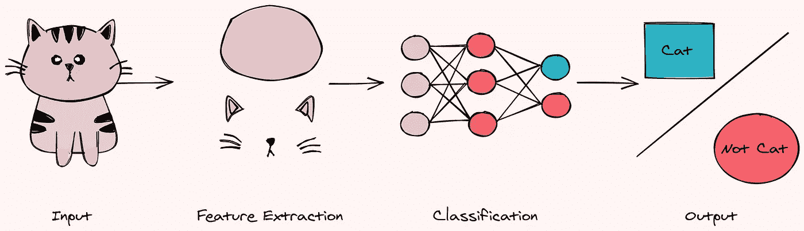

作者图片

在着手一个项目之前，画画也是勾勒出你想做什么的好方法。

有很多绘制图表的工具，但我最喜欢的是 Excalidraw。在本文中，我将向您展示什么是 Excalidraw，以及为什么它是绘制图表的最佳工具之一。

# 什么是 Excalidraw？

[Excalidraw](https://excalidraw.com/) 是一个虚拟白板，用于绘制手绘状的图表。这款虚拟白板有一些不错的功能:

## 手绘草图

Excalidraw 允许你无缝地创建一个漂亮的手绘图表，如下图所示。

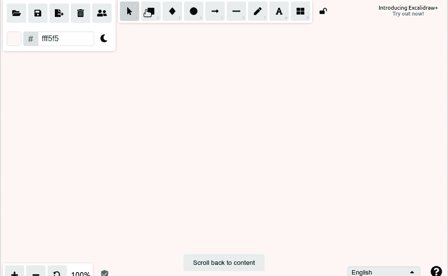

作者 GIF

对于每个形状，您可以调整:

*   颜色
*   充满
*   笔画宽度
*   笔画样式
*   马虎
*   优势
*   不透明

下面的 GIF 显示了形状是如何随着每个选项的改变而改变的。

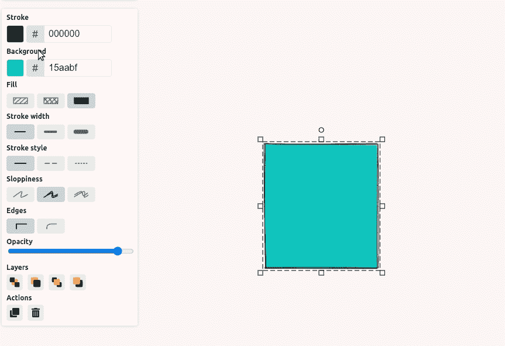

作者 GIF

## 形状移动时，箭头也会移动

如果箭头指向某个形状，而该形状被移动，箭头将自动调整自身，使其仍然指向该形状。这个功能非常有用，因为它节省了你调整形状和箭头的时间。

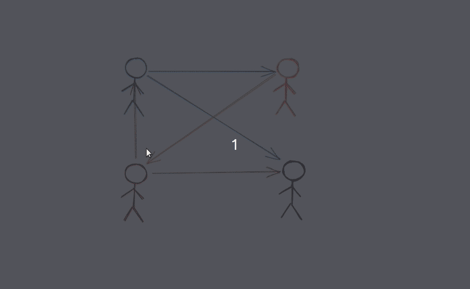

作者 GIF

## 弯曲的箭头和线条

您可以通过拖动来创建直线。但是，如果你想创建一条曲线或箭头，选择一条线或一个箭头，然后点击多个位置，如下所示。

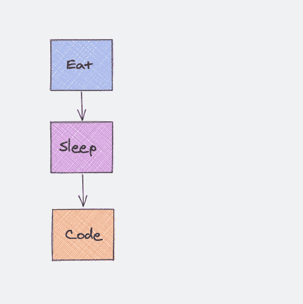

作者 GIF

单击该线两次以调整创建该线的点。

## 从 Excel 创建图表

Excalidraw 还允许您通过复制和粘贴 Excel 中的数据或纯逗号分隔的文本来创建图表！例如，如果您复制下面的表格并将其粘贴到 Excalidraw 上，

…您将自动获得如下两张图！

作者图片

## 移动和对齐多个对象

按住 Shift 键的同时单击多个对象，可以一起移动多个对象。

你也可以让所有的物体像下面这样整齐的排列成一条直线！若要对齐多个对象，请选择多个对象，然后在左侧边栏中选择要对齐的选项。

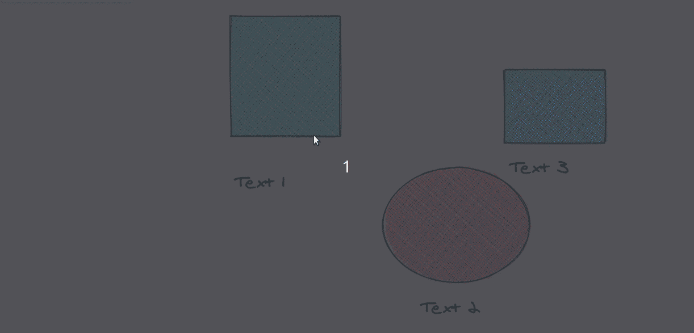

作者 GIF

## 层

您也可以通过在“层”部分选择相应的选项来调整哪个对象应该位于另一个对象的前面或后面。

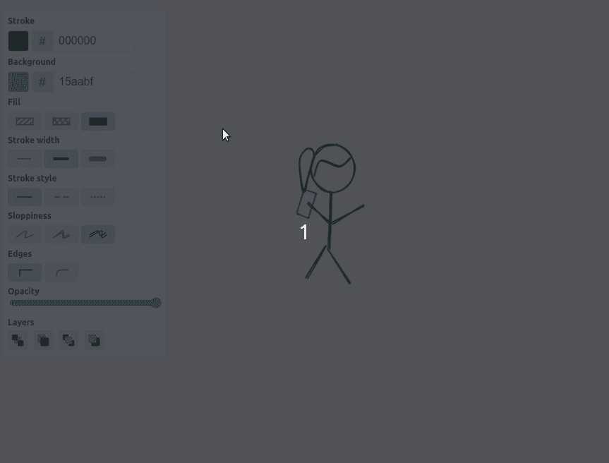

作者 GIF

## 实时协作

想和队友实时协作怎么办？Excalidraw 为您提供了保护。在下面的 GIF 中，无论一个人做了什么改变，另一个人几乎会立即看到。

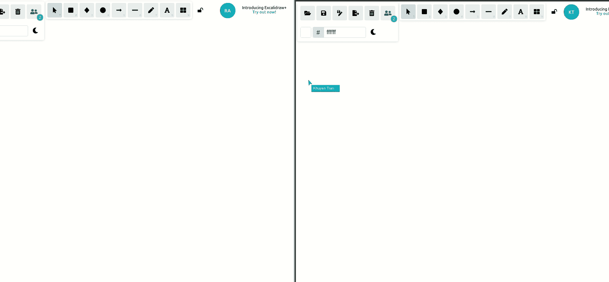

作者 GIF

要启用实时协作，请单击左上角的两个人图标。

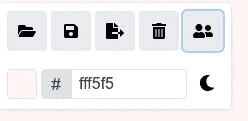

作者图片

## 形状库

如果你想创建一个更复杂的形状，Excalidraw 的库提供了多种形状供你选择。

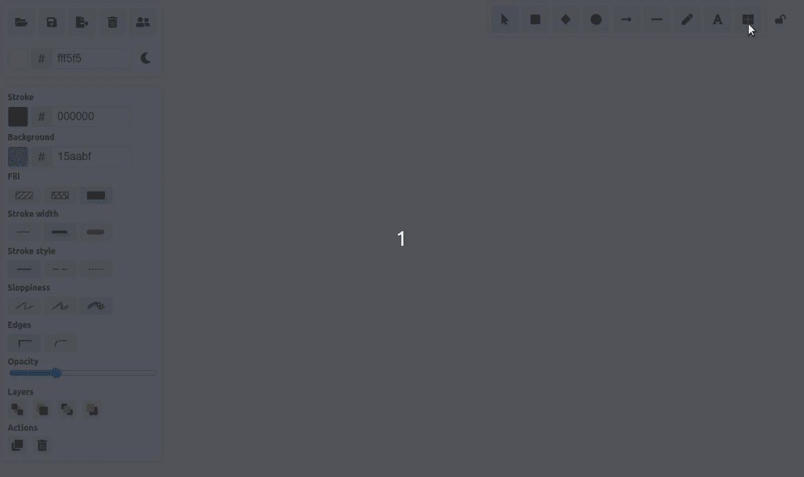

作者 GIF

要从库中选择新形状，请单击顶部工具栏上的方形图标，然后选择要添加的图标。点击浏览库，从 [Excalidraw 库](https://libraries.excalidraw.com/?sort=default)下载更多形状。

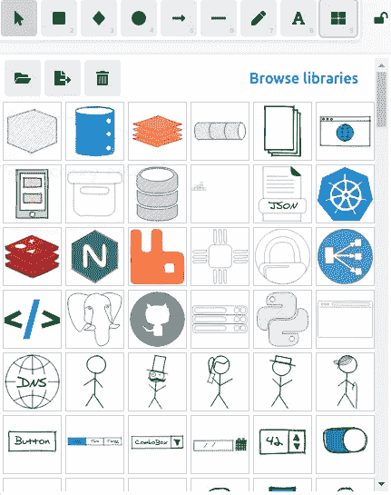

作者图片

## 保存形状

您也可以将形状保存到您的个人库中以供将来使用。要保存形状，请单击该形状，然后单击方形图标。

滚动到列表底部，单击新形状，将其添加到库中。

作者 GIF

现在，你可以随时从你的个人库中调出你的新图形。

# 结论

恭喜你！您刚刚学习了如何使用 Excalidraw 勾画您的数据科学想法。通过绘制图表，你的想法更有可能被你的经理和同事理解和接受。

在实际实现代码之前勾画出你的想法也会让你更清楚应该用什么方法来解决你的问题。

我喜欢写一些基本的数据科学概念，并尝试不同的算法和数据科学工具。你可以通过 [LinkedIn](https://www.linkedin.com/in/khuyen-tran-1401/) 和 [Twitter](https://twitter.com/KhuyenTran16) 与我联系。

如果你想查看我写的所有文章的代码，请点击这里。在 Medium 上关注我，了解我的最新数据科学文章，例如:

 [## 如何使用 Altair 创建多个图之间的绑定和条件

### 使用绘图绑定从不同角度理解数据

towardsdatascience.com](/how-to-create-bindings-and-conditions-between-multiple-plots-using-altair-4e4fe907de37)  [## 如何使用 Python 创建类似 3Blue1Brown 的数学动画

### 利用您的 Python 技能创建美丽的数学动画

towardsdatascience.com](/how-to-create-mathematical-animations-like-3blue1brown-using-python-f571fb9da3d1)  [## Yellowbrick 简介:可视化机器学习预测的 Python 库…

### 您将 f1 分数提高到了 98%！但这是否意味着你的模型表现更好呢？

towardsdatascience.com](/introduction-to-yellowbrick-a-python-library-to-explain-the-prediction-of-your-machine-learning-d63ecee10ecc)  [## 人类学习:通过绘图创建人类学习模型

### 使用您的领域知识来标记您的数据

towardsdatascience.com](/human-learn-create-rules-by-drawing-on-the-dataset-bcbca229f00)