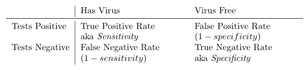
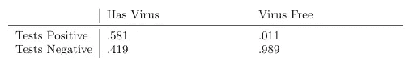
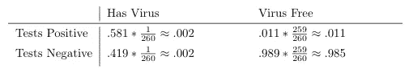
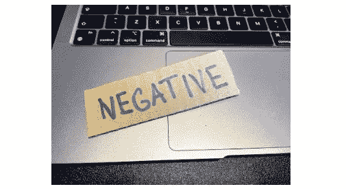
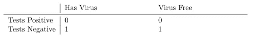
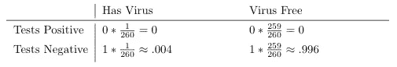
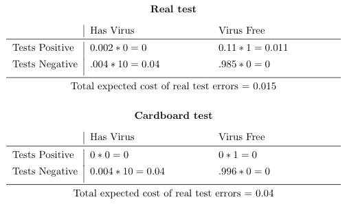

# 如何用锋利的笔大幅削减新冠肺炎测试的误差:为什么准确度不仅仅是一个百分比值

> 原文：<https://towardsdatascience.com/how-to-slash-the-error-of-covid-19-tests-with-a-sharpie-d465c08e818c?source=collection_archive---------20----------------------->

## 为什么准确性不仅仅是一个百分比值

在本文中，我将探索数据科学中的一个基本概念——准确性，并展示对这一基本概念缺乏理解是如何导致一些非常错误的结论的。具体来说，我们将研究横向流动新冠肺炎测试的准确性，并发现它比任何人在家里用记号笔和一块纸板进行的测试的准确性都低。我们将会看到，以百分比值表示的准确度并不是评估这类测试的有用度量。结论不仅限于医学测试，因为从概念的角度来看，测试只是简单的分类器。就像数据科学模型一样，它们基于有限的信息(样本)来预测类别(病毒的存在)。

# 横向流动测试的准确性

首先，我们需要找到新冠肺炎横向流动测试的准确性。答案可以在一篇科学论文“用于诊断新型冠状病毒感染的快速、护理点抗原和分子检测(综述)”中找到——一篇 400 页的综述，涉及 58 项评估新冠肺炎检测准确性的单独研究。为了简单起见，我们将重点关注没有症状的个体。答案在第 6 页，并不像你想象的那么简单。

科学论文实际上并不直接提供准确性，而是提供灵敏度和特异性——这两个值在图 1 中被拆开，论文中的值在图 2 中被填充。敏感度只是真实阳性率的一个不同术语，即有多少病毒携带者将获得阳性检测结果。同样，特异性只是真实阴性率的一个不同术语，即有多少未携带病毒的人将获得阴性检测结果。使用敏感性和特异性，我们可以构建一个混淆矩阵，描述正确分类为新冠肺炎患者/非患者的可能性:

图 1:混淆矩阵是特定测试结果正确或错误频率的表示。

图 2:横向流动测试混淆矩阵。所提供的数值来源于对 58 例无症状个体抗原检测准确性评估的系统综述[2]。

既然我们知道什么是假阳性和假阴性率，我们可以计算准确性。为了估计准确性，我们需要考虑实际上有多少人感染了病毒。如果不考虑病毒的流行程度，混淆矩阵中的数字并不能真正代表我们在现实世界中进行测试时会发生什么。根据国家统计局[1]的数据，目前这一比例为 1/260。

图 3:使用 ONS 信息的横向流动测试预期混淆矩阵此时每 260 人中有 1 人患有冠状病毒[1]。这代表了来自英国人群的不同检测结果的概率，与图 2 相反，图 2 不知道该病毒在英国人群中的流行情况。

准确性是获得正确结果的概率，不管结果是正还是负。使用图 3 中的预期混淆概率，我们得出 98.7%，这看起来确实令人印象深刻！然而，我决定把这个数字推得更高，并开发了我自己的精确度更高的新冠肺炎测试。我将把我的新测试方法称为纸板测试。

# 纸板测试的准确性

我开发的新冠肺炎测试，如图 4 所示，由一张用记号笔写着“否定”的纸板组成。这种测试的优势是巨大的——制造成本非常低，可重复使用，结果立即可用。

图 4:我们将使用自制纸板测试来对比横向流动测试的准确性。作者图片

虽然这看起来很荒谬，但请和我一起计算这个测试的准确性。让我们从混淆矩阵开始:

图 5:纸板测试混淆矩阵。不出所料，测试结果总是“阴性”。

以下是混淆预期矩阵，说明目前英国只有 1/260 的人患有新冠肺炎。

图 6:预期混淆矩阵提供了纸板测试在英国人群中不同类型错误的概率。

由于准确性是获得正确结果的概率，无论是肯定的还是否定的，使用图 6 中的预期混淆概率，我们得到 99.6%的准确性。与横向流动测试的 98.7%的准确度相比，这是一个显著的改进。

该值意味着纸板试验产生的误差量，当目前在英国用于无症状个体时，将比目前提供的横向流动试验产生的误差量低 5 倍。这听起来可能很奇怪，但这是对准确性的天真解释的简单结果，公共卫生当局幸运地知道不要只看准确性，因此不会尝试将测试切换到我的纸板测试，无论这可能会节省成本。不使用纸板测试的原因是不同类型的错误对公众健康有不同的影响。

接受假阳性检测结果是一件令人讨厌的事情，会不必要地把某人推向孤立。假阴性意味着新冠肺炎病毒携带者会四处传播，危及生命，增加医疗服务的压力。显然，这两种结果有着完全不同的影响，不应被视为等同。这就是为什么好的决策者会考虑他们决策的预期成本，而不仅仅是测试或预测的准确性。成本是一个技术术语，指决策失误的负面影响。硬币的另一面被称为预期效用，通常用于商业环境中，以评估您的决策预期带来的好处，在这种情况下，您需要考虑真正的正利率和负利率。

一旦你获得了预期混淆矩阵，并能够将成本与不同类型的错误联系起来，就很容易计算出预期成本。量化错误的成本并不总是容易的，这就是其中的一个例子。然而，为了这个练习的目的，我们将简单地给一个假阳性结果分配一个任意单位的成本。我们将假设假阴性的成本是假阳性的 10 倍，而正确的结果(真阳性或真阴性)没有相关成本。将混淆预期矩阵中的适当单元相乘得到以下结果:

图 7:预期成本矩阵显示了两个测试中不同类型错误的预期成本。这些值的总和是使用特定测试产生的错误的总预期成本。

图 7 清楚地显示了使用真实测试和纸板测试的预期影响是完全不同的，纸板测试的误差导致的成本是真实结果的两倍多。这导致了一个合理的结论，真实测试是一个比我自己开发的纸板测试更好的解决疫情的工具，尽管它的准确性更高。

本文展示了对于评估测试、模型或任何其他影响现实世界的分类工具来说，百分比准确性如何不是一个有用的度量。为了正确评估分类工具，有必要考虑敏感性和特异性，构建混淆矩阵、预期混淆和基于分类做出决策的预期成本。这似乎是一个很大的要求，但如果不这样做，我们可能最终会使用一张纸板，而不是真正的新冠肺炎测试来解决疫情。

# 参考

[1]冠状病毒(新冠肺炎)感染调查，英国:2021 年 7 月 2 日。https://www . ons . gov . UK/peo-plepopulationandcommunity/healthandssocial care/conditions and diseases/bulletins/Coronavirus-covid 19 infections Survey pilot/latest。

[2] Jacqueline Dinnes，Jonathan J Deeks，Sarah Berhane，Melissa Taylor，Ada Adriano，Clare Davenport，Sabine Dittrich，Devy Emperador，Yemisi Takwoingi，Jane Cunningham 等.用于诊断 sars-cov-2 感染的快速、护理点抗原和分子检测。Cochrane 系统综述数据库，(3)，2021。