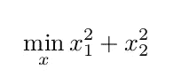

# 如何解决 R 中的一个约束优化问题

> 原文：<https://towardsdatascience.com/how-to-solve-a-constraint-optimization-problem-in-r-fdf5abee197b?source=collection_archive---------0----------------------->

## [实践教程](https://towardsdatascience.com/tagged/hands-on-tutorials)

## 使用`nloptr`在 R 中进行非线性约束优化


图片由作者使用函数 f = (Z⁴-1)绘制，其中 z 是一个复数

# 介绍

通常在物理科学研究中，我们最终会遇到一个困难的问题，即优化一个需要满足一系列约束(线性或非线性等式和不等式)的函数(称为目标)。优化器通常也必须遵守上限和下限。我最近在量子信息科学(QIS)中研究了一个类似的问题，我试图根据物理和数学规则规定的一些约束来优化一个非线性函数。感兴趣的读者可能会发现我在[星座优化方面的工作，即利用位移接收器实现相移键控相干态的互信息最大化](https://ieeexplore.ieee.org/stamp/stamp.jsp?tp=&arnumber=9291373)，其中我基于一组约束优化了四相移键控(QPSK)的互信息。

[](https://ieeexplore.ieee.org/document/9291373) [## 相移键控相干态的星座优化

### 量子信息理论中的一个重要问题是寻找光通信的最佳容量

ieeexplore.ieee.org](https://ieeexplore.ieee.org/document/9291373) 

在研究带有一组约束的非线性优化问题时，我发现并不是所有的优化例程都是一样的。有几个不同语言的库可用，如 **python (scipy.optimize)** 、 **Matlab (fmincon)** 、 **C++ (robotim，nlopt)** 和 **R (nloptr)。**虽然我列出的优化例程并不详尽，但其中一些比其他例程更可靠，一些比其他例程执行更快，一些具有更好的文档。基于几个关键因素，我发现用 R 语言实现的 **nloptr，**最适合非线性优化。 **nloptr** 使用 C++实现的 **nlopt** 作为后端。因此，它提供了 R 语言的优雅和 C++的速度。甚至在 10e-15 数量级的公差下，优化过程也能在几分之一秒内快速执行。

# 非线性优化问题

一般的非线性优化问题通常具有以下形式


其中 *f* 是目标函数， *g* 定义一组不等式约束， *h* 是一组等式约束。 *xL* 和*徐*分别为下限和上限。在文献中，已经提出了几种优化算法。比如 MMA(移动渐近线法)支持任意非线性不等式约束，(COBYLA)线性逼近约束优化，(ORIG_DRIECT)直接算法。也支持非线性等式约束的优化算法包括 ISRES(改进的随机排序进化 Strategy)⁴，(AUGLAG)增强的拉格朗日 Algorithm⁵.这些方法的完整列表可以在[https://nlopt.readthedocs.io/en/latest/NLopt_Reference/](https://nlopt.readthedocs.io/en/latest/NLopt_Reference/)的 **nlopt C++参考页面**中找到。nloptr 使用这些方法之一来解决给定的优化问题。

> “MMA(移动渐近线法)支持任意非线性不等式约束，(COBYLA)约束优化采用线性逼近，(ORIG_DRIECT)直接算法。同样支持非线性等式约束的优化算法包括 ISRES(改进的随机排序进化策略)，(AUGLAG)增广拉格朗日算法。”

在本文的其余部分，我提供了几个使用 R 解决约束优化问题的例子。R Studio 还提供了 knitr 工具，它非常适合用内嵌代码编写文档或文章，还可以生成 latex 源代码和 pdf 文件。这里展示的大多数例子都是从用于验证`nloptr` R 包中的函数的测试套件修改而来的。

# 库的安装和加载

在 R 中安装`nloptr`相当简单。

```
install.packages(“nloptr”)
library(‘nloptr’)
```

# 示例 1:使用显式梯度进行优化

在第一个例子中，我们将最小化 Rosenbrock Banana 函数


其梯度由下式给出


然而，并不是所有的`nlopt`算法都需要显式梯度，我们将在后面的例子中看到。让我们先定义目标函数及其梯度:

```
eval_f <- function(x)
{
    return ( 100 * (x[2] - x[1] * x[1])^2 + (1 - x[1])^2 )
}eval_grad_f <- function(x) {
return( c( -400 * x[1] * (x[2] - x[1] * x[1]) - 2 * (1 - x[1]),
200 * (x[2] - x[1] * x[1]) ) )
}
```

我们还需要优化器的初始值:

```
x0 <- c( -1.2, 1 )
```

在运行最小化过程之前，我们需要指定我们将使用的算法。这可以通过以下方式实现:

```
opts <- list("algorithm"="NLOPT_LD_LBFGS",
"xtol_rel"=1.0e-8)
```

这里，我们将使用 L-BFGS 算法。现在我们准备运行优化程序。

```
# solve Rosenbrock Banana function
res <- nloptr( x0=x0,
eval_f=eval_f,
eval_grad_f=eval_grad_f,
opts=opts)
```

我们可以通过输入看到结果

```
print(res)
```

该函数在(1，1)处被优化，这是基本事实。通过在 R Studio 中运行代码来检查自己。

# 示例 2:无梯度的不等式约束最小化

要最小化的问题是


a1= 2，b1 = 0，a2 = 1，b2 = 1。我们重新排列约束，使其形式为 g(x) ≤ 0:


首先，定义目标函数

```
# objective function
eval_f0 <- function( x, a, b ){
return( sqrt(x[2]) )
}
```

和约束是

```
# constraint function
eval_g0 <- function( x, a, b ) {
return( (a*x[1] + b)^3 - x[2] )
}
```

定义参数

```
# define parameters
a <- c(2,-1)
b <- c(0, 1)
```

现在使用 NLOPT_LN_COBYLA 求解，无需梯度信息

```
# Solve using NLOPT_LN_COBYLA without gradient information
res1 <- nloptr( x0=c(1.234,5.678),
eval_f=eval_f0,
lb = c(-Inf,0),
ub = c(Inf,Inf),
eval_g_ineq = eval_g0,
opts = list("algorithm"="NLOPT_LN_COBYLA",
"xtol_rel"=1.0e-8),
a = a,
b = b )
print( res1 )
```

# 示例 3:没有梯度的等式和不等式约束的最小化

我们想解决下面的约束优化问题


受制于约束


对于本例，最优解在(1.00000000，4.74299963，3.82114998，1.37940829)处获得。

```
# Objective Function
eval_f <- function(x)
{
return (x[1]*x[4]*(x[1] +x[2] + x[3] ) + x[3] )
}# Inequality constraints
eval_g_ineq <- function(x)
{
return (25 - x[1]*x[2]*x[3]*x[4])
}# Equality constraints
eval_g_eq <- function(x)
{
return ( x[1]^2 + x[2]^2 + x[3]^2 + x[4]^2 - 40 )
}# Lower and upper bounds
lb <- c(1,1,1,1)
ub <- c(5,5,5,5)#initial values
x0 <- c(1,5,5,1) 
```

我们还需要定义优化选项

```
# Set optimization options.
local_opts <- list( "algorithm" = "NLOPT_LD_MMA", "xtol_rel" = 1.0e-15 )
opts <- list( "algorithm"= "NLOPT_GN_ISRES",
"xtol_rel"= 1.0e-15,
"maxeval"= 160000,
"local_opts" = local_opts,
"print_level" = 0 )
```

我们使用 NL_OPT_LD_MMA 进行局部优化，使用 NL_OPT_GN_ISRES 进行整体优化。您可以将容差设置得非常低，以获得最佳结果。使用 maxeval 设置迭代次数。将容差设置得非常低或将迭代次数设置得非常高，可能会以增加计算时间为代价获得最佳近似值。最后，我们优化

```
res <- nloptr ( x0 = x0,
                eval_f = eval_f,
                lb = lb,
                ub = ub,
                eval_g_ineq = eval_g_ineq,
                eval_g_eq = eval_g_eq,
                opts = opts
)
print(res)
```

在我的例子中，结果出来是(1 4.768461 3.78758 1.384204)，这是相当接近地面的真相。

# 示例 4:无梯度的多重不等式约束最小化

在这种情况下，我们的目标函数是



使遭受


变量的界限为


对于这个问题，最优解在(1，1)处达到。让我们现在写代码。

```
# Objective function
eval_f <- function(x)
{
return ( x[1]^2 + x[2]^2 )
}# Inequality constraints
eval_g_ineq <- function (x) {
constr <- c(1 - x[1] - x[2],
1 - x[1]^2 - x[2]^2,
9 - 9*x[1]^2 - x[2]^2,
x[2] - x[1]^2,
x[1] - x[2]^2)
return (constr)
}# Lower and upper bounds
lb <- c(-50, -50)
ub <- c(50, 50)# Initial values
x0 <- c(3, 1) 
```

最后，为 nloptr 定义如下选项:

```
opts <- list( "algorithm"
= "NLOPT_GN_ISRES",
"xtol_rel"
= 1.0e-15,
"maxeval"= 160000,
"tol_constraints_ineq" = rep( 1.0e-10, 5 ))
```

然后执行优化

```
res <- nloptr(
        x0          = x0,
        eval_f      = eval_f,
        lb          = lb,
        ub          = ub,
        eval_g_ineq = eval_g_ineq,
        opts        = opts )
print(res)
```

通过指定的公差和迭代次数，我能够获得(1，1)的最优解。

虽然我没有给出带有多个等式约束的例子，但是它们与例子 4 非常相似。但是，一定要选择 NLOPT_GN_ISRES 这样的优化算法。

# **参考文献**

1.  K.Svanberg，移动渐近线法——结构优化的新方法,《国际工程数值方法杂志》, 1987 年，24，359–373。
2.  鲍威尔·MJD(1994)优化和数值分析进展，Kluwer Academic，Dordrecht，一种通过线性插值模拟目标和约束函数的直接搜索优化方法，第 51–67 页。
3.  【https://people.cs.vt.edu/~ltw/lecture_notes/HPCS08tut.pdf 号
4.  刘永强，姚欣，“约束进化优化的随机排序”，中国电机工程学会会刊。进化计算，第 4 卷(第 3 号)，第 284-294 页(2000 年)。
5.  [https://www . HIM . uni-Bonn . de/file admin/HIM/section 6 _ HIM _ v1 . pdf](https://www.him.uni-bonn.de/fileadmin/him/Section6_HIM_v1.pdf)
6.  [https://people.kth.se/~krille/mmagcmma.pdf](https://people.kth.se/~krille/mmagcmma.pdf)
7.  [https://cran . r-project . org/web/packages/nloptr/vignettes/nloptr . pdf](https://cran.r-project.org/web/packages/nloptr/vignettes/nloptr.pdf)
8.  [http://faculty . cas . usf . edu/JK Wilde/math camp/Constrained _ optimization . pdf](http://faculty.cas.usf.edu/jkwilde/mathcamp/Constrained_Optimization.pdf)
9.  https://nlopt.readthedocs.io/en/latest/

如果这篇文章对你有益，请使用以下引用来引用我的工作:

```
Rahul Bhadani. [Nonlinear Optimization in R using nlopt](https://arxiv.org/abs/2101.02912). arXiv preprint arXiv:[2101.02912](https://arxiv.org/abs/2101.02912), 2021.
```

或者

```
[@article](http://twitter.com/article){bhadani2021nonlinear,
    title={Nonlinear Optimization in R using nlopt},
    author={Rahul Bhadani},
    year={2021},
    eprint={2101.02912},
    archivePrefix={arXiv},
    primaryClass={math.OC},
  journal={arXiv preprint arXiv:2101.02912},
}
```