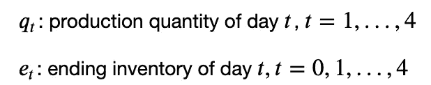

# 如何用 Python 解决生产计划和库存问题

> 原文：<https://towardsdatascience.com/how-to-solve-a-production-planning-and-inventory-problem-in-python-45c546f4bcf0?source=collection_archive---------8----------------------->

## 为了使生产和库存成本最小化，你每天应该生产多少件？

# 动机

假设你是一家服装店的老板。对衣服的需求每天都在变化(更多的人喜欢在周末而不是工作日去购物)。生产成本也是一天一天的变化(雇佣工人周末工作成本更高)。

你的工作是决定每天生产多少件衣服。


作者图片

既然你可以储存你的衣服，你可能会决定在最便宜的一天生产尽可能多的衣服。但是，每天存储 1 个单位的成本是 1 美元，因此您还需要考虑到，随着存储单位数量的增加，存储成本也会增加。


作者图片

你一天应该生产多少产品才能使总成本最小化？

您可以尝试每天生产不同数量的产品，并选择成本最低的产品，但这非常耗时。幸运的是，我们可以使用 Python 和线性编程来解决这个问题。

# 什么是线性规划？

线性规划是一种数学建模技术，其中线性函数在受到各种约束时被最大化或最小化。

[CVXPY](https://www.cvxpy.org/) 是一个 Python 工具，为许多线性编程解算器提供接口。要安装 CXVPY，请键入:

```
pip install cxvpy
```

让我们确定这个问题的输入参数、决策变量、目标和约束。

# 输入参数


作者图片

# 决策变量

我们想确定在 t 日结束时要生产多少单位，储存多少单位。



作者图片

请注意，结束库存变量从第 0 天开始，因为约束条件需要知道第 1 天开始时的库存。

# 目标

我们希望将 4 天的总成本降至最低。这包括生产成本和持有成本。


作者图片

注意，由于存货成本是每天每单位 1 美元，t 日的期末存货成本是:


作者图片

我们可以将总和重写为如下矩阵乘法:


作者图片

# 限制

期末库存等于期初库存和第 t 天的生产数量之和减去第 t 天的需求:


作者图片


作者图片

一般来说，我们有:


作者图片

第 1 天开始时的库存数量为 0:


作者图片

库存的每日数量不能为负:


作者图片

日生产数量不能为负:


作者图片

等等，但是我们不也需要包括需求的约束吗？那是不必要的。期末库存中的每日数量等于或大于 0，这表明满足了每日需求。

# 解决

现在我们有了输入参数、约束和目标，我们准备好解决问题了！

```
1890.0
```

厉害！问题解决了，目标值是 1890。这意味着最佳解决方案的总成本为 1890 美元。

第 1、2、3 和 4 天的生产量是多少？

```
[ 75\. 250\.   0\.  60.]
```

让我们也找到每天的期末存货:

```
[  0\. 100\.   0\.   0.]
```

酷！根据调查结果，我们将:

*   在第 1 天生产足够满足第 1 天需求的产品
*   在第 2 天生产足够的产品以满足第 2 天和第 3 天的需求
*   在第 3 天生产足够满足第 3 天需求的量


作者图片

# 这个解决方案真的是最优的吗？

当使用一个新工具时，我们应该仔细检查以确保它给我们一个最佳的解决方案。让我们仔细检查 CXVPY 给我们的解决方案。

为此，我们将首先创建一个函数，根据每天的生产数量计算总成本。

然后我们将尝试不同的可能组合。我们要确保这些组合满足我们上面写的约束。

## 在第一天生产一切

由于第一天的生产成本是最便宜的，让我们看看如果我们在第一天生产 4 天所需的每个单位，总成本会是多少。

```
2070
```

这个解没有我们之前得到的目标值最优。

## 在第一天和第二天生产一切

第一天生产所有东西的总成本如此之高可能是因为持有成本的累积。如果我们第一天生产一些，第二天生产一些呢？

```
2070
```

这个解决方案也不是更好。

## 生产足够满足每天需求的量

好吧。如果我们完全避免持有成本，每天只生产足够的量，会怎么样？

```
1990
```

没有。这个方案还是不好。

## 在第一天和最后一天生产一切

如果我们在第一天和最后一天生产所有东西会怎么样？

```
1890
```

啊哈！我们找到了一个能产生相同目标值的解决方案。这意味着有两种不同的解决方案产生相同的目标值 1890。这仍然意味着我们找不到比 1890 年更好的客观价值。

我希望你相信我们上面找到的解决方案是最优的解决方案。如果你仍然不相信，请随意尝试其他可能的组合。

# 结论

恭喜你！您刚刚学习了如何使用 CXVPY 解决生产和库存问题。希望这篇文章能给你用 Python 解决类似问题的动力。

上面的问题可能很容易在你的头脑中解决。但是随着问题变大，你会通过使用线性规划来节省自己的时间。

本文的源代码可以在这里找到:

<https://github.com/khuyentran1401/Data-science/blob/master/mathematical_programming/production_and_inventory.ipynb>  

我喜欢写一些基本的数据科学概念，并尝试不同的算法和数据科学工具。你可以在 LinkedIn 和 T2 Twitter 上与我联系。

星[这个回购](https://github.com/khuyentran1401/Data-science)如果你想检查我写的所有文章的代码。在 Medium 上关注我，了解我的最新数据科学文章，例如:

</sympy-symbolic-computation-in-python-f05f1413adb8>  </how-to-create-mathematical-animations-like-3blue1brown-using-python-f571fb9da3d1>  </how-to-match-two-people-with-python-7583b51ff3f9>  </how-to-find-best-locations-for-your-restaurants-with-python-b2fadc91c4dd> 