# 如何用 Python 解决人员调度问题

> 原文：<https://towardsdatascience.com/how-to-solve-a-staff-scheduling-problem-with-python-63ae50435ba4?source=collection_archive---------1----------------------->

## 在**为每个时间窗口**分配足够的工人的同时**最小化每个班次**的工人数量

# 动机

假设你是一家咖啡店的经理。你的咖啡店每天 24 小时营业。每日日程分为 8 个**时间窗口**，如下表所示。每个时间窗口需要不同数量的员工。

数据来源于[应用整数规划，由陈，陈德生，巴特森，r . g .&党，Y. (2010)](https://www.wiley.com/en-us/Applied+Integer+Programming%3A+Modeling+and+Solution-p-9780470373064)

员工需要被安排到 4 个不同的**班次**，如下所示:

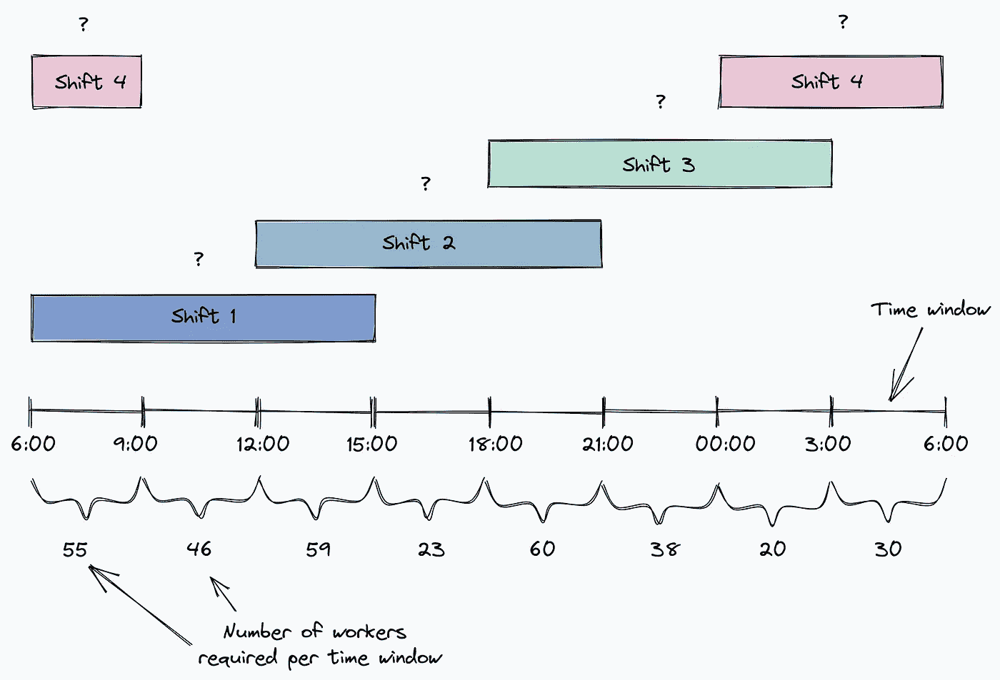

作者图片

你如何决定每班需要多少员工？

## 很容易，不是吗？

你可能会说“这很容易！我将在一个班次的三个时间窗口中选择最高数量的需求。例如，由于我的咖啡店从 6:00 到 9:00 需要 55 名工人，9:00 到 12:00 需要 46 名工人，12:00 到 15:00 需要 59 名工人，因此我将从 6:00 到 15:00 分配 59 名工人。”

这个解决方案是可行的，但是它不是最优的。由于不同班次的**工人在一些时间窗口内一起工作**，每班需要的工人可能比你想象的要少。

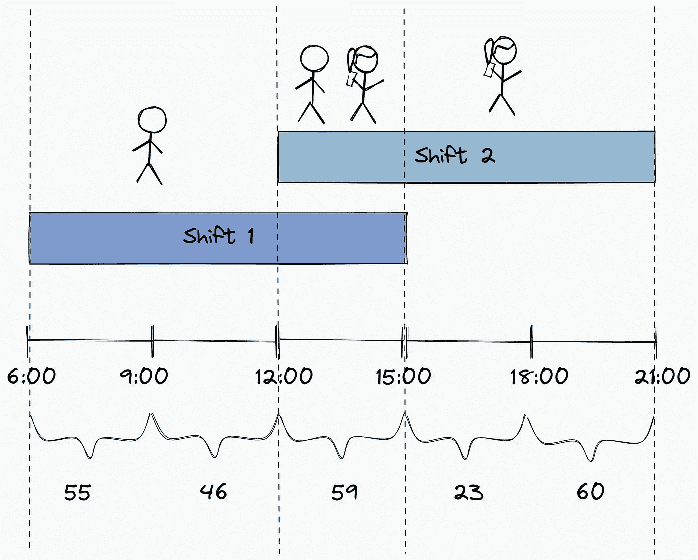

作者图片

但是什么是最优解呢？从经理的角度来看，最佳解决方案是**最大限度地减少每班工人的数量**以节省资金，同时**仍然为每个时间窗口**分配足够的工人。

让我们利用您的 Python 技能来找到这个问题的最佳解决方案，而不是花费几个小时来试图解决这个问题。

# 纸浆介绍

[线性规划](/elements-of-a-linear-programming-problem-lpp-325075688c18#:~:text=Decision%20Variables%3A%20These%20are%20the,cost%2C%20production%20quantity%2C%20etc.) (LP)是寻找上述约束问题最优解的最佳方法之一。 [PuLP](https://github.com/coin-or/pulp) 是一个 Python 库，使得使用 Python 来应用线性编程变得很容易。

要安装纸浆，请键入:

```
pip install pulp
```

现在让我们使用 gdown 从 Google Drive 下载本文开头提到的数据:

```
pip install gdown
```

数据来源于[应用整数规划，由陈，陈德生，巴特森，r . g .&党，Y. (2010)](https://www.wiley.com/en-us/Applied+Integer+Programming%3A+Modeling+and+Solution-p-9780470373064)

# 问题陈述

## 输入参数

首先，让我们创建一个矩阵来显示每个时间窗口与哪个班次相关联。

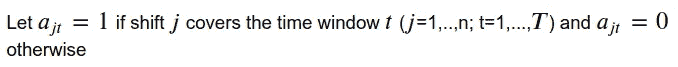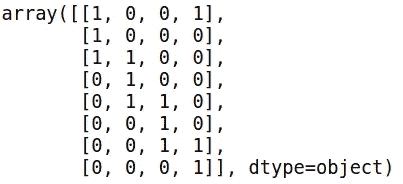

作者图片

写下其他一些有用的信息:

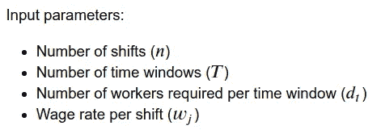

作者图片

## 决策变量

决策变量是我们想要求解的未知量。在我们的例子中，决策变量是每班的工人数量。

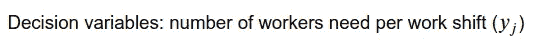

作者图片

要在 PuLP 中指定决策变量，请使用`LpVariable.dicts(name, list_of_variables, lowBound, upBound, cat)`。

*   `name`:变量的名称
*   `lowBound`:此变量范围的下限。默认值为负无穷大
*   `upBound`:该变量范围的上限。默认值为正无穷大
*   `cat`:该变量所在的类别，`Integer`，`Binary`或`Continuous`(默认)

例如，由于每个工作班次的工人数量需要是一个大于 0 的整数，因此我们写:

## 目标

线性规划旨在最小化或最大化某些数值，如成本、利润等。在这个问题中，我们希望最小化支付给所有工人的工资成本。


使用`LpProblem(name, LpMinimize)`，以最小化为目标，制造纸浆问题。

如果目标是最大化，使用`LPMaximize`。

# 制定

我们想尽量减少一天花在所有员工身上的钱。请注意，不同班次的工人工资不同(即夜班工人的工资通常高于白班工人)。

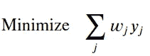

作者图片

每个时间窗口 t 内的需求也需要得到满足。

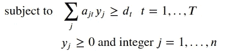

作者图片

酷！现在我们已经写好了约束和目标，我们准备好解决问题了！

# 解决

```
Status: Optimal
```

耶！运行`prob.solve()`时状态为`optimal`！这意味着求解器找到了最优解！

让我们找出这些最优解是什么:

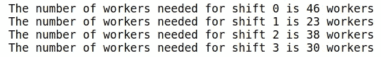

作者图片

酷！

# 解释

让我们想象一下我们的结果，看看它们是否有意义。

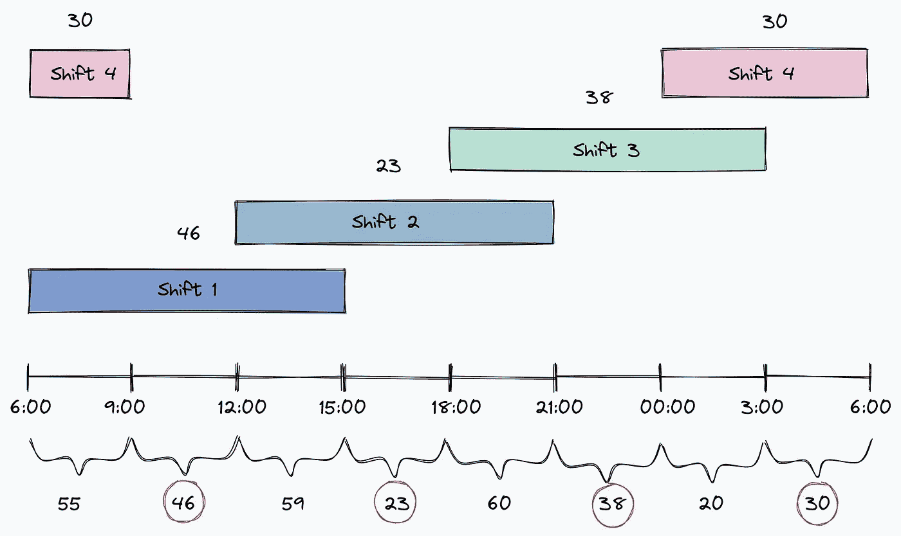

作者图片

咖啡店 6:00-9:00 需要 55 个工人，12:00-15:00 需要 59 个工人。如果求解器只分配 46 名工人到第一班(从 6:00 到 15:00)，咖啡店如何满足这些需求？

因为有一些时间窗口，来自**不同班次** **的工人一起工作**。让我们精确计算每个时间窗口中有多少工人。

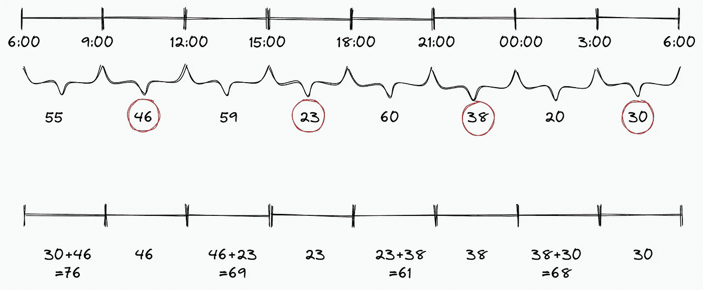

作者图片

啊哈！从上面的计算中，我们可以看到在每个时间窗口都有足够的工人来满足需求。多酷啊。

# 结论

恭喜你！您刚刚学习了如何使用 PuLP 解决优化问题。我希望这篇文章能够激发您利用 Python 技能来解决类似的问题。

这可能看起来很直观，但是当你的问题变得更大时，使用像纸浆这样的工具来解决问题会容易得多。

在 Github repo 中，您可以随意使用本文的代码:

<https://github.com/khuyentran1401/Data-science/tree/master/mathematical_programming/schedule_workers>  

我喜欢写一些基本的数据科学概念，并尝试不同的算法和数据科学工具。你可以在 LinkedIn 和 T2 Twitter 上与我联系。

星[这个回购](https://github.com/khuyentran1401/Data-science)如果你想检查我写的所有文章的代码。在 Medium 上关注我，了解我的最新数据科学文章，例如:

</simulate-real-life-events-in-python-using-simpy-e6d9152a102f> [## 使用 SimPy 在 Python 中模拟真实事件

towardsdatascience.com](/simulate-real-life-events-in-python-using-simpy-e6d9152a102f) </maximize-your-productivity-with-python-6110004b45f7>  </how-to-match-two-people-with-python-7583b51ff3f9>  </python-clean-code-6-best-practices-to-make-your-python-functions-more-readable-7ea4c6171d60>  

# 参考

陈(2010)。*应用整数规划:建模与求解*。j .威利&的儿子们。