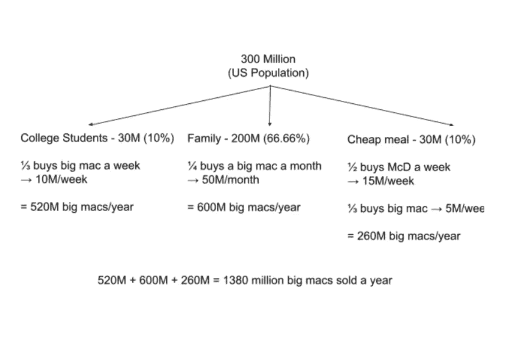

# 如何解决数据科学商业案例面试问题

> 原文：<https://towardsdatascience.com/how-to-solve-data-science-business-case-interview-questions-a4eb3a6f7986?source=collection_archive---------26----------------------->

## *作为数据科学家准备业务案例面试问题的终极指南*

作者在 [Canva](https://canva.com/) 上创建的图片

# 探讨数据科学业务案例面试问题

与[产品感面试问题](https://www.stratascratch.com/blog/the-ultimate-guide-to-product-data-science-interview-questions/?utm_source=blog&utm_medium=click&utm_campaign=medium)类似，数据科学中的业务案例面试问题旨在了解您的解决方案背后的思维过程。即使你的解决方案提供了问题的准确答案，如果你没有给出正确的回答步骤，这在受访者看来也不太好。

业务案例面试问题要求:

*   诊断和解决实际业务案例问题的能力
*   了解受访者对围绕公司产品的经济/业务的熟悉程度
*   受访者解决方案的可行性
*   以结构化的方式有效传达解决方案

(你答案中的所有这些品质都是数据科学工作的一部分，所以尽量确保你记住了这些)

为了有效地为所提出的业务案例面试问题提供解决方案，了解问题属于哪个类别非常重要。

1.  应用数据(最常见)
2.  胶料
3.  理论测试

问题类型

*   简要说明
*   具体例子和一般例子
*   公司寻找:(在你的答案中)

**应用数据**

这些问题要求您通过利用公司数据或外部来源来解决特定的业务问题。

这些问题的示例:

1.  [DemystData 问](https://platform.stratascratch.com/technical/2069-financial-institution?utm_source=blog&utm_medium=click&utm_campaign=medium)“金融机构如何确定申请人的年薪是高于还是低于 5 万美元？”
2.  [脸书问](https://platform.stratascratch.com/technical/2046-finding-invalid-schools?utm_source=blog&utm_medium=click&utm_campaign=medium)“人们在脸书个人资料上列出的高中有多少是真实的？我们如何找到并大规模部署寻找无效学校的方法？”

公司寻求:

*   受访者识别和定义相关数据的能力如何
*   受访者对相关产品的理解程度
*   受访者对围绕产品的业务/经济的了解程度

**定尺寸**

这些问题要求预测销售/存在的产品数量。这些都是看似随意，与公司无关的问题。

这些问题的示例:

1.  [谷歌问](https://platform.stratascratch.com/technical/2087-blue-paint-cans?utm_source=blog&utm_medium=click&utm_campaign=medium)“去年美国卖出了多少罐蓝色油漆？”
2.  [Ebay 问](https://platform.stratascratch.com/technical/2262-roads-in-san-francisco?utm_source=blog&utm_medium=click&utm_campaign=medium)“三藩市所有道路的总长度是多少？”

公司寻求:

*   受访者对相关产品的理解程度
*   受访者对目标市场的识别能力如何

**理论测试**

问这些问题是为了证明/反驳通常涉及公司内产品/功能变化的理论。

这个问题的例子:

1.  如果一个项目经理说他们想把新闻提要中的广告数量增加一倍，你如何判断这是不是一个好主意？

公司寻求:

*   受访者对变更后的产品/功能的理解程度如何
*   受访者对产品和目标受众之间关系的理解程度
*   选择相关指标来跟踪变革是否成功

# 结构化解决方案

作者在 [Canva](https://canva.com/) 上创建的图像

对提出的业务案例面试问题进行分类后，你应该开始构建你的解决方案。不要立即回答这个问题。要明白，即使你给出了一个好的答案，面试官也想知道你是如何得出答案的。

面试官寻找:

*   采用系统方法的解决方案
*   为什么选择了某种解决方案而不是另一种
*   涵盖问题的关键领域
*   可行的解决方案

虽然每个数据科学业务案例面试问题都有不同的解决方案，但您的部分解决方案有相同的方法。解决方案的这一部分可以作为背景研究来创建一个特殊的解决方案。

## 总体框架

受访者首先要做的是理解问题。虽然这看起来很简单，但是你对这个问题的假设可能和面试官想要的不一样。我认为，当你是一名数据科学家，为潜在客户构建背景信息时，你需要了解他们的需求。仅仅通过一个问题很难抓住这一点。花点时间想想公司为什么会问这个问题。

商业案例问题经常被问到:市场份额、用户参与度或收入。了解公司正在努力增加哪一类产品，根据客户的反应，您的解决方案可能会也可能不会改变！即使你认为这不会改变你的解决方案，也要提出来表明你的想法，因为这是开发实际功能/产品时的一个重要方面。

理解问题的一个重要部分是理解问题的关键术语。为了确保你涵盖了所有的关键术语，从头到尾指出并询问你是否对关键术语有一个适当的假设。

例子:“麦当劳在美国每年卖多少个巨无霸？”

*   “巨无霸”→假设巨无霸既包括自己卖的巨无霸，也包括套餐的一部分。巨无霸还有其他的销售方式吗，比如促销/限时销售？
*   “年”→年是指 1 月 1 日至 12 月 31 日(公历)还是 10 月 1 日至 9 月 30 日的财年？
*   “美国”→美国是指美国的 50 个州和特区，还是包括美国的外围小岛和领土？

彻底理解问题后，您需要根据所提问题的类型(应用数据、规模、理论测试)提供解决方案。

## 特定框架

**应用数据**

应用数据是一组极其多样化的问题，因此很难有一个特定的框架。这个问题真正测试你对公司产品的了解程度以及如何利用相关数据。

在花时间构建您的解决方案时，请考虑公司可以访问哪些类型的数据？想想公司收集的是什么内部数据。当谈到“应用数据”问题时，内部数据是一个很好的来源，因为公司通常已经收集了相关数据。例如[优步问](https://platform.stratascratch.com/technical/2213-driving-conditions-and-congestion?utm_source=blog&utm_medium=click&utm_campaign=medium)“你如何估计优步对驾驶状况和交通拥堵的影响？”优步已经收集了客户目前使用的优步汽车的相关数据。优步还将拥有其支持的城市在任何给定时间范围内的交通数据。这些是可以用来构建您的解决方案的内部数据。不要忘记从外部来源收集数据。也可以从可信的外部来源收集和利用数据，但是如果您选择不良的数据源，这可能是一个风险更大的答案。

如果需要收集的数据是指标，记得同时提到成功指标和护栏指标。成功指标是您用来量化特定产品的成功的指标。护栏指标是在追求改变成功指标的过程中不会受到负面影响的指标。例如，[优步问](https://platform.stratascratch.com/technical/2021-metrics-to-acquire-customers?utm_source=blog&utm_medium=click&utm_campaign=medium)“你会用什么指标来跟踪优步利用付费广告获取客户的策略是否奏效？”一个可能的成功度量可以是用户的无机增长，护栏度量可以是乘坐的次数。虽然付费广告的目的可能是增加用户数量(这些假设是你作为受访者想要问面试官的问题类型！)优步不希望人们乘坐的交通工具数量减少。

一旦您了解您的解决方案需要哪些数据，请说明所收集的每项数据与您的解决方案有何关联。这表明您了解所选数据的应用领域，以及这些数据如何支持您的解决方案。

请记住，应用数据问题通常涉及用户和用户体验。试着像一个典型用户和边缘用户那样思考来构建你的解决方案。例如[脸书问](https://platform.stratascratch.com/technical/2007-estimating-birthdays?utm_source=blog&utm_medium=click&utm_campaign=medium)“我们脸书公司想开发一种方法来估计人们的生日，不管人们是否直接给我们这些信息。你会提出什么方法，使用什么数据来帮助完成这项任务？”假设你是一个脸书用户。你可以通过直接信息或者脸书标签收到脸书的生日祝福。一个可能的解决方案是，检查在提到“生日”或“生日”等关键词的帖子中给你贴标签的用户数量。这些帖子往往在你的实际生日期间更多，所以脸书可以据此估计你的生日。

**上浆**

规模问题可能看起来非常随机和多样，但是分解如何实现解决方案更容易。规模问题也可以称为猜测，因为您试图做出一个估计的猜测。询问规模问题是为了了解您对特定产品的目标受众的识别程度。比如，[谷歌问](https://platform.stratascratch.com/technical/2087-blue-paint-cans?utm_source=blog&utm_medium=click&utm_campaign=medium)“去年美国卖了多少罐蓝色油漆？”谷歌想知道你能找到多少目标受众，并进一步了解这些消费者大概会购买多少蓝色颜料罐。

要记住的一个关键点是，你不必试图给出某个目标受众将购买多少蓝色油漆罐的超精确数字。面试官可能也不知道确切的答案，他们只是想听听你答案背后的思维过程。

由于规模问题试图确定目标受众，因此潜在用户中有一些常见的分裂因素(不限于):

1.  年龄
2.  性别
3.  人种
4.  宗教
5.  农村/城市
6.  收入
7.  乐意

另一个要考虑的因素是产品/服务的消费类型。有 3 种消费类型:个人，家庭，结构。

*   个人是指产品/服务的个人消费，如牙刷、水瓶或 t 恤。
*   家庭是指整个家庭的消费，如汽车、电视和冰箱。
*   结构性是指不同家庭的多人消费。例子包括飞机和餐馆。

首先陈述几个目标受众(使用过滤器来帮助)，然后提及你将关注的代表大部分市场的目标受众。

一般来说，这是一个好主意，涉及至少 3 个谁会使用产品/服务的过滤器。始终解释过滤器和目标受众之间的相关性。例如，抖音更适合向 13-18 岁的年轻受众做广告，而不是 65 岁以上的老年人。

如前所述，面试官并不寻求精确的数字，所以尽量使用整数。让我们以抖音为例，假设 20%的美国人口年龄在 13-18 岁之间。美国的人口大约是 333，548，370。333，543，000 的 20%很难在面试的时候当场算出来，特别是紧张的时候。如果把人口四舍五入到 3 亿，计算 3 亿的 20%就容易多了。

人们可以使用多种方法来估计规模，但是在分析了各种方法之后，有一种方法脱颖而出，特别是对于数据科学业务案例访谈。该方法是创建将使用该产品的消费者类型的布局，并填写将使用该产品的大致人数。

为了更好地解释这个方法，让我们用一个[脸书的面试问题](https://platform.stratascratch.com/technical/2002-mcds-big-macs?utm_source=blog&utm_medium=click&utm_campaign=medium)“麦当劳在美国每年卖多少个巨无霸？”。

让我们先取一个美国人口的大概数字，我们假设大约是 3 亿。

巨无霸的主要目标受众通常比儿童餐的目标受众年龄大，比老年人年龄小。主要的目标受众是大学生、家庭和想买便餐的人。

关于大学生，让我们假设 10%的人口是大学生。300 米的 10% = 30 米。让我们假设一个普通大学生每周买一次麦当劳。不是每个人都会买巨无霸，但既然是菜单上的热门项目，我们假设去麦当劳的人有三分之一会买巨无霸。三千万的⅓就是一千万。这意味着在这些假设下，大学生每周会购买 1000 万个巨无霸。这相当于每年 5.2 亿个巨无霸。

关于家庭，让我们假设三分之二的人口生活在同一个家庭中。300 米的三分之二是 200 米。当一个家庭购买食物时，他们倾向于为整个家庭购买。让我们假设普通家庭每周从餐馆购买一次食物，也许每月从麦当劳购买一次。让我们假设一个典型的 4 口之家，一个人选择吃巨无霸。200 米/4 = 50 米。在家庭目标受众下，每月有 5000 万人购买一次巨无霸。这相当于每年 6 亿个巨无霸。

关于那些想买便餐的人，让我们假设有 10%的人想每周买一次快速便餐。300M * 10% = 30M。麦当劳是一家受欢迎的快餐连锁店，在美国几乎到处都有分店。我们假设 3000 万人中，有 50%的人选择麦当劳。30M * 50% = 15M。这导致 1500 万人每周从麦当劳购买一次。让我们假设这些人中有三分之一的人购买巨无霸，这样每周就有 500 万个巨无霸卖给想要快速便宜的目标顾客。这相当于一年售出 2.6 亿个巨无霸。

如果你把这些价值加在一起，美国一年售出的巨无霸数量为 5.2 亿+6.0 亿+2.6 亿= 13.8 亿。

最后，在提到你的最终答案后，你还可以提供更多可能影响价值的相关信息。例如，麦当劳有一个 5 美元或 6 美元的特卖，顾客可以用 5/6 美元购买 2 个巨无霸。这将增加巨无霸的销量。这表明你对产品有所了解。

有时在面试中，你会得到一块在线板，你可以在上面画画并记下你的想法。这可能是一个你可以选择的设计，帮助你更好地理解和解释你的想法！

*要记住的事情*

*   记住，你不必提及所有的目标受众。提及占据大部分市场的重要案例，如果你愿意，也可以提及边缘案例。
*   当你得到最终答案时，做一个理智检查。检查你的最终答案是高估还是低估，并相应地调整数值。
*   尤其是在使用消费者类型的布局时，要写下来，这样你就有了什么与什么相关的参考
*   请记住，您可以使用任何听起来合理的过滤器，但一定要记住提及这与实际解决方案的关系。
*   要记住的一个关键点是不要使用个人偏见。记住你的社交圈并不代表整个人口。不要假设每个人都和你想的一样。站在别人的立场上，看看他们会如何看待这个问题。

**理论测试**

记住理论测试主要是测试你对产品和目标受众的理解程度。有 3 个步骤可以帮助回答这些问题。

1.  确定受影响的用户
2.  变革的利弊
3.  证明/否定该理论的数据
4.  将会改变的指标

为了帮助解释这些步骤，我们将使用脸书提出的一个[问题:“一位总理想要将新闻订阅中的广告数量增加一倍，你如何判断这是否是一个好主意？”](https://platform.stratascratch.com/technical/2202-double-the-number-of-ads?utm_source=blog&utm_medium=click&utm_campaign=medium)

*受影响的用户*

影像测试假设，首先你需要做一些背景研究。了解什么类型的用户会受到这种变化的影响。列出受影响的用户组。产品中的一些变化会影响所有用户，而一些变化只会主要影响一部分用户。受影响的用户是目标受众还是其他用户？

以脸书为例，浏览其新闻源的脸书普通用户将受到影响，影响者也将受到影响，因为将会有更多的广告而不是帖子。

*利与弊*

产品的每一个变化都有积极和消极的一面。这可能会影响用户群或公司的资源。列出两个优点和两个缺点，如果改变被实现，产品将会如何改变。理论测试通常包括测试关于改变产品/服务的理论。利弊列表将有助于更好地理解变更以及收集哪些数据/指标。确定受影响用户的原因是为了在利弊列表中考虑用户组将如何受到影响，因为最终用户是将使用该产品的人。

以脸书为例:

*优点*

*   增加脸书的收入
*   由于广告的增加，企业可能会选择使用脸书作为其营销技术的解决方案

*缺点*

*   由于广告的增加，用户可能会减少在应用上的时间
*   有影响力的人可能不会发布太多的帖子，因为他们的帖子没有像以前那样得到认可

*数据支持理论*

有时，类似的变革可能已经在同一家公司或另一家公司实施过。如果你知道是否进行了类似的变更，说明变更对产品产生了怎样的影响，以及哪些指标发生了变化。

如果没有之前的数据，请说明如果实施变更，您认为哪些指标会发生变化。记得提及你如何预测指标将会改变，以及你为什么会这样想背后的逻辑。

以脸书为例，我们可以看到当脸书第一次在新闻订阅中植入广告时用户的感受。这将提供关于它如何影响脸书用户的直接信息。可以跟踪的指标包括每日活跃用户和影响者帖子的数量。DAU 将帮助显示用户在改变后是否停止使用该应用程序。如果有影响者的帖子数量减少，他们的追随者对应用程序的使用也会减少。

此时，您已经解释了一般框架和具体问题框架的初始部分。现在，您必须解释边缘案例并总结您的解决方案。

对于任何给定的业务案例面试问题，您给出的每个解决方案都不会涵盖某个边缘案例。出现这种情况的主要原因可能是由于面试期间的时间限制。识别您的解决方案没有覆盖的边缘情况是很好的。即使你不能解释如何解决边缘案例，识别一个可能的边缘案例也比完全不识别要好。许多受访者会指出解决方案的大部分，但指出边缘案例将有助于将您与其他人区分开来。在您的具体问题解决方案之后，有理由提及边缘案例。这有助于构建你的解决方案，让面试官不会感到困惑。

一个边缘案例的例子可以用一个[谷歌采访问题](https://platform.stratascratch.com/technical/2087-blue-paint-cans?utm_source=blog&utm_medium=click&utm_campaign=medium)来看，“去年美国卖出了多少罐蓝色油漆？”假设确定了 3 个潜在的主要目标受众:住宅建筑、企业建筑和汽车制造商。一个极端的例子是幼儿园和小学会为学生购买油漆。作为受访者，你可以提出一些粗略的估计，说明你如何计算可能购买了多少蓝色油漆。

提供您的详细解决方案后，您应该总结您的解决方案。

记得包括:

1.  对问题的假设
2.  收集的数据/指标以及与解决方案的相关性
3.  使用收集的数据/指标概述解决方案的具体方法

你的解决方案的总结是你面试的一个重要部分。重申你的解决方案中的关键点是很重要的，但它也表明了你将如何与投资者和客户就如何解决这些业务问题进行沟通。

要遵循的步骤概述

1.  澄清问题的目标——他们为什么问这个问题——了解产品与公司目标的关系——努力增加收入、市场份额或用户参与度
2.  理解问题—分解关键词
3.  特定框架
4.  边缘案例
5.  总结答案

# 传达您的解决方案

作者在 [Canva](https://canva.com/) 上创建的图片

请记住，你的最终答案并不是面试成功与否的决定性因素。你必须能够详细地交流你的思维过程。面试官想知道你的思维过程是如何运作的，想知道你在解释你的解决方案时是否涵盖了所有的要点。面试的一个重要部分是你能多好地交流你的解决方案。

你和面试官之间应该对问题和思维过程有一个清晰的认识。面试官的意见可能是你的解决方案中最重要的部分。如果面试官给出的指示或提出的问题偏离了框架，那就照着做。千万不要严格按照框架来。你应该根据面试官的评论完善你的解决方案和回答步骤。记住面试官会影响雇佣你的决定，所以你越能吸收面试官的意见，你的机会就越大。

*在回应前花点时间*

*   作为受访者，你有一些时间来思考如何解决问题。如果你立即回应，你可能会意识到你的解决方案有一个重大缺陷，从而导致你退回去纠正问题。为了防止这种情况以及你和面试官之间的误解，在回答之前花点时间。受访者通常需要 30 秒钟才能回答。
*   如果想出解决方案的时间确实超过 30 秒，也不用担心！在这一点上，你可以陈述你的假设，以及你是如何思考如何开始你的解决方案的。这样可以避免尴尬的沉默，也不会显得你花了太多时间来提供解决方案。

*就目标/假设达成一致*

*   与面试官交流的一个关键部分是了解如何着手解决问题。商业案例问题背后的措辞故意含糊不清，因此受访者可以识别出需要澄清的短语。类似于与客户的实际讨论，在构思解决方案之前，您需要就目标/假设达成一致。

*提及技术术语*

*   既然你申请的是一个技术职位，你就应该使用专业术语来区分你和其他人。这表明你对某些技术概念的应用有所了解。
*   记住，你永远不要强迫自己使用专业术语。有些时候你应该避免使用技术术语
    ，如果你不完全理解技术概念
    ，如果技术概念是多余的，或者如果问题有更简单的解决方案。仅仅因为机器学习这个术语在任何地方都有销路，并不意味着你应该在任何地方都使用它。
    技术概念和您的解决方案之间没有关联
*   商业案例面试问题并不总是需要复杂的技术概念，所以不要担心你的解决方案是否简单明了。只要你的解决方案涵盖了问题的重要部分，你就是优秀的。

*新指标/数据*

*   每当引入新的指标或收集数据时，都要提到指标/数据是什么。
*   如何得出/收集指标/数据。
*   新的指标/数据如何帮助打造您的解决方案？

示例:

[赛门铁克问](https://platform.stratascratch.com/technical/2190-increase-number-of-customers?utm_source=blog&utm_medium=click&utm_campaign=medium)“假设你有一家咖啡店，你如何增加顾客数量？”假设你正试图通过发布一则你最受欢迎的产品的假日促销广告来增加顾客数量。提到你应该收集有多少人购买每种产品的数据集。这可以通过交易和销售的产品来收集。一旦你收集了数据，你就可以发现哪些商品卖得最多。根据畅销产品的利润率，你可以暂时降低价格来增加顾客数量！

*被卡住*

*   在提供你的解决方案时，如果你在你的解决方案中卡住了，告诉你的面试官你卡住了！告诉他们你是如何考虑你的解决方案的，以及下一步你想达到的目标。告诉面试官你在解决方案中考虑过的某些步骤，但由于某些原因没有采取(解释这些原因)。试着看看面试官有没有给出什么线索。

*你的解决方案中的错误*

*   如果你认为你的解决方案不合理或者肯定会导致错误，说明为什么你的解决方案行不通。多花些时间看看你是否能改变你的解决方案，或者你是否必须回溯你的解决方案到你觉得最有信心的地方。请记住，如果您遇到您的解决方案无法处理的问题，请不要担心。类似于工作环境，最好是确定一个问题，而不是继续在一个破碎的基础上。当提及您的新解决方案时，记得明确说明您的新解决方案将如何避免该问题。

总是大声说出你的解决方案！通过你的解决方案与面试官交流，这样他们也能理解你的思维过程。记住每一步都要和前一步以及总体目标联系起来。经过几个步骤后，做一个理智检查，确保面试官理解你的解决方案。

# 面试前如何准备商业案例问题

商业案例面试问题是[数据科学面试](https://www.stratascratch.com/blog/data-science-interview-guide-questions-from-80-different-companies/?utm_source=blog&utm_medium=click&utm_campaign=medium)中另一个具有挑战性的部分。由于问题的多样性和看似随机的问题，这些问题很难预测。

关于 3 类业务案例问题:应用数据、规模和理论测试，每一类都有不同的准备方式。

准备应用数据问题时，首先你必须了解公司的业务类型。该公司是否涉足大量 B2B 或 B2C 业务？有时候，对于大公司，比如谷歌，公司会提到你申请的部门。研究这个部门做什么类型的业务。接下来你应该了解公司生产的产品类型，或者更好地了解你申请的部门生产的产品。尝试理解围绕产品的商业模式，以及他们会使用什么类型的数据来帮助改进产品。如果没有这方面的公开资料，试着自己做假设！从目标受众的不同角度来看待产品，以及您将收集哪些数据来了解如何改进产品。

不幸的是，规模问题更具随机性，有时公司会问一个似乎与公司业务模式无关的问题。例子:谷歌问“去年美国卖出了多少罐蓝色油漆？”对于这些类型的问题，需要不断练习其他规模问题。

准备理论测试是应用数据问题的下一步，因为你已经发现如何应用数据来改进产品。如何测试这实际上是否可行？想想如果应用这个解决方案会发生什么。用户将在多大程度上受到影响，某些指标将如何增加、减少或保持不变。想想你的潜在雇主会面临什么样的问题！这些问题可以用数据科学的方法来解决，所以想想你会如何解决这个问题！

尝试研究该产品的竞争对手，了解其他竞争公司是否已经改变了他们的产品，类似于你申请的公司试图提及它如何为竞争公司工作！与规模问题类似，理论测试需要用多个问题进行练习！

*最初发表于*[*【https://www.stratascratch.com】*](https://www.stratascratch.com/blog/how-to-solve-data-science-business-case-interview-questions/?utm_source=blog&utm_medium=click&utm_campaign=medium)*。*