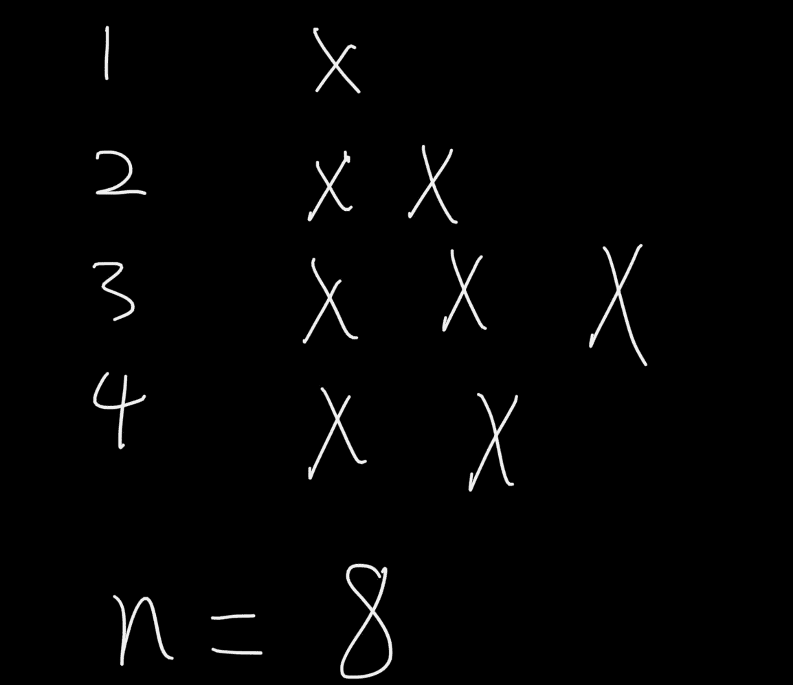

# 如何用数学解决 Python 编码问题

> 原文：<https://towardsdatascience.com/how-to-solve-python-coding-questions-using-math-72d5540b5a24?source=collection_archive---------13----------------------->

## 破解数据科学面试

## 2021 年数据科学家和软件工程师必备的编码技能


[JESHOOTS.COM](https://unsplash.com/@jeshoots?utm_source=unsplash&utm_medium=referral&utm_content=creditCopyText)在 [Unsplash](https://unsplash.com/s/photos/math?utm_source=unsplash&utm_medium=referral&utm_content=creditCopyText) 上拍照

Python 编码面试有不同的形式，每种类型都有其独特的特点和方法。例如， [**字符串操作**](/python-string-manipulation-for-data-scientists-in-2021-c5b9526347f4) 题期望考生对元素的检索和访问有扎实的掌握。 [**数据类型切换**](/master-python-dictionary-for-beginners-in-2021-1cdbaa17ec45?source=post_stats_page-------------------------------------) 问题测试你对每种类型的权衡和独特特征的理解。

但是，数学题不一样。没有一致的测试方法。相反，您必须找出数据模式并用 Python 对其进行编码，这起初听起来令人望而生畏，但经过实践后是完全可行的。

在这篇文章中，我详细阐述并实时编码了 5 个真实的面试问题，帮助你更好地理解数学在 Python 中是如何工作的。

# 问题 1:计算区间范围内的奇数，由微软

> -给定两个非负整数 low 和 high。
> -返回低和高(含)之间的奇数计数。
> -[https://leet code . com/problems/count-odd-numbers-in-a-interval-range/](https://leetcode.com/problems/count-odd-numbers-in-an-interval-range/)

## 走过我的思考

微软问这个问题。作为热身，这个问题似乎太琐碎了，不应该包含在数据科学或软件工程面试中。然而，如果你不知道数学上的捷径，这是非常困难的。

我的第一直觉是迭代上下界的范围，*和*，并使用 for 循环计算奇数的个数。

Python 实现的工作方式如下。

## 解决方案 1: for 循环

```
3
```

正如所料，它在窄范围内运行良好，但在宽范围内运行非常慢。你可以试试这个测试用例:countOdds(3，72222222222222222222222)，它需要永远完成。

## 解决方案 2:数学

作为今天博文的主题，我们学习如何发现数据中的模式，并使用数学方法解决手头的问题。

要计算高低范围内的奇数，它等于上限的奇数减去下限的奇数。

在数学中，结果=奇数到高的计数-奇数到低的计数。

此外，有 50%的奇数，和 50%的偶数。例如，对于 0 和 8 之间的范围，有 4 个奇数和 4 个偶数。

Python 的一般实现如下:

```
3611111111111110
```

第二种方法即时返回结果，即使是大范围的结果。对于需要数学计算的问题，优先考虑的是分析模式并找到它的数学等价。我们必须大量练习，才能对潜在的想法感到舒服。

# **问题 2:排列硬币，作者彭博**

> -你总共有 n 个硬币，你想形成一个楼梯形状，其中每第 k 行必须正好有 k 个硬币。
> ——给定 n，求能形成的全楼梯排的总数。
> - n 为非负整数，在 32 位有符号整数的范围内。https://leetcode.com/problems/arranging-coins/
> -

## 走过我的思考

彭博包括这个问题。总共有 n 个硬币，我们试着把 k 个硬币放在第 k 行。我画了一个简单的图表作为视觉辅助。



我自己的截图

如果 n = 8，我们将 1 放在第一行，2 放在第二行，3 放在第三行，2 放在第四行。因为只有前三排是全楼梯，所以该函数应该返回 3。

有趣的模式是，从第 I 个全楼梯到第(i+1)个全楼梯增加了 1 个单位。在高中，我们学过这种数列叫做**等差数列**或**等差数列**。所以，对于第 k 个完整的楼梯，硬币总数= k*(k+1)/2。

记不住公式也不用担心。我写这篇文章的时候谷歌了一下。

下一步是找到一种方法来最大化完整楼梯的数量，并最小化硬币计数和 n 之间的距离，这可以通过使用二分搜索法来实现。

</binary-search-in-python-the-programming-algorithm-8b8fa039eaa>  

## 解决办法

```
3
```

这是二分搜索法的标准实现，唯一的问题是能够得出**算术序列的求和公式。**

# 问题 3:频闪信号数字，脸书

> -频闪数字是旋转 180 度后看起来相同的数字(上下颠倒)。写一个函数来确定一个数字是否是频闪的。该数字表示为字符串。
> ——https://leetcode.com/problems/strobogrammatic-number/

## 走过我的思考

脸书问了这个问题。写下一些数字并将它们旋转 180 度会很有帮助。

```
**Original      180 degrees rotation**
   0                 0
   1                 1
   2              invalid
   3              invalid
   4              invalid
   5              invalid
   6                 9
   7              invalid
   8                 8
   9                 6 
```

从 0 到 9，旋转 180 度后只有 5 个有效数字和 5 个无效数字。对于这些有效数字，只有 0、1 和 8 在旋转后保持不变，其他两个数字 6 和 9 会改变值。

一方面，如果一个数包含任何无效的数字，那么它在旋转后就不是一个有效的数。

另一方面，我们返回有效数字(0、1、6、8 和 9)的“镜像”值。我们可以创建一个字典，并利用它的键值对特性来返回值。

Dictionary 有一个独特的键值对特性，这在很多情况下都很方便。请看这里:

</master-python-dictionary-for-beginners-in-2021-1cdbaa17ec45>  

## 解决办法

在 Python 中，我们可以做到以下几点:

```
True
```

有两个条件。首先，num 存储为一个字符串，而不是一个整数，我们必须小心访问字符串元素。第二，数字在旋转后会改变它们的位置，因此我们必须使用 reversed()方法从最后一个(最右边的)数字向后读取，例如，169 → 691。

剩下的就不言而喻了。

# 问题 4:设置不匹配，由亚马逊

> -集合 S 最初包含从 1 到 n 的数字。
> -但不幸的是，由于数据错误，集合中的一个数字与集合中的另一个数字重复，导致一个数字重复，另一个数字丢失。
> -给定一个数组 nums，表示该集合出错后的数据状态。你的任务是首先找到出现两次的数字，然后找到丢失的数字。以数组的形式返回它们。【https://leetcode.com/problems/set-mismatch/】-

## 走过我的思考

亚马逊问这个问题。简单来说，一个数字重复两次，在一个数字序列中就少了一个数字。我们的任务是找到他们两个。

使用非数学方法解决这个问题是可能的，但是缺点是使用额外的内存利用率，这在技术面试中是被禁止的。所以，我们会用数学方法来解决它。

```
#1 To find the repeated number
The go-to data type is a set, which does not allow duplicates. By changing the data type to a set, we can get rid of the duplicated case. Then, take the difference between the total sum of the original array and the set. #2 To find the missing number 
Like the first step, we use a set to remove the duplicate and take the difference between the sum of the range up to n and the set.
```

在 Python 中，我们可以做以下代码。

## 解决办法

```
[1, 2]
```

它工作了。

顺便提一下，在 Python 中将一个集合与另一个函数/方法组合起来，例如 len()和 sum()，是在取出副本后检查更改的一种强大方法。

# 问题 5:三的力量，高盛和 Hulu

> -给定一个整数 n，如果它是 3 的幂，则返回 true。否则，返回 false。
> -整数 n 是 3 的幂，如果存在整数 x 使得 n = = https://leetcode.com/problems/power-of-three/
> -[-](https://leetcode.com/problems/power-of-three/)

## 走过我的思考

高盛和 Hulu 收录了这个面试问题。有两种方法。首先我们可以用 while 循环把数除以 3，如果是 3 的幂，那么剩余的部分应该是 1。第二，我们可以使用递归。在这里，我将两种解决方案进行比较。

## 解决方案 1:数学

对于这个问题，数学部分比较容易。我们只需要记住，对于幂数字，提醒应该等于 1。

```
True
```

## 解决方案 2:递归

我们需要指定第二种方法的基本条件。对于幂数，剩余部分等于 0；对其他人来说，剩下的部分不是 0。

```
False
```

*完整的 Python 代码在我的* [*Github*](https://github.com/LeihuaYe/Python_LeetCode_Coding) *上有。*

# 外卖食品

*   数学对于 Python 编程来说很方便。
*   最具挑战性的部分是发现模式并编码。
*   为了找到模式，写出几个例子会有所帮助。
*   特例呢？重复的怎么办？一套可以有帮助！

*Medium 最近进化出了它的* [*作家伙伴计划*](https://blog.medium.com/evolving-the-partner-program-2613708f9f3c) *，支持像我这样的普通作家。如果你还不是订户，通过下面的链接注册，我会收到一部分会员费。*

<https://leihua-ye.medium.com/membership>  

# 我的数据科学面试序列

</5-python-coding-questions-asked-at-faang-59e6cf5ba2a0>  </essential-sql-skills-for-data-scientists-in-2021-8eb14a38b97f>  </crack-data-science-interviews-essential-statistics-concepts-d4491d85219e>  

# 喜欢读这本书吗？

> 请在 [LinkedIn](https://www.linkedin.com/in/leihuaye/) 和 [Youtube](https://www.youtube.com/channel/UCBBu2nqs6iZPyNSgMjXUGPg) 找到我。
> 
> 还有，看看我其他关于人工智能和机器学习的帖子。