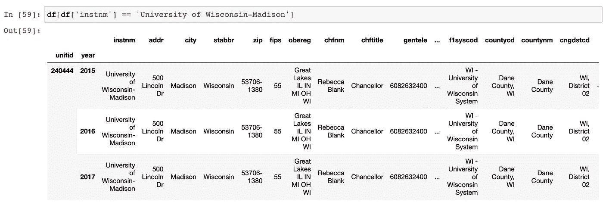
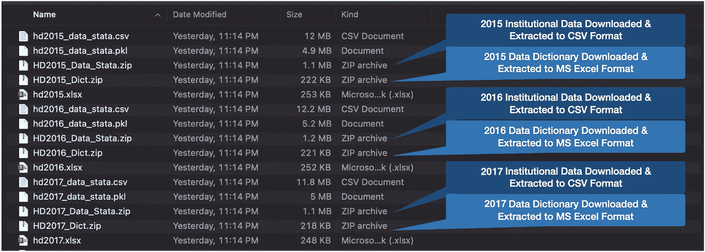
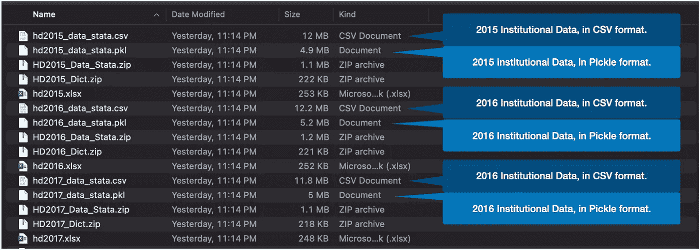
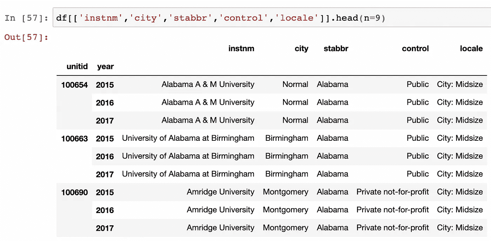
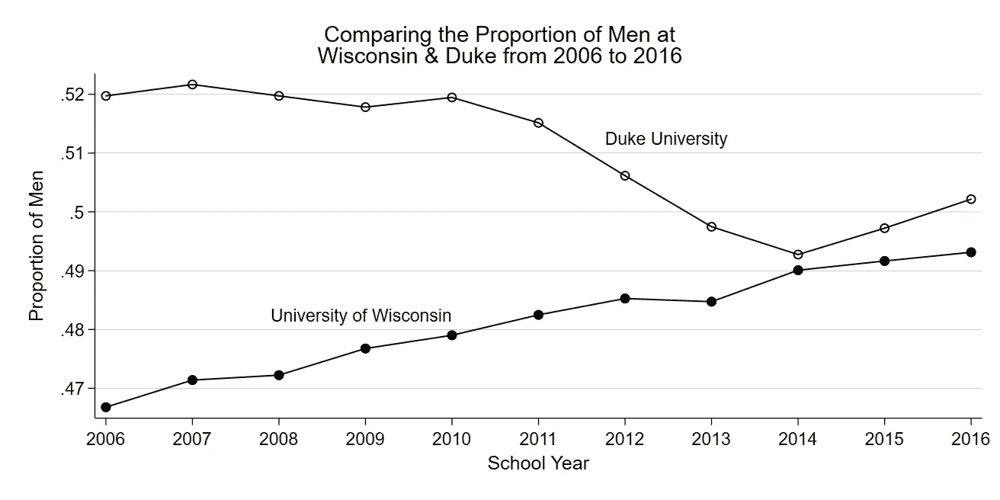

# 联邦数据来源:高等教育数据

> 原文：<https://towardsdatascience.com/how-to-source-federal-data-higher-education-data-675f5edb9813?source=collection_archive---------56----------------------->



来源:作者根据本文的代码收集和汇编的综合中学后教育数据(IPEDS)的再现。摘录的观点。

## 从联邦高等教育数据源构建三年数据面板的分步指南

TLDR:本指南利用美国教育部的公开数据，整合了一个为期三年的数据面板(也称为纵向数据)。使用本文中的技术来准备您可以自己分析的数据。请在评论中告诉我，接下来我应该为哪些其他联邦数据源构建类似的指南。

# 介绍

你是下列任何一种人吗？

*   为一个需要了解美国高等教育机构的客户工作？
*   想研究高等教育机构的研究员(研究生，大学教师)？
*   正在寻找新数据进行探索的现任或有抱负的数据专业人士？

本文提供了 Python 代码，它将从美国教育部下载三年的数据(IPEDS 数据，下面会进一步解释)。本文还解释了这些代码。

首先，本文描述了系统和软件需求。然后，第二，本文概述了代码的五个步骤:

1.  导入包
2.  获取数据
3.  清理数据
4.  保存数据
5.  面板组件

本文末尾有一个链接，指向在 Jupyter 笔记本中提供这些代码的存储库。

## 系统和软件要求

只要您使用的是 Python 3.0，这段代码就可以在 Mac、Windows 和 Linux 上运行。这段代码也适用于 Stata 的 Python API 环境。如果您知道您有一个 Python 环境，请跳过这个需求部分，转到下面的实现部分。

为了自己实现这段代码，您需要访问 Python 编程环境。如果您的计算机上还没有安装 Python，我推荐使用 Anaconda 发行版，它是免费的，并且被许多人认为是数据科学工作的首选。我以前写过如何安装这个软件。如果你喜欢视频，[我有一个主题为](https://www.linkedin.com/posts/arnelson_apple-mac-datascientist-activity-6749732682399268864-h54h)的视频。

[另一个不需要安装软件的选择是使用这个免费的在线 Jupyter 笔记本环境。](https://mybinder.org/v2/gh/ipython/ipython-in-depth/master?filepath=binder/Index.ipynb)

## 履行

**第一步**是**导入包**并指定数据位置。在这一步中，我们还设置了一些参数。

```
import requests
import zipfile
import io
import pandas as pd# We use the ipeds prefix because the data comes from the:
# [I]ntegrated [P]ostsecondary [E]ducation [D]ata [S]ystem
ipeds_locs = '[https://nces.ed.gov/ipeds/datacenter/data/'](https://nces.ed.gov/ipeds/datacenter/data/')
ipeds_fils = 'HD{}_Data_Stata.zip'
ipeds_dict = 'HD{}_Dict.zip'
years = [2015,2016,2017]
```

在`ipeds_locs`中，我们指定数据位置。我们使用`ipeds_fils`来指定 zip 文件名，使用`ipeds_dict`来指定数据字典文件名。在`years`中，我们指定我们想要的结果面板数据的年份。

我们使用`ipeds`前缀是因为这些数据来自综合系统(IPEDS)。我以前写过这些数据。

**第二步**是开始一个 for 循环，该循环将遍历`years`到**中的值以获得数据**。数据源以压缩的 zip 文件格式共享这些数据。并且每年有一个文件。在这一步中，代码下载保存在线数据的 zip 文件。

```
for yr in years:
    print('GETTING FILES FROM {}'.format(yr))
    rdata = requests.get(ipeds_locs + ipeds_fils.format(yr))
    rdict = requests.get(ipeds_locs + ipeds_dict.format(yr))
    rdata_zip = zipfile.ZipFile(io.BytesIO(rdata.content))
    rdict_zip = zipfile.ZipFile(io.BytesIO(rdict.content))

    print('Extracting {} files from zip archive:'.format(yr))
    rdata_zip.printdir()
    rdict_zip.printdir()
    rdata_zip.extractall()
    rdict_zip.extractall()

    print('Saving zip archive to disk.')
    open(ipeds_fils.format(yr), 'wb').write(rdata.content)
    open(ipeds_dict.format(yr), 'wb').write(rdict.content)
```

`print()`语句在遍历各个步骤时提供输出。输出有助于跟踪您的进度。如果你把结果保存在你的笔记中，它将帮助你复制你的工作。

这段代码然后使用`requests.get()`从在线下载 zip 文件，这是我们在第一步中导入的标准库之一。数据进入名为`rdata`的变量，而数据字典进入`rdict`。

下一个目标是提取文件，并将它们保存到磁盘上。为了实现这个目标，我们使用了`zipfile.ZipFile()`、`io.BytesIO()`和`extractall()`。

我们还有一个目标是提供更多的输出(用于跟踪和复制目的)。为了提供额外输出，我们使用了`printdir()`。

最终，`open()`函数和`write()`方法将文件保存到磁盘。

在第二步中的代码运行后，您将有四个新文件用于每年。这些文件现在将位于您的本地计算机上。这是您将找到的文件的图像。



来源:作者对本文代码收集的文件的翻译。(图 1)

如图 1 所示，在 for 循环中，每年都会有 2 个新的 zip 文件、1 个新的 MS Excel 文件和 1 个新的 CSV 文件。名称为`hdyyyy.xlsx`的文件是 IPEDS 提供的数据字典文件。带`hdyyyy_data_stata.csv`的文件是 CSV 格式的数据。扩展名为`.zip`的文件是代码从网上下载的 zip 文件。上图还显示了 pickle 文件，它是主数据的辅助备份，在代码的后面生成。

**第三步**是**清除数据**。这个数据已经清理得很好了，但还不完美。这种数据的一个难以处理的方面是它具有代码值而不是代码标签。如下所述，用代码值替换代码标签将使这些数据更易于阅读。

关于“代码值”和“代码标签”的简短讨论:许多人经常用其他术语来指代这两个概念。对于本文，代码值和代码标签指的是分类变量。

正如所提供的，这些数据使用分类变量的代码值。代码值是映射到代码值的简单数字。例如，下图中有两个数据集。左边是原始数据。右边是更新的数据。原始数据有一个数字来代替每个类别。这些数字是代码值。代码值映射到代码标签。

```
# SIMPLIFIED ILLUSTRATION OF CODE VALUES vs. CODE LABELSORIGINAL DATA:             UPDATED DATA:
+------+-------+------+    +-------+-------+------+
| size | state | type |    | size  | state | type |
+------+-------+------+    +-------+-------+------+
|  1   |  33   |  4   |    | small | Wisc. | 1yr  |
|  1   |  21   |  5   |    | small | Fla.  | 4yr  |
|  2   |  21   |  3   |    | med   | Fla.  | 2yr  |
|  3   |  40   |  3   |    | big   | N.Y.  | 2yr  |
+------+-------+------+    +-------+-------+------+
```

代码值不利于人的可读性。为了使数据更易于阅读，我们将用代码标签替换那些代码值。

更新的数据更容易读取，因为更新的数据具有人类可读的代码标签，而不是数字代码值。因此，第三步的最后一部分，如下所示，用代码标签替换代码值。

```
print('Replacing Code Values with Code Labels.')

# Extract frequencies tab the data dictionary (hdYYYY.xlsx)
freqs = pd.read_excel('hd{}.xlsx'.format(yr),
                      sheet_name='Frequencies')# Put institutional data into a data frame (df)
df = pd.read_csv('hd{}_data_stata.csv'.format(yr), 
                 encoding='ISO-8859-1')    

# Get list of categorical variable names
cat_colms = set(freqs['varname'])

# Remove fips code to prevent its modification
cat_colms.remove('FIPS')
```

在变量`freqs`中，我们存储来自数据字典(`hdYYYY.xlsx`)的元数据。上面的第二步下载并解压缩了这个数据字典。图 1 & 2 也显示了这些数据字典文件。变量名`freqs`是数据来源的电子表格选项卡“频率”的缩写。

在变量`df`中，我们存储了之前在第二步中下载的机构数据。在 Pandas 中工作时，习惯上使用`df`作为主数据框的变量名。

在`cat_colms`中，我们存储了分类变量名称的列表。为了获得分类变量的简单列表，这段代码使用了数据字典中的“frequencies”选项卡。

因为该数据既有州 FIPS 代码的列，也有州名的文本列。FIPS 电码的意义和目的超出了本文的范围。简而言之，它们是州、县和其他政治地理的标准代码。我们将保留 FIPS 代码，因为如果我们想通过将它与其他州数据源合并来扩充该数据，它们会很有用。

因为保留州缩写和州 FIPS 代码都很有用，所以我们使用`cat_colms.remove('FIPS')`从代码将改变的分类列列表中删除该列。

第三步的最后一部分是清理数据，即进一步利用数据字典来创建可以用代码标注替换代码值的地图。映射是一种交叉遍历，Python 可以用一组代码替换另一组代码。这个映射操作是一个循环，因为每一列都需要一个单独的映射。

```
# Loop through categorical columns
for col in cat_colms:
    # Get map keys (code values)
    code_values = freqs[freqs['varname'] == col]['codevalue']
    # Convert map keys to int where appropriate
    code_values = [int(i) if str(i).isdigit() 
                   else i for i in code_values]
    # Get map value (ValueLabels)
    code_labels = freqs[freqs['varname'] == col]['valuelabel']
    var_map = dict(zip(code_values, code_labels)) 
    # Apply mapping dictionary to categorical column
    df[col] = df[col].map(var_map)
```

**第四步**是创建时间索引，然后**保存数据**以备后用。回头看，这段代码在第三步中创建了变量`df`。第三步还操作了`df`中的分类列，用代码标签替换了代码值。

这里，在第四步中，我们进一步操作`df`。行`df['year'] = yr`在数据帧中创建一个新列，该列等于`yr`的当前值，该值在 for 循环的每个周期递增。使用`to_csv()`和`to_pickle()`方法，这段代码将数据保存在 csv 和 pickle 中(作为本地计算机上的文件)。

```
# Create time index for panel specification
df['year'] = yr

print('Writing hd{}_data_stata.csv as csv, pkl'.format(yr))
df.columns = [i.lower() for i in df.columns]
df.to_csv('hd{}_data_stata.csv'.format(yr))
df.to_pickle('hd{}_data_stata.pkl'.format(yr))
print('Done!', end='\n\n')
```

以 CSV 和 pickle 格式将文件保存到磁盘在技术上是不必要的，实际上也是不必要的。我经常以两种格式保存，因为我喜欢防止数据丢失的冗余。当希望确认或复制结果时，拥有数据的冗余副本还可以提供额外的参考点。数据工程师讨厌这样，因为这样效率不高。所以你可以决定你喜欢哪种格式。Pandas 文档还提供了可以编写至少十几种其他格式的函数。

在第四步之后，您将拥有一个工作目录，其中包含一些额外的文件，如图 2 所示。



来源:作者对本文代码收集的文件的翻译。(图 2)

第二步到第四步(导入包、获取数据、清理数据和保存数据)将循环遍历变量`years`中的每个值，然后继续第五步。

**第五步**是**组装面板**。下面的代码从第一步到第四步准备的 CSV 文件中收集数据，如图 2 所示。

回想一下，面板数据通常与纵向数据同义。这种数据包括随时间重复的多个单元的观察结果。在这篇文章的代码收集的数据中，每个高等教育机构有三个观察值，从 2015 年到 2017 年每年一个。

```
all_data = {}
for yr in years:
    all_data[yr] = pd.read_csv('hd{}_data_stata.csv'.format(yr))

df = pd.concat(all_data).sort_values(['unitid',
                                      'year']).set_index(['unitid',
                                                          'year'])
```

将数据放入单个面板首先要声明一个`all_data`字典。然后，在通过`years`变量进行循环时，代码在`all_data`字典中为每年放置一个数据框。

在第五步中，代码重用了`df`变量。在这个过程中，我们有效地抛弃了以前的`df`实例。

在`pd.concat()`函数以及`sort_values()`和`set_index()`方法(如上所示)的帮助下，结果是一个看起来像图 3 中摘录的数据帧。



图像来源:作者实现文章代码的输出。摘录的综合中学后教育数据系统(IPEDS)数据。(图 3)

# 改进空间和后续步骤

## 其他年份

如果您在自己的项目中实现了这段代码，那么明智的做法是从第一步开始修改`years = [2015,2016,2017]`，以包含更多年份的数据。当格式有时发生变化时，添加额外年份的数据会变得很棘手。一定要检查和复查结果。

## 重构

构建和改进这些代码的另一种方法是定义一个(或多个)函数，使代码更容易维护、阅读、记录和更新。例如，第三步中的 For 循环作为一个函数可能会更好。

这段代码的其他部分作为一个函数会运行得更好。我没有列出所有需要改进的地方，而是邀请其他人在评论中提出建议。

## 增大

增强包括将该数据与其他数据源合并的选项。例如，文章提到使用 FIPS 代码(它提供唯一的州标识号)将这些数据与其他数据源合并。

改进此代码的另一种方法是用其他数据文件补充数据，这些数据文件也可以从美国教育部国家教育统计中心、其他联邦机构或私人数据源获得。

如果您的分析问题、目的或动机可能需要将这些数据与其他数据源合并，请考虑使用`pd.merge()`进行合并。

# 支持 Jupyter 笔记本

为了看到准备运行格式的代码，[我准备了这个 Jupyter 笔记本](https://github.com/adamrossnelson/article-sources/blob/main/sourcing_data_1001/Sourcing_Data_1001.ipynb)。有时候 Jupyter 笔记本在 GitHub 上渲染不好。如果笔记本没有为你渲染，[这里有一个版本在降价](https://github.com/adamrossnelson/article-sources/blob/main/sourcing_data_1001/README.md)。

# 结论

本文通过五个步骤展示了其他人可以用来从网上收集数据的代码。这五个步骤是 1)导入包，2)获取数据，3)清理数据，4)保存数据，以及 5)组装面板。

本文的代码从美国教育部收集美国联邦教育数据。其他数据科学家、研究人员和分析师可以将这些代码用作食谱。

如果你在你的项目中使用这些代码，请告诉我。如果您需要故障排除帮助，请告诉我。我很容易通过下面列出的信息联系。

从某些角度来看，这个项目是关于网络抓取的。从网上抓取数据有多种形式。这个例子包括访问已经是结构化格式的数据。本例中收集的数据也几乎可以用于分析。

如果你想知道在探索过程中你会在这些数据中发现什么，那就去检查一个特定的机构。图 4 中的输出显示了来自威斯康星大学麦迪逊分校的信息。该输出显示了 Rebecca Blank 作为校长、该机构的一般电话号码、邮政编码、州、街道地址和该机构的国会选区。


图片来源:作者对本文代码输出的再现。

图 5 中显示的是我从 IPEDS 数据中准备的一个视觉图，它显示了随着时间的推移在两个不同机构注册的男性和女性的平衡。



图片来源:作者对 IPEDS 数据的可视化。两个机构对比的例子。该图显示，每个校区的男女比例似乎向相反的方向漂移。y 轴上的刻度显示，每个校区性别平衡的总体变化为+/-3%。

[](https://adamrossnelson.medium.com/membership) [## 加入我的介绍链接媒体-亚当罗斯纳尔逊

### 作为一个媒体会员，你的会员费的一部分会给你阅读的作家，你可以完全接触到每一个故事…

adamrossnelson.medium.com](https://adamrossnelson.medium.com/membership) 

# 感谢阅读

如果你喜欢我要说的话，可以在 adamrossnelson.medium.com[找到更多。](https://twitter.com/adamrossnelson)

感谢阅读。把你的想法和主意发给我。你可以写信只是为了说声嗨。如果你真的需要告诉我是怎么错的，我期待着尽快和你聊天。推特:[@ adamrossnelson](https://twitter.com/adamrossnelson)| LinkedIn:[亚当·罗斯·纳尔逊](http://www.linkedin.com/in/arnelson) |脸书:[亚当·罗斯·纳尔逊](http://www.facebook.com/adamrossnelson)。