# 如何用摩丁加速熊猫

> 原文：<https://towardsdatascience.com/how-to-speed-up-pandas-with-modin-84aa6a87bcdb?source=collection_archive---------2----------------------->

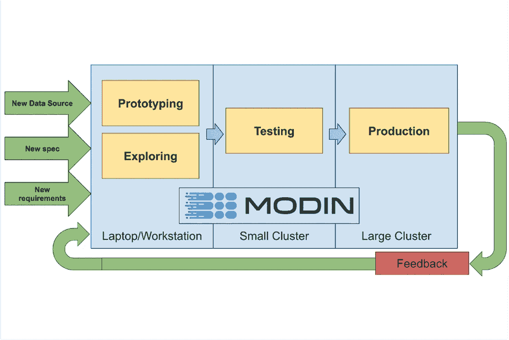

Modin 的一个目标是允许数据科学家对小数据集(千字节)和大数据集(兆兆字节)使用相同的代码。图片由[德文·彼得森](/the-modin-view-of-scaling-pandas-825215533122)提供。

pandas 库提供了像 pandas DataFrames 这样易于使用的数据结构以及数据分析工具。熊猫的一个问题是它处理大量数据会很慢。它[不是为分析 100 GB 或 1 TB 数据集而设计的](https://wesmckinney.com/blog/apache-arrow-pandas-internals/)。幸运的是，有一个[摩丁](https://github.com/modin-project/modin)库，它有一些好处，比如能够通过改变一行代码来扩展你的熊猫工作流，并与 Python 生态系统和 [Ray](https://github.com/ray-project/ray) 集群集成。本教程讲述了如何开始使用 Modin，以及它如何加快你的熊猫工作流程。

# 如何入门摩丁

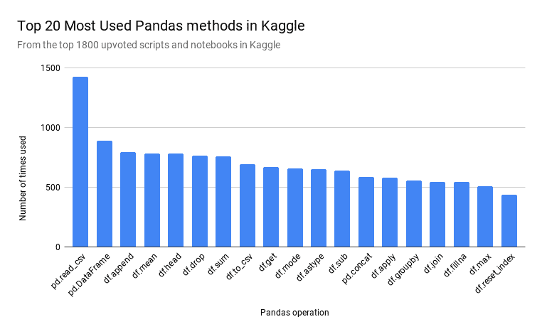

为了确定首先在 Modin 中实现哪些 Pandas 方法，Modin 的开发人员收集了 1800 个投票最多的 Python Kaggle 内核([代码](https://github.com/adgirish/kaggleScape))。图片由[德文·彼得森](/the-modin-view-of-scaling-pandas-825215533122)提供。

Modin 对 pandas API 的覆盖率超过 90%,重点是最常用的 pandas 方法，如 pd.read_csv、pd。DataFrame、df.fillna 和 df.groupby。这意味着如果您有大量数据，您可以更快地执行大多数与 pandas 库相同的操作。本节重点介绍一些常用的操作。

要开始使用，您需要安装 modin。

```
pip install “modin[all]” # Install Modin dependencies and modin’s execution engines
```

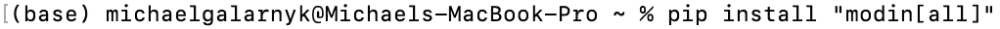

安装 pip 时，不要忘记""迈克尔·加拉尼克拍摄的图片。

## 进口摩丁

Modin 的一个主要优点是它不需要你学习一个新的 API。您只需要更改您的导入语句。

```
import modin.pandas as pd
```

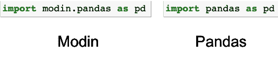

你只需要修改你的 import 语句来使用 Modin(图片由 [Michael Galarnyk](https://twitter.com/GalarnykMichael) 提供)。

## 加载数据(read_csv)

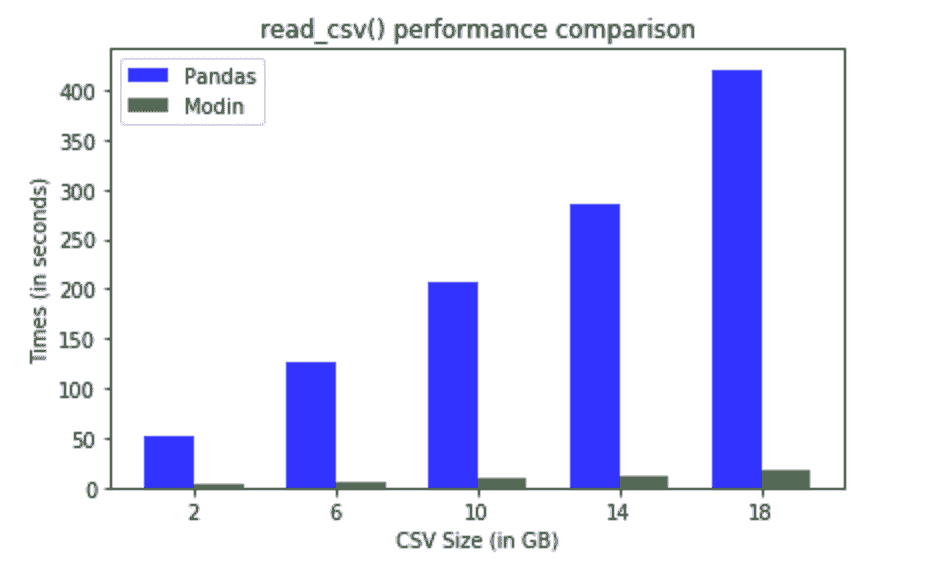

摩丁确实在大型数据集上大放异彩。图片由[德文·彼得森](https://github.com/devin-petersohn/presentations/tree/master/pydata_ny_2018)提供。

本教程中使用的数据集来自大约 2GB 的[健康保险市场](https://www.kaggle.com/hhs/health-insurance-marketplace?select=Rate.csv)数据集。下面的代码将数据读入一个 Modin 数据帧。

```
modin_df = pd.read_csv("Rate.csv”)
```

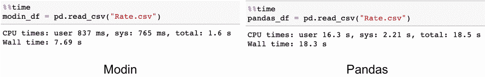

在这种情况下，Modin 速度更快，因为它将工作从主线程转移到异步线程。文件是并行读取的。改进的很大一部分来自于异步构建 DataFrame 组件(图片由 [Michael Galarnyk](https://twitter.com/GalarnykMichael) 提供)。

**头**

下面的代码使用了 head 命令。

```
# Select top N number of records (default = 5)
modin_df.head()
```

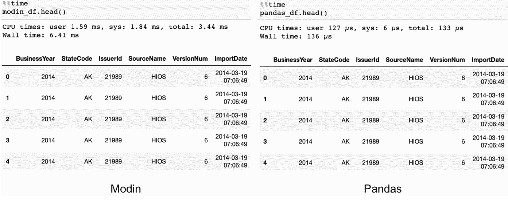

在这种情况下，Modin 较慢，因为它需要一起收集数据。然而，用户应该无法在他们的交互工作流程中察觉到这种差异。

**分组依据**

和熊猫类似，摩丁也有 groupby 操作。

```
df.groupby(['StateCode’]).count()
```

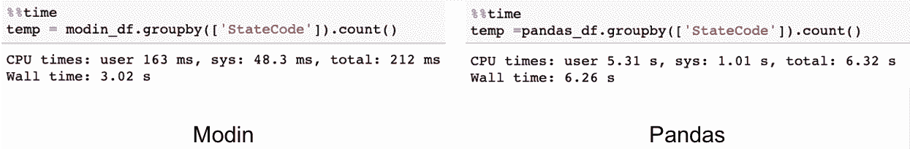

迈克尔·加拉尼克的图片。

请注意，有计划要进一步优化 Modin 中 groupby 操作的性能。

菲尔娜

使用 fillna 方法填充缺失值可以比使用 Modin 快得多。

```
modin_df.fillna({‘IndividualTobaccoRate’: ‘Unknown’})
```

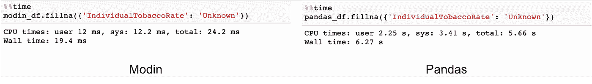

迈克尔·加拉尼克拍摄的图片。

## 默认为 pandas 实现

如前所述，摩丁的 API 覆盖了熊猫 API 的 90%左右。对于尚未涉及的方法，Modin 将默认使用 pandas 实现，如下面的代码所示。

```
modin_df.corr(method = ‘kendall’)
```

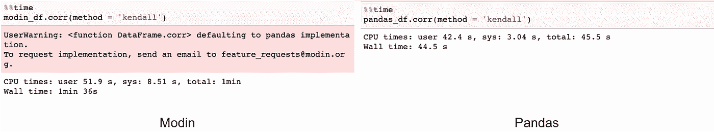

当摩丁默认为熊猫时，你会看到一个警告。迈克尔·加拉尼克的图片。

尽管默认为 pandas 会有性能损失，但无论该命令当前是否在 Modin 中实现，Modin 都将完成所有操作。

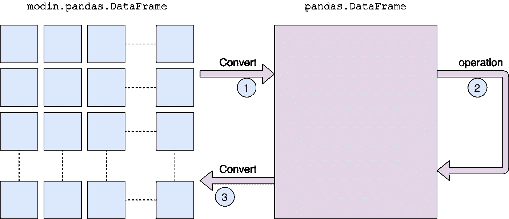

如果一个方法没有实现，它将默认为 pandas(图片由 [Devin Petersohn](/the-modin-view-of-scaling-pandas-825215533122) 提供)。

摩丁的文档解释了这个过程是如何运作的。

我们首先转换成熊猫数据帧，然后执行操作。由于 panda 的通信成本和单线程性质，从分区的 Modin 数据帧到 panda 会有性能损失。一旦 pandas 操作完成，我们就将数据帧转换回分区的 Modin 数据帧。这样，在默认为熊猫之后执行的操作将通过 Modin 进行优化。

# 摩丁如何加快你的熊猫工作流程

modin 使 pandas 工作流程更快的三个主要方法是通过它的多核/多节点支持、系统架构和易用性。

## 多核/多节点支持

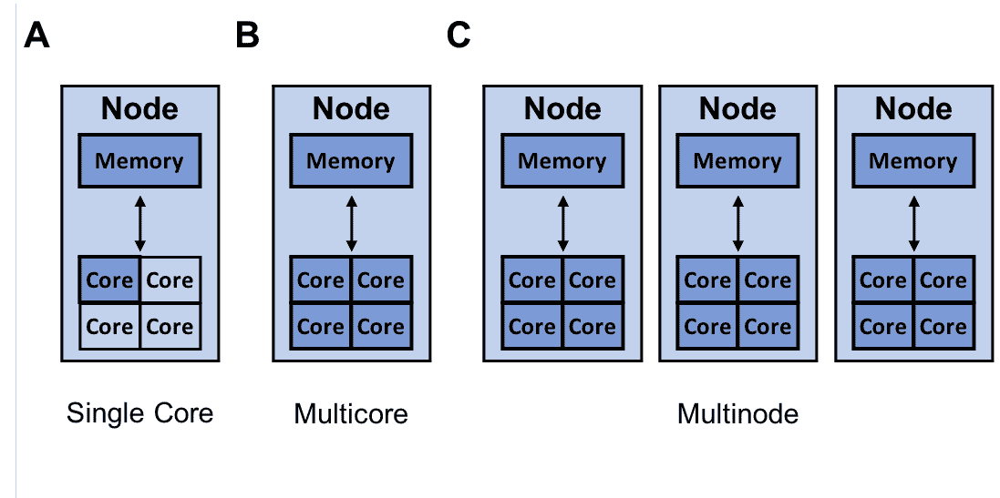

熊猫只能利用单核。摩丁能够有效地利用所有可用的硬件。该图显示了 Modin 可以利用的资源(深蓝色)，具有多个核心(B)和多个可用节点(C)。迈克尔·加拉尼克的图片。

熊猫图书馆只能使用一个核心。由于今天几乎所有的计算机都有多个内核，通过让 modin 利用计算机上的所有内核，有很多机会来加速您的 pandas 工作流。

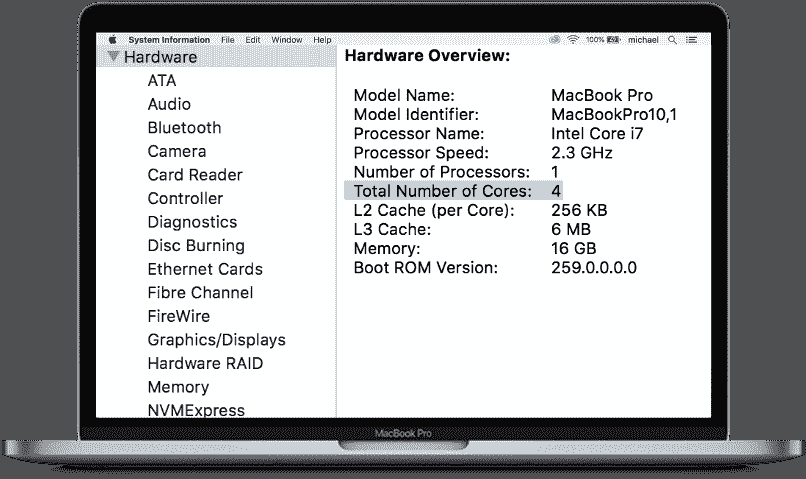

出于这篇博客的目的，你可以把上面的 MacBook 想象成一个 4 核的单节点。图像由[迈克尔·加拉尼克](https://twitter.com/GalarnykMichael)拍摄。

如果你想将你的代码扩展到 1 个以上的节点， [Modin 有一个 API，可以在本地和云提供商/集群上切换运行代码](/the-modin-view-of-scaling-pandas-825215533122)。

## 系统结构

另一个让摩丁比熊猫更快的原因是熊猫本身是如何实现的。熊猫的创造者韦斯·麦金尼做了一个著名的演讲“[我讨厌熊猫的 10 件事](https://www.slideshare.net/wesm/practical-medium-data-analytics-with-python)”，他谈到了一些熊猫缺乏灵活性和表现问题。

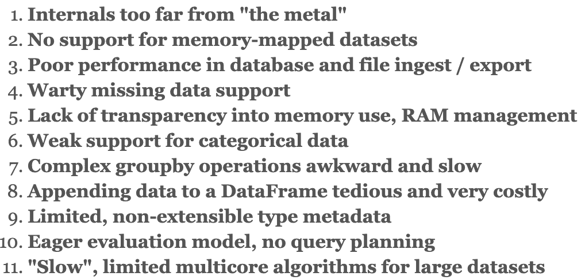

韦斯·麦金尼的一些熊猫问题与表演有关(来自 PyData 2013 的[幻灯片)。](https://www.slideshare.net/wesm/practical-medium-data-analytics-with-python)

摩丁试图解决其中的一些问题。要理解这一点，重要的是要理解它的一些系统架构。下图概述了 Modin 组件的一般分层视图，并对每个主要部分进行了简短描述。

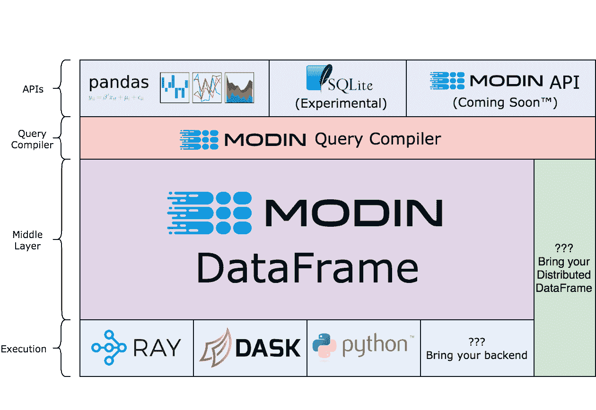

摩丁的系统架构(图片由[德文·彼得森](/the-modin-view-of-scaling-pandas-825215533122)提供)。

API 层:这是面向用户的层，主要是 Modin 对 pandas API 的覆盖。SQLite API 是实验性的，而 Modin API 仍在设计中。

摩丁查询编译器:[除了它的其他职责](https://modin.readthedocs.io/en/latest/developer/architecture.html#query-compiler)之外，查询编译器层严格遵循 pandas API，但是去掉了大部分的重复。

[摩丁数据帧层](https://modin.readthedocs.io/en/latest/developer/architecture.html#modin-dataframe):这是摩丁优化数据帧代数发生的地方。

执行:虽然 Modin 也支持其他执行引擎，如 Dask，但最常用的执行引擎是 [Ray](https://github.com/ray-project/ray) ，您可以在下一节中了解到。

## 雷是什么


Ray 让并行和分布式处理工作更像你所希望的那样( [image source](https://www.reddit.com/r/aww/comments/2oagj8/multithreaded_programming_theory_and_practice/) )。

Ray 是 Modin 的默认执行引擎。本节简要介绍了什么是 Ray，以及它如何不仅仅被用作执行引擎。

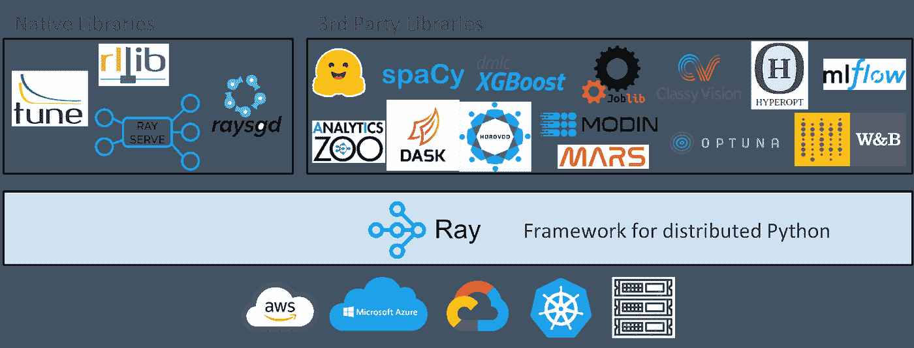

迈克尔·加拉尼克的图片。

上图显示，在高层次上，Ray 生态系统由核心 Ray 系统和用于数据科学的可扩展库组成，如 [Modin](https://github.com/modin-project/modin) 。这是一个用于在多个内核或机器上扩展 Python 应用的库。它有几个主要优点，包括:

*   简单性:无需重写就可以扩展 Python 应用程序，相同的代码可以在一台或多台机器上运行。
*   健壮性:应用程序优雅地处理机器故障和抢占。
*   [性能](/10x-faster-parallel-python-without-python-multiprocessing-e5017c93cce1):任务以毫秒级延迟运行，扩展到数万个内核，并以最小的序列化开销处理数字数据。

因为 Ray 是一个通用框架，所以社区在它的基础上构建了许多库和框架来完成不同的任务，如用于任何规模的超参数调整的 [Ray Tune](https://docs.ray.io/en/master/tune/index.html) 、用于易于使用的可扩展模型服务的 [Ray Serve](https://docs.ray.io/en/master/serve/) 以及用于强化学习的 [RLlib](https://docs.ray.io/en/master/rllib.html) 。它还集成了 scikit-learn 等机器学习库[以及对 PySpark 和 Dask](https://medium.com/distributed-computing-with-ray/how-to-speed-up-scikit-learn-model-training-aaf17e2d1e1) 等数据处理库[的支持。](https://medium.com/distributed-computing-with-ray/data-processing-support-in-ray-ae8da34dce7e)

虽然您不需要学习如何使用 Ray 来使用 Modin，但下图显示，通常只需要添加几行代码，就可以将一个简单的 Python 程序变成一个跨计算集群运行的分布式程序。

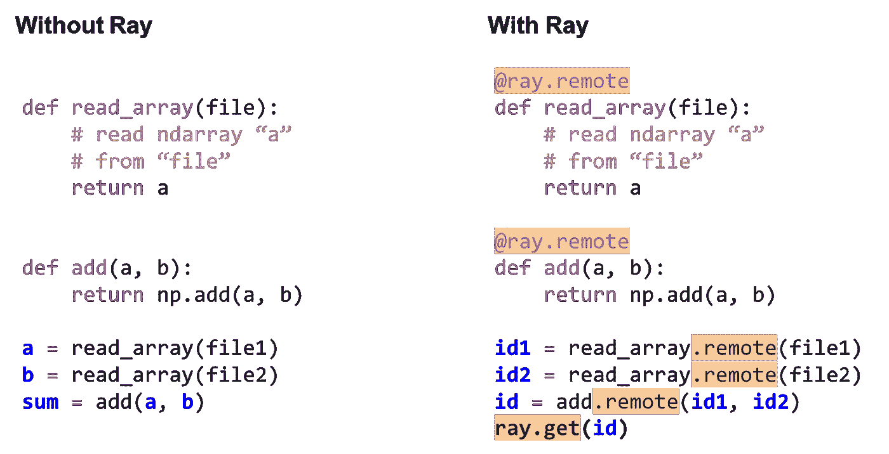

如何用 Ray 把一个简单的程序变成分布式的例子([代码解释](https://youtu.be/zRaWCFJcagI?t=754))。迈克尔·加拉尼克拍摄的图片。

# 结论

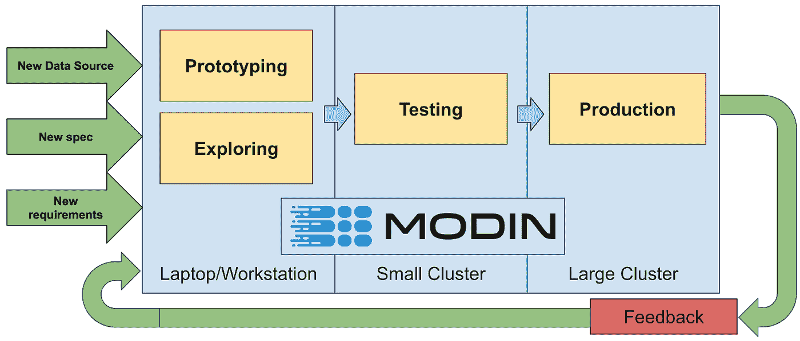

Modin 的一个目标是允许数据科学家对小数据集(千字节)和大数据集(兆兆字节)使用相同的代码。图片来自[德文·彼得森](/the-modin-view-of-scaling-pandas-825215533122)。

Modin 允许您对笔记本电脑上的 10KB 数据集和集群上的 10TB 数据集使用相同的 Pandas 脚本。由于 Modin 易于使用的 API 和系统架构，这是可能的。这种架构可以利用 Ray 作为执行引擎，使扩展 Modin 变得更加容易。如果您对 Ray 有任何问题或想法，请随时通过 [Discourse](https://discuss.ray.io/) 或 [Slack](https://docs.google.com/forms/d/e/1FAIpQLSfAcoiLCHOguOm8e7Jnn-JJdZaCxPGjgVCvFijHB5PLaQLeig/viewform) 加入我们的社区。你也可以查看[射线峰会](http://anyscale.com/ray-summit)页面，看看[射线](https://github.com/ray-project/ray)是如何在整个行业中使用的！

*最初发表于*[*【https://www.anyscale.com】*](https://www.anyscale.com/blog/how-to-speed-up-pandas-with-modin)*。*