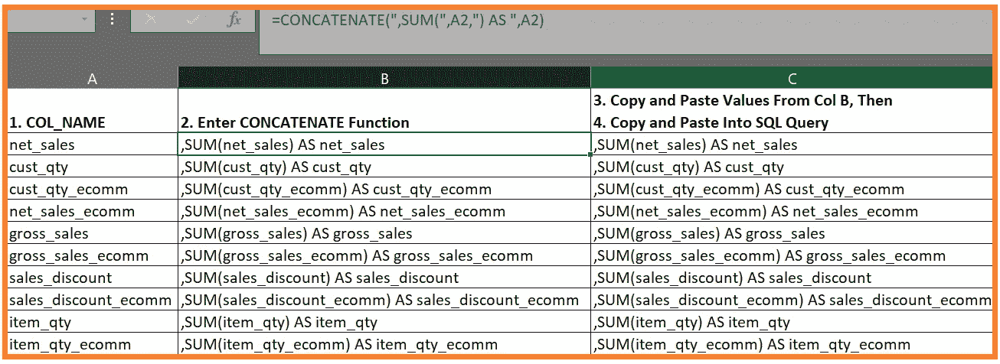

# 如何加快编写大型 SQL 查询

> 原文：<https://towardsdatascience.com/how-to-speed-up-writing-a-large-sql-query-9237c6db56cc?source=collection_archive---------21----------------------->

## 更聪明地工作，而不是更努力:在大约 3 分钟内学会！

图片由 Prateek Katyal 通过 Unsplash 提供

我们都经历过这种情况:从一个大表中提取数据，这个大表有**多**个需要聚合的数字列。为什么要为 30 多列中的每一列都键入“SUM(col_1) AS col_1，etc ”,而这可以简单得多？注意:第二个超级省时器跟在第一个魔术后面！

# Excel 不仅仅可以用于数据透视表

在下图中，我使用了一个假想的 SQL 表中的 10 列。对于每一列，我们将对值求和。我们可以使用 Excel 的内置函数 CONCATENATE()来完成所有繁重的工作，而不是把这些都写出来。

作者照片

在 A 列中，我们有一个要求和的列的列表。在 B 列中，我们输入连接函数。这可以通过别名、不同的聚合等来改变。基本语法是:

1.  逗号(也可以放在末尾)
2.  带有左“(”的聚合名称
3.  列名
4.  用空格结束“)”
5.  “AS”这个词(AS 不是必需的，但既然如此简单，不妨使用它)
6.  再次输入列名

一旦我们创建了 B 列，只将**值**复制并粘贴到另一列。然后，您可以复制这些结果并将其粘贴到您的 SQL 查询中。

对 10 列这样做将节省少量时间。真正的好处是当你开始引入 30 或 50+列时。

# 但是等等，还有更多…

在 A 列或步骤 1 中，我们需要一个列名列表。如果可以加快这个过程，为什么还要把这些都打出来呢？下一部分将根据您使用的 SQL 类型而有所不同。对于 MS SQL Server，您可以使用此查询从表中提取所有列名的列表:

该查询中的一列是您特别命名的表中所有列的名称。您可以复制并粘贴所有列，只删除不需要聚合的列。从 Excel 中删除 20 行比键入 40 个列名要快得多。

# 最后的想法

正如在以前的文章《V2:什么造就了一个伟大的分析师？》中提到的，你一定是个骗子。一个很好的习惯是确定你经常被要求完成的普通类型的任务，找出节省时间的方法，实施它，然后与你团队中的其他人分享这个想法。一如既往，继续学习！

找出“V2:是什么造就了一个伟大的分析师？”：

</v2-what-makes-a-great-data-analyst-bded5e71ec68>  

和 V1:

</what-makes-a-great-data-analyst-f6577cef81a3> 