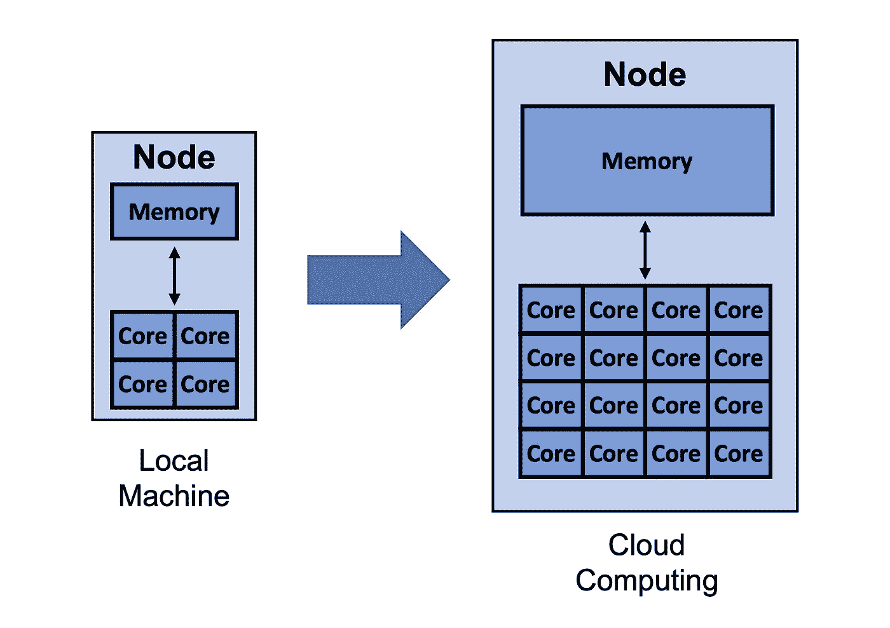
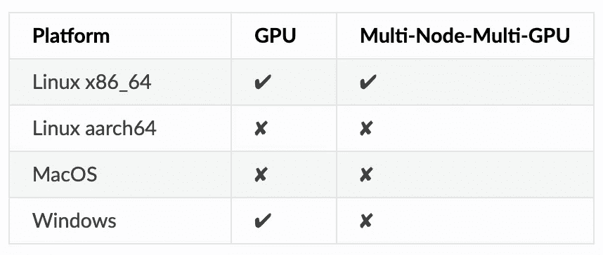
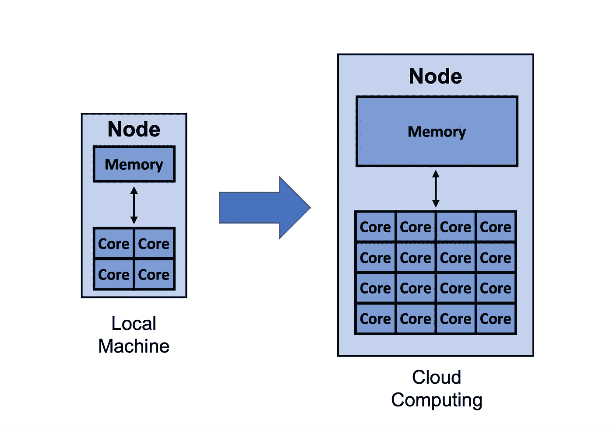
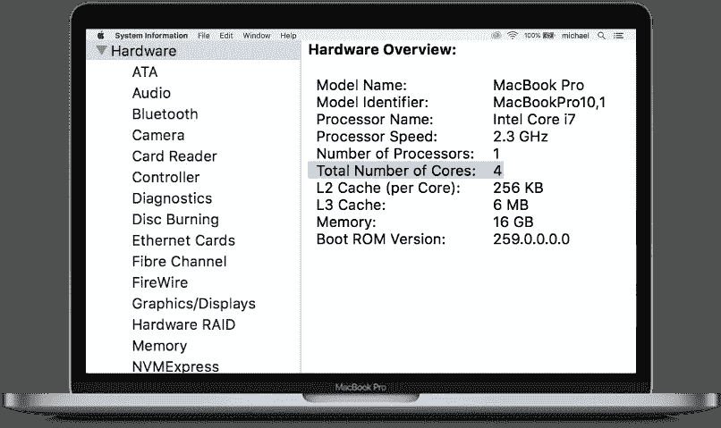
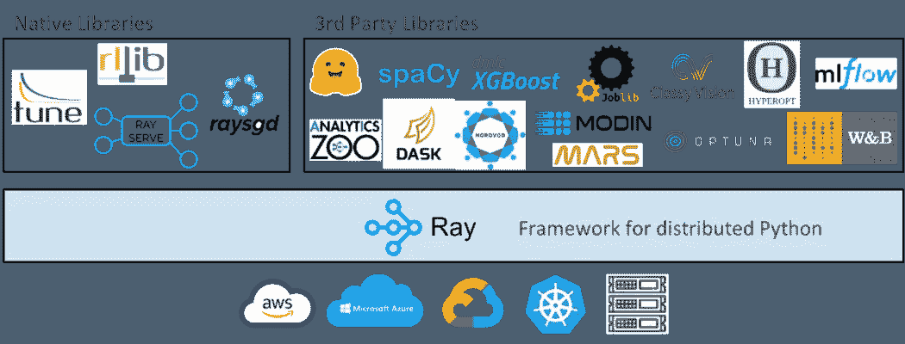
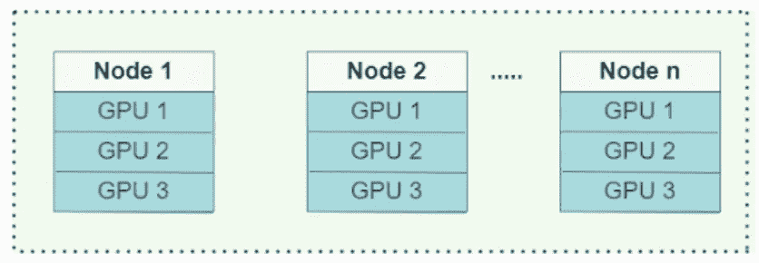
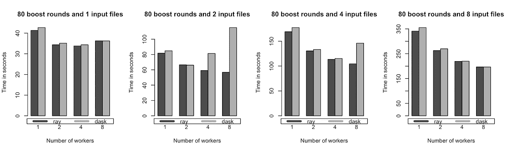
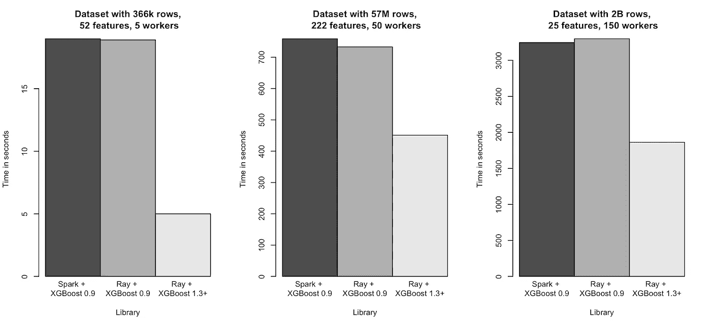

# 如何加快 XGBoost 模型训练

> 原文：<https://towardsdatascience.com/how-to-speed-up-xgboost-model-training-fcf4dc5dbe5f?source=collection_archive---------18----------------------->



虽然增加计算资源可以加快 XGBoost 模型训练的速度，但为了更好地利用可用的计算资源，您也可以选择更高效的算法(图片由 [Michael Galarnyk](https://twitter.com/GalarnykMichael) 提供)。

梯度推进算法广泛应用于监督学习。虽然他们很强大，但他们可能需要很长时间来训练。Extreme gradient boosting，或 [XGBoost](https://xgboost.readthedocs.io/en/latest/) ，是一个开源的梯度增强实现，旨在提高速度和性能。然而，即使是 XGBoost 训练有时也会很慢。

有很多方法可以加速这一过程，例如:

*   改变树的构造方法
*   利用云计算
*   [光线上分布的 XGBoost](https://docs.ray.io/en/latest/xgboost-ray.html#:~:text=XGBoost%2DRay%20integrates%20with%20Ray,training%20run%20parallelized%20by%20itself.)

本文将回顾每种方法的优点和缺点，以及如何开始。

# 改变你的树构造算法

XGBoost 的`tree_method`参数允许您指定想要使用的树构造算法。为你的问题选择一个合适的树构造算法(`exact`、`approx`、`hist`、`gpu_hist`、`auto`，可以帮助你更快的产生一个最优的模型。现在让我们回顾一下算法。

[**确切的**](https://xgboost.readthedocs.io/en/latest/treemethod.html#exact-solution)

这是一个精确的算法，但是它的可扩展性不是很好，因为在每个 split find 过程中，它会遍历所有的输入数据条目。实际上，这意味着长时间的训练。它也不支持分布式训练。可以在原 [XGBoost 论文](https://arxiv.org/abs/1603.02754)中了解更多关于这个算法的内容。

[**约**](https://xgboost.readthedocs.io/en/stable/treemethod.html#approximated-solutions)

虽然确切的算法是准确的，但当数据不能完全适合内存时，它是低效的。原始 [XGBoost 论文](https://arxiv.org/abs/1603.02754)中的近似树方法使用分位数草图和梯度直方图。

[**hist**](https://xgboost.readthedocs.io/en/stable/treemethod.html#approximated-solutions)

在 [LightGBM](https://lightgbm.readthedocs.io/en/latest/) 中使用的近似树方法与`approx`在实现上略有不同(使用了一些性能改进，如 bin 缓存)。这通常比`approx`更快。

[**gpu_hist**](https://xgboost.readthedocs.io/en/stable/treemethod.html#approximated-solutions)

由于 GPU 对于许多机器学习应用来说至关重要，XGBoost 拥有 hist 算法`gpu_hist`的 GPU 实现，该算法支持外部存储器。[它比 hist](https://xgboost.readthedocs.io/en/latest/gpu/index.html) 快得多，使用的内存也少得多。注意，XGBoost 在某些操作系统上没有对 GPU 的**原生支持**。



[XGBoost 文档](https://xgboost.readthedocs.io/en/latest/install.html#python)

[**汽车**](https://xgboost.readthedocs.io/en/stable/treemethod.html#approximated-solutions)

这是参数的默认值。基于数据集的大小，XGBoost 将选择“最快的方法”。对于小型数据集，将使用 exact。对于较大的数据集，将使用近似值。注意，在这种基于启发式的方法中，不考虑 hist 和 gpu_hist，尽管它们通常更快。

如果你运行下面的[代码](https://gist.github.com/mGalarnyk/16d15183f691594bc2c256505a4c42b1)，你会看到使用 gpu_hist 运行模型是如何节省大量时间的。在我的计算机上的一个相对较小的数据集(100，000 行，1000 个要素)上，从 hist 更改为 gpu_hist 将训练时间减少了大约 1/2。

如果 XGBoost 在您的操作系统上没有对 GPU 的**本地支持**，请将第 17 行修改为 methods = ['exact '，' approx '，' hist '，' auto']。这将删除“gpu_hist”。

# 利用云计算



云计算不仅可以让你利用比本地机器更多的内核和内存，还可以让你访问专门的资源，比如 GPU。

最后一节主要是关于选择更有效的算法，以便更好地利用可用的计算资源。然而，有时可用的计算资源是不够的，你只是需要更多。比如下图所示的 MacBook，只有 4 核，16GB 内存。此外，它运行在 MacOS 上，而在撰写本文时，XGBoost 还没有 GPU 支持。



出于本文的目的，你可以将上面的 MacBook 想象成一个 4 核的单节点(图片由 [Michael Galarnyk](https://twitter.com/GalarnykMichael) 提供)。

解决这个问题的方法是在云上利用更多的资源。利用云提供商不是免费的，但他们通常允许你利用比本地机器更多的内核和内存。此外，如果 XGBoost 不支持您的本地机器，很容易选择 XGBoost 支持的实例类型。

如果你想尝试加速你在云上的训练，下面是来自[杰森·布朗利的文章](https://machinelearningmastery.com/train-xgboost-models-cloud-amazon-web-services/)中关于如何在 AWS EC2 实例上训练 XGBoost 模型的步骤概述:

1.设置 AWS 帐户(如果需要)

2.启动 AWS 实例

3.登录并运行代码

4.训练 XGBoost 模型

5.关闭 AWS 实例(仅在使用实例时付费)

如果您选择一个比本地更强大的实例，您可能会发现云上的训练更快。**注意，使用 XGBoost 的多 GPU 训练实际上需要分布式训练，这意味着您需要不止一个节点/实例来完成这个**。

# 使用 Ray 进行分布式 XGBoost 训练

到目前为止，本教程已经介绍了通过改变树构造算法和通过云计算增加计算资源来加速训练。另一个解决方案是用利用 Ray 的 [XGBoost-Ray](https://docs.ray.io/en/latest/xgboost-ray.html) 来分发 XGBoost 模型训练。

## 雷是什么？

Ray 是一个快速、简单的分布式执行框架，可以轻松扩展您的应用程序并利用最先进的机器学习库。使用 Ray，您可以将按顺序运行的 Python 代码，通过最少的代码更改，转换成分布式应用程序。如果你想了解雷和[演员模型](https://en.wikipedia.org/wiki/Actor_model)，你可以在这里了解[。](https://www.anyscale.com/blog/writing-your-first-distributed-python-application-with-ray)



虽然本教程探索了 Ray 如何使 XGBoost 代码的并行化和分发变得容易，但需要注意的是，Ray 及其生态系统也使普通 Python 代码以及现有库的分发变得容易，如 [scikit-learn](https://www.anyscale.com/blog/how-to-speed-up-scikit-learn-model-training) 、 [LightGBM](https://www.anyscale.com/blog/introducing-distributed-lightgbm-training-with-ray) 、 [PyTorch](https://medium.com/pytorch/getting-started-with-distributed-machine-learning-with-pytorch-and-ray-fd83c98fdead) 等等(图片由 [Michael Galarnyk](https://twitter.com/GalarnykMichael) 提供)。

# 如何开始使用 XGBoost-Ray

要开始使用 XGBoost-Ray，[首先需要安装它](https://docs.ray.io/en/latest/xgboost-ray.html#installation)。

`pip install "xgboost_ray"`

因为它与核心 XGBoost API 完全兼容，所以您只需要修改一些代码，就可以将 XGBoost 培训从单台机器扩展到拥有数百个节点的集群。



XGBoost-Ray 支持多节点/多 GPU 训练。在机器上，GPU 通过 NCCL2 传递梯度。在节点之间，他们用 Rabit 代替。你可以[在这里](https://www.anyscale.com/blog/distributed-xgboost-training-with-ray)了解更多信息。

正如您在下面的代码中看到的，这个 API 非常类似于 XGBoost。粗体部分是代码与普通 XGBoost API 不同的地方。

```
**from xgboost_ray import RayXGBClassifier, RayParams**
from sklearn.datasets import load_breast_cancer
from sklearn.model_selection import train_test_split

seed = 42

X, y = load_breast_cancer(return_X_y=True)
X_train, X_test, y_train, y_test = train_test_split(
    X, y, train_size=0.25, random_state=42
)

**clf = RayXGBClassifier(
    n_jobs=4,  # In XGBoost-Ray, n_jobs sets the number of actors
    random_state=seed)**

# scikit-learn API will automatically convert the data
# to RayDMatrix format as needed.
# You can also pass X as a RayDMatrix, in which case
# y will be ignored.

clf.fit(X_train, y_train)

pred_ray = clf.predict(X_test)
print(pred_ray)

pred_proba_ray = clf.predict_proba(X_test)
print(pred_proba_ray)
```

上面的代码显示了使用 XGBoost-Ray 只需要修改很少的代码。虽然您不需要 XGboost-Ray 来训练乳腺癌数据集，但[之前的一篇文章](https://www.anyscale.com/blog/distributed-xgboost-training-with-ray)在不同数量的工作人员(1 到 8)中对几个数据集大小(大约 1.5M 到大约 12M 行)进行了基准测试，以显示它在单个节点上对更大的数据集的性能。



单节点基准测试的训练时间(越短越好)。XGBoost-Ray 和 XGBoost-Dask 在单个 AWS m 5.4x 大型实例上实现了类似的性能，该实例具有 16 个内核和 64 GB 内存([图像源](https://www.anyscale.com/blog/distributed-xgboost-training-with-ray))，

XGBoost-Ray 在多节点(分布式)设置中也是高性能的，如下图所示。



多个合成数据集的多节点训练时间从大约 400k 到大约 2B 行(越低越好)。XGBoost-Ray 和 XGBoost-Spark 实现了类似的性能([图像来源](https://www.anyscale.com/blog/distributed-xgboost-training-with-ray))。

如果你想了解更多关于 XGBoost Ray 的信息，[请查看 XGBoost-Ray](https://www.anyscale.com/blog/distributed-xgboost-training-with-ray) 上的这篇帖子。

# 结论

这篇文章介绍了几种可以用来加速 XGBoost 模型训练的方法，比如改变树的构造方法、利用云计算和在 Ray 上分布式 XGBoost。请记住，有许多不同的方法可以做到这一点，所以请随时用你最喜欢的方式发表评论。如果你想了解雷的最新消息，[可以考虑在 twitter 上关注@ Ray distributed](https://twitter.com/raydistributed)。