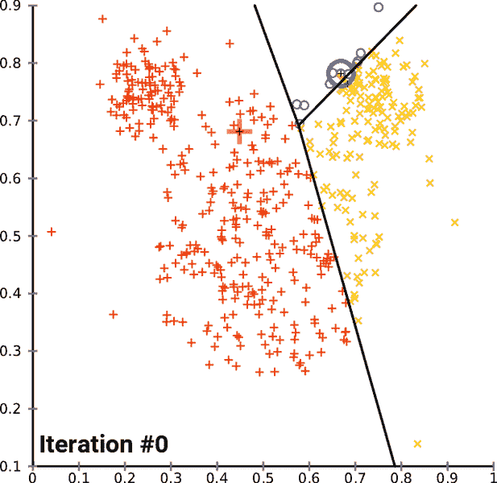

# 如何将 K-Means 聚类速度提高 10 倍

> 原文：<https://towardsdatascience.com/how-to-speed-up-your-k-means-clustering-by-up-to-10x-over-scikit-learn-5aec980ebb72?source=collection_archive---------12----------------------->

## 使用 Faiss 库

[Chire](https://commons.wikimedia.org/wiki/File:K-means_convergence.gif) ， [CC BY-SA 4.0](https://creativecommons.org/licenses/by-sa/4.0/) ，通过维基共享

[K-Means 聚类](https://en.wikipedia.org/wiki/K-means_clustering)是机器学习中最知名、最常用的聚类算法之一。具体来说，它是一种*无监督的*机器学习算法，这意味着它在不需要地面事实标签的情况下进行训练。实际上，要使用它，你所要做的就是设置期望的聚类数 *K* ，初始化 *K* 形心，然后执行算法得到类。

K-Means 的优点在于它的简单性:它真正做的只是计算点和组中心之间的距离，从而导致线性复杂度 *O* ( *n* )。对于大多数不需要处理数百万个数据点的数据集来说，这种方法非常有效。

但这就是我们遇到问题的地方:当涉及到更大的数据集时，K-Means 是缓慢的，因为有太多的数据点需要比较。更糟糕的是，最流行的 K-Means 聚类实现，即 [Scikit-Learn](https://scikit-learn.org/stable/modules/generated/sklearn.cluster.KMeans.html) ，并没有得到很好的优化。

但不用担心。这就是我们的新朋友*费斯*的用武之地！

# 什么是 Faiss？

[*Faiss*](https://github.com/facebookresearch/faiss) 是一个快速相似性搜索和聚类的库。它是由脸书人工智能研究所创建的，非常智能地使用向量，以及跨 CPU 核心的并发性来加快计算速度。更重要的是，它有一个 GPU 组件，用于在更大的数据集上提高速度。

尽管所有这些神奇的事情都发生在幕后，Faiss 仍然提供了一个 Python 接口，这使得编码非常容易。事实上，一旦你进入其中，你会发现代码的布局看起来与 Scikit-Learn 惊人的相似。

# 安装 Faiss 库

安装 Faiss 最简单的方法是使用 conda。首先，创建您的 conda 环境并激活它:

然后，您可以在环境中安装 Faiss 库。我们还将安装 scikit-learn，因为我们将比较两者之间的速度。最后，我们将安装 Keras 和 TensorFlow —我们将使用其中的数据集。

下面我安装了 Faiss 的 CPU 版本，但他们也有一个 [GPU 版本，如果你感兴趣的话](https://github.com/facebookresearch/faiss/blob/master/INSTALL.md)。如果你想做一个非常漂亮的安装，你可以随时查看[安装文档](https://github.com/facebookresearch/faiss/blob/master/INSTALL.md#compile-from-source)。

太好了！现在我们已经准备好让我们的 K-Means 超级快！

# 使用 Scikit-Learn 设置数据和基准

我们要做的第一件事是运行 Scikit-Learn 实现。这是为了建立一个通用的比较基准。供您参考，我运行这些测试的机器有以下规格:

*   i7–8700k CPU
*   32 GB DDR 4 3000 MHz 内存

我们首先要做的是导入和数据加载。

我们将使用经典的 [MNIST 数据](https://en.wikipedia.org/wiki/MNIST_database)。MNIST 是由 60，000 幅训练图像和 10，000 幅测试图像组成的数据集。每个图像是 28x28 像素，在黑色背景上包含一个白色像素的数字(0 到 9 中的一个)。它通常被用作机器学习的快速基准——挑战足够有意义，但又足够小，不需要大量的计算能力。

看看下面的代码，看看我们是如何做到的。我们直接从 Keras 获取数据，对其进行整形，并将输入规范化为浮点类型，值介于 0 和 1 之间。

接下来我们要做的是运行我们的 scikit-learn K-Means 基准测试。看看下面的代码，看看我们是如何做到的。

我们将 K-Means 设置为 10 个聚类，因为这是我们的数据集拥有的类标签(数字)的数量。然后，我们运行我们的`fit()`函数，它实际上创建了集群。我们测量这需要多长时间作为“训练时间”。接下来是我们使用`predict()`函数在测试集上执行的预测。在这里，我们测量对所有样本进行预测所花费的总时间，作为“预测时间”。

不错！

最终，对这 60，000 幅图像的训练花费了 **21.51 秒**，而对 10，000 幅图像的总预测时间为 **0.0203 秒**。

# 使用 Faiss 在 CPU 上运行

现在，我们将看看如何使用 Faiss 实现同样的集群，当然，在 CPU 上要快得多。代码类似于 scikit-learn，只是有几个不同的变量名。

看看下面的代码，看看我们是如何做到的。我们再次将聚类数设置为 10。我们还必须设置两个变量:`niter`，它相当于来自 scikit-learn 的`max_iter`和`nredo`，它相当于来自 scikit-learn 的`n_init`。此外，代替`fit()`，用于训练的函数被称为`train()`，代替`predict()`，用于预测的函数被称为`search()`。

我们再次测量训练和预测的时间。在 Faiss 库的情况下，对这 60，000 幅图像的训练花费了 **2.33 秒**，而总预测时间为 **0.0112 秒**。这几乎是训练的 10 倍加速和预测的 2 倍加速！

# 总是超级快吗？

不，不总是。

在我对更小的数据集做的所有测试中，比如波士顿、鸢尾和 T21，几乎没有改善。我认为这是因为 Faiss 需要时间来设置和矢量化所有的数据，所以只有在更大的数据集上才能实现改进。

如果你想在 GPU 上运行，Faiss 团队也有进一步的建议，他们再次[指向更大的数据集](https://github.com/facebookresearch/faiss/wiki/Comparing-GPU-vs-CPU)。这当然是有意义的，因为将数据从 CPU 传输到 GPU 总是需要时间。因此，一般来说，利用 GPU 只能真正为非常大的数据集(即数百万个样本)加速。

# 了解更多信息

我强烈推荐查看 Faiss Wiki 来了解更多关于如何使用这个库的信息。该库在相似性搜索和检索方面做了令人难以置信的优化(例如 KNN ),并且有[大量的例子](https://github.com/facebookresearch/faiss/wiki/Getting-started)让你开始。