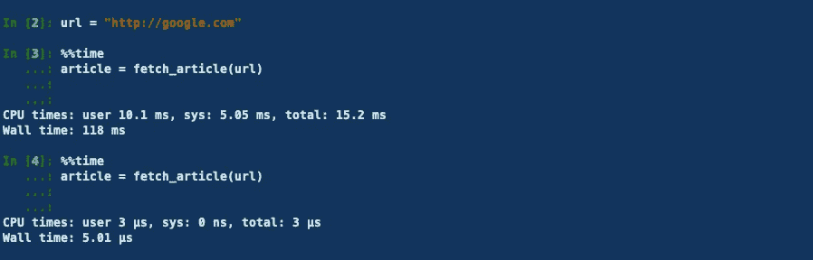
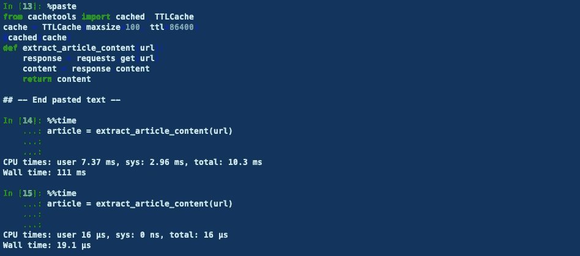

# 如何通过缓存加速 Python 代码

> 原文：<https://towardsdatascience.com/how-to-speed-up-your-python-code-with-caching-c1ea979d0276?source=collection_archive---------1----------------------->

## 使用 cachetools 的快速指南


[安东·马卡连柯](https://www.pexels.com/fr-fr/@anton-makarenko-109081?utm_content=attributionCopyText&utm_medium=referral&utm_source=pexels)的图片来自[派克斯](https://www.pexels.com/fr-fr/photo/chronometre-analogique-rond-argente-sur-panneau-en-bois-marron-1078057/?utm_content=attributionCopyText&utm_medium=referral&utm_source=pexels)

几周前，我开始研究优化我的代码。我了解了常见的[反模式](/18-common-python-anti-patterns-i-wish-i-had-known-before-44d983805f0f)和最坏的实践，查看了创建 Python [对象](/whats-the-difference-between-is-and-in-python-dc26406c85ad)时如何分配内存，并最终理解了多线程和多处理等概念以及[和](https://levelup.gitconnected.com/threading-and-multiprocessing-modules-in-python-14363c13fe9d)之间的区别。

今天，我将告诉你关于**缓存**:一种最小化不必要的计算并加速你的程序的机制。如果做对了，你会惊讶于这是多么有效。

> ***在这篇文章中，我们将了解什么是缓存，什么时候与使用相关，以及我们如何使用*** `***cachetools***` ***python 包将其应用于各种用例。***

事不宜迟，我们来看看吧！🔎

# 什么是缓存？

缓存是一种优化技术，包括将最近(或经常)使用的数据保存在一个内存位置，该位置可以廉价快速地访问重复查询。

由于多种原因，从原始源访问数据可能会很昂贵，缓存似乎是缓解这一问题的解决方案。

👉**让我们考虑一个经常使用缓存的应用** : **web 服务器。**

你正在建立一个小网站来分享你所在地区的本地新闻。

当用户滚动新闻提要并点击一篇文章时，他被重定向到一个网页:浏览器在这一步所做的是查询远程服务器，接收页面源代码并以人类可读的格式呈现它。正如您所料，这个操作非常耗时，因为它涉及到下载远程文件(这是一个网络绑定的操作)和渲染它们。

⚠️每次用户点击这个链接时都重复同样的操作，这似乎是一个不必要的计算。我们已经知道第一次提取后的结果，为什么不重用它呢？

✅:在这种情况下，你应该做的是在获取每篇文章后将内容存储在本地。下次用户打开同一篇文章时，应用程序将从本地副本中读取内容。这会快得多。

# 您可能已经在不知不觉中实现了缓存

让我们回到前面的例子，尝试提出一个简单的缓存实现。

我们想要的是将每篇文章的内容存储在本地内存中(例如 RAM 中的一个对象),如果用户以后请求相同的链接，就可以重用它。

这看起来像是字典的完美工作。

如果我们试图用同一个 url 连续运行两次`fetch_article`。



作者截图

我们会注意到一个巨大的差异。

*   第一次:118 毫秒
*   第二次:5.01 秒

**这是一个 2360 的惊人比例！**

你会告诉我，118 毫秒还是很快。但是想象一下，如果同一个用户每天多次执行这个操作。有很多时间可以节省。

# 使用 cachetools 和 TTLCache 实现相同的缓存机制

`cachetools`是一个提供各种记忆集合和装饰器的模块，包括 Python 标准库的 [@lru_cache](http://docs.python.org/3/library/functools.html#functools.lru_cache) 函数装饰器的变体。

使用`cachetools`添加缓存行为非常简单。我们只需添加几行:

如您所见，我们不再需要处理缓存更新的`fetch_article`函数。

在理解每个 import 语句的作用之前，先让代码替我们说话。



作者截图

运行之后，我们注意到，就像前面的例子一样，相同的时间差。

第一行输入我们需要使用的`cachetools`包。

```
**from cachetools import cached, TTLCache**
```

第二行是我们创建缓存对象的地方:第一个参数指定了我们存储在缓存中的对象的数量。我将它设置为 100，但它可以根据您的使用情况而变化。

第二个参数是生存时间的缩写，基本上是每个结果存储在缓存中的时间。过了这段时间，缓存的结果就过期了。

我随意地将它设置为 86400 秒，这相当于一整天。

```
**cache = TTLCache(maxsize=100, ttl=86400)**
```

第三行是我们添加到每个我们想要使用缓存的函数之上的装饰器。

# 其他缓存策略

我们已经配置了一个 TTL 缓存，但是其他类型的缓存也是可用的。

用哪一个高看你的需求了。有:

*   LFUCache(最少使用):记录检索项目的频率，并丢弃最少使用的项目
*   LRUCache(最近最少使用):丢弃最近最少使用的项目
*   RRCache(随机替换):随机选择物品并丢弃

# 感谢阅读🙏

缓存是一种重要的优化技术，可以防止重复，提高应用程序的速度。

知道何时以及如何添加缓存是提高代码效率的实用技能。

我希望这篇文章对你有用。今天就这些了。

下次见！👋

# 资源

您可以查看以下链接，了解更多关于 Python 中缓存的信息

*   [https://www . program creek . com/python/example/104146/cache tools。TTLCache](https://www.programcreek.com/python/example/104146/cachetools.TTLCache)
*   https://realpython.com/lru-cache-python/
*   【https://dev.to/bhavaniravi/caching-in-python-2a2l 
*   [https://level up . git connected . com/faster-code-with-python-caching-8d a6 E8 a 92 AE 9](https://levelup.gitconnected.com/faster-code-with-python-caching-8da6e8a92ae9)
*   [https://towards data science . com/you-should-never-repeat-computing-in-python-b097d 57 cf 661](/you-should-never-repeat-computing-in-python-b097d57cf661)


照片由[卡斯滕·怀恩吉尔特](https://unsplash.com/@karsten116?utm_source=medium&utm_medium=referral)在 [Unsplash](https://unsplash.com?utm_source=medium&utm_medium=referral) 上拍摄

# 新到中？您可以每月订阅 5 美元，并解锁无限的文章— [单击此处。](https://ahmedbesbes.medium.com/membership)