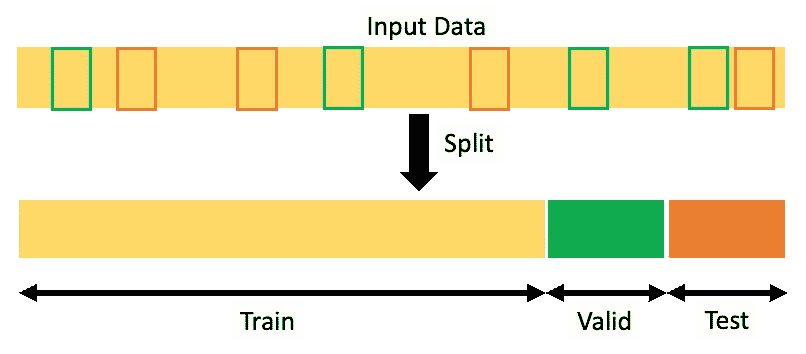
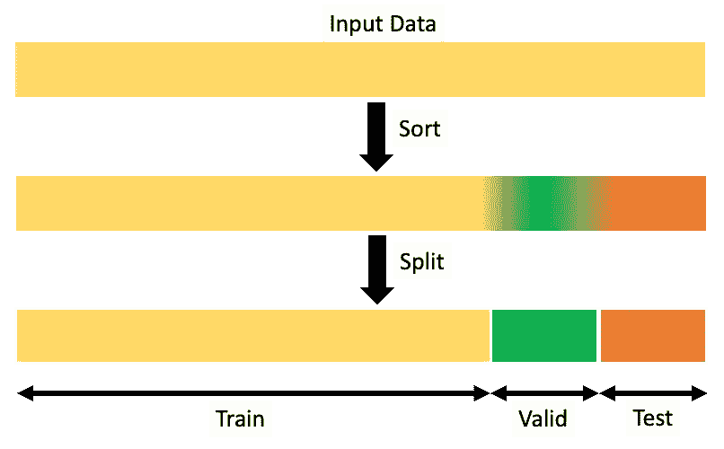

# 如何将数据分成三组(训练、验证和测试)，为什么？

> 原文：<https://towardsdatascience.com/how-to-split-data-into-three-sets-train-validation-and-test-and-why-e50d22d3e54c?source=collection_archive---------0----------------------->

## Sklearn 火车测试拆分不够。我们需要更好、更快的东西

由[内森·杜姆劳](https://unsplash.com/@nate_dumlao?utm_source=medium&utm_medium=referral)在 [Unsplash](https://unsplash.com?utm_source=medium&utm_medium=referral) 拍摄的照片

# 介绍

**为什么需要拆分数据？**

您不希望您的模型过度学习训练数据，并在部署到生产中后表现不佳。你需要有一个机制来评估你的模型推广的有多好。因此，您需要将输入数据分成训练、验证和测试子集，以防止模型过度拟合，并有效地评估模型。

在这篇文章中，我们将涉及以下内容。

1.  培训、验证和测试数据集的简要定义
2.  准备好使用代码来创建这些数据集(2 种方法)
3.  了解数据集分割率背后的科学原理

# 训练有效测试分割的定义

训练有效测试分割是一种评估机器学习模型性能的技术，无论是分类还是回归。你把一个给定的数据集分成三个子集。下面是对每个数据集的作用的简要描述。

## 训练数据集

*   用于学习(由模型)的数据集，即，使参数适合机器学习模型

## 有效数据集

*   调整模型超参数时，用于对符合训练数据集的模型进行无偏评估的数据集。
*   也在其他形式的模型准备中发挥作用，如特征选择、阈值截止选择。

## 测试数据集

*   一组数据，用于对符合训练数据集的最终模型进行无偏评估。

如果你想了解更多关于机器学习专家如何定义训练、测试和验证数据集的信息，请阅读 Jason Brownlee 的这篇文章。#1 下面参考资料部分的链接

# 准备使用代码片段

在本帖中，我们将看到将数据分为训练、有效和测试集的两种方法

1.  随机分裂
2.  使用时间分量进行分割

# 1.随机分裂

您无法使用用于训练的相同数据来评估模型的预测性能。如果你用模型之前没有见过的**新数据**来评估模型，那是最好的。随机分割数据是该**无偏评估最常用的方法。**

将输入数据随机分为训练集、有效集和测试集。作者图片

> ***一、使用 sk learn→‘train _ test _ split’***

在下面的代码片段中，您将学习如何使用两次`train_test_split`来创建我们期望比例的 train | valid | test 数据集。

> ***二世。使用 Fast _ ml →' train _ valid _ test _ split '***

在下面的代码片段中，您将学习如何使用`train_valid_test_split`在一行代码中创建我们期望比例的 train | valid | test 数据集。

# 2)使用时间分量进行分割

你可以听听杰瑞米·霍华德关于机器学习的 fast.ai 讲座:[程序员机器学习入门](https://www.fast.ai/2018/09/26/ml-launch/)。在第 3 课中，他谈到了*“什么是好的验证集，我们利用这个讨论来为这个新数据选择一个验证集。”#2*

他举了一个例子，“假设您正在构建一个模型来预测下个月的销售额。如果你无法知道你建立的模型是否能够提前一个月预测销量，那么你也无法知道当你将一个模型投入生产时，它是否会变得更好。”#3

每当数据集包含日期变量，并且我们希望预测未来的事情时，使用时态变量是拆分数据集的一种更可靠的方法。因此，我们必须使用最新的样本来创建验证和测试数据集。主要思想是始终选择一个样本子集，忠实地代表我们的模型随后将接收到的数据(无论我们面对的是现实世界的问题还是 Kaggle 竞争)。

对数据进行排序后，训练有效的测试数据集。作者图片

> ***一、自定义代码***

在下面的代码片段中，您将学习如何编写自定义代码，以便在对数据进行排序后，创建符合我们期望比例的 train | valid | test 数据集。稍加修改后，您可以直接使用这段代码。

> ***二世。使用 Fast _ ml →' train _ valid _ test _ split '***

在下面的代码片段中，您将学习如何在对数据进行排序后，使用`train_valid_test_split`来创建我们期望比例的 train | valid | test 数据集。所有这些都在一行代码中完成。

# 数据集分割率背后的科学

经常有人问，将数据集分成训练集、验证集和测试集的比例是多少？

这个决定主要取决于两件事。首先是数据中的样本总数，其次是您正在训练的实际模型。

*   有些模型需要大量的数据来进行训练，因此在这种情况下，您可以针对更广泛的训练集进行优化。
*   具有很少超参数的模型将易于验证和调整，因此您可以减少验证集的大小。
*   但是，如果您的模型有许多超参数，您也会希望有一个重要的验证集。
*   如果您碰巧有一个没有超参数或者不容易调整的模型，您可能也不需要验证集。

# **参考文献**

# 1[https://machine learning mastery . com/difference-test-validation-datasets/](https://machinelearningmastery.com/difference-test-validation-datasets/)# 2[https://www.fast.ai/2018/09/26/ml-launch/](https://www.fast.ai/2018/09/26/ml-launch/)
# 3[https://www.youtube.com/watch?v=YSFG_W8JxBo](https://www.youtube.com/watch?v=YSFG_W8JxBo)

# 感谢阅读！！

*   如果你喜欢这个，[关注我的 medium](https://samarthagrawal86.medium.com/) 了解更多。
*   有兴趣合作吗？我们上 [Linkedin](https://www.linkedin.com/in/samarth-agrawal-2501/) 连线吧。
*   请随意写下您的想法/建议/反馈。
*   [卡格尔链接](https://www.kaggle.com/nextbigwhat/train-valid-test-split-instead-of-train-test-split)
*   [Fast_ml 链接](https://pypi.org/project/fast-ml/)

笔记本可在以下位置获得，并附有完整的功能代码:

 [## train_valid_test_split 代替 train_test_split

### 使用 Kaggle 笔记本探索和运行机器学习代码|使用推土机蓝皮书中的数据

www.kaggle.com](https://www.kaggle.com/nextbigwhat/train-valid-test-split-instead-of-train-test-split)