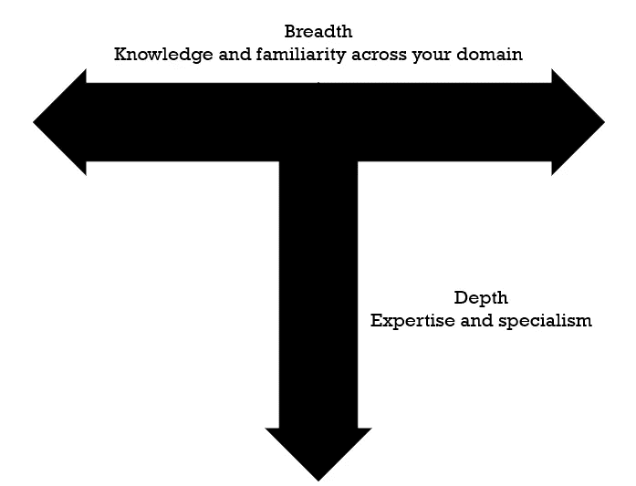

# 2021 年成为伟大数据科学家的 5 种方法

> 原文：<https://towardsdatascience.com/how-to-stand-out-as-a-great-data-scientist-in-2021-3b7a732114a9?source=collection_archive---------34----------------------->

## 帮助您脱颖而出并从经验丰富的数据科学领导者那里获得聘用的技巧

被录用！(图片由[真诚媒体](https://unsplash.com/@sincerelymedia?utm_source=medium&utm_medium=referral)在 [Unsplash](https://unsplash.com?utm_source=medium&utm_medium=referral) 上拍摄)

# 介绍

由于许多原因，数据科学是一个极具吸引力的职业，因此竞争可能会很激烈。下面一些让优秀候选人脱颖而出的建议可能会让你大吃一惊！

我为各种各样的读者写了这篇文章:

*   你可能刚刚开始尝试你的第一个角色
*   你可能在一个无关紧要的技术领域，想要做出改变
*   或者，你可能已经是一名经验丰富的数据科学家，希望提高自己的技能。

## 为什么这么难？

这是我在用户组和社区活动中经常遇到的问题，针对的是有抱负的或职业生涯早期的数据专业人士。这是一个竞争激烈的领域，进入门槛正在发生变化——不再像我开始时那样需要博士学位。随着竞争的加剧，全力以赴的技术能力变得更难让你脱颖而出。

## 为什么要听我的？

我经历过——在桌子的两边！我是一名经验丰富的数据科学家，在科技初创公司中，我经历了高级职位和团队领导职位，一直到总监级别的职位。

在我的职业生涯中，我进步很快，我相信下面概述的几点对此有很大的贡献。

在更高级的职位上，我已经面试并雇佣了几十个候选人——从才华横溢、沉默寡言的专业人士到古怪而出色的人(有时间问问我关于滑板吸血鬼的事情)。我面试过各种各样的角色，包括:

*   数据科学家
*   机器学习工程师
*   数据工程师
*   分析员
*   BI 开发人员
*   DevOps 工程师、CRM 顾问、项目经理…

在所有这些经历中，有一些关键的主题和技能非常突出(剧透:它们大多是非技术性的技能)。我将在下面分享我对它们的看法，并尝试给出一些如何改进它们的建议。

# 技术

现在开始，我不打算讨论你应该知道什么算法，你应该阅读什么统计学书籍，或者你应该选择哪个机器学习堆栈。外面有很多课程，其中很多是免费的，这会给你在这个领域打下良好的基础。我在博士期间通过像[这种](https://www.coursera.org/learn/machine-learning)的免费资源学习，但是有很多方法可以获得正确的体验。

## 宽广还是深邃？

做多面手好还是做专家好？这不是数据科学特有的问题，而是适用于许多技术角色的问题。这个问题也没有明确的答案，这真的取决于你想在什么样的组织中工作。如果你的梦想是在一个专注于一件事的知名技术团队或研究小组中获得一个角色，那么学习机器学习模型的每一种风格都不会像真正深入探索那个利基一样有效。这个领域太大了，不可能成为所有领域的专家(即使是跟上某个领域的研究也已经足够困难了)。

然而，如果你想成为一个组织进入数据科学的第一步，或者你想在一家羽翼未丰的初创公司工作，那么拥有广阔的视野通常是最好的。了解整个行业的工具和技术将使您能够解决更广泛的问题，并更容易知道如何在需求和要求发生变化时从数据中发掘价值。

优秀的候选人通常都有 T 型经验——广泛的知识和对领域的熟悉，以及他们真正闪光的专业(图片由作者提供)。

脱颖而出的候选人往往是 T 型的。他们对更广泛的领域有很好的理解，但只专注于一件事。对你的职业生涯来说，这通常也是一种更有回报的方式！它让你专注于你喜欢的一件事，并真正突出你的优势，同时仍然能够投入到其他类型的项目中。

> 小贴士# 1——在你的专业技能上呈 T 型可以让你集中精力展示你的专业技能，但仍然有助于一个充满活力的团队处理各种各样的任务。

## 展示你的弱点

人们通常认为你必须知道一切并表现出来——尤其是在面试的时候。事实并非如此，那些尝试过的人往往面试得很糟糕。当候选人直截了当地告诉我他们不知道一些事情时，我真的感到如释重负——这会建立信任和融洽。

数据科学是一个庞大而复杂的领域。没有人是这方面的专家。如果你不喜欢统计，那就敞开心扉。

像许多人一样，你可能是一个自学成才的程序员，在这种情况下，不要在编码测试中磕磕绊绊地背诵考试答案，而不是真正理解为什么。

如果你得到了这份工作，仅仅是在面试时假装成功就能让你在最初的几个月里感到不舒服。

> 秘诀 2——诚实面对你的弱点和你不知道的事情。当有人在虚张声势时，通常很容易辨别出来，而你真的不想最终担任一个不允许你表现出色的角色。

## 软件工程

申请数据科学职位的绝大多数人都花了所有的时间学习机器学习、统计、编码，也许还有一些可视化技能。当你开始催促他们关于设计模式或者软件开发方法的时候，他们会完全不知所措。

在 Jupyter 笔记本上编写粗糙的小模型和构建可以轻松打包、测试和扩展到生产中的强大机器学习工作流之间有很大的区别。

花些时间学习软件工程的基础知识。即使你不需要经常使用它，你也会在整个职业生涯中与软件工程师打交道。他们为早期职业数据科学家遇到的许多问题设计了解决方案，因此要向他们学习。此外，如果你受雇于一家公司的技术部门，你的部门主管或首席技术官很有可能原本是一名软件工程师——会说他们的语言对你有好处。

开始学习可能会很困难，但是开始学习以下两本书的主题是不会错的:

<https://amzn.to/39TdfxD>  <https://amzn.to/3jpDE9s>  

> 技巧 3——学习软件工程的基础知识。这将使您的工作更容易，您的代码更健壮，并允许您更好地与组织的其他部分联系起来。

## 运行正常的

对于大多数组织来说，如果最全面、最先进的模型只能由数据科学家来运行，它们就毫无价值。很多数据科学团队和机器学习项目失败是因为他们无法超越探索阶段。

你不需要成为容器和流程编排方面的专家(除非你想成为一名 ML 工程师)，但是将你的模型转化为价值是这个角色的关键部分。我几乎总是问这个问题:

> 你将如何把你的模型交到一个非技术用户的手中？

在我见过的最好的一次面试中，候选人向我展示了他们准备的一些代码和一个非常简单的 web 应用程序，其中包含了这个模型。我马上就能玩它，并围绕他们做了什么提出问题。

如果您想开始使用 MLOps，我在这里写了一个简短的系列文章，带您浏览一个端到端的示例:

</docker-for-data-scientists-part-1-41b0725d4a50>  </docker-for-data-scientists-part-2-7655c02fe975>  

> 技巧 4——了解将您的工作部署到生产环境中的方法和工具。了解基本的 MLOps 将表明你理解模型开发只是工作的一小部分。

## 证明它

有时候，甚至去面试都很困难。这与上一篇技巧文章中给出的例子非常吻合。在你的申请中，没有比证明你已经做过这类工作更有力的了。

如果我在浏览简历时偶然发现一份带有 GitHub 链接的简历，我会一直查看它，并且通常会投入比我分配给那个人的时间更多的时间。它甚至不需要完全是原创的项目，更重要的是看你如何解决问题。如果你刚刚开始，没有大量的作业，把你的课程作业放上去，写一篇关于你是如何完成的评论。这将有助于你在面试开始前引导面试，因为你的面试官几乎肯定会问这个问题。

还有很多其他途径来展示你的作品。可以考虑边学边写博客(Medium 超级容易上手)。不要害怕通过 YouTube 或者在聚会和活动中出现在人们面前——这也将有助于提高一些重要的软技能。

你不一定要成为专家才能为人们的学习做出贡献。如果你对此不确定或者不知道从哪里开始，我强烈推荐阅读奥斯汀·克莱恩的一些作品，比如这篇文章:

<https://medium.com/low-pass-filter/show-your-work-39e6466c4273>  

或者这本伟大的书更详细地探讨了这个问题:

<https://amzn.to/39WKPTp>  

技巧 5——展示你所知道的。在 GitHub 上做项目，在博客上谈论你学到的一些东西，演讲和活动或者活跃的 YouTube 频道会让你鹤立鸡群。

# 结论

今天，我试图分享什么样的技能，至少对我来说，能让一名优秀的数据科学候选人脱颖而出。如果所有这些对你来说都是新的或令人生畏的，选择一个，从小处着手。如果你开始写博客，并一边写一边加入 GitHub，你将开始提高你的技能并获得自信。

很难找到适合你的角色。许多人会喜欢一个更全面的候选人，可以在整个组织中交流。仅仅知道最多的算法或最新的工具并不是让你在求职中脱颖而出的最佳方式。

希望这些建议能让你得到工作。如果您有任何反馈，我将非常感谢您的来信。如果你也是这个领域的招聘经理，我很想知道你的想法。

# 进一步阅读

下面是其他可能有帮助的资源列表。如果上面提到的书有点沉重，那么由 [Ahmed Besbes](https://medium.com/u/adc8ea174c69?source=post_page-----3b7a732114a9--------------------------------) 撰写的这篇关于软件工程的文章是一个很好的开端:

<https://medium.com/swlh/software-engineering-tips-and-best-practices-for-data-science-5d85dbcf87fd>  

这是 Vincent Tatan 对最近 MLOps 思想的一个很好的介绍和概述:

</intro-to-mlops-ml-technical-debt-9d3d6107cd95>  

免责声明:这篇文章确实包含附属链接。