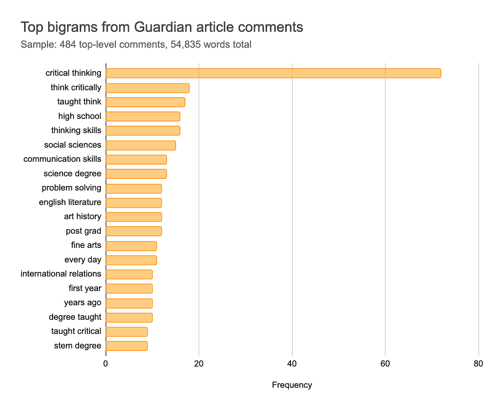
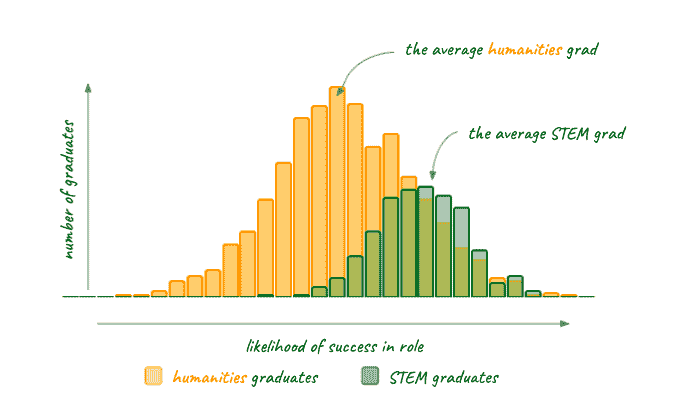
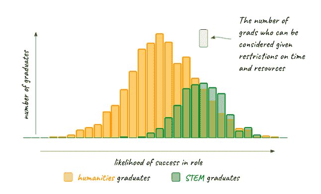
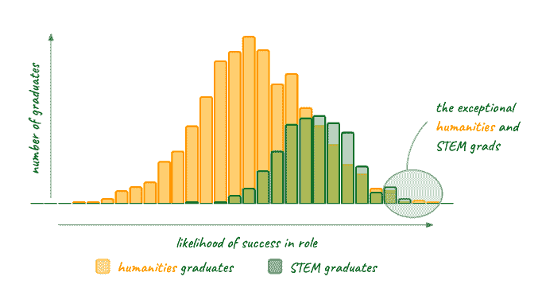

# 如何从艺术开始数据分析师的职业生涯，为什么

> 原文：<https://towardsdatascience.com/how-to-start-a-career-as-a-data-analyst-from-a-background-in-the-arts-and-why-913b3ac6710d?source=collection_archive---------11----------------------->

## 你拥有的 STEM 毕业生可能没有的东西，以及“大数据”必须从艺术中获得的东西

亚当·威尔森在 [Unsplash](https://unsplash.com?utm_source=medium&utm_medium=referral) 上拍摄的照片

*当工科学生称自己为工程师时，难道不令人讨厌吗？他们太超前了。这不像你听到医学生自称医生或艺术生自称咖啡师！*

一个关于艺术学位的笑话是这样说的，这是一条为懒惰或愚笨的人提供的简单的教育途径，充满了乐趣，却不会有任何结果。

对我这个法语毕业生来说，这是一份分析职业，我发现这份职业很有价值，非常适合我在大学期间获得的能力。这与许多人没有明显的联系，但我想鼓励世界上更多的人这样做。

我已经在这个领域工作了十多年，经历了从没有特定培训的起点发展专业技能的过程，以及在伦敦和悉尼的机构、初创企业和大公司中实践分析的过程。

在过去的三年里，我一直在为我的公司雇主招聘分析师，并能够挑战候选人必须拥有 STEM 学科学位的规范，我自己的经验证明，商业分析充分利用了在人文学科研究中获得的能力(我更喜欢“人文学科”而不是“艺术”，但我在这里可以互换使用)。

在这篇文章中，我将试图解释这些能力是什么，它们如何适应分析，以及对于那些考虑从事非 STEM 背景的分析职业的人来说，从哪里开始。我希望激励有正确倾向的毕业生去尝试，说服招聘经理更开放地考虑他们考虑的简历，并在拉近人文科学和科学之间的距离方面发挥作用。

# 什么是“数据分析师”？

首先，我这里所说的数据分析师是指什么？一个人如何利用他们的时间？

我可以说，现在的分析世界由三个核心学科组成，通常分为“数据分析师”、“数据工程师”和“数据科学家”三个标签。简而言之，数据分析师探索数据以获得可用于业务决策的见解，数据工程师管理收集、存储和访问“大”数据所需的计算工具，数据科学家构建可用于业务预测、个性化建议等的软件。

我不会在这里更详细地描述其他两个学科，我只想说，它们是专业的、技术性很强的角色，可能不适合通才毕业生(尽管在入门级别的时候，界限往往很模糊)。但要了解这三个学科之间的更多区别，这里的是一篇比较每个角色的招聘广告的好文章。

另一方面，数据分析师的角色更容易获得，因为相对简单的技术知识的**新手可以通过其他才能**为组织带来价值，例如良好的沟通或洞察力。我们可以把这个角色比作一个记者揭露一个故事，建立一个证据体系来证明一个假设，并通过使用有说服力的故事来吸引他们的读者。对于数据分析师来说，证据通常基于数字数据，由数据可视化引导的故事讲述，但潜在的追求和思维模式是相似的。(关于用数据讲故事的经典例子，请看[汉斯·罗斯林的 TED 演讲](https://www.ted.com/talks/hans_rosling_the_best_stats_you_ve_ever_seen))。

卡斯帕·卡米尔·鲁宾在 [Unsplash](https://unsplash.com?utm_source=medium&utm_medium=referral) 上的照片

隐藏在数据中的故事可能是对某种产品的需求激增，这种需求可能与某些情况有关(如雨天的食品配送)，或者是某种产品对某些类型的受众的特殊吸引力(如自行车社区的咖啡)。在这些情况下，分析师可以帮助做出的商业决策可能是增加下次我们预期的此类事件的资源，或者向这些社区投放广告。

用于数据分析的工具通常包括电子表格(如 Excel、Google Sheets)、数据可视化工具(如 Tableau、Google Data Studio)和 SQL 代码。在本文的后面，您可以找到更多关于如何开始使用这些工具的信息。Python 和 R 在与职位相关的方面也被大量引用，对于统计分析和从互联网上导入公开可用的数据尤其有用，尽管我认为它们在招聘广告中很流行，但它们一开始并不重要，甚至在高层也是不错的选择。

在典型的一周中，经验丰富的数据分析师可能会:

*   与组织中的决策者会面，讨论他们的问题(例如*是什么让我上一次的营销活动如此成功？人们不与我们重复购买的原因是什么？*)并咨询使用可用数据回答这些问题的方法。
*   使用上述任何工具浏览和清理数据集。“清理”是将杂乱的数据排列起来的过程，这通常是分析数据集所花费的最长时间。(举一个简单的例子，显示客户性别的数据列可能混合了“F”、“female”和“Female ”,它们都表示相同的东西，但就数据而言是不同的。为了清理这个，我们可以把所有这些都转换成 F。)
*   花时间做研究，了解他们正在处理的数据是如何收集的。例如，在一个营销结果数据集中，收入按推动购买的渠道细分，我们如何准确地将购买归因于社交媒体广告、电子邮件简讯等？如果客户在选择购买之前看到了来自多个渠道的多个广告，该怎么办？
*   设计实验来测试假设。
*   使用视觉故事向决策者展示调查结果，并根据洞察提出行动建议。

随着分析师加深他们的技术能力，积累领域知识，他们分析的潜在复杂性将会增加，但是**如果他们的观众不能理解他们或者看不到‘那又怎样？’的话，这些都不会有效所有分析的背后。**正是在这种情况下，只见树木不见森林的能力和有说服力的沟通变得至关重要。这是一个让许多技术出众的人绊倒的障碍，也是一个人文学科毕业生可能会发现自己拥有优势的关键领域。

他们还能带来什么？

# 人文学科给数据分析带来了什么？

2020 年，在澳大利亚政府停止资助高等教育中的人文学科后，澳大利亚卫报[向人文学科毕业生征集意见](https://www.theguardian.com/commentisfree/2020/jun/19/what-is-the-value-of-an-arts-degree-tell-us-where-yours-took-you)，询问他们的学位如何让他们适应工作。

你认为评论中的核心主题是什么？你能猜出哪个包含人文价值的两个词在所有评论中出现得最多吗(准确地说，在 484 条评论中出现了 90 次)？

照片由 [Giammarco](https://unsplash.com/@giamboscaro?utm_source=medium&utm_medium=referral) 在 [Unsplash](https://unsplash.com?utm_source=medium&utm_medium=referral) 上拍摄

在我们找到答案之前，这里有一条评论，举例说明了读者反映的主题:

> 这个学位给了我独立思考的工具，让我对别人告诉我的一切提出质疑，并得出自己对真实情况的结论[……]交流技能，能够清晰、清晰、有说服力地写作，一直被雇主视为招聘新员工的最重要的品质之一。然而，奇怪的是，他们似乎没有把他们所寻求的技能和艺术毕业生联系起来。[Bizkit]

这里有一条来自一位在数字领域工作的评论者，我们倾向于将它与 STEM 背景联系起来:

> 我主修英语和古典文学。我职业生涯的大部分时间都在从事基金管理。我为主要的上市公司和私人公司管理过两家公司，并与澳大利亚一家领先的基金经理共事了十多年。我的批判性评估技能弥补了我缺乏会计培训的不足。艺术学位教你如何学习和批判性思考——更多的人应该尝试。*【mgan ci23】*

*这就是:“批判性思考”。在一个面对大量信息和不确定事实的世界里，我们如何知道该相信什么，如何做出决定？*

*该术语及其变体在 484 条顶级评论中出现了 90 次，其他评论中的许多讨论也借鉴了相同的观点。除了“艺术学位”和“人文学位”这两个词，这是遥遥领先的顶级二元词(两个词的组合)，在所有单个词频的统计中(这对挑选关键主题不太有用)，关于“思考”的变体排名非常高。如果你想看的话，这里是数据集。*

**

*作者图片*

*那么，为什么“批判性思维”是人文学科的标志，它真的不是 STEM 教育的一部分吗？*

*我想象会有 STEM 毕业生准备坚定地捍卫他们在学习或其他方面获得的批判性思维能力，但我认为有足够的证据表明，STEM 广泛教授的方式存在一些不足。目前，社会科学领域正在上演一场被广泛讨论的复制危机，这让人们对科学家得出结论的基本方法产生了怀疑，似乎部分科学界已经习惯于使用统计工具[，但他们并不完全理解这些工具](https://fivethirtyeight.com/features/not-even-scientists-can-easily-explain-p-values/)。大卫·爱泼斯坦，[对糟糕的科学研究](https://www.ted.com/speakers/david_epstein)持批评态度，他认为肤浅的思维是科学中的通病，这是从大学里学到的，他在他的书 *Range* 中声称:*

> *像许多研究生一样，我有一个大数据库，按下电脑按钮运行一个普通的统计分析，从来没有人教我深入思考(或根本没有)统计分析是如何工作的。stat 程序给出了一个被普遍认为“具有统计学意义”的数字。不幸的是，这几乎肯定是一个假阳性，因为我不理解在我应用它的环境中统计测试的局限性。审查这项工作的科学家也没有[……]我在没有学会科学推理的情况下就一头扎进了极其专业的科学研究。(然后我也因此得到了奖励，硕士学位)。*

*很容易想象，在工程和计算机科学等学位中，学生们倾向于基于规则的思维，积累事物如何组合的知识，以及解决逻辑问题的灵活性——毫无疑问，这是宝贵的技能。但是，在人类决策的世界里，这些技能能在多大程度上帮助他们呢？在这个世界里，问题往往没有直接的答案，或者存在缺失的事实，或者得出结论的时间有严格的限制。*

*如何在不确定性中衡量证据，形成立场并解释这是人文学科的领域，随着 STEM 浪潮的兴起，也出现了来自人文学科的反压力，要求平衡。一个很好的焦点可以在 [STEAM 运动](https://theconversation.com/steam-not-stem-why-scientists-need-arts-training-89788)中找到，该运动提倡在 STEM 教育中增加“艺术”的“A ”,以培养更多以人为中心的思维。*

*但是这和数据分析有什么关系呢？数据的使用基本上不就是一个数学问题吗？不，这也是在实践中对分析所需要的东西仍然存在巨大误解的地方。最大的误解是，数据告诉我们的是客观事实，这个行业从坚持这一点中受益。在现实中，数据的使用存在不确定性和主观性(参见 [Jonathan Choi 的讨论](/the-perception-of-objectivity-in-data-1abacf195b29)，这是一个很好的起点)，有足够的空间来歪曲数据，以人为地支持一个议程，如《T4》*《谎言实地指南》* (也以标题*武器化的谎言*)和 [*称之为扯淡*等书所强调的。](https://www.goodreads.com/book/show/48889983-calling-bullshit)大机构中有经验的分析师可能都非常熟悉用支持性数据来支持声明的要求，或许有机会质疑它，但没有足够的时间这么做。*

*当谈到人文学科在数据分析中可能扮演的角色时，我们通常会跳到交流方面，但另一个关键的倾向是质疑数据将如何被使用的心态(导致‘那又怎样？’)以及同样重要的数据来源。计算机科学中有一句名言*垃圾进垃圾出*，但是很少有分析师首先质疑数据的有效性，或者将数据的来源作为他们调查的主题。首先，数据收集的方式往往存在偏见或问题，这可能会改变我们对数据的解释，尽管这听起来可能很明显，但分析师往往无法严格检查他们的信息来源。*

*批判性思维是一种很难教授的思维习惯。操纵数据的技术，无论是通过代码还是其他工具，都更容易。*

# *为什么数据分析师职位的招聘广告要求 STEM 学位*

**

*照片由[本工程 RAEng](https://unsplash.com/@thisisengineering?utm_source=medium&utm_medium=referral) 在 [Unsplash](https://unsplash.com?utm_source=medium&utm_medium=referral) 上拍摄*

*从我的第一份工作开始，我得到的每一份分析工作都要求有数学、计算机科学、统计学、经济学之类的学位，而我没有。但是这从来没有阻碍过。*

*在澳大利亚，上大学的风气似乎比在英国更注重职业培训，同事们对我的学位背景感到惊讶。当我在 LinkedIn 上建立新的联系时，我很好奇要检查他们的教育背景，我想不出我在澳大利亚遇到的任何一个分析师没有 STEM 或商业相关学位。在英国，雇主对本科生的学习领域没有那么严格的规定，这里的背景更为混杂。(奇怪的是，软件开发人员似乎来自更古怪的背景)。*

*我不怀疑 STEM 学位为工作提供了一些实用的工具，并为获得第一份工作提供了帮助，但我希望其他人知道，这些学位中的大多数并不直接让毕业生具备工作能力。没有人教数学家如何评估营销活动的表现。没有人教计算机科学家如何在企业中进行 A/B 测试。他们在工作中学会了这些东西，雇主们寻找那些学得快、教得愉快、并且在进入角色后能与每个人相处融洽的毕业生。*

*对于数据分析至关重要的技术技能可以在工作中相当快地学习到足够有用的标准，职业发展很快就开始专注于构建领域知识(即，你所在的行业如何运作，最新趋势是什么)和提高“软技能”，而大学学位没有涵盖任何相关的深度。这并不是说 STEM 与这一角色无关——科学方法和某些细节(如对统计学的理解)非常有用——但我的观点是，它不会直接让你为这份工作做好准备，人文学科中的一些品质也是有用的，但被低估了。最终，**是一个适合有范围**的人的角色。*

*它可能有助于求职者理解，招聘广告中需要 STEM 的主要原因是，它们充当过滤器，有助于减少招聘人员必须审查的申请数量。由于任何人都可以自由申请公开招聘的职位，大公司可能会收到数百份申请，根本不可能审查每一份，因此他们需要一种方法来最大限度地增加在时限内找到优秀候选人的机会。*

*为此，预先增加 STEM 学位的要求是假设 STEM 申请者比人文学科申请者更适合这个职位。申请人池的假定组成可能如下所示。(这些分布是假设的，其目的是帮助将招聘经理使用的决策启发概念化。它的目的不是洞察人才库的规模和形状。)*

**

*作者图片*

*条形图代表了人文学科和 STEM 毕业生在初级数据分析师职位上取得成功的可能性分布。*

*我们假设一般的 STEM 毕业生比一般的人文毕业生有更高的成功可能性，但是毕业生的适合性在每个组中都是不同的，一些人文毕业生比许多 STEM 毕业生更适合。*

*尽管一些优秀的人文学科候选人处于分布的高端，但如果雇主考虑申请人的时间有限，那么只从绿色候选人中挑选将是一种合理的节省时间的措施。*

**

*作者图片*

*但是黄色分布右尾的例外人文毕业生呢？不幸的是，错过它们是使用过滤器的代价。他们被拒绝不是因为他们实际上不适合这个角色，而是因为他们不适合*雇主的考虑*考虑到他们的时间限制和他们所发挥的启发。(作为一个有趣的旁白，[有人建议](https://www.businessinsider.com.au/why-nigerian-scam-emails-are-obvious-2014-5)类似的过程是对电子邮件骗子糟糕的英语语法采取行动——那些不太可能上当的人会对糟糕的写作产生怀疑，并立即离开，从而最大限度地减少骗子在后续工作中浪费的时间，这些工作最终不会有回报。)*

**

*作者图片*

*所以，求职者们，要明白，未能通过申请的筛选阶段可能与你在该职位和职业中的潜力无关，而是与雇主考虑每份申请的实际限制有关。可悲的是，目前使用 STEM 的启发式方法是有效的，所以那些受害者需要另一条途径。*

# *获得第一份分析工作*

*不管你的背景如何，如果“前门”被证明是困难的，这里有一些进入这个领域的技巧。*

## *1.开始在线学习*

*我进入分析领域得益于书本上的一些自学。自那以后，行业对数据分析师的需求急剧膨胀，在线学习资源的数量也在不断增加。钻研一些知识不仅会给你在数据分析职业中直接有用的技能，还会测试你是否真的喜欢这个职业。*

*我向初学者推荐的免费在线资源是 [Mode 关于 SQL](https://mode.com/sql-tutorial/introduction-to-sql/) 的优秀入门书。对于更广泛的付费选项，我建议潜入[数据营的](https://www.datacamp.com/courses/introduction-to-sql)交互式 SQL 教程或[谷歌在 Coursera](https://grow.google/dataanalytics) 上的数据分析课程，这似乎是[现在得到了很多关注](https://www.youtube.com/results?search_query=google+data+analytics+certificate)。*

*连续三个月每周给自己 10 个小时的学习时间，你将会很好地体会到工作中涉及的内容和一些有用的技能，以及你的动机的证据。*

## *2.网络*

*在 LinkedIn 和 Twitter 上关注从事分析工作的分析机构和个人。不要犹豫向陌生人寻求建议，如果你大多得不到回应也不要气馁。他们发布的内容会让你对当前社区中的热门话题有一个很好的了解，并且通常会有免费网络研讨会和你可以参加的当地活动的链接。在 meetup.com 上查找您当地城市的分析活动(我推荐“数字分析星期三”或“数据与分析星期三”，这在世界各地的许多主要城市每月举行一次)。请你认识的人把你介绍给他们认识的分析师，并获得他们的建议。*

## *3.通过其他角色输入分析*

*你很难找到数据没有用的业务功能。不要因为申请其他职位而觉得自己走错了路，一旦进入，就想办法接触数据。自愿清理一份电子表格，或者挑战自己，用数据来改善你的部分功能。或许你可以组织一次内部调查，并为你的团队制作一个可视化结果的包。与贵组织中负责数据分析的人员联系。晚上坚持参加网上课程。*

# *结束语*

*我打算把这篇文章主要写给来自艺术界的求职者，事实上，你找到了写这篇文章的方法，这可能意味着你已经把这当成了你人生的一个方向。我希望我已经能够激励你去冒险，并说服你这可能是一个可行的选择，尽管所有的迹象都指向相反的方向。*

*对于其他人，尤其是商界人士，我希望这能让您思考一下在动态、快速发展的环境中进行数据分析所面临的挑战，以及更多批判性思维的必要性。*