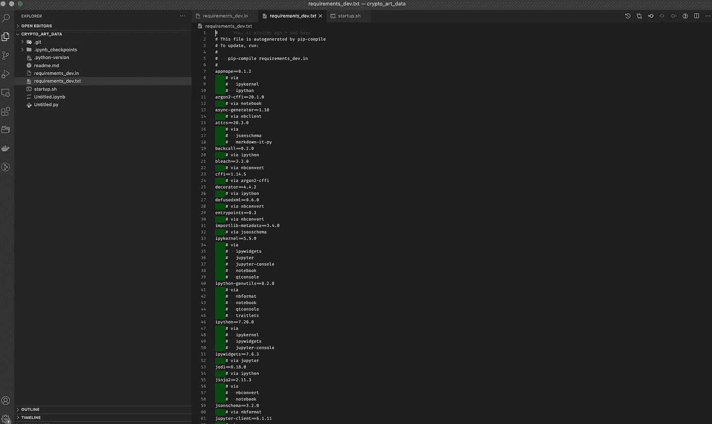
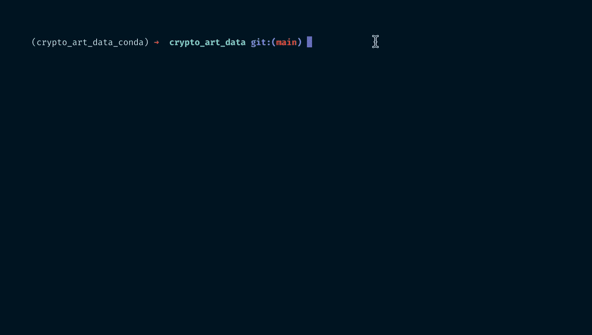
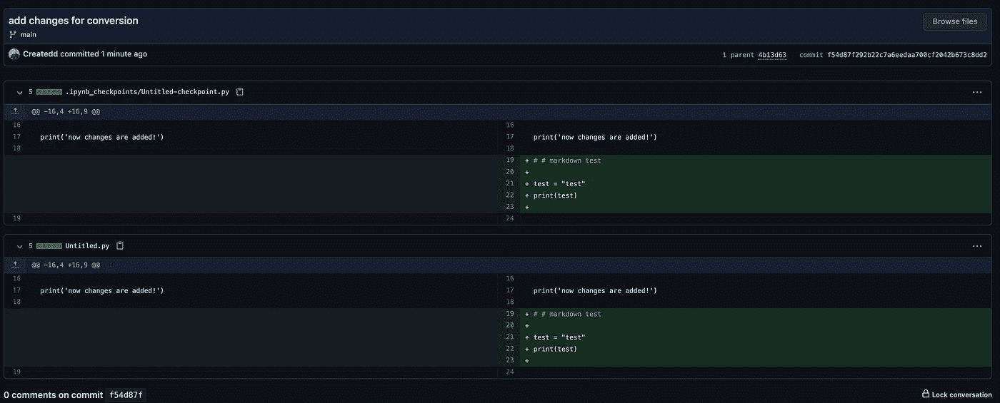

# 如何在 2021 年开始一个数据科学项目样板？

> 原文：<https://towardsdatascience.com/how-to-start-a-data-science-project-boilerplate-in-2021-33d81393e50?source=collection_archive---------22----------------------->

## 在本文中，我想展示我如何准备数据科学项目的三个步骤。


艾通过作者创造艺术。更多例子上[](https://www.instagram.com/art_and_ai/)**；受香波特* [*的启发，https://unsplash.com/photos/bHlZX1D4I8g*](https://unsplash.com/photos/bHlZX1D4I8g)*

# *目录*

*   *[为什么](https://github.com/Createdd/Writing/blob/master/2021/articles/dataBoilerplate.md#why)*
*   *[1。创建项目手续](https://github.com/Createdd/Writing/blob/master/2021/articles/dataBoilerplate.md#1-create-project-formalities)*
*   *[2。依赖关系管理](https://github.com/Createdd/Writing/blob/master/2021/articles/dataBoilerplate.md#2-dependency-management)*
*   *[以更好的方式安装依赖项](https://github.com/Createdd/Writing/blob/master/2021/articles/dataBoilerplate.md#install-dependencies-in-a-better-way)*
*   *[捆绑在单个启动脚本中](https://github.com/Createdd/Writing/blob/master/2021/articles/dataBoilerplate.md#bundle-in-single-startup-script)*
*   *[3。正确跟踪 jupyter 笔记本的变化](https://github.com/Createdd/Writing/blob/master/2021/articles/dataBoilerplate.md#3-tracking-jupyter-notebook-changes-properly)*
*   *[转换成 python 文件](https://github.com/Createdd/Writing/blob/master/2021/articles/dataBoilerplate.md#convert-to-python-files)*
*   *[为 jupytext 安装 git hook](https://github.com/Createdd/Writing/blob/master/2021/articles/dataBoilerplate.md#install-githook-for-jupytext)*
*   *[免责声明](https://github.com/Createdd/Writing/blob/master/2021/articles/dataBoilerplate.md#disclaimer)*
*   *[关于](https://github.com/Createdd/Writing/blob/master/2021/articles/dataBoilerplate.md#about)*

# *为什么*

*我开始的每个数据科学项目都有不同的结果，但开始总是一样的。在本文中，我想展示我如何准备数据科学项目的三个步骤。它涵盖了以下主要领域*

*   *应对虚拟环境*
*   *管理依赖性和*
*   *正确跟踪 jupyter 笔记本的变化*

*我想涵盖这些方面，因为我没有找到一个合适的样板为我这样做。我知道库克科特项目。然而，我不是在寻找一个文件夹结构，因为这很容易适应。我在寻找自动化步骤，确保我在开发过程中保持适当的标准。*

*以下网址提供了简单的样板文件设置:*

*https://github.com/Createdd/data_science_boilerplate[▶️](https://github.com/Createdd/data_science_boilerplate)*

*它专注于在 jupyter 笔记本电脑中开发概念验证，而不是生产。如果你也想要一个生产设置，请告诉我。*

# *1.创建项目手续*

*本地设置步骤。我用的是 Conda 环境和 Git + Github。按照以下步骤来做:*

1.  *创建本地文件夹`mkdir NAME`*
2.  *用`NAME`在 Github 上创建一个新的存储库*
3.  *创造康达环境`conda create --name NAME python=3.7`*
4.  *在 jupyter 中注册新环境`ipython kernel install --name NAME--user`*
5.  *激活康达环境`conda activate PATH_TO_ENVIRONMENT`*
6.  *创建 git repo `git init`*
7.  *连接到 Github repo。添加自述文件，提交并*

```
*git remote add origin URL_TO_GIT_REPO
git branch -M main
git push -u origin main*
```

# *2.依赖性管理*

*我用 Python 开发了很长时间，仍然在改进依赖管理设置。这是我目前的做法。*

*Pip 没有提供自己的适当的依赖性管理，因为*

*   *pip 冻结的需求文件不提供任何结构*
*   *安装的版本没有固定，这导致每次安装都不一样*
*   *没有依赖关系解析*

*还有一些有用的附加库:*

*   *[pipdeptree](https://github.com/naiquevin/pipdeptree) 允许在层次视图中显示依赖关系*
*   *[pip-tools](https://github.com/jazzband/pip-tool) 允许固定依赖性*

# *以更好的方式安装依赖项*

*我使用一个自动化的工作流程来处理依赖列表和编译。*

*   *将使用固定的子依赖关系更新需求文件，并创建需求文件。*

*因此，我们需要用*

```
*python -m pip install pip-tools*
```

*来使用它，而不是编写常规的`pip install jupyter jupytext`，*

*我们通过以下方式创建一个`requirements_dev.in`文件*

```
*touch requirements_dev.in*
```

*然后我们打开这个文件，添加我们想要添加的库。我们将在整个存储库中遵循这种风格！*

*让我们从依赖关系开始*

*   *jupyter 笔记本*
*   *jupytext(用于转换。ipynb 文件)*
*   *pipdeptree(用于显示依赖关系树)*
*   *when-changed(编译和安装包的监视程序)*

*那就跑*

```
*pip-compile requirements_dev.in
pip install -r requirements_dev.txt*
```

*这会生成一个格式很好的`requirements_dev.txt`文件，然后安装所有的东西*

**

*良好的排序和显示依赖关系；作者图片*

*所以每次我们添加一个库时，我们都需要运行编译命令。这也是一个可以自动化的步骤。*

*我们将使用 [when-changed](https://github.com/joh/when-changed) 库。因为我们已经用以前的列表安装了它。我们现在可以做以下事情:*

```
*when-changed requirements_dev.in pip-compile requirements_dev.in;pip install -r requirements_dev.txt*
```

*现在，每次您添加一个包并保存到`.in`文件时，编译和安装命令都会被触发。*

# *捆绑在单个启动脚本中*

*为 jupyter notebook 和 change watcher 设置自己的终端窗口可能会很烦人。一种解决方案是将命令捆绑在自己的 bash 脚本中。*

```
*touch startup.sh*
```

*然后插入正在执行的命令，比如*

```
*#!/bin/bashjupyter notebook &
when-changed requirements_dev.in pip-compile requirements_dev.in &
when-changed requirements_dev.in pip install -r requirements_dev.txt*
```

*然后使文件可执行(在 mac 上)并启动脚本。*

```
*chmod +x startup.shtbash startup.sh*
```

*现在两个命令在同一个终端窗口中并行运行。*

**

*运行捆绑包脚本；作者图片*

# *3.正确跟踪 jupyter 笔记本的变化*

# *转换为 python 文件*

*我们将使用 jupytext 将`.ipynb`文件转换成`.py`文件。这允许正确跟踪 Git 中的变化。*

*我们已经在前面的步骤中安装了软件包。现在我们只需要添加一个 githook 来自动完成转换。*

# *为 jupytext 安装 githook*

*在`.git/hooks/pre-commit`中设置一个钩子，用于正确跟踪 git 中的笔记本变化；*

```
*touch .git/hooks/pre-commit
code  .git/hooks/pre-commit*
```

*把这个复制到文件里*

```
*#!/bin/sh
# For every ipynb file in the git index, add a Python representation
#jupytext --from ipynb --to py:light --pre-commit
jupytext --from ipynb --to jupytext_conversion//py:light --pre-commit*
```

*之后让钩子可执行(在 mac 上)*

```
*chmod +x .git/hooks/pre-commit*
```

*现在，在提交对 jupyter 笔记本的更改之前，该文件被转换为 python 文件，并且这些更改将完美地反映出来:*

**

*正确跟踪 ipynb 变化；作者图片*

*以下网址提供了简单的样板文件设置:*

*https://github.com/Createdd/data_science_boilerplate▶️*

# *放弃*

*我与本文中使用的任何服务都没有关联。*

*我不认为自己是专家。我不是博主什么的。我只是记录工作流程。因此，这些内容并不代表我任何作品的质量，也不完全反映我对事物的看法。*

*我总是乐于听取建设性的意见以及如何改进。*

*这写于 **21.02.2021** 。我无法监控我的所有文章。当你在时间流逝后读到这篇文章时，提示已经过时，流程已经改变，这种可能性很大。*

# *关于*

*丹尼尔是一名艺术家、企业家、软件开发人员和商业法毕业生。他的知识和兴趣目前围绕着编程机器学习应用程序及其所有相关方面。从本质上说，他认为自己是复杂环境的问题解决者，这在他的各种项目中都有所体现。*

**

*连接到:*

*   *[Allmylinks](https://allmylinks.com/createdd)*

*直接:*

*   *[领英](https://www.linkedin.com/in/createdd)*
*   *[Github](https://github.com/Createdd)*
*   *[中等](https://medium.com/@createdd)*
*   *[推特](https://twitter.com/_createdd)*
*   *[Instagram](https://www.instagram.com/create.dd/)*
*   *[createdd.com](https://www.createdd.com/)*