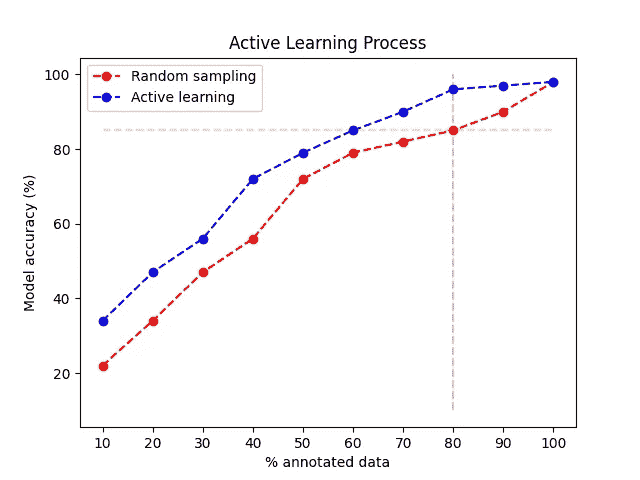
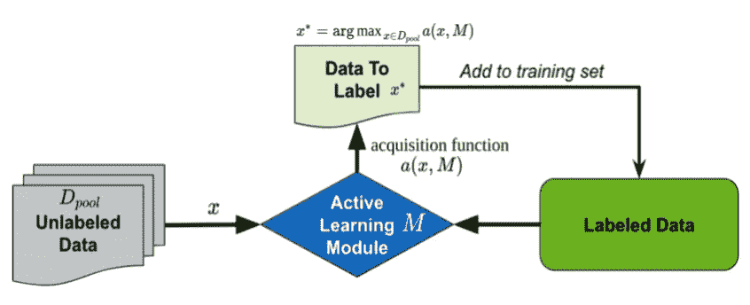
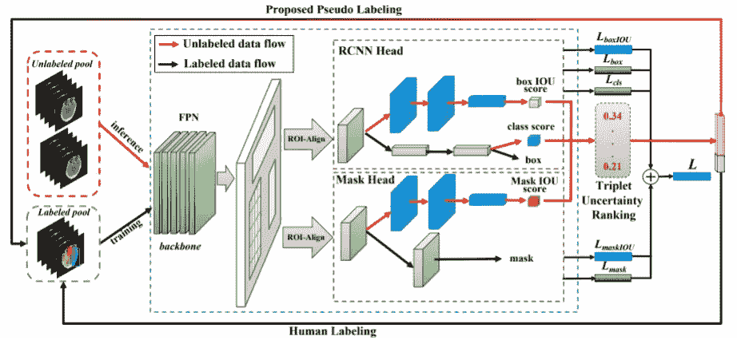
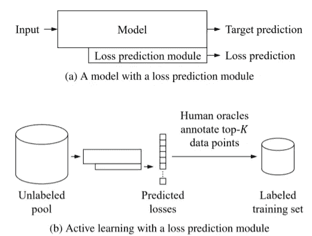
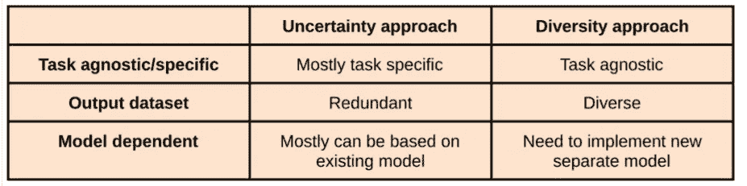

# 如何开始成为一个主动的学习者？

> 原文：<https://towardsdatascience.com/how-to-start-being-an-active-learner-8d311d68fb70?source=collection_archive---------20----------------------->

## 计算机视觉主动学习简介

照片由[莱昂](https://unsplash.com/@myleon?utm_source=unsplash&utm_medium=referral&utm_content=creditCopyText)在 [Unsplash](https://unsplash.com/s/photos/education?utm_source=unsplash&utm_medium=referral&utm_content=creditCopyText) 上拍摄

深度学习(DL)模型是计算机视觉中许多任务最常用的方法。DL 通过使用大量的标记数据取得了巨大的成果。然而，随着计算机视觉任务变得更加复杂，DL 网络变得更大，参数数量增加，这需要更多的标记数据来训练网络。

*为什么这是个问题？*

*   **标注周期** —要标注的数据集越大→价格越高+完成所有标注的时间越长。
*   **训练周期** —更大的训练数据集→更长的训练时间。

***主动学习是来救援的！***

**DL 中主动学习的目标是用更少的数据——更便宜的标注预算和更短的训练周期——训练一个模型，并获得相似的性能。**

在这篇文章中，我将描述什么是主动学习，分享一些常见的方法，它们的利弊，并添加一些个人见解。

**图 1-绿线** —相同数据量的准确度更高。**橙色线—** 数据量更少时精度水平相同。(图片由作者创作)

什么是主动学习？主动学习是一个连续的训练管道，它利用不同的方法(如下所述)来选择下一个要注释的样本。选择过程是知情的，而不是通常所做的随机选择过程(图 3 (b))。

**图 2 —** 主动学习通用管道[8]

我们怎样才能做到呢？主动学习方法旨在从我们的未标记图像集中选择最具信息量和代表性的图像子集。这样，我们可以在使用较小数据集的同时获得更高的模型精度。

# 主动学习方法:

主动学习方法可以分为三大类[1]:

1.  *不确定性方法* —定义和测量不确定性的数量以选择数据点(图 3 (c))。
2.  *多样性方法* —选择代表未标记池整体分布的多样性数据点(图 3 (d))。
3.  *预期模型变化* —选择会导致当前模型参数或输出最大变化的点，如果它们的标签已知的话。

**图 3-** 采样策略【4】。蓝点和红点代表不同类别的数据。

*预期模型变化*方法*，a* 成功应用于小模型，但对于最近的深度网络在计算上不切实际。因此，我们将着重于前两类。

根据我的经验，主动学习方法也可以分为*特定任务型和*不特定任务型。如果我有一个包含几个任务的管道，我可能更喜欢找到一个任务不可知的方法，用于所有的模型。相比之下，我可能已经找到了一个很好的方法，针对某个特定的任务，极大地提高了我的结果。在这种情况下，维护几种不同的方法可能是值得的。

# 不确定性方法:

不确定性方法旨在选择模型最不确定其输出的图像。因此，大多数不确定性方法是依赖于模型的，需要针对每个新模型进行训练或调整。

## 直接在输出上测量不确定性(特定于任务和模型)

从输出中直接测量不确定性的最简单方法是在推断中使用一个下降图层(也称为蒙特卡洛下降)。在推断中使用丢弃，我们的预测不再是确定性的，而是取决于随机丢弃的节点。因此，可以通过计算 T 个不同预测的方差来估计图像输出的不确定性(更多信息参见[9]，例如关于分割任务参见[6])。

## 结合在网络中的不确定性测量(任务特定和任务不可知)

获得不确定性度量的不同方法是通过添加额外的并行分支将不确定性预测并入网络。

接下来，我将描述使用这种方法的两种方法，一种方法是特定于任务的，另一种是任务不可知的。

*特定任务*[1】—特定于图像分割任务。关注边界框和遮罩预测中的不确定性。

两个平行分支连接到网络的检测头和掩模头(图 4-蓝色网络分支)。每个分支的输出是预测预测边界框和目标框的交集(IoU)以及预测遮罩和目标遮罩的 IoU 的值。最终预测得分是 IoU 预测和分类得分的组合。分数越低，不确定性越高。

**图 4—** 架构示意图。蓝色表示 IoU 预测的附加分支和训练的附加损失[1]

*任务无关*[2】—可以添加到我们使用的任何现有网络中。目标是学会预测网络的损耗。损耗越高，网络输出越不确定。

**图 5**【2】

## 不确定性方法的收获

*   优点:易于实现，可以很容易地插入到现有模型中。
*   缺点:可能包含多余的数据点。深度学习在相似图像上往往是不确定的。
*   个人见解:我发现不确定性方法很容易理解，无论是从算法方面还是从实现方面。

# 多样性方法:

多样性方法旨在从我们的非注释集中选择一个子集，这样它将代表我们的数据分布。与可能导致冗余实例的不确定性方法相比，多样性方法试图将选择的数据分散到整个分布中。

多样性方法测量图像特征之间的相似性，并输出未注释图像的子集，以使其代表整个数据分布，重点是对不同情况进行采样。

## 那么我们如何创建这些图像特征呢？

一种直接的方法是测量从卷积神经网络提取的特征之间的距离。然后，将选择与许多其他无注释图像相似并覆盖不同情况的图像(更多信息见[5])。

一种不同的方式是使用变分自动编码器并学习到具有期望概率分布的潜在空间的映射函数。然后，对于新的一批未标注数据，创建一个子集，其到潜在空间的映射分布类似于已学习的分布(更多信息见[3])。

## 多样性方法的收获

*   优点:独立于模型和任务。可以用来发现罕见的情况，并处理阶级不平衡。
*   缺点:可能更难理解，需要更深入的理论理解
*   个人见解:我喜欢主动学习和具体任务之间的耦合消除。

# 享受两个世界——使用两种方法

可以看出，每一个类别都有自己的优点和缺点。为什么不把它们结合起来，一起享受呢？在下一篇文章中，我将详细阐述如何利用这两种方法的优点来获得更好的结果。现在，你可以看看[3]和[6]并开始成为一个积极的学习者！

# 参考资料:

[1] [通过得分预测进行实例分割的半监督主动学习](https://www.bmvc2020-conference.com/assets/papers/0031.pdf)

[2] [主动学习的学习损失](http://openaccess.thecvf.com/content_CVPR_2019/html/Yoo_Learning_Loss_for_Active_Learning_CVPR_2019_paper.html)

[3] [基于贝叶斯样本查询的分词主动学习](https://arxiv.org/pdf/1912.10493.pdf)

[4] [学会抽样:一个主动的学习框架](https://arxiv.org/pdf/1909.03585.pdf)

[5] [提示性标注:生物医学图像分割的深度主动学习框架](https://link.springer.com/chapter/10.1007/978-3-319-66179-7_46)

[6] [用于黑色素瘤分割的成本有效的主动学习](https://arxiv.org/abs/1711.09168)

[7] [作为贝叶斯近似的辍学:表示深度学习中的模型不确定性](http://proceedings.mlr.press/v48/gal16.pdf)

[8] [贝叶斯层定位与深度贝叶斯主动学习中模型不确定性的相关性](https://www.researchgate.net/publication/329362769_The_Relevance_of_Bayesian_Layer_Positioning_to_Model_Uncertainty_in_Deep_Bayesian_Active_Learning)

[9] [作为贝叶斯近似的漏失:表示深度学习中的模型不确定性](https://arxiv.org/pdf/1506.02142.pdf)