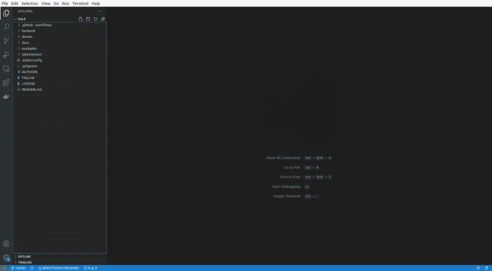

# 如何开始为开源项目做贡献

> 原文：<https://towardsdatascience.com/how-to-start-contributing-to-open-source-projects-41fcfb654b2e?source=collection_archive---------9----------------------->

## 开始往往是成功的一半


图片由来自 [Pixabay](https://pixabay.com/?utm_source=link-attribution&utm_medium=referral&utm_campaign=image&utm_content=5290465) 的 [Markus Winkler](https://pixabay.com/users/viarami-13458823/?utm_source=link-attribution&utm_medium=referral&utm_campaign=image&utm_content=5290465) 拍摄

为开源项目做贡献可能是了解您感兴趣的技术、为您最喜欢的工具的发展做贡献以及向未来的员工展示您的能力的最佳方式。

此外，您还可以加入一个活跃的社区，结识有共同兴趣和想法的开发人员，并让您的名字在该领域广为人知。

> 如何在不污染系统的情况下创建开发环境，并在隔离的便携式工作区中通过第一批测试？

然而，开始并不容易，这是一个关键的步骤，如果做得不好，可能会让任何人气馁。克隆项目、设置环境、构建二进制文件以及通过测试并不总是简单明了的。

这个故事提供了一些想法，关于如何开始一个新的开源项目，创建一个开发环境而不污染我们的系统，并在一个隔离的便携式工作空间中通过第一次测试。

> [Learning Rate](https://www.dimpo.me/newsletter?utm_source=medium&utm_medium=article&utm_campaign=open-source) 是一份时事通讯，面向那些对 AI 和 MLOps 世界感到好奇的人。你会在每周五收到我关于最新人工智能新闻和文章的更新和想法。订阅[这里](https://www.dimpo.me/newsletter?utm_source=medium&utm_medium=article&utm_campaign=open-source)！

# 连续的例子

本文使用了一个运行的例子，一个简单的用例，它将使一切变得透明；我们将克隆一个名为 [Kale](https://github.com/kubeflow-kale/kale) 的开源项目，设置工作环境，并运行我们的第一个测试。

**Kale 是一个开源项目，它简化了数据科学家使用 Kubeflow 和 Kubernetes 的体验。**

你可以把 Kale 想象成你在 Kubeflow 上的机器学习(ML)项目指挥者；作为数据科学家，我们可以在我们最喜欢的 JupyterLab 环境中工作，无需任何代码更改，就可以在 Kubeflow 和 Kubernetes 上运行 ML 管道，此外，我们可以运行超参数优化实验，将我们的模型作为可扩展的 API，创建 AutoML 项目，并毫不费力地分发我们的深度学习(DL)训练过程。

如果您有兴趣了解更多关于羽衣甘蓝和 Kubeflow 的信息，请阅读以下文章:

[](/jupyter-is-ready-for-production-as-is-b36f1d1ca8f8) [## Jupyter 准备生产；原样

### 无需编写一行代码，即可将您的笔记本草稿转化为生产就绪的 Kubeflow 管道。

towardsdatascience.com](/jupyter-is-ready-for-production-as-is-b36f1d1ca8f8) [](/hyperparameter-tuning-should-not-be-part-of-your-ml-code-44c49e80adb6) [## 超参数调优不应该是 ML 代码的一部分

### 让凯尔和卡提卜卸下重担。

towardsdatascience.com](/hyperparameter-tuning-should-not-be-part-of-your-ml-code-44c49e80adb6) [](/the-simplest-way-to-serve-your-ml-models-on-kubernetes-5323a380bf9f) [## 在 Kubernetes 上提供 ML 模型的最简单方法

### 从 Jupyter 笔记本到生产就绪的机器学习 API，只需一行代码

towardsdatascience.com](/the-simplest-way-to-serve-your-ml-models-on-kubernetes-5323a380bf9f) [](/autosklearn-at-scale-with-kubeflow-and-kale-bfd51f57a54f) [## 使用 Kubeflow 和羽衣甘蓝进行大规模 AutoSklearn

### 如何使用 Kale 和 AutoSklearn 在 Kubeflow 上运行 AutoML 实验

towardsdatascience.com](/autosklearn-at-scale-with-kubeflow-and-kale-bfd51f57a54f) 

既然我们已经看到了羽衣甘蓝是什么，以及它如何将我们的 ML 实验提高到一个新的水平，让我们假设我们愿意积极参与它的开发。怎么才能开始呢？

# 设置开发环境

当然，第一步是克隆项目:

```
git clone [https://github.com/kubeflow-kale/kale.git](https://github.com/kubeflow-kale/kale.git)
```

Kale 是一个 JupyterLab 扩展和一个 Python 库。我更熟悉 Python，所以我将在这篇文章中介绍如何开始为 Kale 的后端 Python 库做贡献。

在克隆项目并在 [Visual Studio 代码](https://code.visualstudio.com/)中打开它之后，您将会看到:



羽衣甘蓝项目——作者图片

然而，我们对此无能为力；最重要的是，我们没有安装必要的库。那我们该怎么办？我们应该把 Kale 需要的所有东西直接安装到我们的系统中吗？我们是否应该创建一个单独的虚拟环境，并将它们安装在那里？不，不！

首先，我们来看看羽衣甘蓝需要什么。一些项目带有我们可以使用的`requirements.txt`文件，其他项目带有用于 conda 的`environment.yaml`文件，或者甚至是简化一切的`docker-compose.yaml`文件。

羽衣甘蓝这些都没有，就从简单的开始吧；让我们创建一个`requirements.txt`文件。打开`backend`文件夹中的`setup.py`文件，复制`install_requires`列表中的所有库，粘贴到一个新文件中，命名为`requirements.txt`。它应该是这样的:

```
kfp
autopep8>=1.4<1.5
astor>=0.8.1
nbformat>=4.4<5.0
networkx>=2.3<3.0
jinja2>=2.10<3.0
graphviz>=0.13<1.0
pyflakes>=2.1.1
dill>=0.3<0.4
IPython>=7.6.0
jupyter-client>=5.3.4
jupyter-core>=4.6.0
nbconvert>=5.6.1<6.0.0
ipykernel>=5.1.4
notebook>=6.0.0
packaging>20
ml_metadata==0.24.0
progress>=1.5
kfserving>=0.4.0<0.5.0
kubernetes<12.0.0
```

> 请注意，将来依赖关系的版本可能会改变。

我们现在可以创建一个安装了这些依赖项的 Docker 映像，并将 Kale 项目复制到其中，这样我们就可以使用它了。但是这看起来工作量太大了。让我们自动化吧！

首先，我们需要为 VS 代码安装`[remote-containers](https://marketplace.visualstudio.com/items?itemName=ms-vscode-remote.remote-containers)`扩展。您可以在市场中搜索它，然后单击安装。然后，点击右下方的`Open a Remote Window`选项，选择`Add development container configuration files`选项。


按照向导，选择一个最近的 Python 3 环境(所有高于`3.5`的环境应该都可以)，如果您也想在 JupyterLab 扩展上工作，安装 NodeJS。最后，点击 OK，一个名为`.devcontainer`的新文件夹将会出现在你的项目的根文件夹中。

该文件夹包含两个文件:

*   一个`devcontainer.json`文件来保存您的配置选项
*   建立你的形象

一切都为你准备好了，但是我们需要对`Dockerfile`做一个小小的修改。打开它，取消安装您的`requirements.txt`文件的注释行:

```
COPY requirements.txt /tmp/pip-tmp/
RUN pip3 --disable-pip-version-check --no-cache-dir install -r /tmp/pip-tmp/requirements.txt \
&& rm -rf /tmp/pip-tmp
```

最后，再次点击右下方的`Open a Remote Window`选项，并选择`Reopen in container`。VS 代码将构建您的映像，启动一个容器，并挂载您启动 Kale 所需的文件。就这么简单！

如果您想更进一步，您可以更改您的`devcontainer.json`来安装您想要的 VS 代码扩展，并更改容器内的 VS 代码设置。例如，我倾向于使用`Pylance`作为我的 Python 语言服务器。如果你想了解更多关于`Pylance`的信息，请阅读下面的故事:

[](/pylance-the-best-python-extension-for-vs-code-ae299f35548c) [## pylance:VS 代码的最佳 Python 扩展

### Microsoft Python 语言服务器的未来以及为什么应该使用它。

towardsdatascience.com](/pylance-the-best-python-extension-for-vs-code-ae299f35548c) 

我的 Kale 的`devcontainer.json`配置文件如下所示:

如果你想了解更多关于 VS 代码`[remote-containers](https://marketplace.visualstudio.com/items?itemName=ms-vscode-remote.remote-containers)`扩展的信息，请阅读下面的故事:

[](/the-only-vs-code-extension-you-will-ever-need-e095a6d09f24) [## 你唯一需要的 VS 代码扩展

### 如果您必须安装一个 Visual Code Studio 扩展，这就是它！

towardsdatascience.com](/the-only-vs-code-extension-you-will-ever-need-e095a6d09f24) [](/5-visual-studio-code-extensions-for-data-scientists-937487b987c0) [## 面向数据科学家的 5 个 Visual Studio 代码扩展

### 借助这些强大的附加组件，提高 VS 代码的生产率

towardsdatascience.com](/5-visual-studio-code-extensions-for-data-scientists-937487b987c0) 

# 运行您的第一个测试

了解一个新项目的最好方法是通过 VS 代码可视化调试器来跟踪它的逻辑。但是你得先知道跑什么。如何触发调试器？为此，您可以阅读文档或直接询问维护人员。在我们的例子中，我们应该从相关文件夹中运行以下命令:

```
cli.py --nb /kale/backend/kale/tests/assets/notebooks/pipeline.ipynb
```

但是如何通过可视化调试器来设置断点并遵循逻辑呢？让我们创建一个`launch.json`配置文件。

转到 visual debugger 窗格，点击`create a launch.json file`。然后，复制以下几行:

这个文件做三件事:

1.  在当前活动的`.py`文件上启动调试器
2.  传递正确的参数
3.  设置`PYTHONPATH`

导航到`/backend/kale/cli.py`，从这个文件运行调试器。设置您的断点并遵循逻辑！你完了！

# 结论

为开源项目做贡献可能是了解我们正在使用的技术、为我们最喜欢的工具的发展做贡献以及向未来的员工展示我们的能力的最佳方式。

此外，我们可以参与到一个活跃的社区中，与有共同兴趣和想法的开发人员会面，并让我们的名字在该领域为人所知。

然而，开始并不总是那么容易。这个故事使用了一个运行示例来设置 Kale 的工作开发环境，Kale 是一个开源项目，它简化了数据科学家使用 Kubeflow 和 Kubernetes 的体验。

这是我处理新项目的方式。如果你有任何关于如何丰富这个过程的想法，或者你遵循的任何不同的技术来促进设置工作流，请在评论区留下它们！

# 关于作者

我叫 [Dimitris Poulopoulos](https://www.dimpo.me/?utm_source=medium&utm_medium=article&utm_campaign=open-source) ，是一名为 [Arrikto](https://www.arrikto.com/) 工作的机器学习工程师。我曾为欧洲委员会、欧盟统计局、国际货币基金组织、欧洲央行、经合组织和宜家等主要客户设计和实施过人工智能和软件解决方案。

如果你有兴趣阅读更多关于机器学习、深度学习、数据科学和数据操作的帖子，请关注我的 [Medium](https://towardsdatascience.com/medium.com/@dpoulopoulos/follow) 、 [LinkedIn](https://www.linkedin.com/in/dpoulopoulos/) 或 Twitter 上的 [@james2pl](https://twitter.com/james2pl) 。

所表达的观点仅代表我个人，并不代表我的雇主的观点或意见。