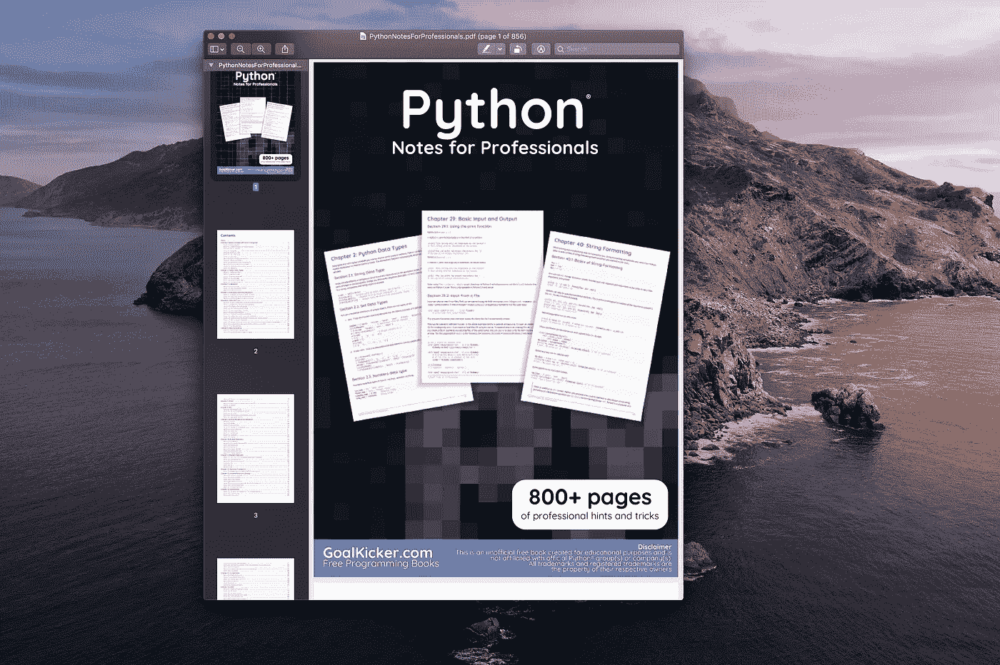

# 如何免费开始机器学习

> 原文：<https://towardsdatascience.com/how-to-start-with-machine-learning-for-free-483c1974c4b6?source=collection_archive---------7----------------------->

## 这个领域提供有竞争力的薪水，既有挑战性又有趣。最棒的是你可以免费学习。


由 [Unsplash](https://unsplash.com?utm_source=medium&utm_medium=referral) 上的 [Roméo A.](https://unsplash.com/@gronemo?utm_source=medium&utm_medium=referral) 拍摄的照片

人们对机器学习领域越来越感兴趣。对于深度学习和神经网络的大肆宣传，我并不感到惊讶。除此之外，这个领域提供有竞争力的薪水，既有挑战性又有趣。

我假设你是这个领域的新手，不知道从哪里开始。

我最常被问到的问题是:**如何从机器学习开始？我的答案总是一样的，因此我写了这篇文章来指导你的旅程。**

我的建议是:从免费内容开始，因为网上有很多很好的资源。甚至常春藤盟校也免费提供在线课程。

> 通过学习这些资源，你将了解机器学习是否适合你

不要马上开始花钱上昂贵的课程。把付费课程当成一门专业。幸运的是，你可以免费学习强大的机器学习基础。

**通过阅读本文，你将了解哪些是值得学习的优秀电子书和课程:**

*   用 Python 编程
*   熊猫的数据分析
*   从数据科学和机器学习开始

我也分享几个如何高效学习机器学习的小技巧。

# 介绍


照片由[蒂姆·莫斯霍尔德](https://unsplash.com/@timmossholder?utm_source=medium&utm_medium=referral)在 [Unsplash](https://unsplash.com?utm_source=medium&utm_medium=referral) 上拍摄

在我们开始之前，我想给你一些建议。

不要太深入任何一本书或课程。当你开始一个新的领域时，了解这个领域的广度是很重要的。

同时从多本书和课程中学习。这样你会听到从不同角度对复杂概念的解释。

练习也很重要。没有任何实践经验不要太深入理论。[泰坦尼克号——从灾难中学习机器](https://www.kaggle.com/c/titanic)是一个很好的起点。看看代码和讨论部分。

概念都不背，学习还有什么意义？一个很好的记忆方法是使用 Anki**——**一个使用间隔重复的应用程序。

[](/top-5-apps-for-data-scientists-dc8b66886560) [## 数据科学家的五大应用

### 我如何跟上最新的研究？我如何记住领域中的复杂概念？在…的帮助下

towardsdatascience.com](/top-5-apps-for-data-scientists-dc8b66886560) 

# 编程电子书

## 面向专业人士的 Python 注释

作者:堆栈溢出的人



专业人士阅读 [Python 笔记](https://goalkicker.com/PythonBook/)(图片由作者制作)

这本 [Python 书籍](https://goalkicker.com/PythonBook/)是我见过的最完整的 Python 指南之一。它是由栈溢出文档编译的，内容是由栈溢出的人编写的。

这本书广泛涵盖了你(很可能)会用到的 Python 的每个领域。我建议你不要从头到尾读一遍，而是把它作为你想进一步了解的某个主题的参考。

如果你不精通 Python，我推荐你深入阅读这本书。这本书有 816 页，提供的信息足以让你精通 Python。

我为什么推荐这本书？因为你可以随时重温。它可以作为你旅途中的参考。

# 学习熊猫

作者:埃尔南·罗哈斯


照片由[斯坦 Y](https://unsplash.com/@stanyw?utm_source=medium&utm_medium=referral) 在 [Unsplash](https://unsplash.com?utm_source=medium&utm_medium=referral) 上拍摄

Pandas 成为 Python 中数据科学的事实上的标准。[学习熊猫](https://bitbucket.org/hrojas/learn-pandas)这本书是用 Jupyter 笔记本写的，并附有文字。

它从如何创建数据框架的基本课程开始，以创建 Excel 报表结束。它的目标是那些仍在熟悉熊猫的初级数据科学家。

要了解更多先进的熊猫技巧，我建议你查看我的熊猫系列进行数据分析:

[](https://medium.com/@romanorac/pandas-data-analysis-series-b8cec5b38b22) [## 熊猫数据分析系列

### 从提示和技巧，如何不指南到与大数据分析相关的提示，熊猫文章的精选列表。

medium.com](https://medium.com/@romanorac/pandas-data-analysis-series-b8cec5b38b22) 

# 机器学习电子书

## Python 数据科学手册

作者:杰克·范德普拉斯


Viktor Forgacs 在 [Unsplash](https://unsplash.com?utm_source=medium&utm_medium=referral) 上拍摄的照片

[Python 数据科学手册](https://jakevdp.github.io/PythonDataScienceHandbook/)面向初级数据科学家。它展示了如何使用最重要的工具，包括 IPython、NumPy、Pandas、Matplotlib、Scikit-Learn 和许多其他工具。这本书非常适合解决日常问题，例如清理、操作和转换数据，或者构建机器学习模型。

## 可解释的机器学习

副标题:让黑盒模型变得可解释的指南
作者:*克里斯托夫·莫尔纳尔*


卢卡斯·本杰明在 [Unsplash](https://unsplash.com?utm_source=medium&utm_medium=referral) 上的照片

这本书使用了“支付你想要的价格策略”,所以从技术上来说它不是免费的。

[可解释机器学习](https://christophm.github.io/interpretable-ml-book/)专注于表格数据(也称为关系或结构化数据)的 ML 模型，较少关注计算机视觉和自然语言处理任务。

这本书推荐给机器学习从业者、数据科学家、统计学家和其他任何对让机器学习模型可解释感兴趣的人。它详细说明了如何为机器学习项目选择和应用最佳解释方法。

# **免费在线课程**

## 机器学习课程

大学:哥伦比亚
导师:约翰·w·佩斯利博士


照片由 [h heyerlein](https://unsplash.com/@heyerlein?utm_source=medium&utm_medium=referral) 在 [Unsplash](https://unsplash.com?utm_source=medium&utm_medium=referral) 上拍摄

[](https://www.edx.org/course/machine-learning) [## 机器学习

### 机器学习是当今数据分析领域最激动人心的职业的基础。你会学到模型和方法…

www.edx.org](https://www.edx.org/course/machine-learning) 

机器学习是当今数据分析领域最激动人心的职业的基础。您将学习模型和方法，并将它们应用到现实世界中，从识别趋势新闻话题到构建推荐引擎、给运动队排名和绘制电影僵尸的路径。

涵盖的主要观点包括:

*   概率与非概率建模
*   监督与非监督学习

主题包括分类和回归、聚类方法、序列模型、矩阵分解、主题建模和模型选择。

方法包括线性和逻辑回归、支持向量机、树分类器、boosting、最大似然和 MAP 推断、EM 算法、隐马尔可夫模型、卡尔曼滤波器、k 均值、高斯混合模型等。

## 人工智能课程

大学:ColumbiaX
导师:Ansaf Salleb-Aouissi 博士


[亚历山大·奈特](https://unsplash.com/@agkdesign?utm_source=medium&utm_medium=referral)在 [Unsplash](https://unsplash.com?utm_source=medium&utm_medium=referral) 上拍照

[](https://www.edx.org/course/artificial-intelligence-ai) [## 人工智能

### 自动驾驶汽车、人脸识别、网络搜索、工业机器人、导弹制导、肿瘤检测有什么…

www.edx.org](https://www.edx.org/course/artificial-intelligence-ai) 

自动驾驶汽车、人脸识别、网页搜索、工业机器人、导弹制导、肿瘤检测有什么共同点？

它们都是复杂的现实世界问题，正在通过智能(AI)的应用来解决。

本课程将提供对构建智能计算机系统的基本技术的广泛理解，以及对人工智能如何应用于问题的理解。

你将学习人工智能的历史、智能代理、状态空间问题表示、无信息和启发式搜索、玩游戏、逻辑代理和约束满足问题。

您将通过构建一个基本的搜索代理获得实践经验。对抗性搜索将通过创建一个游戏来探索，机器学习的介绍包括线性回归的工作。

# 在你走之前

```
- [Advance your Career in Cybersecurity (60% off) [Course]](https://imp.i115008.net/c/2402645/1024607/11298)- [Become a Cloud Developer using Microsoft Azure [Course]](https://imp.i115008.net/c/2402645/895504/11298)- [Binary logistic regression overview](https://dataanalysis.substack.com/p/supervised-machine-learning-binary-logistic-regression-overview-47282b9c608b)- [Free skill tests for Data Scientists & Machine Learning Engineers](https://aigents.co/skills)
```

*上面的一些链接是附属链接，如果你通过它们购买，我会赚取佣金。请记住，我链接课程是因为它们的质量，而不是因为我从你的购买中获得的佣金。*

在 [Twitter](https://twitter.com/romanorac) 上关注我，在那里我定期[发布关于数据科学和机器学习的](https://twitter.com/romanorac/status/1328952374447267843)消息。


照片由[Courtney hedge](https://unsplash.com/@cmhedger?utm_source=medium&utm_medium=referral)在 [Unsplash](https://unsplash.com/?utm_source=medium&utm_medium=referral) 拍摄