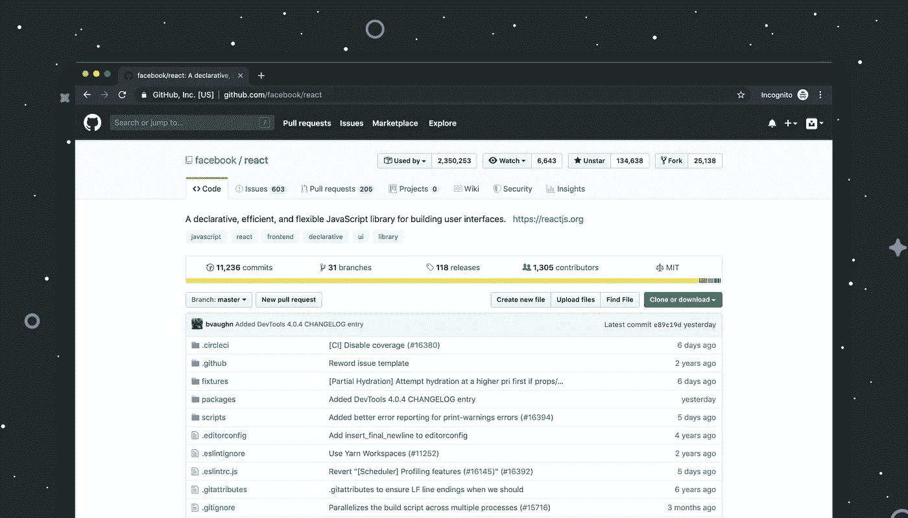

# 如何成为一名有竞争力的数据科学家

> 原文：<https://towardsdatascience.com/how-to-stay-a-competitive-data-scientist-ba459a0f7a8f?source=collection_archive---------39----------------------->

## 意见

## 这里有 3 种方法…


布鲁克·卡吉尔在[Unsplash](https://unsplash.com/s/photos/people-working?utm_source=unsplash&utm_medium=referral&utm_content=creditCopyText)【1】上的照片。

# 目录

1.  介绍
2.  油管（国外视频网站）
3.  卡格尔
4.  开源代码库
5.  摘要
6.  参考

# 介绍

虽然关于如何成为数据科学家的文章数不胜数，但关于如何继续成为一名成功的数据科学家的文章却不多，更具体地说，就是成为一名有竞争力的、全面发展的数据科学家。所以——这是我将在本文中深入探讨的内容。需要注意的是，有多种方法可以达到巅峰，但我将讨论我所做的三件事，也就是说，你也可以应用这些工具来提高你作为数据科学家的当前水平。如果您想了解如何使用下面的工具来改善您的数据科学职业生涯，请继续阅读。

# 油管（国外视频网站）


照片由[布鲁克·卡吉尔](https://unsplash.com/@brookecagle?utm_source=unsplash&utm_medium=referral&utm_content=creditCopyText)在[Unsplash](https://unsplash.com/s/photos/people-working?utm_source=unsplash&utm_medium=referral&utm_content=creditCopyText)【2】上拍摄。

因为 YouTube 视频在娱乐性方面非常成功，所以他们的教育视频也是如此。也就是说，如果你通常阅读关于复杂数据科学算法的论文或出版物，以了解它们是如何工作的，这可能会变得非常令人困惑和不知所措。这就是 YouTube 的用武之地:它可以作为一个有价值的平台，将复杂的数据科学主题的教程、讨论和总体总结转化为易于理解和有趣的视频。作为一个从例子中学习的人，我发现从其他人那里学习非常成功，他们提供了常见数据科学问题的真实世界的例子，并且由于可视化可以带来的额外价值而使它们更容易理解。如果你是一个视觉学习者，YouTube 可能是学习数据科学的最简单和最好的方法之一。

> 通过 YouTube 视频提高数据科学的优势:

*   几乎每个数据科学主题的内容
*   可以向真实的业内人士学习，以及他们各自的经验
*   可以直观地看到复杂的主题工作
*   可以一边学习一边娱乐
*   免费！
*   一些 YouTube 帐户有完整的课程
*   各种教程，包括如何使用 Python 和 R

正如你所看到的，使用 YouTube 作为平台来提高你的数据科学职业有无数的好处。然而，请记住，因为大多数人都可以发布 YouTube 视频，这也意味着任何人都可以传播虚假信息——所以要对学习持保留态度，并从各种账户观看，这样你就可以对你正在学习的材料有更广泛的了解。话虽如此，让我们看看我将在下面讨论的下一个工具，它更适合学习。

# 卡格尔


伊利亚·巴甫洛夫在 [Unsplash](https://unsplash.com/s/photos/data?utm_source=unsplash&utm_medium=referral&utm_content=creditCopyText) 上拍摄的照片。

虽然 YouTube 可能是一个学习的好地方，但它也有信息或内容可能不正确的缺点。因此，另一个值得学习的地方是[Kaggle](https://www.kaggle.com/)【4】，它作为学习教育内容的来源，更具体地说，是数据科学的来源，更有名气。Kaggle 是一个独特的平台，在这里您不仅可以学习数据科学主题，还可以通过解决实际问题来进行竞争，通常，在特定数据集上具有最高准确性或最低误差的人将会获胜。Kaggle 也有一个部分，Kaggle Learn，你可以免费尝试并完成课程。

> 我喜欢的一些你可以从中学习的课程有:

*   机器学习可解释性
*   自然语言处理
*   游戏人工智能和强化学习简介
*   地理空间分析

以上只是你可以参加的一些课程，这些课程也有教程和练习，所以你可以通过例子来学习。他们甚至根据最近的世界大事更新了他们的一些课程，这样你就可以了解相关的话题。

在 Kaggle 上你可以学习的另一个方法是通过他们的公共笔记本搜索例子。一些趋势笔记本是泰坦尼克分析、假新闻检测、客户终身价值和智能水分析等。正如你所看到的，向 Kaggle 学习有几个好处，它作为一个平台，提供了不同的学习途径，如示例、课程、教程、数据、笔记本和交流。

> 以下是 Kaggle 对改善您的数据科学职业生涯的一些好处:

*   带教程和练习的免费课程(*包括代码*)
*   包含数千个示例的同行和公共笔记本
*   趋势数据和笔记本的流行使用案例，通常来自当前世界事件
*   免费！
*   不同的代码示例，如 Python 和 R 编程
*   可以搜索不同的主题，如自然语言处理( *NLP* )或金融等

正如我们所看到的，Kaggle 有很多很棒的地方，但是如果我们想要更多关于存储库的例子，我们可以看看其他地方，就像我将在下一节讨论的那样。

# 开源代码库



卢克·切瑟在[Unsplash](https://unsplash.com/s/photos/github?utm_source=unsplash&utm_medium=referral&utm_content=creditCopyText)【5】上拍摄的照片。

这个网站有一些最好的数据科学的例子，几乎有任何新的数据科学主题，你所要做的就是搜索它。如果有一个新的数据科学库或机器学习算法，GitHub 上大多有一个例子。这里的这些例子通常比 Kaggle 更胜一筹，因为它们通常存放在包含整齐有序的文件夹、数据和文件的存储库中，就像真实的生产或开发存储库一样。有了这种类型的例子，你可以学习一个新的主题，或者通过真实的公司而不仅仅是教育环境中的例子，在当前的主题中变得更好。

> GitHub 作为改善您当前数据科学职业的平台的优势:

*   存储库代码、文件、数据和笔记本
*   拥有 Jupyter 笔记本格式
*   可以有各种不同的编程语言
*   高效组织
*   代码经常更新
*   拥有流行的数据科学图书馆

GitHub 确实是数据科学家和其他软件工程师的一个伟大平台。这是 GitHub 的另一个优势或好处，它是一个更加跨功能的平台，包括从非数据科学家和数据科学家的实例学习到真实世界的存储库。

# 摘要

有很多学习数据科学的途径，也有很多地方可以继续你的数据科学游戏。我已经讨论了我在数据科学领域保持最新的一些方法。重要的是不要停滞不前，因为数据科学和机器学习总是在发展和改进。你两年前在学校学到的东西可能已经过时了，与今天的新技术和图书馆相比没有用了。

> 总而言之，您可以在以下三个方面提升自己的数据科学职业生涯:

```
YouTube Kaggle GitHub
```

所有这些网站基本上都是免费使用的，可以提供最新最好的数据科学的例子。如果你还没有使用这些平台，那么没有比现在更好的开始了。

这些学习平台的其他一些好处是，如果你是一名初级数据科学家，或者如果你正在寻找一份新工作，它们可以作为交换简历的工具和经验。有时，来自 Kaggle 和 GitHub 的项目尤其可以成为更具竞争力的经历，给招聘人员和招聘经理留下更深刻的印象。如果你想证明你的学识或专长，Kaggle 也允许你获得证书。另一方面，GitHub 将让你展示自己在端到端数据科学过程中的代码，这可能非常有价值，因为它将向你自己和其他人表明，你可以将业务修辞、编程技能和机器学习算法应用到用例中——你是一名面向项目的数据科学家，而不仅仅是面向代码的数据科学家。

我希望你觉得我的文章既有趣又有用。如果您已经使用这些平台来学习或改善您的数据科学职业生涯，或者两者兼而有之，请随时在下面发表评论。这对你现在的数据科学事业有帮助吗？你同意还是不同意，为什么？

请随时查看我的个人资料和其他文章，也可以通过 LinkedIn 联系我。

如果你想了解更多关于数据分析以及它如何成为数据科学的重要先决条件，请点击这里查看我的另一篇文章[6]:

[](/you-should-master-data-analytics-first-before-becoming-a-data-scientist-5dbceaea9d3d) [## 在成为数据科学家之前，你应该先掌握数据分析

### 以下是为什么…的 4 个原因

towardsdatascience.com](/you-should-master-data-analytics-first-before-becoming-a-data-scientist-5dbceaea9d3d) 

# 参考

[1]由[布鲁克·卡吉尔](https://unsplash.com/@brookecagle?utm_source=unsplash&utm_medium=referral&utm_content=creditCopyText)在 [Unsplash](https://unsplash.com/s/photos/people-working?utm_source=unsplash&utm_medium=referral&utm_content=creditCopyText) 上拍摄的照片，(2017)

[2]Brooke Cagle 在 [Unsplash](https://unsplash.com/s/photos/people-working?utm_source=unsplash&utm_medium=referral&utm_content=creditCopyText) 上拍摄的照片，(2018)

[3]Ilya Pavlov 在 [Unsplash](https://unsplash.com/s/photos/data?utm_source=unsplash&utm_medium=referral&utm_content=creditCopyText) 上拍摄的照片，(2016)

[4] Kaggle， [Kaggle 主页](https://www.kaggle.com/)，(2021)

[5]卢克·切瑟在 [Unsplash](https://unsplash.com/s/photos/github?utm_source=unsplash&utm_medium=referral&utm_content=creditCopyText) 上拍摄的照片，(2019)

[6] M.Przybyla，[在成为数据科学家之前，你应该首先掌握数据分析](/you-should-master-data-analytics-first-before-becoming-a-data-scientist-5dbceaea9d3d)，(2021)