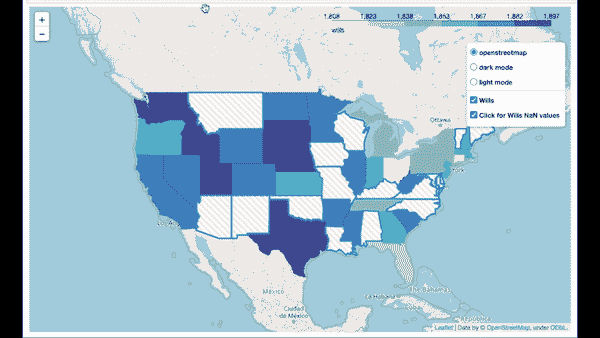
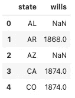
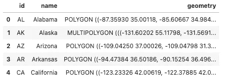
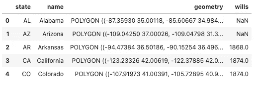
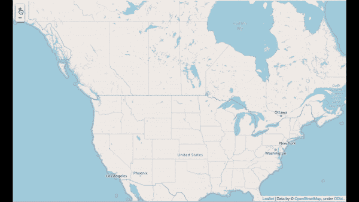
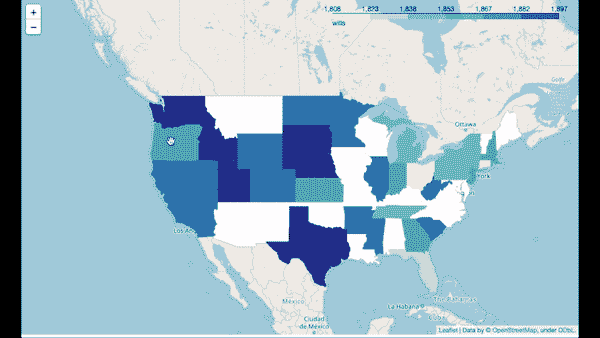
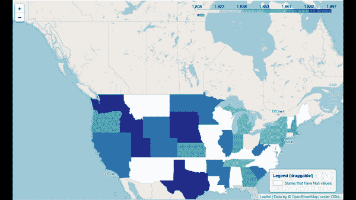
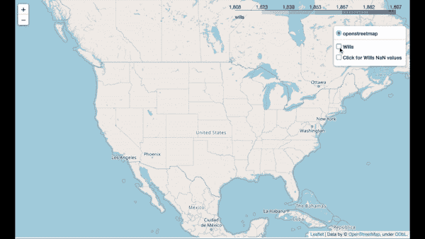
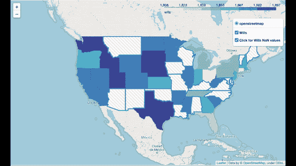

# 如何提高你的 Choropleth 地图技能

> 原文：<https://towardsdatascience.com/how-to-step-up-your-folium-choropleth-map-skills-17cf6de7c6fe?source=collection_archive---------4----------------------->



作者 Gif

本教程的目的是让你的 Foilium 技能更上一层楼。在这篇文章中，我们将创建一个比平常更高级的 Choroplet 地图。我们将添加自定义功能，以添加一个可拖动的图例，悬停功能，和交叉影线(交叉线)。如果您想学习这些技能，我强烈建议您自己用一个样本数据集来检查每个步骤。你会学到一些工具，你可以在自己的项目中运用这些工具，给你的老板或客户留下深刻印象。有些功能花了我几个小时的研究，我认为分享这些技能让人们提高他们的叶子技能是个好主意。分享是关爱，我总是喜欢分享知识，并把它传递给希望进步的人。所以我希望你会喜欢这个教程。

# **数据清理:**

第一步是清理数据来绘制我们的 Choropleth 图。

```
*# We first import the libraries.* 
**import** pandas **as** pd
**import** folium 
**from** folium.plugins **import** StripePattern
**import** geopandas **as** gpd
**import** numpy **as** np*# Next we import the data.* 
df **=** pd**.**read_csv("sample_data")

*# We grab the state and wills column*
df **=** df[["state","wills"]]
df**.**head()
```



作者图片

```
*# We check how many rows we have and the types of our data.*
df**.**info()<class 'pandas.core.frame.DataFrame'>
RangeIndex: 48 entries, 0 to 47
Data columns (total 2 columns):
 #   Column  Non-Null Count  Dtype  
---  ------  --------------  -----  
 0   state   48 non-null     object 
 1   wills   32 non-null     float64
dtypes: float64(1), object(1)
memory usage: 896.0+ bytes
```

正如我们在上面看到的，wills 列中有 48 个条目和 16 个缺失值。下一步是导入 geoJson 文件。要创建一个 choropleth，我们需要两样东西:

*   首先，我们需要一个 geoJSON 文件，为我们提供图层的地理坐标。然后，我们可以使用 geopandas 将坐标读入数据框。
*   其次，我们需要用不同的颜色在地图上显示这些值。在我们的例子中，我们将使用样本数据中的“wills”列。

对于我们的例子，我们需要美国各州的坐标。

```
*# We import the geoJSON file.* 
url **=** ("https://raw.githubusercontent.com/python-visualization/folium/master/examples/data")
state_geo **=** f"{url}/us-states.json"

*# We read the file and print it.*
geoJSON_df **=** gpd**.**read_file(state_geo)
geoJSON_df**.**head()
```



作者图片

在上面的数据框中，您可以看到几何列，它为我们提供了 Choropleth 地图图层的坐标。

```
*# Next we grab the states and put them in a list and check the length.*
geoJSON_states **=** list(geoJSON_df**.**id**.**values)
len(geoJSON_states)48
```

我们的实际数据有 48 个州。因此，我们缺少两个状态。让我们找出哪些州缺失，因为我们需要在接下来的步骤中合并这两个数据集来绘制 Choropleth 图。为了找到缺失的状态，我们将使用 NumPy setdiff1d 函数。该函数查找两个数组的集合差。

```
*# Let's check which states are missing.*
missing_states **=** np**.**setdiff1d(geoJSON_states,df_states_list)
missing_statesarray(['AK', 'HI'], dtype='<U2')
```

缺失的州是阿拉斯加和夏威夷。下一步是从 geoJSON 数据框中移除这两个状态，这样我们在两个数据框中都有相同数量的状态来合并两个数据框。要合并两个数据框，我们需要确保两个数据框的列名和状态值具有相同的列名。当我们合并数据帧时，我们需要基于一个特定的键来合并它们，如下所示。

```
*# we rename the column from id to state in the geoJSON_df so we can merge the two data frames.*
geoJSON_df **=** geoJSON_df**.**rename(columns **=** {"id":"state"})*# Next we merge our sample data (df) and the geoJSON data frame on the key id.*
final_df **=** geoJSON_df**.**merge(df, on **=** "state")
final_df**.**head()
```



作者图片

瞧，正如你在上面看到的，我们有了合并的数据框。到目前为止，我们已经清理了数据，并准备好处理叶子地图，进入有趣的部分。

# Choropleth 地图:

要创建一个叶子地图，我们需要设置初始坐标，这样我们就可以知道地图在开始时以哪个坐标为中心。

```
*# Initialize folium map.*
sample_map **=** folium**.**Map(location**=**[48, **-**102], zoom_start**=**4)
sample_map
```



作者 Gif

你应该看到上面的美国地图。下一步是创建 Choropleth 并添加层，以根据我们的示例数据中的 wills 列显示不同的颜色。

为了设置 Choropleth 映射，我们将使用 foliumChoropleth()函数。我们需要正确设置的最关键的参数是 geo_data、data、columns、key_on 和 fill_color。为了更好地理解这些参数，我们看一下文档。根据文档，我们了解到以下内容:

*   geo_data(字符串/对象)Geojson 几何的 URL、文件路径或数据(JSON、dict、geopandas 等)
*   数据(熊猫数据帧或系列，默认无)-要绑定到 GeoJSON 的数据。
*   columns (dict 或 tuple，缺省无)—如果数据是 Pandas 数据帧，则是要绑定的数据列。必须将第 1 列作为键传递，将第 2 列作为值传递。
*   key_on(字符串，默认无)geo _ data GeoJSON 文件中要将数据绑定到的变量。必须以“feature”开头，并且采用 JavaScript 异议表示法。例如:“feature.id”或“feature.properties.statename”。

要了解有关您在上面看到的其他参数的更多信息，请参考以下链接:

 [## 0.12.1 文件

### 使用用于绘制地图的 Python 和 fleed . js 类制作漂亮的交互式地图。基地…

python-visualization.github.io](https://python-visualization.github.io/folium/modules.html) 

下一步是建立 Choropleth 图。

```
*# Set up Choropleth map*
folium**.**Choropleth(
geo_data**=**final_df,
data**=**final_df,
columns**=**['state',"wills"],
key_on**=**"feature.properties.state",
fill_color**=**'YlGnBu',
fill_opacity**=**1,
line_opacity**=**0.2,
legend_name**=**"wills",
smooth_factor**=**0,
Highlight**=** **True**,
line_color **=** "#0000",
name **=** "Wills",
show**=False**,
overlay**=True**,
nan_fill_color **=** "White"
)**.**add_to(sample_map)

sample_map
```



作者 Gif

正如您在上面看到的，白色状态表示数据中的空值。在上面的代码中，我将 nan_fill_color 参数设置为白色。

到目前为止，这基本上就是你如何使用叶子创建一个基本的 Choropleth。这可能令人满意，但是我们应该告诉用户白色状态的真正含义。上面的图例没有告诉我们信息，因为它只是给了我们关于 wills 列的信息。为了增加趣味，并将该图提升到另一个层次，我们可能应该向该图添加另一个图例，以便用户只需查看地图就可以知道白色州代表空值。补充一个次要的传说，我在网上看到了一个很好的例子，我强烈推荐你去看看。请参见下面的链接:

[](https://nbviewer.jupyter.org/gist/talbertc-usgs/18f8901fc98f109f2b71156cf3ac81cd) [## nbviewer 笔记本

### 看看这个 Jupyter 笔记本！

nbviewer.jupyter.org](https://nbviewer.jupyter.org/gist/talbertc-usgs/18f8901fc98f109f2b71156cf3ac81cd) 

我们只是不打算添加一个常规的图例，而是添加一个可拖动的图例，让你的剧情更具互动性。要添加可拖动的图例，您可能需要了解一些基本的 HTML 和 JavaScript。请参见下面的示例代码。

```
*# We import the required library:*
**from** branca.element **import** Template, MacroElement

template **=** """


<!doctype html>
<html lang="en">
<head>
  <meta charset="utf-8">
  <meta name="viewport" content="width=device-width, initial-scale=1">
  <title>jQuery UI Draggable - Default functionality</title>
  <link rel="stylesheet" href="//code.jquery.com/ui/1.12.1/themes/base/jquery-ui.css">

  <script src="https://code.jquery.com/jquery-1.12.4.js"></script>
  <script src="https://code.jquery.com/ui/1.12.1/jquery-ui.js"></script>

  <script>
  $( function() {
    $( "#maplegend" ).draggable({
                    start: function (event, ui) {
                        $(this).css({
                            right: "auto",
                            top: "auto",
                            bottom: "auto"
                        });
                    }
                });
});

  </script>
</head>
<body>

<div id='maplegend' class='maplegend' 
    style='position: absolute; z-index:9999; border:2px solid grey; background-color:rgba(255, 255, 255, 0.8);
     border-radius:6px; padding: 10px; font-size:14px; right: 20px; bottom: 20px;'>

<div class='legend-title'>Legend (draggable!)</div>
<div class='legend-scale'>
  <ul class='legend-labels'>
    <li><span style='background:white;opacity:0.7;'></span>States that have Null values.</li>

  </ul>
</div>
</div>

</body>
</html>

<style type='text/css'>
  .maplegend .legend-title {
    text-align: left;
    margin-bottom: 5px;
    font-weight: bold;
    font-size: 90%;
    }
  .maplegend .legend-scale ul {
    margin: 0;
    margin-bottom: 5px;
    padding: 0;
    float: left;
    list-style: none;
    }
  .maplegend .legend-scale ul li {
    font-size: 80%;
    list-style: none;
    margin-left: 0;
    line-height: 18px;
    margin-bottom: 2px;
    }
  .maplegend ul.legend-labels li span {
    display: block;
    float: left;
    height: 16px;
    width: 30px;
    margin-right: 5px;
    margin-left: 0;
    border: 1px solid #999;
    }
  .maplegend .legend-source {
    font-size: 80%;
    color: #777;
    clear: both;
    }
  .maplegend a {
    color: #777;
    }
</style>
"""

macro **=** MacroElement()
macro**.**_template **=** Template(template)

sample_map**.**get_root()**.**add_child(macro)

sample_map
```



作者 Gif

正如你在上面看到的，我们已经添加了可拖动的图例。你可以点击它并把它拖到你想要的位置。如果您不熟悉 HTML，我建议您将代码复制并粘贴到您的项目中，并注意下面一行:

*   有空值的州。

如果您想在图例中添加多个值，只需复制粘贴上面的行并更改背景颜色和名称。

假设你的老板不喜欢你有两个传奇，他让你想出另一个解决方案。另一种选择是添加代表缺失值的交叉影线(交叉线)。为了给层添加模式，我们需要使用名为 StripePattern 的 flour 插件。请看下面的代码:

```
*# We create another map called sample_map2.*
sample_map2 **=** folium**.**Map(location**=**[48, **-**102], zoom_start**=**4)

*# Set up Choropleth map*
folium**.**Choropleth(
geo_data**=**final_df,
data**=**final_df,
columns**=**['state',"wills"],
key_on**=**"feature.properties.state",
fill_color**=**'YlGnBu',
fill_opacity**=**1,
line_opacity**=**0.2,
legend_name**=**"wills",
smooth_factor**=**0,
Highlight**=** **True**,
line_color **=** "#0000",
name **=** "Wills",
show**=True**,
overlay**=True**,
nan_fill_color **=** "White"
)**.**add_to(sample_map2)

*# Here we add cross-hatching (crossing lines) to display the Null values.*
nans **=** final_df[final_df["wills"]**.**isnull()]['state']**.**values
gdf_nans **=** final_df[final_df['state']**.**isin(nans)]
sp **=** StripePattern(angle**=**45, color**=**'grey', space_color**=**'white')
sp**.**add_to(sample_map2)
folium**.**features**.**GeoJson(name**=**"Click for Wills NaN values",data**=**gdf_nans, style_function**=lambda** x :{'fillPattern': sp},show**=True**)**.**add_to(sample_map2)

*# We add a layer controller.* 
folium**.**LayerControl(collapsed**=False**)**.**add_to(sample_map2)
sample_map2
```



作者 Gif

为了添加上面的剖面线，我们查看上面代码中的以下行:

1.  nans = final_df[final_df[“遗嘱”]。isnull()]['state']。价值观念
2.  GDF _ nans = final _ df[final _ df[' state ']。isin(nans)]
3.  sp = StripePattern(角度=45，颜色= '灰色'，space_color= '白色')
4.  sp.add_to(sample_map2)
5.  folio . features . geo JSON(name = "点击查看收益 NaN 值"，data=gdf_nans，style _ function = lambda x:{ ' fill pattern ':sp }，show=True)。添加到(样本映射 2)

在第一个例子中，我们获取 wills 列中具有空值的州。在编号 2 中，我从编号 1 中的 nans 变量中提取状态等于状态的行。在数字 3 和 4 中，我设置了我想要为 NaN 值显示的模式。最后，在数字 5 中，我添加了 NaN 层，sp 变量作为 fillPattern。注意，我还在倒数第二行添加了层控制器。

我将讨论的最后一个主题是悬停功能。假设您想将鼠标悬停在各州上方并显示一些数据。为了添加这个功能，我们将再次使用 leav。特色。GeoJson()的功能与我们在上面的代码中所做的一样。

```
*# Add hover functionality.*
style_function **=** **lambda** x: {'fillColor': '#ffffff', 
                            'color':'#000000', 
                            'fillOpacity': 0.1, 
                            'weight': 0.1}
highlight_function **=** **lambda** x: {'fillColor': '#000000', 
                                'color':'#000000', 
                                'fillOpacity': 0.50, 
                                'weight': 0.1}
NIL **=** folium**.**features**.**GeoJson(
    data **=** final_df,
    style_function**=**style_function, 
    control**=False**,
    highlight_function**=**highlight_function, 
    tooltip**=**folium**.**features**.**GeoJsonTooltip(
        fields**=**['state','wills'],
        aliases**=**['state','wills'],
        style**=**("background-color: white; color: #333333; font-family: arial; font-size: 12px; padding: 10px;") 
    )
)
sample_map2**.**add_child(NIL)
sample_map2**.**keep_in_front(NIL)
sample_map2
```



作者 Gif

首先，我们创建一个 style_function 和一个 highlight_function 来确定我们希望悬停功能如何出现。接下来，在 NIL 变量中，我们需要注意正确的参数值。

*   我们将数据设置为 final_df 数据帧。
*   我们将样式函数设置为我们在第二行创建的 style_function。
*   我们将第 6 行中的 highlight 函数设置为 highlight_function。
*   我们使用 GeoJsonTooltip 函数，并将字段和别名参数设置为 final_df 数据框中的列名，以便在将鼠标悬停在各州上方时显示所需的数据点。

参见下面的最终代码。我还在代码底部的图层控制器中添加了明暗模式选项。我使用 cartodbdark_matter 图层作为亮模式，对于暗模式，我使用 cartodbpositron 图层。

```
*# We create another map called sample_map2.*
sample_map2 **=** folium**.**Map(location**=**[48, **-**102], zoom_start**=**4)

*# Set up Choropleth map*
folium**.**Choropleth(
geo_data**=**final_df,
data**=**final_df,
columns**=**['state',"wills"],
key_on**=**"feature.properties.state",
fill_color**=**'YlGnBu',
fill_opacity**=**1,
line_opacity**=**0.2,
legend_name**=**"wills",
smooth_factor**=**0,
Highlight**=** **True**,
line_color **=** "#0000",
name **=** "Wills",
show**=True**,
overlay**=True**,
nan_fill_color **=** "White"
)**.**add_to(sample_map2)

*# Add hover functionality.*
style_function **=** **lambda** x: {'fillColor': '#ffffff', 
                            'color':'#000000', 
                            'fillOpacity': 0.1, 
                            'weight': 0.1}
highlight_function **=** **lambda** x: {'fillColor': '#000000', 
                                'color':'#000000', 
                                'fillOpacity': 0.50, 
                                'weight': 0.1}
NIL **=** folium**.**features**.**GeoJson(
    data **=** final_df,
    style_function**=**style_function, 
    control**=False**,
    highlight_function**=**highlight_function, 
    tooltip**=**folium**.**features**.**GeoJsonTooltip(
        fields**=**['state','wills'],
        aliases**=**['state','wills'],
        style**=**("background-color: white; color: #333333; font-family: arial; font-size: 12px; padding: 10px;") 
    )
)
sample_map2**.**add_child(NIL)
sample_map2**.**keep_in_front(NIL)

*# Here we add cross-hatching (crossing lines) to display the Null values.*
nans **=** final_df[final_df["wills"]**.**isnull()]['state']**.**values
gdf_nans **=** final_df[final_df['state']**.**isin(nans)]
sp **=** StripePattern(angle**=**45, color**=**'grey', space_color**=**'white')
sp**.**add_to(sample_map2)
folium**.**features**.**GeoJson(name**=**"Click for Wills NaN values",data**=**gdf_nans, style_function**=lambda** x :{'fillPattern': sp},show**=True**)**.**add_to(sample_map2)

*# Add dark and light mode.* 
folium**.**TileLayer('cartodbdark_matter',name**=**"dark mode",control**=True**)**.**add_to(sample_map2)
folium**.**TileLayer('cartodbpositron',name**=**"light mode",control**=True**)**.**add_to(sample_map2)

*# We add a layer controller.* 
folium**.**LayerControl(collapsed**=False**)**.**add_to(sample_map2)
sample_map2
```


作者 Gif

# 结论:

最后，让我们回顾一下我们在本教程中学习的步骤，并总结一下我们所学到的内容:

*   我们使用 NumPy、Pandas 和 GeoPandas 清理数据，并通过合并 geoJSON 数据和我们的样本数据来创建最终数据框，从而使用 folium 创建 Choropleth 地图。
*   我们学习了如何添加一个可拖动的图例。
*   我们还学习了如何添加交叉影线(交叉线)来显示空值。
*   最后但同样重要的是，我们讨论了悬停功能。

我希望你喜欢这个教程，并且你将能够在你未来的项目中运用这些技巧来介绍你的老板或客户。如果你对这个话题有任何问题或者有任何反馈，请随时联系我。如果你能在任何社交媒体平台上分享它，我将不胜感激。谢谢你，下次再见 time️！✌️

[](https://www.navidma.com/) [## 纳维德·马辛奇作品集

### 我是 Navid Mashinchi，是加利福尼亚州萨克拉门托的一名数据科学家。我一直在分析领域工作…

www.navidma.com](https://www.navidma.com/)