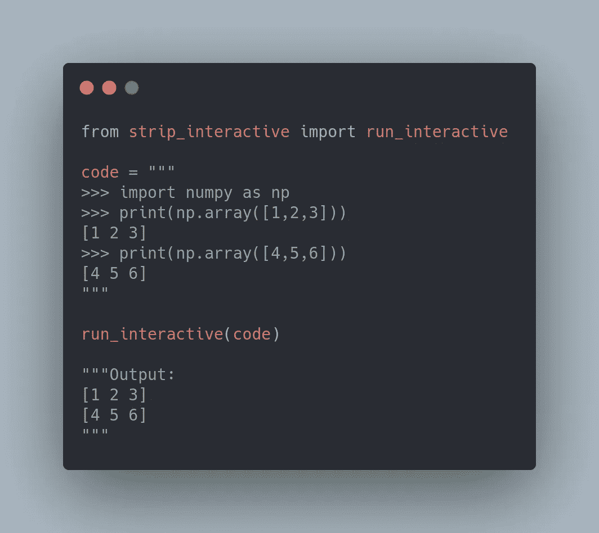

# 如何在 Python 脚本中剥离输出并执行交互式代码

> 原文：<https://towardsdatascience.com/how-to-strip-outputs-and-execute-interactive-code-in-a-python-script-6d4c5da3beb0?source=collection_archive---------26----------------------->

## 使用 strip-interactive 在一行代码中执行交互式 Python 代码



作者图片

# 动机

你见过这样的交互式 Python 代码教程吗:

…并且希望只获得可以像下面这样执行的代码？

删除所有的`>>>`符号和移除所有的输出可能很耗时，尤其是当代码很长的时候。有没有一种方法可以让你在一行代码中得到如上的干净输入？

这就是为什么我创建了一个名为 [strip-interactive](https://github.com/khuyentran1401/strip_interactive) 的包。在本文中，我将向您展示如何使用这个包来做到这一点。

要安装 strip-interactive，请键入:

```
pip install strip-interactive
```

# 提取干净的输入

让我们使用 strip-interactive 从交互式 Python 代码中提取干净的输入:

输出:

```
import numpy as np
print(np.array([1,2,3]))
print(np.array([4,5,6]))
```

酷！现在，这些干净的输入可以执行了。

# 执行干净的输入

为了执行我们刚刚从`get_clean_code`得到的输入，使用`exec`方法:

```
[1 2 3]
[4 5 6]
```

如果您喜欢一步执行交互式 Python 代码，请使用`run_interactive`方法:

输出:

```
[1 2 3]
[4 5 6]
```

厉害！使用`run_interactive`方法得到的输出与使用`get_clean_code`和`exec`方法得到的输出相同。

## 如果我的交互代码有注释，这还有效吗？

我相信是的，但是最好测试一下。

产出:

```
[1 2 3]
```

太好了，成功了！

## 这个什么时候失效？

请注意，如果您对如下代码使用`run_interactive`，将不会有输出:

因此，请确保将`print`添加到`np.array([1,2,3])`以查看输出:

输出:

```
[1 2 3]
```

# 结论

恭喜你！您刚刚学习了如何使用 strip-interactive 在一行代码中执行 Python 脚本中的交互式 Python 代码。当您想在文章或文档中快速尝试交互式 Python 代码时，这将非常方便。

这篇文章的代码可以在[这里](https://github.com/khuyentran1401/Data-science/blob/master/data_science_tools/strip_interactive_example.py)找到。如果你看到如何改进这个包，请在这里随意投稿或提交问题[。](https://github.com/khuyentran1401/strip_interactive)

我喜欢写一些基本的数据科学概念，并尝试不同的算法和数据科学工具。你可以在 LinkedIn 和 T2 Twitter 上与我联系。

星[这个回购](https://github.com/khuyentran1401/Data-science)如果你想检查我写的所有文章的代码。在 Medium 上关注我，了解我的最新数据科学文章，例如:

[](/stop-using-print-to-debug-in-python-use-icecream-instead-79e17b963fcc) [## 在 Python 中停止使用 Print 进行调试。用冰淇淋代替

### 你是使用打印还是日志来调试你的代码？用冰淇淋代替。

towardsdatascience.com](/stop-using-print-to-debug-in-python-use-icecream-instead-79e17b963fcc) [](/how-to-create-mathematical-animations-like-3blue1brown-using-python-f571fb9da3d1) [## 如何使用 Python 创建类似 3Blue1Brown 的数学动画

### 利用您的 Python 技能创建美丽的数学动画

towardsdatascience.com](/how-to-create-mathematical-animations-like-3blue1brown-using-python-f571fb9da3d1) [](/2-tools-to-automatically-reload-when-python-files-change-90bb28139087) [## 当 Python 文件改变时自动重新加载的 2 个工具

towardsdatascience.com](/2-tools-to-automatically-reload-when-python-files-change-90bb28139087) [](/3-tools-to-track-and-visualize-the-execution-of-your-python-code-666a153e435e) [## 3 个跟踪和可视化 Python 代码执行的工具

towardsdatascience.com](/3-tools-to-track-and-visualize-the-execution-of-your-python-code-666a153e435e)