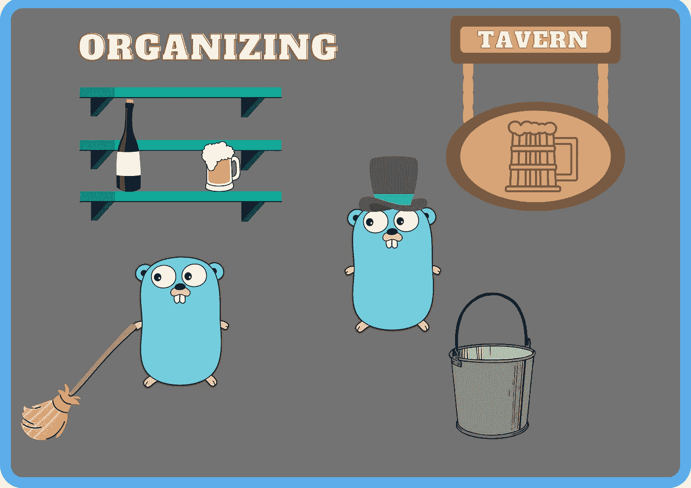
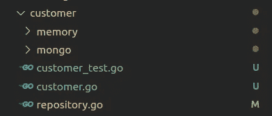
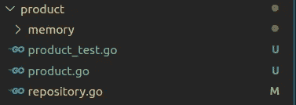
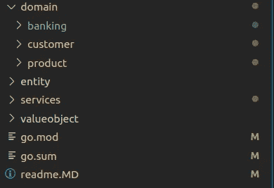
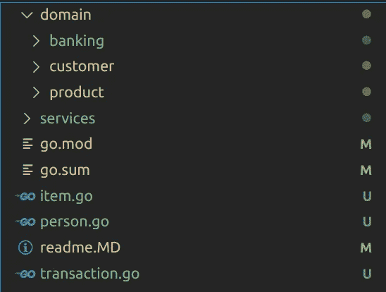
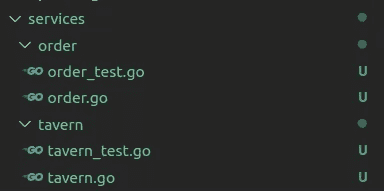
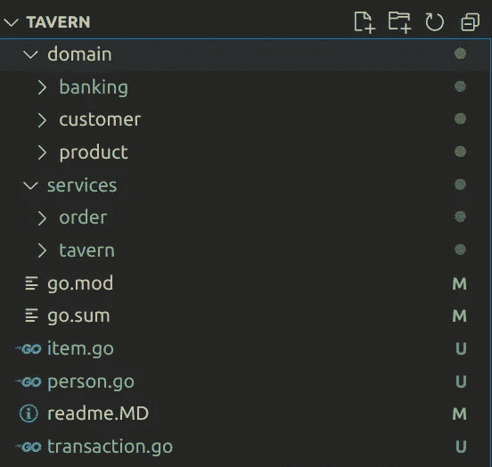

# 如何构建戈朗的 DDD

> 原文：<https://towardsdatascience.com/how-to-structure-ddd-in-golang-28a7c3e7263b?source=collection_archive---------13----------------------->

## 关于如何在 Go 中用 DDD 方法组织代码和包结构的后续文章



是时候清理代码结构了。上田拓也的 Gopher，勒内·弗伦奇的原始 Go Gopher(CC 3.0)

在 Go 项目中使用 DDD 时，是时候看看更好的架构解决方案了。在本文中，我们将采用一个包含所有 DDD 组件的存储库，并展示如何在维护 DDD 的同时管理一个不太复杂的项目设置。

我们将要改变的库来自我以前写的一篇关于如何在 Go 中实现 DDD 的文章。在那篇文章中，我解释了 Eric Evans 所解释的 DDD 的所有组成部分。这个库可以在 [GitHub](https://github.com/percybolmer/ddd-go) 上找到。

[](/how-to-implement-domain-driven-design-ddd-in-golang-2e2139beb09d) [## 如何在 Golang 中实现领域驱动设计(DDD)

### 学习如何在 Go 应用程序中使用 DDD 的简单方法

towardsdatascience.com](/how-to-implement-domain-driven-design-ddd-in-golang-2e2139beb09d) 

> 本文中绘制的所有图像均由珀西·博尔梅勒绘制，地鼠由[拓也·上田](https://twitter.com/tenntenn)绘制，灵感来自蕾妮·弗伦奇的作品。图像中的地鼠已被修改

如果你想看这篇文章的视频，可以在 Youtube 上找到

## 将聚合移动到其域包中

首先要做的是把`aggregate`包一起去掉。我们学习了什么是聚合以及应用什么规则，我们不一定要命名要聚合的包。我倾向于将聚合放在它们各自的域包中，所以`Customer`聚合应该放在`customer`域中。在我看来这更有意义。



从聚合包中删除客户聚合

当然，在将文件移动到`customer`域后，您还需要更改任何指向`aggregate.Customer`的引用，如果您在客户包中，就用`customer.Customer`或`Customer`替换它。

customer/repository.go —删除对聚合包的所有提及

必须对`Product`聚合执行同样的操作，它应该进入`product`域。我不会涵盖所有的代码更改，找到并重构所有提到的`aggregate`包应该很容易。



包含产品集合的产品域

在我看来，以这种方式在他们的域包中包含聚合看起来更好，也更有意义。

删除聚合文件夹，我们已经整理了一些代码气味。



该项目的改进结构，但尚未完成

## 移动值对象和实体

对于`entity`和`valueobject`，我们仍然有一个文件夹，我想这没有错。以这种方式将共享结构存储在单独的包中的一个好处是避免了循环导入。

不过，我们可以用另一种不那么臃肿的方式来实现这一点。现在我们根本没有根包。将实体和值对象中的所有文件移动到根目录，并将包重命名为`tavern`

item.go 在根目录下，包名为 tavern

这给我们留下了一个更好的结构。



将实体和其他共享项目移动到根包中

您还需要将`go.mod`中的模块重命名为合适的名称。

```
module github.com/percybolmer/tavern
```

不仅如此，我们需要更改所有文件中的所有导入来反映这一更改，并且`entities`包的所有引用都必须更改为`tavern`，如下所示。

用 tavern 替换实体的所有实例，以及所有导入。

所有以`github.com/percybolmer/go-ddd`开头的导入都改为`github.com/percybolmer/tavern`。

应用此更改的最简单方法是更改所有文件，删除 go.mod 和 go.sum 文件，并用新名称`go mod init github.com/percybolmer/tavern`重新初始化 go 模块。

这是相当的重构练习，但它是值得的。请随意重新运行任何测试，这样您就知道它正在按预期工作。

## 拆分服务包

现在，服务包包含同一个包中的所有服务。我想把这些分成两个包，`Order`和`Tavern`。

原因是随着项目的增长，将服务分成更小的包是很好的。在我看来，把它们都放在同一个包里会显得臃肿。我也喜欢将域作为基础设施的一部分，在这种情况下，我们在`services`文件夹中创建一个名为`order`的新文件夹。原因是在未来我们可能会看到更多与订单相关的服务出现，例如，当前的订单服务专注于点饮料的`Customer`，但是当酒馆需要补给时呢？使用这种结构，开发人员很容易知道在哪里可以找到相关的代码。

另一件重要的事情是配置函数的命名，如果我们继续创建像`WithMemoryCustomerRepository`这样的函数，就很难保持什么配置去哪里。如果我们看到`order.WithMemoryCustomerRepository`就很容易知道发生了什么。



如何将服务包组织成子包

做出这个改变需要`Tavern`包引用`order.OrderService`而不是唯一的`OrderService`

更改所有引用以匹配新结构。我们还将在`OrderService`中添加一个新函数来添加新客户，因为现在我们只能通过使用 struct 中的`customer`库来做到这一点。这是行不通的，因为服务将暴露给其他包。此外，服务永远不应该假设服务的用户知道如何这样操作，因此在服务自己的域中维护这种逻辑是很自然的。

在 OrderService 中添加 Customer 以帮助创建新客户。

在应用了这些更改之后，订购产品的测试变得更加容易了。

taver_test.go —创建新客户和订购更加容易

现在我们终于有了最终的解决方案。一个非常简单的导航，干净的结构化项目。



要使用的最终架构

## 如何经营酒馆

我想推荐的最后一件事是使用许多 Go 存储库中的`cmd`文件夹。在那个文件夹中，应该可以找到所有的命令行工具，而且可以不止一个。为了结束这篇文章，我将在`cmd`文件夹中创建一个主程序。

```
mkdir cmd
touch main.go
```

我们点杯啤酒庆祝一下吧。

main . go——试着运行程序，看看是否一切正常，明白这个双关语了吗？

这个关于 DDD 的很长的两部分系列到此结束。

你可以在 [GitHub](https://github.com/percybolmer/ddd-go/tree/clean-architecture) 上找到完整代码。

关于 DDD 还有很多东西要学，这只触及了基础，以及我如何找到结构化项目。我们还没有触及`Domain events`、`CQRS`、`EventSourcing`等话题。敬请关注更多内容。

如果你渴望了解更多关于 DDD 的知识，我推荐 Eric Evans 的书*《领域驱动设计:解决软件核心的复杂性》。你可以在亚马逊上找到它。*

一如既往，请随时通过我的任何社交媒体联系我。我确实喜欢反馈、批评，甚至愤怒。

我可以在 medium、T [witter](https://twitter.com/percybolmer) 、 [Instagram](https://www.instagram.com/programmingpercy/) 和 [Linkedin](https://www.linkedin.com/in/percy-bolmer-bb223b122/) 上找到我。