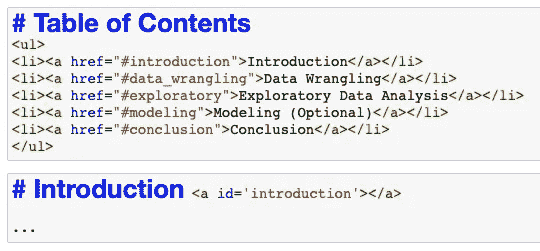

# 如何构建易于理解的数据科学笔记本

> 原文：<https://towardsdatascience.com/how-to-structure-your-data-science-notebook-to-be-easy-to-follow-2d3c2777e6e0?source=collection_archive---------10----------------------->

## 创建有序笔记本的清晰步骤，包括示例

凯利·西克玛在 [Unsplash](https://unsplash.com?utm_source=medium&utm_medium=referral) 上的照片

笔记本的结构比你想象的更重要。读者在理解细节之前需要对你的作品有一个清晰的概述。

要实现这一点，您的笔记本需要一个有条理的结构，包含直观的连续部分。也许有人只对您的数据解决方案的某一部分感兴趣。所以你工作的主要部分需要容易识别。

但是我们不需要把事情变得不必要的复杂。所以开门见山，一般来说，我们可以简单地使用以下五个部分:

1.  介绍
2.  数据争论
3.  探索性数据分析
4.  建模(可选)
5.  结论

下面我们详细说明每一部分必须包含的内容，描述所有的**必要子部分**。

# 1.介绍

首先，我们必须根据**业务目标**来描述项目。首先给出你工作的背景，它的起源，你想要达到的目标:主要目标。

例如，假设您正在调查一个包含营销公司销售数据的数据集。引言的第一部分将谈论销售数据的来源，并说明你想从数据中回答哪些问题，例如，你的产品的哪些方面(颜色、尺寸、品牌等)。)与销量的相关性更大。

> 一个好的经验法则是明确地创建一个要解决的问题列表。

仍然与您的项目目标相关，仅从该笔记本中选择的**产品**就需要指定。例如，分析的最终目标是创建一个具有洞察力的月度报告？或者只是一个一次性的段落，通过电子邮件发送给首席执行官来证明一个观点？这一点应该在引言中说清楚。

最后，简单说一下任何**先验知识**也很重要。例如，如果销售数据只来自一个特定的商店，就应该提到这一点。如果在某段时间，公司的某些产品出现问题，如分销问题，直接影响销售，这也应该说明。基本上，我们必须描述任何有助于**理解数据源的上下文**和重要细节的东西。

# **2。数据争论**

本节首先简要描述我们将要分析的数据集。基本上，这意味着我们必须**列出每个表中的列名**，以及**它们的含义**。如果我们要处理多个表，我们还应该描述这些表是如何相互关联的。

之后，我们开始编码，第一步是加载数据。这里检查**清洁度**也很重要，并且完全清洁你的数据集用于分析。

> 数据集中的任何修改都应该在这个部分。

接下来的章节将简单地**查看**用于探索的数据。但是数据争论部分是您为想要探索的维度调整数据的地方。

记录清理数据所采取的步骤也很重要，**证明每个决策的合理性**。例如，如果您删除了“年龄”列中缺失数据的观察值，您需要清楚地解释原因。

由于数据集通常有许多棘手的任务，一个好的做法是**在一个 markdown 单元格中列出本节中执行的所有修改**。

# 3.探索性数据分析

这一部分应该以你要回答的问题为导向。换句话说，您将**为介绍中提出的每个问题**创建一个子部分。

因此，在数据已经清理完毕的情况下，这里你将基本上**计算** **统计**和**创建可视化**，目标是回答每个问题。

请记住，在整个探索过程中始终添加注释。在每个情节或分析决定之后，你需要**解释什么是结果**，以及你从结果中得到的观察。

> 引导读者通过你的思维过程！

确保从多个角度调查每个问题，讨论可以使结果更有趣的方面。例如，不只是添加分布图并描述它们，而是考虑**创建支持您答案的图**。

# 4.建模(可选)

并非所有数据科学工作都包括建模。许多商业问题可以通过探索性的数据分析来回答。例如，设计良好的假设检验可以为您的数据提供许多有趣的见解。

> 更重要的是**不**建议在笔记本上进行建模。

建模不要用笔记本，要用模块化代码，直接用 python 脚本，用协同工作，测试套件等。尽管如此，笔记本可能用于快速建模实验，例如创建简单的基线模型。

因此，如果您确实包括建模，请确保首先将您的数据集分成**“训练”和“测试”样本**。然后，处理“训练”部分，直到满足给定的指标，比如使用交叉验证达到 85%的准确率。一旦你完成了**比较模型和执行调整**，你就可以在“测试”样本上评估你的最终模型。

因此，这里要记录的主要部分是:你如何将数据分成训练和测试，使用了哪些算法和超参数，以及**你如何评估你的模型确实有用**。例如，有时候“精确”比“回忆”更有意义。这个要在简介里说明，这里调一下。

# 5.结论

最后，我们**总结了我们的发现**以及针对引言中提出的问题所获得的结果。

此外，我们应该指出**额外的研究可以在哪里进行**或者**额外的信息**可以在哪里有用。例如，分析可以指出折扣优惠的有趣数据是用户与产品页面互动的时间。因此，分析师会建议该公司在每个产品的销售页面上增加这样一个功能。

最后，另一个非常重要的点是确保你清楚你的项目的**限制。没有一个项目是完美的，所以至少应该在这里的一个小节中描述一个限制。**

> 强迫自己列出至少一个工作的局限。

例如:数据中是否有任何缺失的观察值，即不在该数据集中的其他信息？我们能完全相信为验证项目中提到的假设而进行的统计测试吗？为什么？

我希望您喜欢这个关于如何构建您的数据科学笔记本的高级视图。按照上面提到的方面，下面是一个具体的子部分示例，您可以将它包含在所描述的五个部分中:

1.  **简介**:背景、业务目标、问题列表
2.  **数据争论**:清洗步骤列表，步骤 1，步骤 2，…
3.  **探索性数据分析**:问题 1，问题 2，…
4.  **建模(可选)**:拆分数据、训练、测试
5.  **结论**:局限性，未来工作

记得在描述作品时充分利用 markdown 单元格和所有可用于 markdown 的样式资源，你会做得很好！

最后，创建内部链接和建立目录也很有用。这里有一个例子:

在笔记本中使用降价单元格和 HTML 的目录。图片由作者提供。

如果你喜欢阅读这样的故事，并想支持我成为一名作家，可以考虑[注册成为一名媒体会员](https://medium.com/@ryancarters/membership)。每月 5 美元，你可以无限制地阅读媒体上的故事。如果你[用我的链接](https://medium.com/@ryancarters/membership)注册，我会赚一小笔佣金。