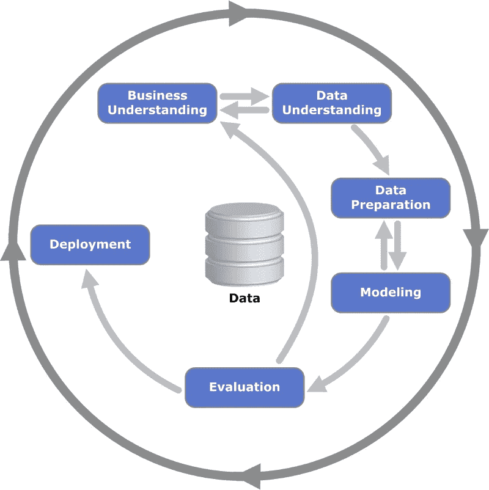

# 如何构建您的数据科学项目

> 原文：<https://towardsdatascience.com/how-to-structure-your-data-science-project-d2484e452e46?source=collection_archive---------43----------------------->

## 你可以用三种方法来组织你的学习和文件夹项目

威廉·艾文在 [Unsplash](https://unsplash.com?utm_source=medium&utm_medium=referral) 上的照片

项目是学习数据科学的好方法。它们提供了一种有意义的、自我指导的方法来提高你的技能，并可能为你和他人解决实际问题。项目也是在作品集中展示你技能的好方法。虽然有一些小项目，你只是在一两天内“做”以熟悉某些技能、库或主题，但也有一些项目可能稍大一些，需要更多的前期规划。

我曾经犯过这样的错误，刚开始一个项目，就忘记了所有我想完成的小任务和我的解决方案。最后，我没有事先制定计划，给自己增加了很多额外的工作。为了省去你的麻烦，我想提供三个框架，你可以用它们来规划你的项目，从头到尾指导你自己。每个框架的步骤当然不是一成不变的，您应该根据自己的具体情况进行调整。一些框架也比其他的更具体，所以只要选择最适合你的就行了！

## CRISP-DM —数据挖掘的跨行业标准流程

CRISP-DM 是在欧盟的资助下于 1996 年创建的过程模型。这是最常用的分析模型之一。2015 年，IBM 改进了这种方法并创建了 ASUM-DM，但对于我们的目的来说，CRISP-DM 提供了一个很好的框架。流程模型包含多个步骤，步骤之间有一些可选的迭代循环。这些步骤是:

*   商业理解
*   数据理解
*   数据准备
*   建模
*   估价
*   部署

肯尼斯·延森在维基百科上(CC BY-SA 3.0)

让我们来看一下它们及其组件。

**商业理解:
1。收集关于您的问题、领域等的背景信息**。，定义您的“业务”或项目目标以及您的成功标准。请记住，你是在试图解决一个问题，而不是达到一定的准确性分数！
**2。** **评估情况:**你可以利用哪些资源，有什么假设或约束，有什么潜在风险吗？你考虑过伦理问题吗？
**3。确定您的数据科学工作的目标，**通过您的分析或建模，真正理解您试图实现的目标。 **4。制定一个计划(至少是一个大纲)**

**数据理解:
1。收集(初始)数据:**这可能是从 kaggle，谷歌，一些数据库或你已经有的一些数据现有的数据。它可能是你需要通过网络搜集或其他数据收集方法获得的数据。
**2。探索和描述你的数据:**了解你的数据的大小、种类和复杂性(这可能有助于避免你的分析或建模中代价高昂的错误)。通过 EDA 浏览数据(了解分布、汇总统计等。).
**3。** **检查你的数据质量:是否有任何遗漏、错误的标签、不一致，元数据是否正确和有用？**

**接下来的两个步骤并不总是线性的，可能需要在这两个步骤之间反复进行。**

**资料准备:
1。选择(右侧)数据:**选择您的特征，可能将数据分为训练集、验证集和测试集。
②**。清理数据:**填充或删除缺失，纠正数据不一致等。
**3。** **扩展数据:**扩展你的特征(通过计算新特征)或者训练例子(例如通过数据扩充)。
4。格式化数据:转换你的数据，使其适合即将到来的分析或机器学习技术(缩放、标准化、编码等)。)

**造型:**
**1。** **选择建模技术:**这可以是传统的统计模型，也可以是更先进的机器/深度学习技术。根据您的数据、目标和约束条件选择一个或多个模型/算法。**定义一个或多个指标。
2。构建/创建模型:**指定模型和超参数，训练它，如果可能的话，在单独的验证集上验证它)
**3 .评估模型:**根据您选择的指标评估模型的性能。

**评价:**T42**1。评估结果:**是否有清晰可辨的结果或任何新颖的发现？模型或发现能用来实现你的商业目标吗？
2**。回顾过程:**有什么地方出错了吗？能快速修好吗？有没有可以探索的替代解决方案？
**3。确定接下来的步骤:**如果结果没有达到您的业务目标，您可能需要退回一点，用不同的方法重新开始，或者如果您的结果令人满意，您可能会进入部署阶段

**部署**
1**。总结你的过程和发现。**试着记录你做了什么，你的过程是什么，你如何解释结果。
**2。** **创建一个部署计划**，确定未来可能出现的任何问题。
**3。** **计划监控和维护**您的解决方案
**4。** **进行最终评审并记录您的流程**

## **项目管理办法**

你不需要一个完整的项目计划，或者这里的甘特图，不要担心。但是项目管理采用的一般方法当然可以应用于您的数据科学项目。
预防性维护方法通常可分为以下几个步骤:

**启动—计划—执行—监控&控制—关闭**

开始是第一阶段，但也是关键的一步。这是您确定项目目标、可用资源(数据、包、时间)的地方。做完这些后，评估你的项目是否可行，如果可行:太好了！如果没有，你也不必永久抛弃它，也许你现在只是缺少一些资源或时间，但你的想法以后会变得可行。

在计划阶段，你可以决定采取哪些具体步骤来实现你的目标。想想你要用这些数据做什么，你可能会使用哪些模型等等。，如果你能试着想出一个时间表或里程碑，你想在某个时候实现。这肯定会帮助你坚持下去。如果你和一个伙伴或团队一起工作，你可以用你的计划来分配任务

在你计划好一切之后，是时候执行了。完成你给自己设定的任务，努力达到你的里程碑。在这个阶段，重要的是**监控&控制**你在做什么，你的工作是否仍然符合你最初的目标？一切都像预期的那样吗？如果不是，与预期有什么不同？哪里出了问题？试着理解为了达到你的目标，哪些调整是必要的。

最后，是时候结束你的项目了。但是**关闭**不仅仅意味着保存你的工作和最后一次推送你的 GitHub repo。记录你的工作，评估每件事的进展，检查你是否真的按计划完成了每件事。为你自己和潜在的记录获取你的经验教训。回收你可以再次使用的东西，比如你写的函数或者你建立的工作流程。最后:庆祝一下！

## **传动系统方法**

这种方法是由(fast.ai 的)杰瑞米·霍华德、玛吉特·兹韦默和迈克·洛基德斯建立的。它是专门为生产数据产品而设计的，可以达到一定的目标。我认为这是一个比前两个更“高级”的方法，因为它的步骤更少细节，定义更广泛。
它包含四个步骤，旨在利用数据**产生可操作的结果。**

第一步是**定义一个清晰的目标**或者你想要完成的目标。一旦你有了一个明确的目标，你就可以开始**找出你可以利用哪些杠杆**来实现你的目标。思考你可以采取哪些行动来改进现有的解决方案。然后**考虑你需要**收集的数据，以便采取行动实现目标。一旦你完成了这些步骤，你就可以开始**考虑你可以构建和使用哪些模型**来组合你的数据和杠杆，以产生想要的结果。

我希望这篇概述能给你一些关于如何为你自己或你的投资组合构建数据科学项目的想法。享受规划的乐趣，最重要的是执行你的项目！

-梅林

参考资料:

[1][https://en . Wikipedia . org/wiki/Cross-industry _ standard _ process _ for _ data _ mining](https://en.wikipedia.org/wiki/Cross-industry_standard_process_for_data_mining)

[2][https://www . oreilly . com/radar/drive train-approach-data-products/](https://www.oreilly.com/radar/drivetrain-approach-data-products/)